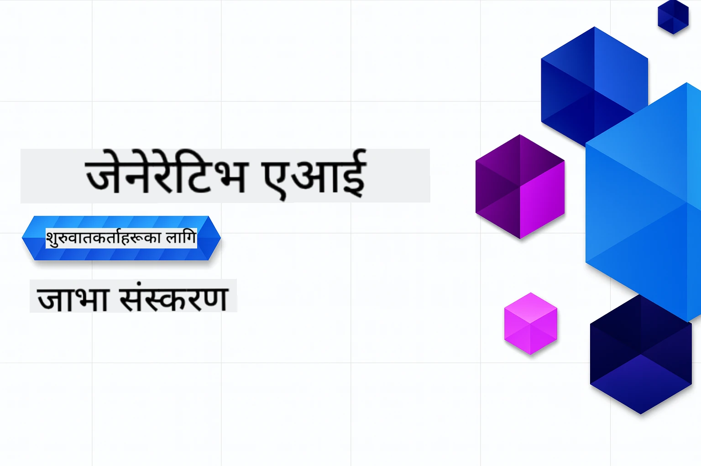

# शुरुआतीहरूका लागि जनरेटिभ AI - जाभा संस्करण
[](https://discord.gg/nTYy5BXMWG)



**समय प्रतिबद्धता**: सम्पूर्ण कार्यशाला स्थानीय सेटअप बिना अनलाइन पूरा गर्न सकिन्छ। वातावरण सेटअप गर्न २ मिनेट लाग्छ, नमूनाहरू अन्वेषण गर्न १-३ घण्टा अन्वेषण गहिराइ अनुसार आवश्यक पर्छ।

> **छिटो सुरु गर्नुहोस्**

1. यो रिपोजिटरीलाई तपाईंको GitHub खातामा Fork गर्नुहोस्
2. क्लिक गर्नुहोस् **Code** → **Codespaces** ट्याब → **...** → **नयाँ विकल्पहरूसँग...**
3. पूर्वनिर्धारित विकल्पहरू प्रयोग गर्नुहोस् – यसले यस कोर्सको लागि सिर्जना गरिएको विकास कन्टेनर चयन गर्नेछ
4. क्लिक गर्नुहोस् **Create codespace**
5. करिब २ मिनेट पर्खनुहोस् वातावरण तयार हुनको लागि
6. सिधै जानुहोस् [पहिलो उदाहरणतर्फ](./02-SetupDevEnvironment/README.md#step-2-create-a-github-personal-access-token)

## बहुभाषी समर्थन

### GitHub Action मार्फत समर्थित (स्वचालित र सधैं अद्यावधिक)

<!-- CO-OP TRANSLATOR LANGUAGES TABLE START -->
[अरेबिक](../ar/README.md) | [बङ्गाली](../bn/README.md) | [बुल्गेरियन](../bg/README.md) | [बर्मिज (म्यानमार)](../my/README.md) | [चिनियाँ (सरलीकृत)](../zh-CN/README.md) | [चिनियाँ (परम्परागत, हङकङ)](../zh-HK/README.md) | [चिनियाँ (परम्परागत, मकाउ)](../zh-MO/README.md) | [चिनियाँ (परम्परागत, ताइवान)](../zh-TW/README.md) | [क्रोएसियन](../hr/README.md) | [चेक](../cs/README.md) | [डेनिस](../da/README.md) | [डच](../nl/README.md) | [एस्टोनियन](../et/README.md) | [फिनिश](../fi/README.md) | [फ्रेन्च](../fr/README.md) | [जर्मन](../de/README.md) | [ग्रिक](../el/README.md) | [हिब्रू](../he/README.md) | [हिन्दी](../hi/README.md) | [हंगेरीयन](../hu/README.md) | [इन्डोनेसियन](../id/README.md) | [इतालियन](../it/README.md) | [जापानी](../ja/README.md) | [कन्नड](../kn/README.md) | [खमेर](../km/README.md) | [कोरियन](../ko/README.md) | [लिथुनियन](../lt/README.md) | [मलय](../ms/README.md) | [मलयालम](../ml/README.md) | [मराठी](../mr/README.md) | [नेपाली](./README.md) | [नाइजेरीयन पिजिन](../pcm/README.md) | [नर्वेजियन](../no/README.md) | [फारसी (पर्शियन)](../fa/README.md) | [पोलिश](../pl/README.md) | [पोर्तुगाली (ब्राजिल)](../pt-BR/README.md) | [पोर्तुगाली (पोर्चुगल)](../pt-PT/README.md) | [पन्जाबी (गुरमुखी)](../pa/README.md) | [रोमानियन](../ro/README.md) | [रूसी](../ru/README.md) | [सर्बियाली (सिरिलिक)](../sr/README.md) | [स्लोवाक](../sk/README.md) | [स्लोभेनियाली](../sl/README.md) | [स्पेनी](../es/README.md) | [स्वाहिली](../sw/README.md) | [स्विडिश](../sv/README.md) | [टागालोग (फिलिपिनो)](../tl/README.md) | [तमिल](../ta/README.md) | [तेलुगु](../te/README.md) | [थाई](../th/README.md) | [टर्किश](../tr/README.md) | [यूक्रेनीयन](../uk/README.md) | [उर्दू](../ur/README.md) | [भियतनामी](../vi/README.md)

> **स्थानीय रूपमा क्लोन गर्न चाहनुहुन्छ?**
>
> यस रिपोजिटरीमा ५०+ भाषाका अनुवादहरू समावेश छन् जसले डाउनलोड साइज धेरै बढाउँछ। अनुवाद बिना क्लोन गर्नको लागि sparse checkout प्रयोग गर्नुहोस्:
>
> **Bash / macOS / Linux:**
> ```bash
> git clone --filter=blob:none --sparse https://github.com/microsoft/Generative-AI-for-beginners-java.git
> cd Generative-AI-for-beginners-java
> git sparse-checkout set --no-cone '/*' '!translations' '!translated_images'
> ```
>
> **CMD (Windows):**
> ```cmd
> git clone --filter=blob:none --sparse https://github.com/microsoft/Generative-AI-for-beginners-java.git
> cd Generative-AI-for-beginners-java
> git sparse-checkout set --no-cone "/*" "!translations" "!translated_images"
> ```
>
> यसले तपाईंलाई कोर्स पूरा गर्न आवश्यक सबै कुरा धेरै छिटो डाउनलोडको साथ दिन्छ।
<!-- CO-OP TRANSLATOR LANGUAGES TABLE END -->

## कोर्स संरचना र सिकाइ मार्ग

### **अध्याय १: जनरेटिभ AI मा परिचय**
- **मुख्य अवधारणाहरू**: ठूला भाषा मोडेलहरू, टोकनहरू, एम्बेडिङहरू, र AI क्षमता बुझाइ
- **जाभा AI इकोसिस्टम**: स्प्रिंग AI र OpenAI SDKs को अवलोकन
- **मोडेल कन्टेक्स्ट प्रोटोकल**: MCP को परिचय र AI एजेन्ट सञ्चारमा यसको भूमिका
- **व्यावहारिक अनुप्रयोगहरू**: च्याटबोट र सामग्री सिर्जना सहित वास्तविक संसारका परिदृश्यहरू
- **[→ अध्याय १ सुरु गर्नुहोस्](./01-IntroToGenAI/README.md)**

### **अध्याय २: विकास वातावरण सेटअप**
- **बहु-प्रदायक कन्फिगरेसन**: GitHub मोडेलहरू, Azure OpenAI, र OpenAI Java SDK एकीकरण सेटअप
- **स्प्रिंग बूट + स्प्रिंग AI**: उद्यम AI अनुप्रयोग विकासका लागि उत्कृष्ट अभ्यासहरू
- **GitHub मोडेलहरू**: निःशुल्क AI मोडेल पहुँच प्रोटोटाइप र सिकाइका लागि (क्रेडिट कार्ड अनिवार्य छैन)
- **विकास उपकरणहरू**: Docker कन्टेनरहरू, VS Code, र GitHub Codespaces कन्फिगरेसन
- **[→ अध्याय २ सुरु गर्नुहोस्](./02-SetupDevEnvironment/README.md)**

### **अध्याय ३: मुख्य जनरेटिभ AI प्रविधिहरू**
- **प्रम्प्ट इन्जिनियरिङ**: AI मोडेल प्रतिक्रियाका लागि उत्कृष्ट प्रविधिहरू
- **एम्बेडिङ र भेक्टर अपरेसनहरू**: सेम्यान्टिक खोज र समानता मिलान लागू गर्नुहोस्
- **रिट्राइभ-अग्मेन्टेड जेनेरेशन (RAG)**: AI लाई आफ्नै डाटास्रोतहरूसँग जोड्नुहोस्
- **फंक्शन कलिङ**: कस्टम उपकरणहरू र प्लगइनहरूद्वारा AI क्षमताहरू विस्तार गर्नुहोस्
- **[→ अध्याय ३ सुरु गर्नुहोस्](./03-CoreGenerativeAITechniques/README.md)**

### **अध्याय ४: व्यावहारिक अनुप्रयोगहरू र परियोजनाहरू**
- **पेट स्टोरी जेनेरेटर** (`petstory/`): GitHub मोडेलहरूसँग सिर्जनात्मक सामग्री उत्पादन
- **फाउन्ड्री स्थानीय डेमो** (`foundrylocal/`): OpenAI Java SDK सँग स्थानीय AI मोडेल एकीकरण
- **MCP क्यालकुलेटर सेवा** (`calculator/`): स्प्रिंग AI सँग आधारभूत मोडेल कन्टेक्स्ट प्रोटोकल कार्यान्वयन
- **[→ अध्याय ४ सुरु गर्नुहोस्](./04-PracticalSamples/README.md)**

### **अध्याय ५: जिम्मेवार AI विकास**
- **GitHub मोडेल सुरक्षा**: निर्मित सामग्री फिल्टरिंग र सुरक्षा संयन्त्रहरू परीक्षण गर्नुहोस् (कडा रोकथाम र सौम्य अस्वीकारहरूको)
- **जिम्मेवार AI डेमो**: आधुनिक AI सुरक्षा प्रणाली कसरी कार्य गर्छ भनेर देखाउने व्यावहारिक उदाहरण
- **सर्वोत्तम अभ्यासहरू**: नैतिक AI विकास र कार्यान्वयनका लागि आवश्यक दिशानिर्देशहरू
- **[→ अध्याय ५ सुरु गर्नुहोस्](./05-ResponsibleGenAI/README.md)**

## अतिरिक्त स्रोतहरू

<!-- CO-OP TRANSLATOR OTHER COURSES START -->
### LangChain
[](https://aka.ms/langchain4j-for-beginners)
[](https://aka.ms/langchainjs-for-beginners?WT.mc_id=m365-94501-dwahlin)
[](https://github.com/microsoft/langchain-for-beginners?WT.mc_id=m365-94501-dwahlin)
---

### Azure / Edge / MCP / Agents
[](https://github.com/microsoft/AZD-for-beginners?WT.mc_id=academic-105485-koreyst)
[](https://github.com/microsoft/edgeai-for-beginners?WT.mc_id=academic-105485-koreyst)
[](https://github.com/microsoft/mcp-for-beginners?WT.mc_id=academic-105485-koreyst)
[](https://github.com/microsoft/ai-agents-for-beginners?WT.mc_id=academic-105485-koreyst)

---
 
### जनरेटिभ AI श्रृंखला
[](https://github.com/microsoft/generative-ai-for-beginners?WT.mc_id=academic-105485-koreyst)
[-9333EA?style=for-the-badge&labelColor=E5E7EB&color=9333EA)](https://github.com/microsoft/Generative-AI-for-beginners-dotnet?WT.mc_id=academic-105485-koreyst)
[-C084FC?style=for-the-badge&labelColor=E5E7EB&color=C084FC)](https://github.com/microsoft/generative-ai-for-beginners-java?WT.mc_id=academic-105485-koreyst)
[-E879F9?style=for-the-badge&labelColor=E5E7EB&color=E879F9)](https://github.com/microsoft/generative-ai-with-javascript?WT.mc_id=academic-105485-koreyst)

---
 
### मुख्य सिकाइ
[](https://aka.ms/ml-beginners?WT.mc_id=academic-105485-koreyst)
[](https://aka.ms/datascience-beginners?WT.mc_id=academic-105485-koreyst)
[](https://aka.ms/ai-beginners?WT.mc_id=academic-105485-koreyst)
[](https://github.com/microsoft/Security-101?WT.mc_id=academic-96948-sayoung)

[](https://aka.ms/webdev-beginners?WT.mc_id=academic-105485-koreyst)
[](https://aka.ms/iot-beginners?WT.mc_id=academic-105485-koreyst)
[](https://github.com/microsoft/xr-development-for-beginners?WT.mc_id=academic-105485-koreyst)

---
 
### Copilot श्रृंखला
[](https://aka.ms/GitHubCopilotAI?WT.mc_id=academic-105485-koreyst)
[](https://github.com/microsoft/mastering-github-copilot-for-dotnet-csharp-developers?WT.mc_id=academic-105485-koreyst)
[](https://github.com/microsoft/CopilotAdventures?WT.mc_id=academic-105485-koreyst)
<!-- CO-OP TRANSLATOR OTHER COURSES END -->

## मद्दत पाउने तरिका

यदि तपाइँ अल्झनु भएको छ वा AI अनुप्रयोगहरू निर्माण गर्ने बारे कुनै प्रश्न छ भने। साथी सिक्नेहरू र अनुभवी विकासकर्ताहरूलाई MCP बारे छलफलमा सामेल हुनुहोस्। यो समर्थन गर्ने समुदाय हो जहाँ प्रश्नहरू स्वागत छ र ज्ञान स्वतन्त्र रूपमा साझा गरिन्छ।

[](https://discord.gg/nTYy5BXMWG)

यदि तपाइँसँग उत्पादन प्रतिक्रिया वा त्रुटिहरू छन् भने, कृपया भ्रमण गर्नुहोस्:

[](https://aka.ms/foundry/forum)

---

<!-- CO-OP TRANSLATOR DISCLAIMER START -->
**अस्वीकरण**:
यो कागजात AI अनुवाद सेवा [Co-op Translator](https://github.com/Azure/co-op-translator) प्रयोग गरी अनुवाद गरिएको हो। हामी शुद्धताका लागि प्रयासरत छौं, तर कृपया ध्यान दिनुहोस् कि स्वचालित अनुवादहरूमा त्रुटि वा अशुद्धता हुन सक्ने सम्भावना हुन्छ। मूल कागजात आफ्नो मूल भाषामा आधिकारिक स्रोतको रूपमा मानिनेछ। महत्वपूर्ण जानकारीका लागि व्यावसायिक मानव अनुवाद सिफारिस गरिन्छ। यस अनुवाद प्रयोगबाट उत्पन्न कुनै पनि भ्रम वा गलत अर्थ प्रकट हुने स्थितिमा हामी कुनै पनि जिम्मेवारी लिदैनौं।
<!-- CO-OP TRANSLATOR DISCLAIMER END -->