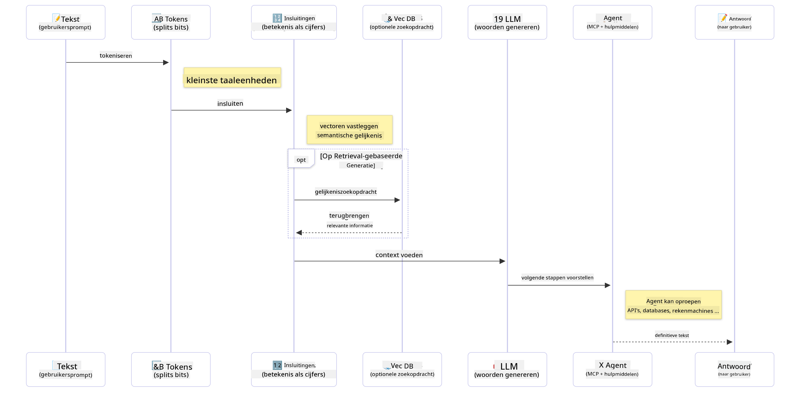

<!--
CO_OP_TRANSLATOR_METADATA:
{
  "original_hash": "006866db93a268a8769bb55f2e324291",
  "translation_date": "2025-07-28T10:57:01+00:00",
  "source_file": "01-IntroToGenAI/README.md",
  "language_code": "nl"
}
-->
# Introductie tot Generatieve AI - Java Editie

## Wat Je Gaat Leren

- **De basisprincipes van Generatieve AI**, inclusief LLM's, prompt engineering, tokens, embeddings en vector databases
- **Vergelijk Java AI-ontwikkeltools**, zoals Azure OpenAI SDK, Spring AI en OpenAI Java SDK
- **Ontdek het Model Context Protocol** en de rol ervan in de communicatie van AI-agenten

## Inhoudsopgave

- [Introductie](../../../01-IntroToGenAI)
- [Een korte opfrissing van Generatieve AI-concepten](../../../01-IntroToGenAI)
- [Overzicht van prompt engineering](../../../01-IntroToGenAI)
- [Tokens, embeddings en agenten](../../../01-IntroToGenAI)
- [AI-ontwikkeltools en bibliotheken voor Java](../../../01-IntroToGenAI)
  - [OpenAI Java SDK](../../../01-IntroToGenAI)
  - [Spring AI](../../../01-IntroToGenAI)
  - [Azure OpenAI Java SDK](../../../01-IntroToGenAI)
- [Samenvatting](../../../01-IntroToGenAI)
- [Volgende Stappen](../../../01-IntroToGenAI)

## Introductie

Welkom bij het eerste hoofdstuk van Generatieve AI voor Beginners - Java Editie! Deze basisles introduceert je in de kernconcepten van generatieve AI en hoe je hiermee kunt werken in Java. Je leert over de essentiële bouwstenen van AI-toepassingen, zoals Large Language Models (LLM's), tokens, embeddings en AI-agenten. We verkennen ook de belangrijkste Java-tools die je gedurende deze cursus zult gebruiken.

### Een korte opfrissing van Generatieve AI-concepten

Generatieve AI is een type kunstmatige intelligentie dat nieuwe inhoud creëert, zoals tekst, afbeeldingen of code, op basis van patronen en relaties die het uit data heeft geleerd. Generatieve AI-modellen kunnen mensachtige reacties genereren, context begrijpen en soms zelfs inhoud creëren die menselijk lijkt.

Bij het ontwikkelen van Java AI-toepassingen werk je met **generatieve AI-modellen** om inhoud te creëren. Enkele mogelijkheden van generatieve AI-modellen zijn:

- **Tekstgeneratie**: Het maken van mensachtige tekst voor chatbots, inhoud en tekstaanvulling.
- **Afbeeldingsgeneratie en -analyse**: Het produceren van realistische afbeeldingen, verbeteren van foto's en detecteren van objecten.
- **Codegeneratie**: Het schrijven van codefragmenten of scripts.

Er zijn specifieke typen modellen die geoptimaliseerd zijn voor verschillende taken. Bijvoorbeeld, zowel **Small Language Models (SLM's)** als **Large Language Models (LLM's)** kunnen tekst genereren, waarbij LLM's doorgaans beter presteren bij complexe taken. Voor beeldgerelateerde taken gebruik je gespecialiseerde vision-modellen of multimodale modellen.

De reacties van deze modellen zijn natuurlijk niet altijd perfect. Je hebt waarschijnlijk gehoord over modellen die "hallucineren" of onjuiste informatie genereren op een overtuigende manier. Maar je kunt het model helpen betere reacties te genereren door duidelijke instructies en context te geven. Dit is waar **prompt engineering** van pas komt.

#### Overzicht van prompt engineering

Prompt engineering is de praktijk van het ontwerpen van effectieve invoer om AI-modellen naar gewenste resultaten te sturen. Het omvat:

- **Duidelijkheid**: Instructies helder en ondubbelzinnig maken.
- **Context**: Noodzakelijke achtergrondinformatie bieden.
- **Beperkingen**: Eventuele limieten of formaten specificeren.

Enkele best practices voor prompt engineering zijn het ontwerpen van prompts, duidelijke instructies, het opsplitsen van taken, one-shot en few-shot learning, en prompt tuning. Het testen van verschillende prompts is essentieel om te ontdekken wat het beste werkt voor jouw specifieke toepassing.

Bij het ontwikkelen van toepassingen werk je met verschillende typen prompts:
- **Systeemprompts**: Stellen de basisregels en context voor het gedrag van het model.
- **Gebruikersprompts**: De invoergegevens van jouw applicatiegebruikers.
- **Assistentprompts**: De reacties van het model op basis van systeem- en gebruikersprompts.

> **Meer leren**: Lees meer over prompt engineering in [het hoofdstuk Prompt Engineering van de GenAI voor Beginners-cursus](https://github.com/microsoft/generative-ai-for-beginners/tree/main/04-prompt-engineering-fundamentals)

#### Tokens, embeddings en agenten

Bij het werken met generatieve AI-modellen kom je termen tegen zoals **tokens**, **embeddings**, **agenten** en **Model Context Protocol (MCP)**. Hier is een gedetailleerd overzicht van deze concepten:

- **Tokens**: Tokens zijn de kleinste eenheden van tekst in een model. Dit kunnen woorden, karakters of subwoorden zijn. Tokens worden gebruikt om tekstgegevens te representeren in een formaat dat het model kan begrijpen. Bijvoorbeeld, de zin "The quick brown fox jumped over the lazy dog" kan worden getokeniseerd als ["The", " quick", " brown", " fox", " jumped", " over", " the", " lazy", " dog"] of ["The", " qu", "ick", " br", "own", " fox", " jump", "ed", " over", " the", " la", "zy", " dog"], afhankelijk van de tokenisatiestrategie.

Tokenisatie is het proces van het opsplitsen van tekst in deze kleinere eenheden. Dit is cruciaal omdat modellen werken met tokens in plaats van ruwe tekst. Het aantal tokens in een prompt beïnvloedt de lengte en kwaliteit van de reactie van het model, aangezien modellen tokenlimieten hebben voor hun contextvenster (bijvoorbeeld 128K tokens voor GPT-4o's totale context, inclusief zowel invoer als uitvoer).

  In Java kun je bibliotheken zoals de OpenAI SDK gebruiken om tokenisatie automatisch af te handelen bij het verzenden van verzoeken naar AI-modellen.

- **Embeddings**: Embeddings zijn vectorrepresentaties van tokens die semantische betekenis vastleggen. Het zijn numerieke representaties (meestal arrays van drijvende-komma-getallen) die modellen in staat stellen relaties tussen woorden te begrijpen en contextueel relevante reacties te genereren. Vergelijkbare woorden hebben vergelijkbare embeddings, waardoor het model concepten zoals synoniemen en semantische relaties kan begrijpen.

  In Java kun je embeddings genereren met behulp van de OpenAI SDK of andere bibliotheken die embedding-generatie ondersteunen. Deze embeddings zijn essentieel voor taken zoals semantisch zoeken, waarbij je vergelijkbare inhoud wilt vinden op basis van betekenis in plaats van exacte tekstovereenkomsten.

- **Vector databases**: Vector databases zijn gespecialiseerde opslagsystemen die geoptimaliseerd zijn voor embeddings. Ze maken efficiënte gelijkeniszoekopdrachten mogelijk en zijn cruciaal voor Retrieval-Augmented Generation (RAG)-patronen, waarbij je relevante informatie uit grote datasets wilt vinden op basis van semantische gelijkenis in plaats van exacte overeenkomsten.

> **Opmerking**: In deze cursus behandelen we geen vector databases, maar we vinden het belangrijk om ze te noemen omdat ze vaak worden gebruikt in praktijktoepassingen.

- **Agenten & MCP**: AI-componenten die autonoom interacteren met modellen, tools en externe systemen. Het Model Context Protocol (MCP) biedt een gestandaardiseerde manier voor agenten om veilig toegang te krijgen tot externe gegevensbronnen en tools. Lees meer in onze [MCP voor Beginners](https://github.com/microsoft/mcp-for-beginners)-cursus.

In Java AI-toepassingen gebruik je tokens voor tekstverwerking, embeddings voor semantisch zoeken en RAG, vector databases voor gegevensopvraging, en agenten met MCP voor het bouwen van intelligente systemen die tools gebruiken.

### AI-ontwikkeltools en bibliotheken voor Java

Java biedt uitstekende tools voor AI-ontwikkeling. Er zijn drie belangrijke bibliotheken die we in deze cursus zullen verkennen: OpenAI Java SDK, Azure OpenAI SDK en Spring AI.

Hier is een snel referentieoverzicht dat laat zien welke SDK in de voorbeelden van elk hoofdstuk wordt gebruikt:

| Hoofdstuk | Voorbeeld | SDK |
|-----------|-----------|-----|
| 02-SetupDevEnvironment | github-models | OpenAI Java SDK |
| 02-SetupDevEnvironment | basic-chat-azure | Spring AI Azure OpenAI |
| 03-CoreGenerativeAITechniques | voorbeelden | Azure OpenAI SDK |
| 04-PracticalSamples | petstory | OpenAI Java SDK |
| 04-PracticalSamples | foundrylocal | OpenAI Java SDK |
| 04-PracticalSamples | calculator | Spring AI MCP SDK + LangChain4j |

**SDK Documentatielinks:**
- [Azure OpenAI Java SDK](https://github.com/Azure/azure-sdk-for-java/tree/azure-ai-openai_1.0.0-beta.16/sdk/openai/azure-ai-openai)
- [Spring AI](https://docs.spring.io/spring-ai/reference/)
- [OpenAI Java SDK](https://github.com/openai/openai-java)
- [LangChain4j](https://docs.langchain4j.dev/)

#### OpenAI Java SDK

De OpenAI SDK is de officiële Java-bibliotheek voor de OpenAI API. Het biedt een eenvoudige en consistente interface voor interactie met de modellen van OpenAI, waardoor het gemakkelijk is om AI-mogelijkheden in Java-toepassingen te integreren. Hoofdstuk 2's GitHub Models-voorbeeld, Hoofdstuk 4's Pet Story-toepassing en Foundry Local-voorbeeld demonstreren de OpenAI SDK-aanpak.

#### Spring AI

Spring AI is een uitgebreid framework dat AI-mogelijkheden naar Spring-toepassingen brengt en een consistente abstractielaag biedt over verschillende AI-providers. Het integreert naadloos met het Spring-ecosysteem, waardoor het de ideale keuze is voor zakelijke Java-toepassingen die AI-mogelijkheden nodig hebben.

De kracht van Spring AI ligt in de naadloze integratie met het Spring-ecosysteem, waardoor het eenvoudig is om productieklare AI-toepassingen te bouwen met vertrouwde Spring-patronen zoals dependency injection, configuratiebeheer en testframeworks. Je gebruikt Spring AI in Hoofdstuk 2 en 4 om toepassingen te bouwen die zowel OpenAI als de Model Context Protocol (MCP) Spring AI-bibliotheken benutten.

##### Model Context Protocol (MCP)

Het [Model Context Protocol (MCP)](https://modelcontextprotocol.io/) is een opkomende standaard die AI-toepassingen in staat stelt om veilig te communiceren met externe gegevensbronnen en tools. MCP biedt een gestandaardiseerde manier voor AI-modellen om toegang te krijgen tot contextuele informatie en acties uit te voeren in jouw toepassingen.

In Hoofdstuk 4 bouw je een eenvoudige MCP-calculatorservice die de basisprincipes van het Model Context Protocol met Spring AI demonstreert, en laat zien hoe je basisintegraties en servicearchitecturen kunt creëren.

#### Azure OpenAI Java SDK

De Azure OpenAI-clientbibliotheek voor Java is een aanpassing van de REST-API's van OpenAI die een idiomatische interface biedt en integreert met de rest van het Azure SDK-ecosysteem. In Hoofdstuk 3 bouw je toepassingen met de Azure OpenAI SDK, waaronder chattoepassingen, functieaanroepen en RAG (Retrieval-Augmented Generation)-patronen.

> Opmerking: De Azure OpenAI SDK loopt achter op de OpenAI Java SDK qua functies, dus voor toekomstige projecten kun je overwegen de OpenAI Java SDK te gebruiken.

## Samenvatting

**Gefeliciteerd!** Je hebt met succes:

- **De basisprincipes van Generatieve AI geleerd**, inclusief LLM's, prompt engineering, tokens, embeddings en vector databases
- **Java AI-ontwikkeltools vergeleken**, zoals Azure OpenAI SDK, Spring AI en OpenAI Java SDK
- **Het Model Context Protocol ontdekt** en de rol ervan in de communicatie van AI-agenten

## Volgende Stappen

[Hoofdstuk 2: Het opzetten van de ontwikkelomgeving](../02-SetupDevEnvironment/README.md)

**Disclaimer (Vrijwaring)**:  
Dit document is vertaald met behulp van de AI-vertalingsservice [Co-op Translator](https://github.com/Azure/co-op-translator). Hoewel we streven naar nauwkeurigheid, dient u zich ervan bewust te zijn dat geautomatiseerde vertalingen fouten of onnauwkeurigheden kunnen bevatten. Het originele document in de oorspronkelijke taal moet worden beschouwd als de gezaghebbende bron. Voor cruciale informatie wordt professionele menselijke vertaling aanbevolen. Wij zijn niet aansprakelijk voor misverstanden of verkeerde interpretaties die voortvloeien uit het gebruik van deze vertaling.