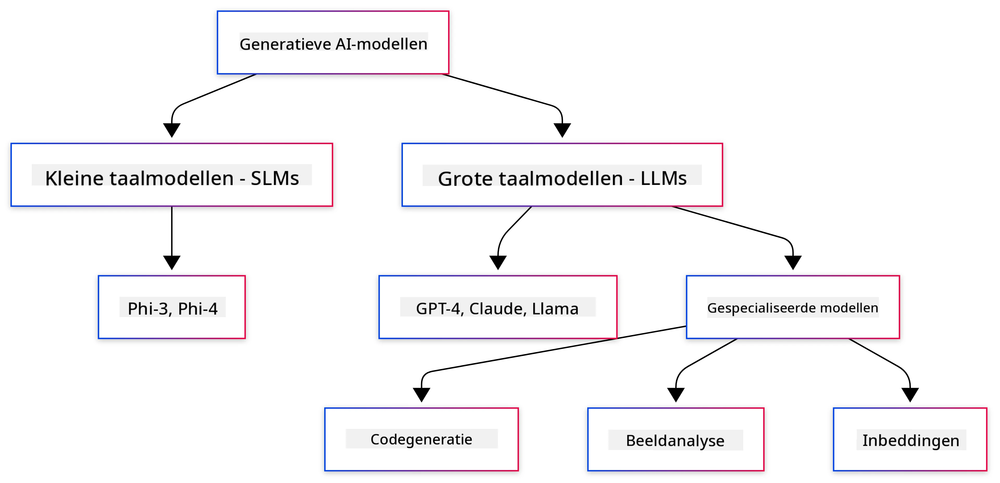
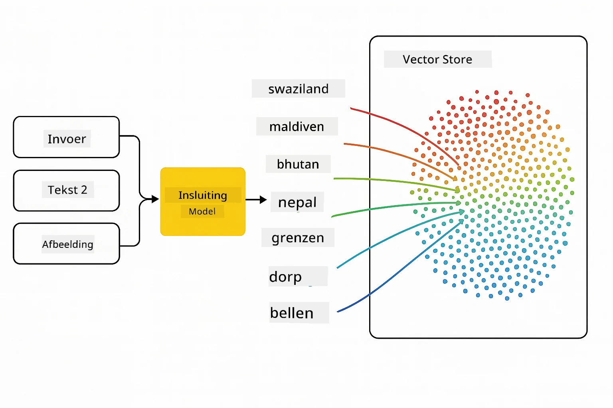
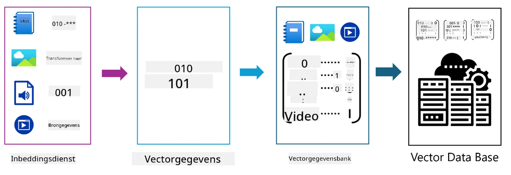
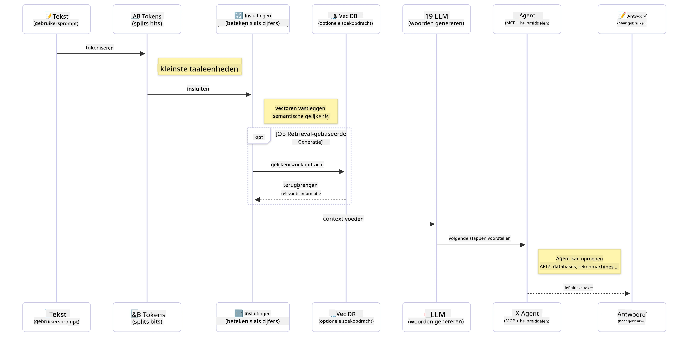

# Introductie tot Generatieve AI - Java Editie

> **Video**: [Bekijk de video overzicht voor deze les op YouTube.](https://www.youtube.com/watch?v=XH46tGp_eSw) Je kunt ook op de thumbnail afbeelding hierboven klikken.

## Wat Je Zal Leren

- **Fundamenten van Generatieve AI** inclusief LLM's, prompt engineering, tokens, embeddings, en vector databases
- **Vergelijk Java AI ontwikkeltools** inclusief Azure OpenAI SDK, Spring AI, en OpenAI Java SDK
- **Ontdek het Model Context Protocol** en zijn rol in communicatie tussen AI-agenten

## Inhoudsopgave

- [Introductie](#introductie)
- [Een snelle opfrisser over Generatieve AI concepten](#een-snelle-opfrisser-over-generatieve-ai-concepten)
- [Prompt engineering review](#prompt-engineering-review)
- [Tokens, embeddings, en agenten](#tokens-embeddings-en-agenten)
- [AI Ontwikkeltools en Bibliotheken voor Java](#ai-ontwikkeltools-en-bibliotheken-voor-java)
  - [OpenAI Java SDK](#openai-java-sdk)
  - [Spring AI](#spring-ai)
  - [Azure OpenAI Java SDK](#azure-openai-java-sdk)
- [Samenvatting](#samenvatting)
- [Volgende Stappen](#volgende-stappen)

## Introductie

Welkom bij het eerste hoofdstuk van Generatieve AI voor Beginners - Java Editie! Deze fundamentele les introduceert je tot de kernconcepten van generatieve AI en hoe je ermee werkt in Java. Je leert over de essentiële bouwstenen van AI-toepassingen, zoals Grote Taalmodellen (LLM's), tokens, embeddings, en AI-agenten. We verkennen ook de belangrijkste Java-tools die je tijdens deze cursus zult gebruiken.

### Een snelle opfrisser over Generatieve AI concepten

Generatieve AI is een vorm van kunstmatige intelligentie die nieuwe content creëert, zoals tekst, afbeeldingen of code, gebaseerd op patronen en relaties die geleerd zijn uit data. Generatieve AI-modellen kunnen mensachtige antwoorden genereren, context begrijpen, en soms zelfs content creëren die mensachtig lijkt.

Tijdens het ontwikkelen van je Java AI-toepassingen werk je met **generatieve AI-modellen** om content te creëren. Enkele mogelijkheden van generatieve AI-modellen zijn:

- **Tekstgeneratie**: Mensachtige tekst maken voor chatbots, content, en tekstvervollediging.
- **Beeldgeneratie en Analyse**: Realistische afbeeldingen produceren, foto’s verbeteren, en objecten detecteren.
- **Codegeneratie**: Codefragmenten of scripts schrijven.

Er zijn specifieke typen modellen die geoptimaliseerd zijn voor verschillende taken. Bijvoorbeeld, zowel **Kleine Taalmodellen (SLM's)** als **Grote Taalmodellen (LLM's)** kunnen tekstgeneratie aan, waarbij LLM's doorgaans betere prestaties leveren bij complexe taken. Voor beeldgerelateerde taken gebruik je gespecialiseerde vision modellen of multi-modale modellen.

Natuurlijk zijn de antwoorden van deze modellen niet altijd perfect. Je hebt waarschijnlijk wel gehoord over modellen die "hallucineren" of foutieve informatie genereren op een gezaghebbende manier. Maar je kunt het model helpen om betere antwoorden te genereren door het duidelijke instructies en context te geven. Dit is waar **prompt engineering** om de hoek komt kijken.

#### Prompt engineering review

Prompt engineering is de praktijk van het ontwerpen van effectieve inputs om AI-modellen te sturen naar gewenste outputs. Het omvat:

- **Helderheid**: Zorg dat instructies duidelijk en eenduidig zijn.
- **Context**: Verstrek noodzakelijke achtergrondinformatie.
- **Beperkingen**: Specificeer eventuele limieten of formats.

Enkele beste praktijken voor prompt engineering omvatten promptontwerp, heldere instructies, taakopdeling, one-shot en few-shot leren, en prompt tuning. Het testen van verschillende prompts is essentieel om te ontdekken wat het beste werkt voor jouw specifieke gebruiksgeval.

Bij het ontwikkelen van toepassingen werk je met verschillende prompttypen:
- **Systeem prompts**: Stellen de basisregels en context in voor het gedrag van het model
- **Gebruikersprompts**: De inputdata van je applicatiegebruikers
- **Assistent prompts**: De reacties van het model gebaseerd op systeem- en gebruikersprompts

> **Leer meer**: Leer meer over prompt engineering in het [Prompt Engineering hoofdstuk van de GenAI voor Beginners cursus](https://github.com/microsoft/generative-ai-for-beginners/tree/main/04-prompt-engineering-fundamentals)

#### Tokens, embeddings, en agenten

Bij het werken met generatieve AI-modellen kom je termen tegen als **tokens**, **embeddings**, **agenten**, en **Model Context Protocol (MCP)**. Hier volgt een gedetailleerd overzicht van deze concepten:

- **Tokens**: Tokens zijn de kleinste tekstunit binnen een model. Ze kunnen woorden, karakters, of subwoorden zijn. Tokens worden gebruikt om tekstdata te representeren in een formaat dat het model kan begrijpen. Bijvoorbeeld, de zin "De snelle bruine vos sprong over de luie hond" zou getokeniseerd kunnen worden als ["De", " snelle", " bruine", " vos", " sprong", " over", " de", " luie", " hond"] of ["De", " sn", "elle", " br", "uin", "e vo", "s sp", "ron", "g ov", "er d", "e lu", "ie h", "ond"] afhankelijk van de tokenisatiestrategie.

Tokenisatie is het proces waarbij tekst wordt opgesplitst in deze kleinere eenheden. Dit is cruciaal omdat modellen op tokens werken in plaats van ruwe tekst. Het aantal tokens in een prompt beïnvloedt de lengte en kwaliteit van het antwoord van het model, aangezien modellen tokenlimieten hebben voor hun contextvenster (bijv. 128K tokens voor GPT-4o’s totale context, inclusief zowel input als output).

  In Java kun je bibliotheken zoals de OpenAI SDK gebruiken om tokenisatie automatisch te laten verlopen bij het verzenden van verzoeken aan AI-modellen.

- **Embeddings**: Embeddings zijn vectorrepresentaties van tokens die semantische betekenis vastleggen. Ze zijn numerieke representaties (meestal arrays van kommagetallen) die het model in staat stellen relaties tussen woorden te begrijpen en contextueel relevante antwoorden te genereren. Soortgelijke woorden hebben vergelijkbare embeddings, waardoor het model concepten zoals synoniemen en semantische relaties kan begrijpen.

  In Java kun je embeddings genereren met behulp van de OpenAI SDK of andere bibliotheken die embeddinggeneratie ondersteunen. Deze embeddings zijn essentieel voor taken zoals semantisch zoeken, waarbij je op betekenis gebaseerde gelijkaardige inhoud wilt vinden in plaats van exacte tekstovereenkomsten.

- **Vector databases**: Vector databases zijn gespecialiseerde opslagystemen die geoptimaliseerd zijn voor embeddings. Ze maken efficiënte gelijkeniszoektocht mogelijk en zijn cruciaal voor Retrieval-Augmented Generation (RAG) patronen waarbij je relevante informatie uit grote datasets wilt vinden op basis van semantische gelijkenis in plaats van exacte overeenkomsten.

> **Opmerking**: In deze cursus behandelen we vector databases niet maar vinden we het de moeite waard ze te noemen omdat ze vaak worden gebruikt in praktijkgerichte toepassingen.

- **Agenten & MCP**: AI-componenten die autonoom interacteren met modellen, tools en externe systemen. Het Model Context Protocol (MCP) biedt een gestandaardiseerde manier voor agenten om veilig toegang te krijgen tot externe databronnen en tools. Leer meer in onze [MCP voor Beginners](https://github.com/microsoft/mcp-for-beginners) cursus.

In Java AI-toepassingen gebruik je tokens voor tekstverwerking, embeddings voor semantisch zoeken en RAG, vector databases voor dataopvraging en agenten met MCP om intelligente, tool-gebruikende systemen te bouwen.

### AI Ontwikkeltools en Bibliotheken voor Java

Java biedt uitstekende tooling voor AI-ontwikkeling. Er zijn drie hoofd-bibliotheken die we gedurende deze cursus zullen verkennen - OpenAI Java SDK, Azure OpenAI SDK, en Spring AI.

Hier is een snelle referentietabel die toont welke SDK gebruikt wordt in de voorbeelden van elk hoofdstuk:

| Hoofdstuk | Voorbeeld | SDK |
|---------|--------|-----|
| 02-SetupDevEnvironment | github-models | OpenAI Java SDK |
| 02-SetupDevEnvironment | basic-chat-azure | Spring AI Azure OpenAI |
| 03-CoreGenerativeAITechniques | examples | Azure OpenAI SDK |
| 04-PracticalSamples | petstory | OpenAI Java SDK |
| 04-PracticalSamples | foundrylocal | OpenAI Java SDK |
| 04-PracticalSamples | calculator | Spring AI MCP SDK + LangChain4j |

**SDK Documentatielinks:**
- [Azure OpenAI Java SDK](https://github.com/Azure/azure-sdk-for-java/tree/azure-ai-openai_1.0.0-beta.16/sdk/openai/azure-ai-openai)
- [Spring AI](https://docs.spring.io/spring-ai/reference/)
- [OpenAI Java SDK](https://github.com/openai/openai-java)
- [LangChain4j](https://docs.langchain4j.dev/)

#### OpenAI Java SDK

De OpenAI SDK is de officiële Java-bibliotheek voor de OpenAI API. Het biedt een eenvoudige en consistente interface om met OpenAI's modellen te communiceren, wat het gemakkelijk maakt om AI-functionaliteiten in Java-applicaties te integreren. Het GitHub Models voorbeeld van hoofdstuk 2, de Pet Story applicatie en Foundry Local voorbeeld van hoofdstuk 4 demonstreren de OpenAI SDK aanpak.

#### Spring AI

Spring AI is een uitgebreid framework dat AI-functionaliteiten naar Spring-applicaties brengt en een consistente abstractielaag biedt over verschillende AI-aanbieders. Het integreert naadloos met het Spring-ecosysteem en is daarmee ideaal voor enterprise Java-applicaties die AI-functionaliteiten nodig hebben.

De kracht van Spring AI ligt in de naadloze integratie met het Spring ecosysteem, waardoor je eenvoudig productieklare AI-toepassingen kunt bouwen met bekende Spring-patronen als dependency injection, configuratiebeheer en testframeworks. Je zult Spring AI gebruiken in hoofdstuk 2 en 4 om applicaties te bouwen die zowel OpenAI als het Model Context Protocol (MCP) Spring AI bibliotheken benutten.

##### Model Context Protocol (MCP)

Het [Model Context Protocol (MCP)](https://modelcontextprotocol.io/) is een opkomende standaard die AI-applicaties in staat stelt veilig te communiceren met externe databronnen en tools. MCP biedt een gestandaardiseerde manier voor AI-modellen om contextuele informatie te verkrijgen en acties in je applicaties uit te voeren.

In hoofdstuk 4 bouw je een eenvoudige MCP calculator service die de fundamenten van het Model Context Protocol met Spring AI demonstreert en laat zien hoe je basis tool-integraties en service-architecturen kunt creëren.

#### Azure OpenAI Java SDK

De Azure OpenAI clientbibliotheek voor Java is een aanpassing van OpenAI’s REST API’s die een idiomatische interface en integratie met de rest van het Azure SDK ecosysteem biedt. In hoofdstuk 3 bouw je toepassingen met de Azure OpenAI SDK, waaronder chatapplicaties, functie-aanroepen en RAG (Retrieval-Augmented Generation) patronen.

> Opmerking: De Azure OpenAI SDK loopt qua functies achter op de OpenAI Java SDK, dus overweeg voor toekomstige projecten de OpenAI Java SDK te gebruiken.

## Samenvatting

Dat waren de fundamenten! Je begrijpt nu:

- De kernconcepten achter generatieve AI – van LLM's en prompt engineering tot tokens, embeddings en vector databases
- Je toolkitopties voor Java AI-ontwikkeling: Azure OpenAI SDK, Spring AI en OpenAI Java SDK
- Wat het Model Context Protocol is en hoe het AI-agenten in staat stelt met externe tools te werken

## Volgende Stappen

[Hoofdstuk 2: Het ontwikkelomgeving opzetten](../02-SetupDevEnvironment/README.md)

---

<!-- CO-OP TRANSLATOR DISCLAIMER START -->
**Disclaimer**:  
Dit document is vertaald met behulp van de AI-vertalingsdienst [Co-op Translator](https://github.com/Azure/co-op-translator). Hoewel we streven naar nauwkeurigheid, dient u er rekening mee te houden dat automatische vertalingen fouten of onnauwkeurigheden kunnen bevatten. Het originele document in de oorspronkelijke taal dient als de gezaghebbende bron te worden beschouwd. Voor kritieke informatie wordt professionele menselijke vertaling aanbevolen. Wij zijn niet aansprakelijk voor eventuele misverstanden of verkeerd geïnterpreteerde informatie voortkomend uit het gebruik van deze vertaling.
<!-- CO-OP TRANSLATOR DISCLAIMER END -->