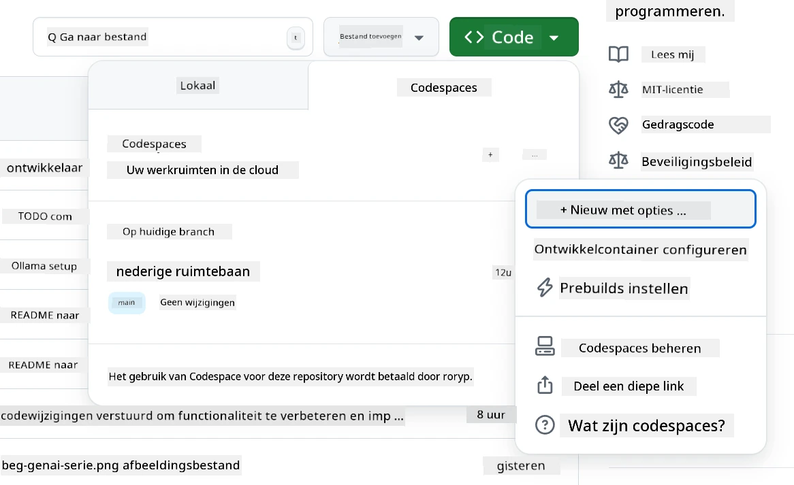
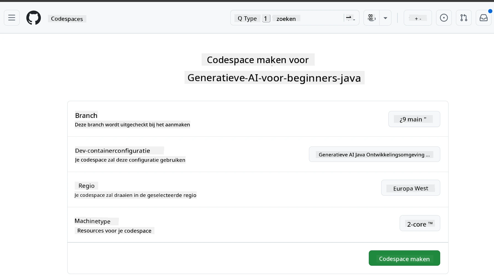
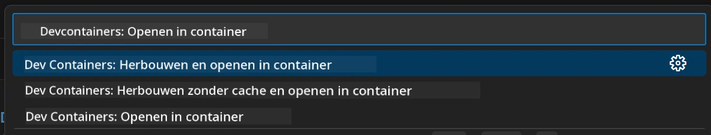
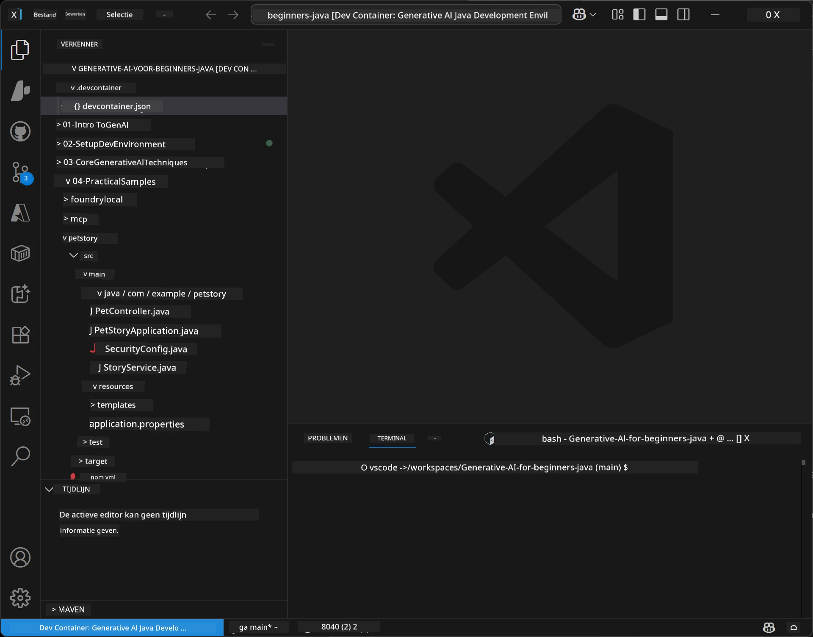

<!--
CO_OP_TRANSLATOR_METADATA:
{
  "original_hash": "96a30d42b9751a3d4e4b20e28d29d459",
  "translation_date": "2026-01-28T05:07:14+00:00",
  "source_file": "02-SetupDevEnvironment/README.md",
  "language_code": "nl"
}
-->
# Het opzetten van de ontwikkelomgeving voor Generatieve AI voor Java

> **Snel aan de slag**: codeer in de cloud binnen 2 minuten - Ga naar [GitHub Codespaces Setup](../../../02-SetupDevEnvironment) - geen lokale installatie nodig en gebruikt GitHub-modellen!

> **Geïnteresseerd in Azure OpenAI?**, zie onze [Azure OpenAI Setup Guide](getting-started-azure-openai.md) met stappen om een nieuwe Azure OpenAI-resource aan te maken.

## Wat je zult leren

- Een Java-ontwikkelomgeving opzetten voor AI-toepassingen
- Kies en configureer je voorkeursontwikkelomgeving (cloud-first met Codespaces, lokale devcontainer of volledige lokale setup)
- Test je setup door verbinding te maken met GitHub Models

## Inhoudsopgave

- [Wat je zult leren](../../../02-SetupDevEnvironment)
- [Introductie](../../../02-SetupDevEnvironment)
- [Stap 1: Zet je ontwikkelomgeving op](../../../02-SetupDevEnvironment)
  - [Optie A: GitHub Codespaces (Aanbevolen)](../../../02-SetupDevEnvironment)
  - [Optie B: Lokale Dev Container](../../../02-SetupDevEnvironment)
  - [Optie C: Gebruik je bestaande lokale installatie](../../../02-SetupDevEnvironment)
- [Stap 2: Maak een GitHub Personal Access Token aan](../../../02-SetupDevEnvironment)
- [Stap 3: Test je setup](../../../02-SetupDevEnvironment)
- [Probleemoplossing](../../../02-SetupDevEnvironment)
- [Samenvatting](../../../02-SetupDevEnvironment)
- [Volgende stappen](../../../02-SetupDevEnvironment)

## Introductie

Dit hoofdstuk leidt je door het opzetten van een ontwikkelomgeving. We gebruiken **GitHub Models** als ons belangrijkste voorbeeld omdat het gratis is, gemakkelijk op te zetten met alleen een GitHub-account, geen creditcard vereist en toegang biedt tot meerdere modellen om te experimenteren.

**Geen lokale installatie nodig!** Je kunt meteen beginnen met coderen via GitHub Codespaces, die een volledige ontwikkelomgeving in je browser levert.


We raden aan om [**GitHub Models**](https://github.com/marketplace?type=models) te gebruiken voor deze cursus omdat het:
- **Gratis** is om te starten
- **Gemakkelijk** op te zetten met alleen een GitHub-account
- **Geen creditcard** nodig heeft
- **Meerdere modellen** beschikbaar heeft om mee te experimenteren

> **Opmerking**: De GitHub Models die in deze training worden gebruikt hebben deze gratis limieten:
> - 15 verzoeken per minuut (150 per dag)
> - ~8.000 woorden in, ~4.000 woorden uit per verzoek
> - 5 gelijktijdige verzoeken
> 
> Voor productiegebruik upgrade je naar Azure AI Foundry Models met je Azure-account. Je code hoeft niet te worden aangepast. Zie de [Azure AI Foundry documentatie](https://learn.microsoft.com/azure/ai-foundry/foundry-models/how-to/quickstart-github-models).


## Stap 1: Zet je ontwikkelomgeving op

<a name="quick-start-cloud"></a>

We hebben een vooraf geconfigureerde ontwikkelcontainer gemaakt om de setup tijd te minimaliseren en ervoor te zorgen dat je alle benodigde tools hebt voor deze Generatieve AI voor Java cursus. Kies je voorkeursontwikkelwijze:

### Opties voor omgevingssetup:

#### Optie A: GitHub Codespaces (Aanbevolen)

**Begin met coderen in 2 minuten - geen lokale setup nodig!**

1. Fork deze repository naar je GitHub-account
   > **Opmerking**: Als je de basisconfiguratie wilt bewerken, kijk dan naar de [Dev Container Configuration](../../../.devcontainer/devcontainer.json)
2. Klik op **Code** → tabblad **Codespaces** → **...** → **Nieuw met opties...**
3. Gebruik de standaardinstellingen – dit selecteert de **Dev container configuratie**: **Generative AI Java Development Environment** custom devcontainer gemaakt voor deze cursus
4. Klik op **Codespace aanmaken**
5. Wacht ~2 minuten tot de omgeving klaar is
6. Ga verder naar [Stap 2: Maak GitHub Token aan](../../../02-SetupDevEnvironment)







> **Voordelen van Codespaces**:
> - Geen lokale installatie nodig
> - Werkt op elk apparaat met een browser
> - Vooraf geconfigureerd met alle tools en afhankelijkheden
> - Gratis 60 uur per maand voor persoonlijke accounts
> - Consistente omgeving voor alle cursisten

#### Optie B: Lokale Dev Container

**Voor ontwikkelaars die lokaal met Docker willen werken**

1. Fork en clone deze repository naar je lokale machine
   > **Opmerking**: Als je de basisconfiguratie wilt bewerken, kijk dan naar de [Dev Container Configuration](../../../.devcontainer/devcontainer.json)
2. Installeer [Docker Desktop](https://www.docker.com/products/docker-desktop/) en [VS Code](https://code.visualstudio.com/)
3. Installeer de [Dev Containers-extensie](https://marketplace.visualstudio.com/items?itemName=ms-vscode-remote.remote-containers) in VS Code
4. Open de repository-map in VS Code
5. Wanneer gevraagd, klik op **Opnieuw openen in container** (of gebruik `Ctrl+Shift+P` → "Dev Containers: Opnieuw openen in container")
6. Wacht tot de container wordt opgebouwd en gestart
7. Ga verder naar [Stap 2: Maak GitHub Token aan](../../../02-SetupDevEnvironment)





#### Optie C: Gebruik je bestaande lokale installatie

**Voor ontwikkelaars met bestaande Java-omgevingen**

Vereisten:
- [Java 21+](https://www.oracle.com/java/technologies/javase/jdk21-archive-downloads.html)
- [Maven 3.9+](https://maven.apache.org/download.cgi)
- [VS Code](https://code.visualstudio.com) of je favoriete IDE

Stappen:
1. Clone deze repository naar je lokale machine
2. Open het project in je IDE
3. Ga verder naar [Stap 2: Maak GitHub Token aan](../../../02-SetupDevEnvironment)

> **Protip**: Heb je een low-spec machine maar wil je VS Code lokaal gebruiken? Gebruik dan GitHub Codespaces! Je kunt je lokale VS Code verbinden met een cloud-gehoste Codespace voor het beste van twee werelden.


## Stap 2: Maak een GitHub Personal Access Token aan

1. Ga naar [GitHub Settings](https://github.com/settings/profile) en selecteer **Settings** in je profielmenu.
2. Klik in de linkerzijbalk op **Developer settings** (meestal onderaan).
3. Onder **Personal access tokens**, klik op **Fine-grained tokens** (of volg deze directe [link](https://github.com/settings/personal-access-tokens)).
4. Klik op **Generate new token**.
5. Geef onder "Token name" een beschrijvende naam op (bijv. `GenAI-Java-Course-Token`).
6. Stel een vervaldatum in (aanbevolen: 7 dagen voor beveiligingsredenen).
7. Onder "Resource owner" selecteer je je gebruikersaccount.
8. Onder "Repository access" selecteer je de repositories die je wilt gebruiken met GitHub Models (of "All repositories" indien nodig).
9. Onder "Account permissions" zoek **Models** en zet dit op **Read-only**.
10. Klik op **Generate token**.
11. **Kopieer en sla je token nu op** – je zult het daarna niet meer zien!

> **Beveiligingstip**: Gebruik de minimaal vereiste scope en de kortst mogelijke vervaltijd voor je toegangstokens.

## Stap 3: Test je setup met het GitHub Models voorbeeld

Zodra je ontwikkelomgeving klaar is, testen we de GitHub Models-integratie met onze voorbeeldapplicatie in [`02-SetupDevEnvironment/examples/github-models`](../../../02-SetupDevEnvironment/examples/github-models).

1. Open de terminal in je ontwikkelomgeving.
2. Navigeer naar het GitHub Models voorbeeld:
   ```bash
   cd 02-SetupDevEnvironment/examples/github-models
   ```
3. Stel je GitHub-token in als omgevingsvariabele:
   ```bash
   # macOS/Linux
   export GITHUB_TOKEN=your_token_here
   
   # Windows (Opdrachtprompt)
   set GITHUB_TOKEN=your_token_here
   
   # Windows (PowerShell)
   $env:GITHUB_TOKEN="your_token_here"
   ```

4. Start de applicatie:
   ```bash
   mvn compile exec:java -Dexec.mainClass="com.example.githubmodels.App"
   ```

Je zou een output moeten zien zoals:
```text
Using model: gpt-4.1-nano
Sending request to GitHub Models...
Response: Hello World!
```

### Het voorbeeldcode begrijpen

Laten we eerst begrijpen wat we zojuist draaiden. Het voorbeeld in `examples/github-models` gebruikt de OpenAI Java SDK om verbinding te maken met GitHub Models:

**Wat deze code doet:**
- **Verbindt** met GitHub Models met je personal access token
- **Stuurt** een simpele "Say Hello World!"-boodschap naar het AI-model
- **Ontvangt** en toont het antwoord van de AI
- **Verifieert** dat je setup correct werkt

**Belangrijke afhankelijkheid** (in `pom.xml`):
```xml
<dependency>
    <groupId>com.openai</groupId>
    <artifactId>openai-java</artifactId>
    <version>2.12.0</version>
</dependency>
```

**Hoofdcode** (`App.java`):
```java
// Verbinden met GitHub-modellen met behulp van OpenAI Java SDK
OpenAIClient client = OpenAIOkHttpClient.builder()
    .apiKey(pat)
    .baseUrl("https://models.inference.ai.azure.com")
    .build();

// Maak een chatvoltooiingsverzoek aan
ChatCompletionCreateParams params = ChatCompletionCreateParams.builder()
    .model(modelId)
    .addSystemMessage("You are a concise assistant.")
    .addUserMessage("Say Hello World!")
    .build();

// Krijg AI-antwoord
ChatCompletion response = client.chat().completions().create(params);
System.out.println("Response: " + response.choices().get(0).message().content().orElse("No response content"));
```

## Samenvatting

Geweldig! Je hebt nu alles opgezet:

- Een GitHub Personal Access Token aangemaakt met de juiste permissies voor AI-modeltoegang
- Je Java-ontwikkelomgeving draaiende gekregen (of dat nu Codespaces, devcontainers of lokaal is)
- Verbonden met GitHub Models via de OpenAI Java SDK voor gratis AI-ontwikkeling
- Getest dat alles werkt met een eenvoudig voorbeeld dat met AI-modellen communiceert

## Volgende stappen

[Hoofdstuk 3: Kerntechnieken van Generatieve AI](../03-CoreGenerativeAITechniques/README.md)

## Probleemoplossing

Problemen? Hier zijn veelvoorkomende problemen en oplossingen:

- **Token werkt niet?** 
  - Controleer of je de volledige token hebt gekopieerd zonder extra spaties
  - Controleer of de token correct als omgevingsvariabele is ingesteld
  - Controleer of je token de juiste permissies heeft (Models: Read-only)

- **Maven niet gevonden?** 
  - Bij gebruik van devcontainers/Codespaces zou Maven vooraf geïnstalleerd moeten zijn
  - Voor lokale setup, zorg dat Java 21+ en Maven 3.9+ geïnstalleerd zijn
  - Probeer `mvn --version` om de installatie te verifiëren

- **Verbindingsproblemen?** 
  - Controleer je internetverbinding
  - Controleer of GitHub bereikbaar is vanaf je netwerk
  - Zorg dat je niet achter een firewall zit die het GitHub Models endpoint blokkeert

- **Dev container start niet?** 
  - Zorg dat Docker Desktop draait (voor lokale ontwikkeling)
  - Probeer de container opnieuw te bouwen: `Ctrl+Shift+P` → "Dev Containers: Rebuild Container"

- **Applicatie compileerfouten?**
  - Zorg dat je in de juiste map zit: `02-SetupDevEnvironment/examples/github-models`
  - Probeer schoon te maken en opnieuw te bouwen: `mvn clean compile`

> **Hulp nodig?**: Heb je nog steeds problemen? Maak een issue aan in de repository en we helpen je graag verder.

---

<!-- CO-OP TRANSLATOR DISCLAIMER START -->
**Disclaimer**:  
Dit document is vertaald met behulp van de AI-vertalingsdienst [Co-op Translator](https://github.com/Azure/co-op-translator). Hoewel wij streven naar nauwkeurigheid, dient u er rekening mee te houden dat geautomatiseerde vertalingen fouten of onjuistheden kunnen bevatten. Het originele document in de oorspronkelijke taal wordt beschouwd als de gezaghebbende bron. Voor kritieke informatie wordt een professionele menselijke vertaling aanbevolen. Wij zijn niet aansprakelijk voor eventuele misverstanden of verkeerde interpretaties die voortvloeien uit het gebruik van deze vertaling.
<!-- CO-OP TRANSLATOR DISCLAIMER END -->