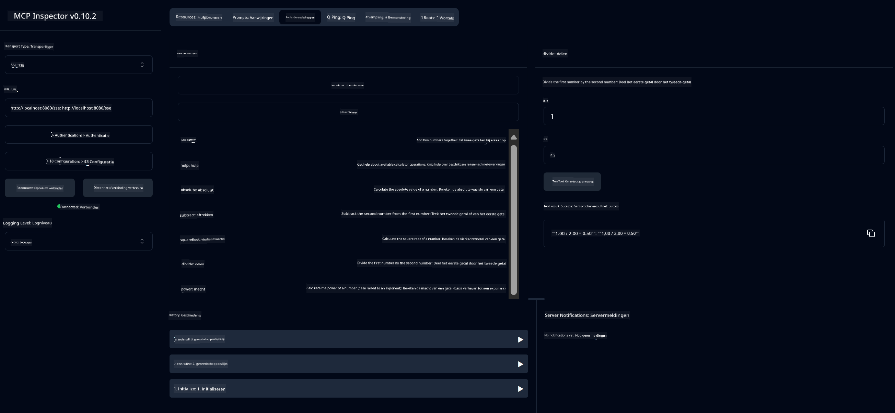

<!--
CO_OP_TRANSLATOR_METADATA:
{
  "original_hash": "5bd7a347d6ed1d706443f9129dd29dd9",
  "translation_date": "2025-07-25T09:44:26+00:00",
  "source_file": "04-PracticalSamples/mcp/calculator/README.md",
  "language_code": "nl"
}
-->
# Basis Rekenmachine MCP Service

>**Opmerking**: Dit hoofdstuk bevat een [**Tutorial**](./TUTORIAL.md) die je door de voorbeelden begeleidt.

Welkom bij je eerste praktische ervaring met het **Model Context Protocol (MCP)**! In de vorige hoofdstukken heb je de basis van generatieve AI geleerd en je ontwikkelomgeving opgezet. Nu is het tijd om iets praktisch te bouwen.

Deze rekenmachineservice laat zien hoe AI-modellen veilig kunnen communiceren met externe tools via MCP. In plaats van te vertrouwen op de soms onbetrouwbare rekenvaardigheden van AI-modellen, laten we zien hoe je een robuust systeem kunt bouwen waarin AI gespecialiseerde services kan aanroepen voor nauwkeurige berekeningen.

## Inhoudsopgave

- [Wat Je Gaat Leren](../../../../../04-PracticalSamples/mcp/calculator)
- [Vereisten](../../../../../04-PracticalSamples/mcp/calculator)
- [Belangrijke Concepten](../../../../../04-PracticalSamples/mcp/calculator)
- [Snel Starten](../../../../../04-PracticalSamples/mcp/calculator)
- [Beschikbare Rekenmachinebewerkingen](../../../../../04-PracticalSamples/mcp/calculator)
- [Test Clients](../../../../../04-PracticalSamples/mcp/calculator)
  - [1. Directe MCP Client (SDKClient)](../../../../../04-PracticalSamples/mcp/calculator)
  - [2. AI-Aangedreven Client (LangChain4jClient)](../../../../../04-PracticalSamples/mcp/calculator)
- [MCP Inspector (Web UI)](../../../../../04-PracticalSamples/mcp/calculator)
  - [Stapsgewijze Instructies](../../../../../04-PracticalSamples/mcp/calculator)

## Wat Je Gaat Leren

Door dit voorbeeld te doorlopen, leer je:
- Hoe je MCP-compatibele services maakt met Spring Boot
- Het verschil tussen directe protocolcommunicatie en AI-aangedreven interactie
- Hoe AI-modellen beslissen wanneer en hoe ze externe tools gebruiken
- Best practices voor het bouwen van AI-toepassingen met tools

Perfect voor beginners die MCP-concepten willen leren en klaar zijn om hun eerste AI-toolintegratie te bouwen!

## Vereisten

- Java 21+
- Maven 3.6+
- **GitHub Token**: Vereist voor de AI-aangedreven client. Als je dit nog niet hebt ingesteld, zie [Hoofdstuk 2: Je ontwikkelomgeving instellen](../../../02-SetupDevEnvironment/README.md) voor instructies.

## Belangrijke Concepten

**Model Context Protocol (MCP)** is een gestandaardiseerde manier voor AI-toepassingen om veilig verbinding te maken met externe tools. Zie het als een "brug" waarmee AI-modellen externe services zoals onze rekenmachine kunnen gebruiken. In plaats van dat het AI-model zelf wiskunde probeert te doen (wat onbetrouwbaar kan zijn), kan het onze rekenmachineservice aanroepen om nauwkeurige resultaten te krijgen. MCP zorgt ervoor dat deze communicatie veilig en consistent verloopt.

**Server-Sent Events (SSE)** maakt realtime communicatie mogelijk tussen de server en clients. In tegenstelling tot traditionele HTTP-verzoeken, waarbij je vraagt en wacht op een antwoord, kan de server met SSE continu updates naar de client sturen. Dit is ideaal voor AI-toepassingen waarbij antwoorden gestreamd worden of tijd kosten om te verwerken.

**AI Tools & Functieaanroepen** stellen AI-modellen in staat om automatisch externe functies (zoals rekenmachinebewerkingen) te kiezen en te gebruiken op basis van gebruikersverzoeken. Als je vraagt "Wat is 15 + 27?", begrijpt het AI-model dat je optelling wilt, roept automatisch onze `add`-tool aan met de juiste parameters (15, 27) en geeft het resultaat terug in natuurlijke taal. De AI fungeert als een intelligente coördinator die weet wanneer en hoe elke tool te gebruiken.

## Snel Starten

### 1. Navigeer naar de map van de rekenmachine-applicatie
```bash
cd Generative-AI-for-beginners-java/04-PracticalSamples/mcp/calculator
```

### 2. Bouwen & Uitvoeren
```bash
mvn clean install -DskipTests
java -jar target/calculator-server-0.0.1-SNAPSHOT.jar
```

### 2. Testen met Clients
- **SDKClient**: Directe MCP-protocolinteractie
- **LangChain4jClient**: AI-aangedreven natuurlijke taalinteractie (vereist GitHub-token)

## Beschikbare Rekenmachinebewerkingen

- `add(a, b)`, `subtract(a, b)`, `multiply(a, b)`, `divide(a, b)`
- `power(base, exponent)`, `squareRoot(number)`, `absolute(number)`
- `modulus(a, b)`, `help()`

## Test Clients

### 1. Directe MCP Client (SDKClient)
Test de ruwe MCP-protocolcommunicatie. Voer uit met:
```bash
mvn test-compile exec:java -Dexec.mainClass="com.microsoft.mcp.sample.client.SDKClient" -Dexec.classpathScope=test
```

### 2. AI-Aangedreven Client (LangChain4jClient)
Toont natuurlijke taalinteractie met GitHub-modellen. Vereist een GitHub-token (zie [Vereisten](../../../../../04-PracticalSamples/mcp/calculator)).

**Uitvoeren:**
```bash
mvn test-compile exec:java -Dexec.mainClass="com.microsoft.mcp.sample.client.LangChain4jClient" -Dexec.classpathScope=test
```

## MCP Inspector (Web UI)

MCP Inspector biedt een visuele webinterface om je MCP-service te testen zonder code te schrijven. Perfect voor beginners om te begrijpen hoe MCP werkt!

### Stapsgewijze Instructies:

1. **Start de rekenmachineserver** (als deze nog niet draait):
   ```bash
   java -jar target/calculator-server-0.0.1-SNAPSHOT.jar
   ```

2. **Installeer en voer MCP Inspector uit** in een nieuwe terminal:
   ```bash
   npx @modelcontextprotocol/inspector
   ```

3. **Open de webinterface**:
   - Zoek naar een bericht zoals "Inspector running at http://localhost:6274"
   - Open die URL in je webbrowser

4. **Verbind met je rekenmachineservice**:
   - Stel in de webinterface het transporttype in op "SSE"
   - Stel de URL in op: `http://localhost:8080/sse`
   - Klik op de knop "Connect"

5. **Verken beschikbare tools**:
   - Klik op "List Tools" om alle rekenmachinebewerkingen te zien
   - Je ziet functies zoals `add`, `subtract`, `multiply`, enz.

6. **Test een rekenmachinebewerking**:
   - Selecteer een tool (bijv. "add")
   - Voer parameters in (bijv. `a: 15`, `b: 27`)
   - Klik op "Run Tool"
   - Bekijk het resultaat dat door je MCP-service wordt geretourneerd!

Deze visuele aanpak helpt je precies te begrijpen hoe MCP-communicatie werkt voordat je je eigen clients bouwt.



---
**Referentie:** [MCP Server Boot Starter Docs](https://docs.spring.io/spring-ai/reference/api/mcp/mcp-server-boot-starter-docs.html)

**Disclaimer**:  
Dit document is vertaald met behulp van de AI-vertalingsservice [Co-op Translator](https://github.com/Azure/co-op-translator). Hoewel we ons best doen voor nauwkeurigheid, dient u zich ervan bewust te zijn dat geautomatiseerde vertalingen fouten of onnauwkeurigheden kunnen bevatten. Het originele document in de oorspronkelijke taal moet worden beschouwd als de gezaghebbende bron. Voor kritieke informatie wordt professionele menselijke vertaling aanbevolen. Wij zijn niet aansprakelijk voor eventuele misverstanden of verkeerde interpretaties die voortvloeien uit het gebruik van deze vertaling.