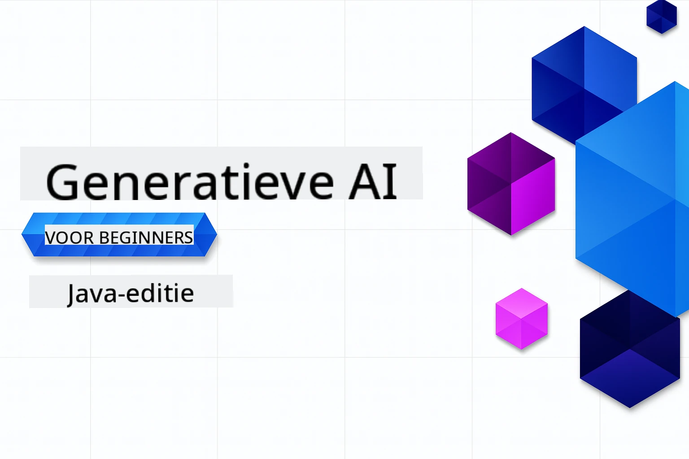

# Generatieve AI voor Beginners - Java Editie
[](https://discord.gg/nTYy5BXMWG)



**Tijdsinvestering**: De hele workshop kan online worden voltooid zonder lokale installatie. Het opzetten van de omgeving duurt 2 minuten, het verkennen van de voorbeelden kost 1-3 uur, afhankelijk van de diepgang van de verkenning.

> **Snelle Start**

1. Fork deze repository naar je GitHub-account
2. Klik op **Code** → tabblad **Codespaces** → **...** → **Nieuw met opties...**
3. Gebruik de standaardinstellingen – hierdoor wordt de ontwikkelcontainer geselecteerd die voor deze cursus is gemaakt
4. Klik op **Codespace maken**
5. Wacht ongeveer 2 minuten tot de omgeving klaar is
6. Ga direct naar [Het eerste voorbeeld](./02-SetupDevEnvironment/README.md#step-2-create-a-github-personal-access-token)

> **Liever lokaal klonen?**
>
> Deze repository bevat meer dan 50 taalvertalingen, wat de downloadgrootte aanzienlijk vergroot. Om te klonen zonder vertalingen, gebruik je sparse checkout:
> ```bash
> git clone --filter=blob:none --sparse https://github.com/microsoft/Generative-AI-for-beginners-java.git
> cd Generative-AI-for-beginners-java
> git sparse-checkout set --no-cone '/*' '!translations' '!translated_images'
> ```
> Dit geeft je alles wat je nodig hebt om de cursus te voltooien met een veel snellere download.


## Meertalige Ondersteuning

### Ondersteund via GitHub Action (Geautomatiseerd & Altijd Up-to-date)

<!-- CO-OP TRANSLATOR LANGUAGES TABLE START -->
[Arabisch](../ar/README.md) | [Bengaals](../bn/README.md) | [Bulgaars](../bg/README.md) | [Birmaans (Myanmar)](../my/README.md) | [Chinees (Vereenvoudigd)](../zh-CN/README.md) | [Chinees (Traditioneel, Hong Kong)](../zh-HK/README.md) | [Chinees (Traditioneel, Macau)](../zh-MO/README.md) | [Chinees (Traditioneel, Taiwan)](../zh-TW/README.md) | [Kroatisch](../hr/README.md) | [Tsjechisch](../cs/README.md) | [Deens](../da/README.md) | [Nederlands](./README.md) | [Ests](../et/README.md) | [Fins](../fi/README.md) | [Frans](../fr/README.md) | [Duits](../de/README.md) | [Grieks](../el/README.md) | [Hebreeuws](../he/README.md) | [Hindi](../hi/README.md) | [Hongaars](../hu/README.md) | [Indonesisch](../id/README.md) | [Italiaans](../it/README.md) | [Japans](../ja/README.md) | [Kannada](../kn/README.md) | [Koreaans](../ko/README.md) | [Litouws](../lt/README.md) | [Maleisisch](../ms/README.md) | [Malayalam](../ml/README.md) | [Marathi](../mr/README.md) | [Nepalees](../ne/README.md) | [Nigerdelta Pidgin](../pcm/README.md) | [Noors](../no/README.md) | [Perzisch (Farsi)](../fa/README.md) | [Pools](../pl/README.md) | [Portugees (Brazilië)](../pt-BR/README.md) | [Portugees (Portugal)](../pt-PT/README.md) | [Punjabi (Gurmukhi)](../pa/README.md) | [Roemeens](../ro/README.md) | [Russisch](../ru/README.md) | [Servisch (Cyrillisch)](../sr/README.md) | [Slowaaks](../sk/README.md) | [Sloveens](../sl/README.md) | [Spaans](../es/README.md) | [Swahili](../sw/README.md) | [Zweeds](../sv/README.md) | [Tagalog (Filipijns)](../tl/README.md) | [Tamil](../ta/README.md) | [Telugu](../te/README.md) | [Thais](../th/README.md) | [Turks](../tr/README.md) | [Oekraïens](../uk/README.md) | [Urdu](../ur/README.md) | [Vietnamees](../vi/README.md)

## Cursusstructuur & Leerpad

### **Hoofdstuk 1: Introductie tot Generatieve AI**
- **Kernconcepten**: Begrip van grote taalmodellen, tokens, embeddings en AI-capaciteiten
- **Java AI Ecosysteem**: Overzicht van Spring AI en OpenAI SDK's
- **Model Context Protocol**: Introductie tot MCP en de rol ervan in AI-agentcommunicatie
- **Praktische Toepassingen**: Praktijkvoorbeelden waaronder chatbots en contentgeneratie
- **[→ Start Hoofdstuk 1](./01-IntroToGenAI/README.md)**

### **Hoofdstuk 2: Ontwikkelomgeving Instellen**
- **Multi-Provider Configuratie**: Instellen van GitHub Models, Azure OpenAI en OpenAI Java SDK-integraties
- **Spring Boot + Spring AI**: Beste praktijken voor enterprise AI-applicatieontwikkeling
- **GitHub Models**: Gratis AI-modeltoegang voor prototyping en leren (geen creditcard vereist)
- **Ontwikkeltools**: Docker-containers, VS Code en GitHub Codespaces-configuratie
- **[→ Start Hoofdstuk 2](./02-SetupDevEnvironment/README.md)**

### **Hoofdstuk 3: Kerntechnieken van Generatieve AI**
- **Prompt Engineering**: Technieken voor optimale AI-modelreacties
- **Embeddings & Vectorbewerkingen**: Implementeren van semantisch zoeken en gelijkenisvergelijking
- **Retrieval-Augmented Generation (RAG)**: Combineer AI met je eigen gegevensbronnen
- **Functieoproepen**: Breid AI-capaciteiten uit met aangepaste tools en plugins
- **[→ Start Hoofdstuk 3](./03-CoreGenerativeAITechniques/README.md)**

### **Hoofdstuk 4: Praktische Toepassingen & Projecten**
- **Pet Story Generator** (`petstory/`): Creatieve contentgeneratie met GitHub Models
- **Foundry Local Demo** (`foundrylocal/`): Lokale AI-modelintegratie met OpenAI Java SDK
- **MCP Calculator Service** (`calculator/`): Basale Model Context Protocol-implementatie met Spring AI
- **[→ Start Hoofdstuk 4](./04-PracticalSamples/README.md)**

### **Hoofdstuk 5: Verantwoorde AI-ontwikkeling**
- **GitHub Models Veiligheid**: Test de ingebouwde contentfiltering en veiligheidsmechanismen (harde blokkades en zachte weigeringen)
- **Verantwoorde AI Demo**: Praktijkvoorbeeld dat laat zien hoe moderne AI-veiligheidssystemen werken
- **Beste Praktijken**: Essentiële richtlijnen voor ethische AI-ontwikkeling en -implementatie
- **[→ Start Hoofdstuk 5](./05-ResponsibleGenAI/README.md)**

## Aanvullende Bronnen

<!-- CO-OP TRANSLATOR OTHER COURSES START -->
### LangChain
[](https://aka.ms/langchain4j-for-beginners)
[](https://aka.ms/langchainjs-for-beginners?WT.mc_id=m365-94501-dwahlin)
[](https://github.com/microsoft/langchain-for-beginners?WT.mc_id=m365-94501-dwahlin)
---

### Azure / Edge / MCP / Agents
[](https://github.com/microsoft/AZD-for-beginners?WT.mc_id=academic-105485-koreyst)
[](https://github.com/microsoft/edgeai-for-beginners?WT.mc_id=academic-105485-koreyst)
[](https://github.com/microsoft/mcp-for-beginners?WT.mc_id=academic-105485-koreyst)
[](https://github.com/microsoft/ai-agents-for-beginners?WT.mc_id=academic-105485-koreyst)

---
 
### Generatieve AI Serie
[](https://github.com/microsoft/generative-ai-for-beginners?WT.mc_id=academic-105485-koreyst)
[-9333EA?style=for-the-badge&labelColor=E5E7EB&color=9333EA)](https://github.com/microsoft/Generative-AI-for-beginners-dotnet?WT.mc_id=academic-105485-koreyst)
[-C084FC?style=for-the-badge&labelColor=E5E7EB&color=C084FC)](https://github.com/microsoft/generative-ai-for-beginners-java?WT.mc_id=academic-105485-koreyst)
[-E879F9?style=for-the-badge&labelColor=E5E7EB&color=E879F9)](https://github.com/microsoft/generative-ai-with-javascript?WT.mc_id=academic-105485-koreyst)

---
 
### Kernleren
[](https://aka.ms/ml-beginners?WT.mc_id=academic-105485-koreyst)
[](https://aka.ms/datascience-beginners?WT.mc_id=academic-105485-koreyst)
[](https://aka.ms/ai-beginners?WT.mc_id=academic-105485-koreyst)
[](https://github.com/microsoft/Security-101?WT.mc_id=academic-96948-sayoung)
[](https://aka.ms/webdev-beginners?WT.mc_id=academic-105485-koreyst)
[](https://aka.ms/iot-beginners?WT.mc_id=academic-105485-koreyst)
[](https://github.com/microsoft/xr-development-for-beginners?WT.mc_id=academic-105485-koreyst)

---
 
### Copilot-serie
[](https://aka.ms/GitHubCopilotAI?WT.mc_id=academic-105485-koreyst)
[](https://github.com/microsoft/mastering-github-copilot-for-dotnet-csharp-developers?WT.mc_id=academic-105485-koreyst)
[](https://github.com/microsoft/CopilotAdventures?WT.mc_id=academic-105485-koreyst)
<!-- CO-OP TRANSLATOR OTHER COURSES END -->

## Hulp krijgen

Als je vastloopt of vragen hebt over het bouwen van AI-apps. Doe mee met mede-leerlingen en ervaren ontwikkelaars in discussies over MCP. Het is een ondersteunende gemeenschap waar vragen welkom zijn en kennis vrij wordt gedeeld.

[](https://discord.gg/nTYy5BXMWG)

Als je productfeedback hebt of fouten tegenkomt tijdens het bouwen, bezoek dan:

[](https://aka.ms/foundry/forum)

---

<!-- CO-OP TRANSLATOR DISCLAIMER START -->
**Disclaimer**:
Dit document is vertaald met behulp van de AI-vertalingsdienst [Co-op Translator](https://github.com/Azure/co-op-translator). Hoewel we streven naar nauwkeurigheid, dient u er rekening mee te houden dat automatische vertalingen fouten of onnauwkeurigheden kunnen bevatten. Het oorspronkelijke document in de oorspronkelijke taal moet als de gezaghebbende bron worden beschouwd. Voor cruciale informatie wordt professionele menselijke vertaling aanbevolen. Wij zijn niet aansprakelijk voor misverstanden of verkeerde interpretaties die voortvloeien uit het gebruik van deze vertaling.
<!-- CO-OP TRANSLATOR DISCLAIMER END -->