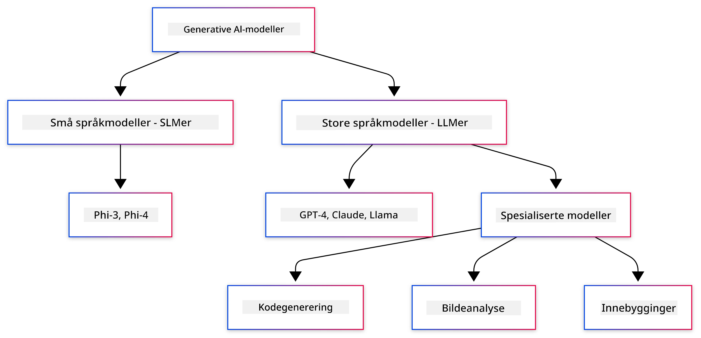
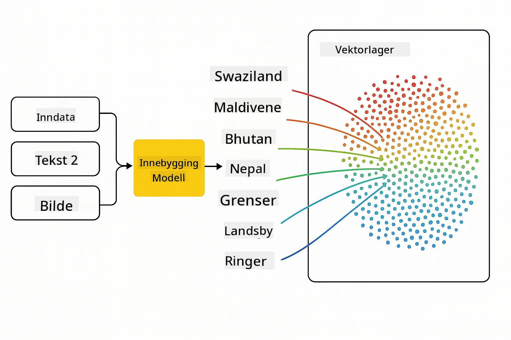
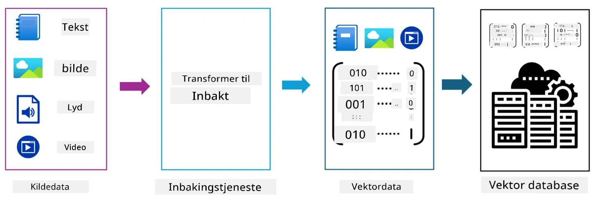
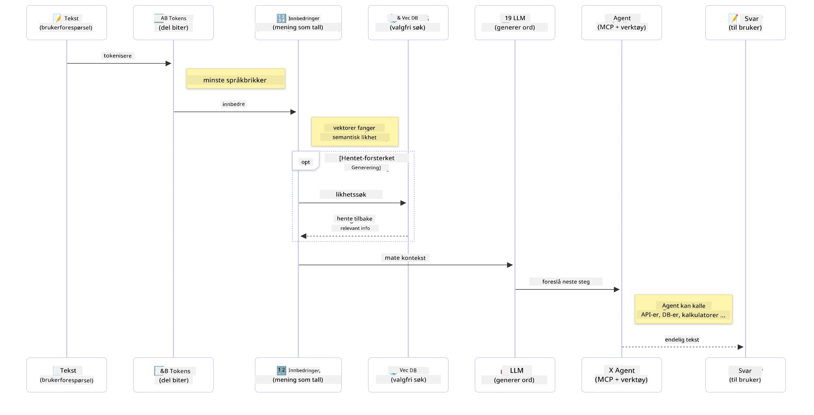

# Introduksjon til Generativ AI - Java-utgave

> **Video**: [Se videooversikten for denne leksjonen på YouTube.](https://www.youtube.com/watch?v=XH46tGp_eSw) Du kan også klikke på miniatyrbildet over.

## Hva du vil lære

- **Grunnleggende om generativ AI** inkludert LLM-er, prompt-engineering, tokens, embeddings og vektordatabaser
- **Sammenlign Java AI-utviklingsverktøy** inkludert Azure OpenAI SDK, Spring AI og OpenAI Java SDK
- **Oppdag Model Context Protocol** og dens rolle i kommunikasjon mellom AI-agenter

## Innholdsfortegnelse

- [Introduksjon](#introduksjon)
- [En rask oppfriskning av generative AI-konsepter](#en-rask-oppfriskning-av-generative-ai-konsepter)
- [Gjennomgang av prompt engineering](#gjennomgang-av-prompt-engineering)
- [Tokens, embeddings og agenter](#tokens-embeddings-og-agenter)
- [AI-utviklingsverktøy og biblioteker for Java](#ai-utviklingsverktøy-og-biblioteker-for-java)
  - [OpenAI Java SDK](#openai-java-sdk)
  - [Spring AI](#spring-ai)
  - [Azure OpenAI Java SDK](#azure-openai-java-sdk)
- [Oppsummering](#oppsummering)
- [Neste steg](#neste-steg)

## Introduksjon

Velkommen til det første kapittelet i Generativ AI for nybegynnere - Java-utgave! Denne grunnleggende leksjonen introduserer deg for kjernebegrepene i generativ AI og hvordan du kan jobbe med dem ved hjelp av Java. Du vil lære om de essensielle byggesteinene for AI-applikasjoner, inkludert store språkmodeller (LLM-er), tokens, embeddings og AI-agenter. Vi utforsker også hovedverktøyene i Java som du vil bruke gjennom hele kurset.

### En rask oppfriskning av generative AI-konsepter

Generativ AI er en type kunstig intelligens som skaper nytt innhold, som tekst, bilder eller kode, basert på mønstre og relasjoner lært fra data. Generative AI-modeller kan generere menneskelignende svar, forstå kontekst og noen ganger til og med lage innhold som virker menneskelig.

Når du utvikler dine Java AI-applikasjoner, vil du jobbe med **generative AI-modeller** for å skape innhold. Noen evner til generative AI-modeller inkluderer:

- **Tekstgenerering**: Lage menneskelignende tekst for chatboter, innhold og tekstfullføring.
- **Bildegenerering og analyse**: Lage realistiske bilder, forbedre bilder og oppdage objekter.
- **Kodegenerering**: Skrive kodebiter eller skript.

Det finnes spesifikke modelltyper som er optimalisert for ulike oppgaver. For eksempel kan både **små språkmodeller (SLM)** og **store språkmodeller (LLM)** håndtere tekstgenerering, der LLM-er vanligvis tilbyr bedre ytelse for komplekse oppgaver. For bilde-relaterte oppgaver bruker man spesialiserte visjonsmodeller eller multimodale modeller.

Selvfølgelig er ikke svarene fra disse modellene alltid perfekte. Du har sikkert hørt om modeller som "hallusinerer" eller genererer feil informasjon på en autoritativ måte. Men du kan hjelpemodellen til å generere bedre svar ved å gi klare instrukser og kontekst. Her kommer **prompt engineering** inn.

#### Gjennomgang av prompt engineering

Prompt engineering er praksisen med å designe effektive innganger som styrer AI-modeller mot ønskede utdata. Det innebærer:

- **Klarhet**: Gjøre instruksjonene klare og utvetydige.
- **Kontekst**: Gi nødvendig bakgrunnsinformasjon.
- **Begrensninger**: Spesifisere eventuelle begrensninger eller formater.

Noen beste praksiser for prompt engineering inkluderer design av prompts, klare instruksjoner, oppdeling av oppgaver, ett-skudd og få-skudd læring, samt finjustering av prompts. Det er viktig å teste ulike prompts for å finne det som fungerer best for ditt spesifikke brukstilfelle.

Når du utvikler applikasjoner vil du jobbe med forskjellige typer prompts:
- **System-prompts**: Setter grunnreglene og konteksten for modellens oppførsel
- **Bruker-prompts**: Inndata fra applikasjonens brukere
- **Assistent-prompts**: Modellens svar basert på system- og bruker-prompts

> **Lær mer**: Lær mer om prompt engineering i [Prompt Engineering-kapitlet i GenAI for Beginners-kurset](https://github.com/microsoft/generative-ai-for-beginners/tree/main/04-prompt-engineering-fundamentals)

#### Tokens, embeddings og agenter

Når du jobber med generative AI-modeller, vil du møte begreper som **tokens**, **embeddings**, **agenter** og **Model Context Protocol (MCP)**. Her er en detaljert oversikt over disse konseptene:

- **Tokens**: Tokens er den minste teksteenheten i en modell. De kan være ord, tegn eller sub-ord. Tokens brukes til å representere tekstdata i et format som modellen kan forstå. For eksempel kan setningen "The quick brown fox jumped over the lazy dog" tokeniseres som ["The", " quick", " brown", " fox", " jumped", " over", " the", " lazy", " dog"] eller ["The", " qu", "ick", " br", "own", " fox", " jump", "ed", " over", " the", " la", "zy", " dog"] avhengig av tokeniseringsstrategien.

Tokenisering er prosessen med å dele opp tekst i disse mindre enhetene. Dette er avgjørende fordi modeller opererer på tokens i stedet for rå tekst. Antall tokens i en prompt påvirker modellens svarlengde og kvalitet, siden modeller har tokenbegrensninger for sin kontekstvindu (f.eks. 128K tokens for GPT-4o sin totale kontekst, inkludert både input og output).

  I Java kan du bruke biblioteker som OpenAI SDK for automatisk tokenisering når du sender forespørsler til AI-modeller.

- **Embeddings**: Embeddings er vektorreprensentasjoner av tokens som fanger semantisk mening. De er numeriske representasjoner (vanligvis matriser av flyttallsverdier) som lar modellen forstå relasjoner mellom ord og generere kontekstuelt relevante svar. Like ord har like embeddings, noe som gjør at modellen kan forstå konsepter som synonymer og semantiske relasjoner.

  I Java kan du generere embeddings ved hjelp av OpenAI SDK eller andre biblioteker som støtter generering av embeddings. Disse embeddings er essensielle for oppgaver som semantisk søk, der du ønsker å finne lignende innhold basert på mening fremfor eksakte teksttreff.

- **Vektordatabaser**: Vektordatabaser er spesialiserte lagringssystemer optimalisert for embeddings. De muliggjør effektivt søk etter likhet og er avgjørende for Retrieval-Augmented Generation (RAG) mønstre hvor du må finne relevant informasjon fra store datasett basert på semantisk likhet fremfor eksakte treff.

> **Merk**: I dette kurset vil vi ikke dekke vektordatabaser, men vi mener det er verdt å nevne siden de ofte brukes i reelle applikasjoner.

- **Agenter & MCP**: AI-komponenter som autonomt samhandler med modeller, verktøy og eksterne systemer. Model Context Protocol (MCP) gir en standardisert måte for agenter å sikkert få tilgang til eksterne datakilder og verktøy. Lær mer i vår [MCP for Beginners](https://github.com/microsoft/mcp-for-beginners)-kurs.

I Java AI-applikasjoner bruker du tokens for tekstbehandling, embeddings for semantisk søk og RAG, vektordatabaser for datahenting og agenter med MCP for å bygge intelligente systemer som bruker verktøy.

### AI-utviklingsverktøy og biblioteker for Java

Java tilbyr fremragende verktøy for AI-utvikling. Det finnes tre hovedbiblioteker vi skal utforske gjennom kurset - OpenAI Java SDK, Azure OpenAI SDK og Spring AI.

Her er et raskt referansekart som viser hvilket SDK som brukes i eksemplene i hvert kapittel:

| Kapittel | Eksempel | SDK |
|---------|--------|-----|
| 02-SetupDevEnvironment | github-models | OpenAI Java SDK |
| 02-SetupDevEnvironment | basic-chat-azure | Spring AI Azure OpenAI |
| 03-CoreGenerativeAITechniques | examples | Azure OpenAI SDK |
| 04-PracticalSamples | petstory | OpenAI Java SDK |
| 04-PracticalSamples | foundrylocal | OpenAI Java SDK |
| 04-PracticalSamples | calculator | Spring AI MCP SDK + LangChain4j |

**SDK-dokumentasjonslenker:**
- [Azure OpenAI Java SDK](https://github.com/Azure/azure-sdk-for-java/tree/azure-ai-openai_1.0.0-beta.16/sdk/openai/azure-ai-openai)
- [Spring AI](https://docs.spring.io/spring-ai/reference/)
- [OpenAI Java SDK](https://github.com/openai/openai-java)
- [LangChain4j](https://docs.langchain4j.dev/)

#### OpenAI Java SDK

OpenAI SDK er det offisielle Java-biblioteket for OpenAI API-et. Det gir et enkelt og konsistent grensesnitt for å samhandle med OpenAI sine modeller, og gjør det lett å integrere AI-funksjonalitet i Java-applikasjoner. Kapittel 2 sitt GitHub Models-eksempel, kapittel 4 sin Pet Story-applikasjon og Foundry Local-eksempelet demonstrerer tilnærmingen med OpenAI SDK.

#### Spring AI

Spring AI er et omfattende rammeverk som bringer AI-funksjonalitet til Spring-applikasjoner, og tilbyr et konsistent abstraksjonslag på tvers av ulike AI-leverandører. Det integreres sømløst med Spring-økosystemet, og er det ideelle valget for enterprise Java-applikasjoner som trenger AI-funksjonalitet.

Styrken til Spring AI ligger i dens sømløse integrasjon med Spring-økosystemet, noe som gjør det enkelt å bygge produksjonsklare AI-applikasjoner med kjente Spring-mønstre som dependency injection, konfigurasjonsstyring og testframerwork. Du vil bruke Spring AI i kapittel 2 og 4 for å bygge applikasjoner som utnytter både OpenAI og Model Context Protocol (MCP) Spring AI-biblioteker.

##### Model Context Protocol (MCP)

[Model Context Protocol (MCP)](https://modelcontextprotocol.io/) er en fremvoksende standard som gjør det mulig for AI-applikasjoner å samhandle sikkert med eksterne datakilder og verktøy. MCP gir en standardisert måte for AI-modeller å få tilgang til kontekstuell informasjon og utføre handlinger i applikasjonene dine.

I kapittel 4 bygger du en enkel MCP-kalkulatortjeneste som demonstrerer grunnprinsippene i Model Context Protocol med Spring AI, og viser hvordan man lager grunnleggende verktøy-integrasjoner og tjenestearkitekturer.

#### Azure OpenAI Java SDK

Azure OpenAI klientbibliotek for Java er en tilpasning av OpenAI sine REST-API-er som tilbyr et idiomatisk grensesnitt og integrasjon med resten av Azure SDK-økosystemet. I kapittel 3 bygger du applikasjoner med Azure OpenAI SDK, inkludert chat-applikasjoner, funksjonskall og RAG (Retrieval-Augmented Generation) mønstre.

> Merk: Azure OpenAI SDK ligger etter OpenAI Java SDK når det gjelder funksjoner, så for fremtidige prosjekter bør du vurdere å bruke OpenAI Java SDK.

## Oppsummering

Det var grunnlaget! Du forstår nå:

- Kjernebegrepene bak generativ AI – fra LLM-er og prompt engineering til tokens, embeddings og vektordatabaser
- Dine verktøyvalg for Java AI-utvikling: Azure OpenAI SDK, Spring AI og OpenAI Java SDK
- Hva Model Context Protocol er og hvordan det gjør at AI-agenter kan jobbe med eksterne verktøy

## Neste steg

[Kapittel 2: Sette opp utviklingsmiljøet](../02-SetupDevEnvironment/README.md)

---

<!-- CO-OP TRANSLATOR DISCLAIMER START -->
**Ansvarsfraskrivelse**:  
Dette dokumentet er oversatt ved hjelp av AI-oversettelsestjenesten [Co-op Translator](https://github.com/Azure/co-op-translator). Selv om vi streber etter nøyaktighet, vennligst vær oppmerksom på at automatiske oversettelser kan inneholde feil eller unøyaktigheter. Det originale dokumentet på dets opprinnelige språk skal betraktes som den autoritative kilden. For kritisk informasjon anbefales profesjonell menneskelig oversettelse. Vi er ikke ansvarlige for eventuelle misforståelser eller feiltolkninger som oppstår ved bruk av denne oversettelsen.
<!-- CO-OP TRANSLATOR DISCLAIMER END -->