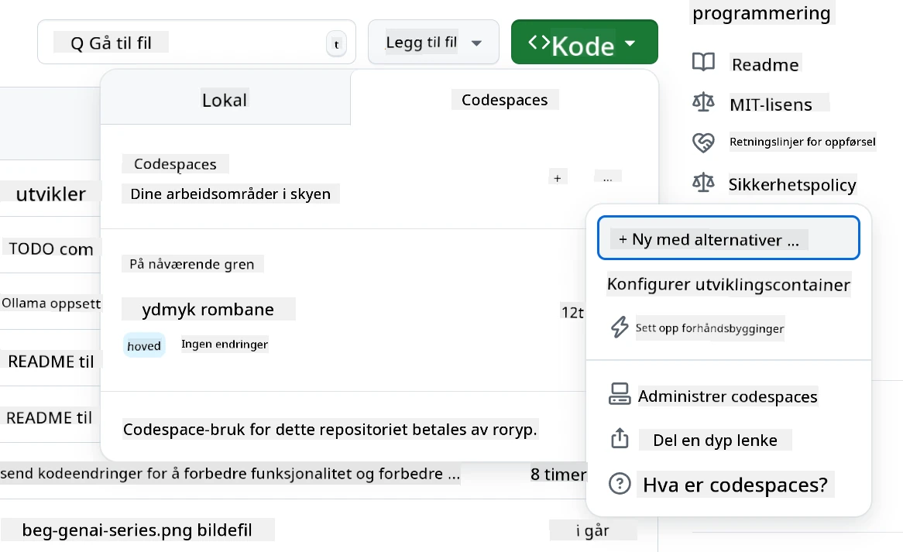
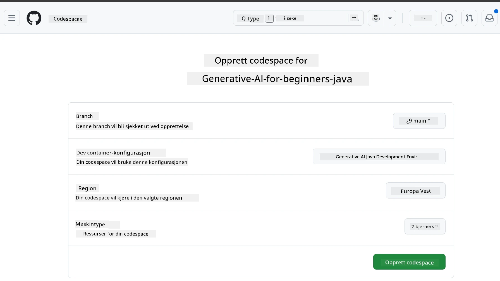
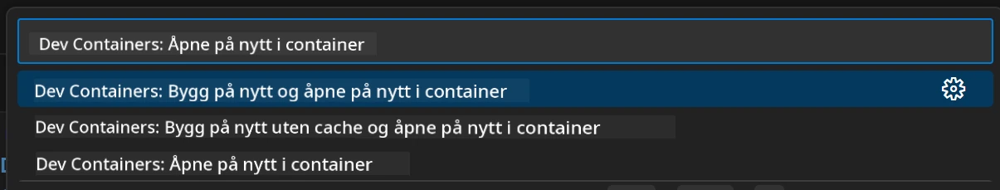
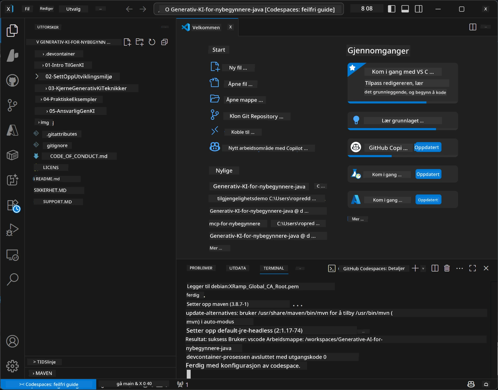

<!--
CO_OP_TRANSLATOR_METADATA:
{
  "original_hash": "96a30d42b9751a3d4e4b20e28d29d459",
  "translation_date": "2026-01-28T05:05:11+00:00",
  "source_file": "02-SetupDevEnvironment/README.md",
  "language_code": "no"
}
-->
# Sette opp utviklingsmiljøet for Generativ AI for Java

> **Rask start**: Kode i skyen på 2 minutter - hopp til [GitHub Codespaces-oppsett](../../../02-SetupDevEnvironment) - ingen lokal installasjon kreves og bruker GitHub-modeller!

> **Interessert i Azure OpenAI?**, se vår [Azure OpenAI-oppsettguide](getting-started-azure-openai.md) med trinn for å opprette en ny Azure OpenAI-ressurs.

## Hva du vil lære

- Sette opp et Java-utviklingsmiljø for AI-applikasjoner
- Velge og konfigurere ditt foretrukne utviklingsmiljø (sky-først med Codespaces, lokal dev container, eller full lokal oppsett)
- Teste oppsettet ditt ved å koble til GitHub-modeller

## Innholdsfortegnelse

- [Hva du vil lære](../../../02-SetupDevEnvironment)
- [Introduksjon](../../../02-SetupDevEnvironment)
- [Trinn 1: Sett opp utviklingsmiljøet ditt](../../../02-SetupDevEnvironment)
  - [Alternativ A: GitHub Codespaces (anbefalt)](../../../02-SetupDevEnvironment)
  - [Alternativ B: Lokal dev container](../../../02-SetupDevEnvironment)
  - [Alternativ C: Bruk din eksisterende lokale installasjon](../../../02-SetupDevEnvironment)
- [Trinn 2: Lag en GitHub-personlig tilgangstoken](../../../02-SetupDevEnvironment)
- [Trinn 3: Test oppsettet ditt](../../../02-SetupDevEnvironment)
- [Feilsøking](../../../02-SetupDevEnvironment)
- [Oppsummering](../../../02-SetupDevEnvironment)
- [Neste steg](../../../02-SetupDevEnvironment)

## Introduksjon

Dette kapitlet vil veilede deg gjennom å sette opp et utviklingsmiljø. Vi bruker **GitHub Models** som vårt hovedeksempel fordi det er gratis, enkelt å sette opp med bare en GitHub-konto, krever ikke kredittkort, og gir tilgang til flere modeller for eksperimentering.

**Ingen lokal oppsett kreves!** Du kan begynne å kode umiddelbart ved hjelp av GitHub Codespaces, som gir et fullt utviklingsmiljø i nettleseren din.


Vi anbefaler å bruke [**GitHub Models**](https://github.com/marketplace?type=models) for dette kurset fordi det er:
- **Gratis** å komme i gang
- **Enkelt** å sette opp med bare en GitHub-konto
- **Ingen kredittkort** kreves
- **Flere modeller** tilgjengelig for eksperimentering

> **Merk**: GitHub Models som brukes i dette kurset har disse gratisgrensene:
> - 15 forespørsler per minutt (150 per dag)
> - ~8.000 ord inn, ~4.000 ord ut per forespørsel
> - 5 samtidige forespørsler
> 
> For produksjonsbruk, oppgrader til Azure AI Foundry Models med din Azure-konto. Koden din trenger ikke å endres. Se [Azure AI Foundry dokumentasjonen](https://learn.microsoft.com/azure/ai-foundry/foundry-models/how-to/quickstart-github-models).

## Trinn 1: Sett opp utviklingsmiljøet ditt

<a name="quick-start-cloud"></a>

Vi har laget en forhåndskonfigurert utviklingscontainer for å minimere oppsettstid og sikre at du har alle nødvendige verktøy for dette Generative AI for Java-kurset. Velg din foretrukne utviklingsmetode:

### Miljøoppsett-alternativer:

#### Alternativ A: GitHub Codespaces (anbefalt)

**Start koding på 2 minutter - ingen lokal oppsett kreves!**

1. Fork dette repoet til din GitHub-konto
   > **Merk**: Hvis du ønsker å redigere grunnkonfigurasjonen, ta en titt på [Dev Container Configuration](../../../.devcontainer/devcontainer.json)
2. Klikk **Code** → fanen **Codespaces** → **...** → **New with options...**
3. Bruk standardverdiene – dette velger **Dev container configuration**: **Generative AI Java Development Environment**, en tilpasset devcontainer laget for dette kurset
4. Klikk **Create codespace**
5. Vent ~2 minutter til miljøet er klart
6. Fortsett til [Trinn 2: Lag GitHub Token](../../../02-SetupDevEnvironment)






> **Fordeler med Codespaces**:
> - Ingen lokal installasjon kreves
> - Fungerer på hvilken som helst enhet med nettleser
> - Forhåndskonfigurert med alle verktøy og avhengigheter
> - Gratis 60 timer per måned for personlige kontoer
> - Konsistent miljø for alle elever

#### Alternativ B: Lokal dev container

**For utviklere som foretrekker lokal utvikling med Docker**

1. Fork og klon dette repoet til din lokale maskin
   > **Merk**: Hvis du ønsker å redigere grunnkonfigurasjonen, ta en titt på [Dev Container Configuration](../../../.devcontainer/devcontainer.json)
2. Installer [Docker Desktop](https://www.docker.com/products/docker-desktop/) og [VS Code](https://code.visualstudio.com/)
3. Installer [Dev Containers-utvidelsen](https://marketplace.visualstudio.com/items?itemName=ms-vscode-remote.remote-containers) i VS Code
4. Åpne repo-mappen i VS Code
5. Når du blir spurt, klikk **Reopen in Container** (eller bruk `Ctrl+Shift+P` → "Dev Containers: Reopen in Container")
6. Vent til containeren bygges og starter
7. Fortsett til [Trinn 2: Lag GitHub Token](../../../02-SetupDevEnvironment)




#### Alternativ C: Bruk din eksisterende lokale installasjon

**For utviklere med eksisterende Java-miljøer**

Forutsetninger:
- [Java 21+](https://www.oracle.com/java/technologies/javase/jdk21-archive-downloads.html)
- [Maven 3.9+](https://maven.apache.org/download.cgi)
- [VS Code](https://code.visualstudio.com) eller din foretrukne IDE

Steg:
1. Klon dette repoet til din lokale maskin
2. Åpne prosjektet i din IDE
3. Fortsett til [Trinn 2: Lag GitHub Token](../../../02-SetupDevEnvironment)

> **Profftips**: Har du maskinvare med lav spesifikasjon men vil kjøre VS Code lokalt? Bruk GitHub Codespaces! Du kan koble din lokale VS Code til en cloud-hosted Codespace og få det beste fra begge verdener.



## Trinn 2: Lag en GitHub-personlig tilgangstoken

1. Gå til [GitHub-innstillinger](https://github.com/settings/profile) og velg **Settings** i profilmenyen.
2. Klikk på **Developer settings** i venstremenyen (vanligvis nederst).
3. Under **Personal access tokens**, klikk **Fine-grained tokens** (eller følg denne direkte [lenken](https://github.com/settings/personal-access-tokens)).
4. Klikk **Generate new token**.
5. Under "Token name", gi tokenet et beskrivende navn (f.eks. `GenAI-Java-Course-Token`).
6. Sett en utløpsdato (anbefalt: 7 dager for sikkerhets skyld).
7. Under "Resource owner", velg din brukerkonto.
8. Under "Repository access", velg repoene du vil bruke med GitHub Models (eller "All repositories" om nødvendig).
9. Under "Account permissions", finn **Models** og sett den til **Read-only**.
10. Klikk **Generate token**.
11. **Kopier og lagre tokenet nå** – du får ikke se det igjen!

> **Sikkerhetstips**: Bruk bare den nødvendige minste rettigheten og kortest mulig utløpstid på dine tilgangstokener.

## Trinn 3: Test oppsettet ditt med GitHub Models-eksempelet

Når utviklingsmiljøet ditt er klart, la oss teste GitHub Models-integrasjonen med vårt eksempelprogram i [`02-SetupDevEnvironment/examples/github-models`](../../../02-SetupDevEnvironment/examples/github-models).

1. Åpne terminalen i utviklingsmiljøet ditt.
2. Naviger til GitHub Models-eksempelet:
   ```bash
   cd 02-SetupDevEnvironment/examples/github-models
   ```
3. Sett din GitHub-token som en miljøvariabel:
   ```bash
   # macOS/Linux
   export GITHUB_TOKEN=your_token_here
   
   # Windows (Kommandoprompt)
   set GITHUB_TOKEN=your_token_here
   
   # Windows (PowerShell)
   $env:GITHUB_TOKEN="your_token_here"
   ```

4. Kjør applikasjonen:
   ```bash
   mvn compile exec:java -Dexec.mainClass="com.example.githubmodels.App"
   ```

Du skal se output lik:
```text
Using model: gpt-4.1-nano
Sending request to GitHub Models...
Response: Hello World!
```

### Forstå eksempelkoden

Først, la oss forstå hva vi nettopp kjørte. Eksempelet under `examples/github-models` bruker OpenAI Java SDK for å koble til GitHub Models:

**Hva denne koden gjør:**
- **Kobler** til GitHub Models med din personlige tilgangstoken
- **Sender** en enkel "Say Hello World!" melding til AI-modellen
- **Mottar** og viser AI-modellens svar
- **Validerer** at oppsettet ditt fungerer korrekt

**Viktig avhengighet** (i `pom.xml`):
```xml
<dependency>
    <groupId>com.openai</groupId>
    <artifactId>openai-java</artifactId>
    <version>2.12.0</version>
</dependency>
```

**Hovedkode** (`App.java`):
```java
// Koble til GitHub-modeller ved hjelp av OpenAI Java SDK
OpenAIClient client = OpenAIOkHttpClient.builder()
    .apiKey(pat)
    .baseUrl("https://models.inference.ai.azure.com")
    .build();

// Opprett forespørsel om chatfullføring
ChatCompletionCreateParams params = ChatCompletionCreateParams.builder()
    .model(modelId)
    .addSystemMessage("You are a concise assistant.")
    .addUserMessage("Say Hello World!")
    .build();

// Hent AI-respons
ChatCompletion response = client.chat().completions().create(params);
System.out.println("Response: " + response.choices().get(0).message().content().orElse("No response content"));
```

## Oppsummering

Flott! Nå har du alt satt opp:

- Opprettet en GitHub-personlig tilgangstoken med riktige rettigheter for AI-modell-tilgang
- Fått Java-utviklingsmiljøet ditt i gang (enten det er Codespaces, dev containere eller lokalt)
- Koblet til GitHub Models via OpenAI Java SDK for gratis AI-utvikling
- Testet at alt fungerer med et enkelt eksempel som kommuniserer med AI-modeller

## Neste steg

[Kapittel 3: Kjerneteknikker for Generativ AI](../03-CoreGenerativeAITechniques/README.md)

## Feilsøking

Har du problemer? Her er vanlige problemer og løsninger:

- **Token fungerer ikke?** 
  - Sørg for at du kopierte hele tokenet uten ekstra mellomrom
  - Bekreft at tokenet er satt riktig som miljøvariabel
  - Sjekk at tokenet har korrekt tillatelse (Models: Read-only)

- **Maven ikke funnet?** 
  - Hvis du bruker dev containere/Codespaces, skal Maven være forhåndsinstallert
  - For lokal oppsett, sørg for at Java 21+ og Maven 3.9+ er installert
  - Prøv `mvn --version` for å verifisere installasjonen

- **Tilkoblingsproblemer?** 
  - Sjekk internettilkoblingen din
  - Verifiser at GitHub er tilgjengelig fra ditt nettverk
  - Sørg for at du ikke er bak en brannmur som blokkerer GitHub Models-endepunktet

- **Dev container starter ikke?** 
  - Sørg for at Docker Desktop kjører (for lokal utvikling)
  - Prøv å bygge containeren på nytt: `Ctrl+Shift+P` → "Dev Containers: Rebuild Container"

- **Kompileringsfeil i applikasjonen?**
  - Sørg for at du er i riktig mappe: `02-SetupDevEnvironment/examples/github-models`
  - Prøv å rense og bygge på nytt: `mvn clean compile`

> **Trenger du hjelp?**: Har du fortsatt problemer? Opprett en issue i repositoriet så hjelper vi deg.

---

<!-- CO-OP TRANSLATOR DISCLAIMER START -->
**Ansvarsfraskrivelse**:
Dette dokumentet er oversatt ved bruk av AI-oversettelsestjenesten [Co-op Translator](https://github.com/Azure/co-op-translator). Selv om vi streber etter nøyaktighet, vennligst vær oppmerksom på at automatiske oversettelser kan inneholde feil eller unøyaktigheter. Det opprinnelige dokumentet på dets opprinnelige språk skal betraktes som den autoritative kilden. For kritisk informasjon anbefales profesjonell menneskelig oversettelse. Vi påtar oss ikke ansvar for eventuelle misforståelser eller feiltolkninger som oppstår ved bruk av denne oversettelsen.
<!-- CO-OP TRANSLATOR DISCLAIMER END -->