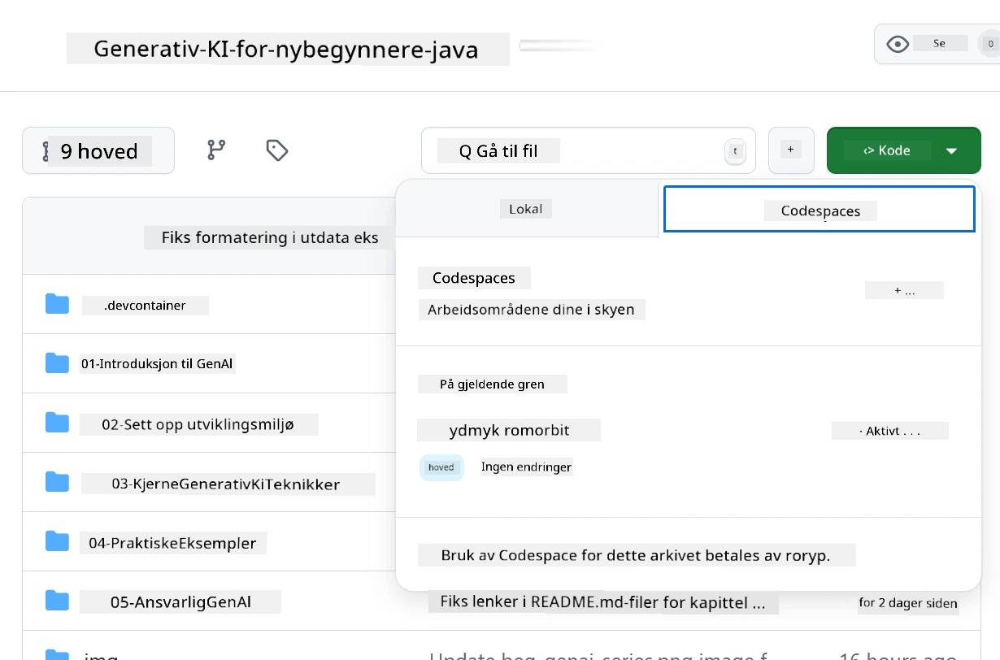

# Sette opp utviklingsmiljøet for Azure OpenAI

> **Rask start**: Denne veiledningen er for oppsett av Azure OpenAI. For en umiddelbar start med gratis modeller, bruk [GitHub Models with Codespaces](./README.md#quick-start-cloud).

Denne veiledningen hjelper deg med å sette opp Azure AI Foundry-modeller for dine Java AI-applikasjoner i dette kurset.

## Innholdsfortegnelse

- [Oversikt over raskt oppsett](../../../02-SetupDevEnvironment)
- [Trinn 1: Opprett Azure AI Foundry-ressurser](../../../02-SetupDevEnvironment)
  - [Opprett en hub og et prosjekt](../../../02-SetupDevEnvironment)
  - [Distribuer GPT-4o-mini-modellen](../../../02-SetupDevEnvironment)
- [Trinn 2: Opprett din Codespace](../../../02-SetupDevEnvironment)
- [Trinn 3: Konfigurer miljøet ditt](../../../02-SetupDevEnvironment)
- [Trinn 4: Test oppsettet ditt](../../../02-SetupDevEnvironment)
- [Hva nå?](../../../02-SetupDevEnvironment)
- [Ressurser](../../../02-SetupDevEnvironment)
- [Ekstra ressurser](../../../02-SetupDevEnvironment)

## Oversikt over raskt oppsett

1. Opprett Azure AI Foundry-ressurser (Hub, Prosjekt, Modell)
2. Opprett en Codespace med Java-utviklingscontainer
3. Konfigurer .env-filen din med Azure OpenAI-legitimasjon
4. Test oppsettet ditt med eksempelprosjektet

## Trinn 1: Opprett Azure AI Foundry-ressurser

### Opprett en hub og et prosjekt

1. Gå til [Azure AI Foundry Portal](https://ai.azure.com/) og logg inn
2. Klikk **+ Opprett** → **Ny hub** (eller naviger til **Administrasjon** → **Alle huber** → **+ Ny hub**)
3. Konfigurer huben din:
   - **Hubnavn**: f.eks. "MyAIHub"
   - **Abonnement**: Velg ditt Azure-abonnement
   - **Ressursgruppe**: Opprett ny eller velg eksisterende
   - **Plassering**: Velg nærmest deg
   - **Lagringskonto**: Bruk standard eller konfigurer tilpasset
   - **Key vault**: Bruk standard eller konfigurer tilpasset
   - Klikk **Neste** → **Gjennomgå + opprett** → **Opprett**
4. Når den er opprettet, klikk **+ Nytt prosjekt** (eller **Opprett prosjekt** fra huboversikten)
   - **Prosjektnavn**: f.eks. "GenAIJava"
   - Klikk **Opprett**

### Distribuer GPT-4o-mini-modellen

1. I prosjektet ditt, gå til **Modellkatalog** og søk etter **gpt-4o-mini**
   - *Alternativ: Gå til **Distribusjoner** → **+ Opprett distribusjon***
2. Klikk **Distribuer** på gpt-4o-mini-modellkortet
3. Konfigurer distribusjonen:
   - **Distribusjonsnavn**: "gpt-4o-mini"
   - **Modellversjon**: Bruk siste
   - **Distribusjonstype**: Standard
4. Klikk **Distribuer**
5. Når den er distribuert, gå til **Distribusjoner**-fanen og kopier disse verdiene:
   - **Distribusjonsnavn** (f.eks. "gpt-4o-mini")
   - **Mål-URI** (f.eks. `https://your-hub-name.openai.azure.com/`) 
      > **Viktig**: Kopier kun basis-URL-en (f.eks. `https://myhub.openai.azure.com/`) og ikke hele endepunktstien.
   - **Nøkkel** (fra delen Nøkler og endepunkt)

> **Har du fortsatt problemer?** Besøk den offisielle [Azure AI Foundry-dokumentasjonen](https://learn.microsoft.com/azure/ai-foundry/how-to/create-projects?tabs=ai-foundry&pivots=hub-project)

## Trinn 2: Opprett din Codespace

1. Fork dette repositoriet til din GitHub-konto
   > **Merk**: Hvis du vil redigere grunnleggende konfigurasjon, se på [Dev Container Configuration](../../../.devcontainer/devcontainer.json)
2. I ditt forkede repo, klikk **Code** → **Codespaces**-fanen
3. Klikk **...** → **Ny med alternativer...**

4. Velg **Dev container configuration**: 
   - **Generative AI Java Development Environment**
5. Klikk **Opprett codespace**

## Trinn 3: Konfigurer miljøet ditt

Når Codespace er klar, sett opp dine Azure OpenAI-legitimasjoner:

1. **Naviger til eksempelprosjektet fra repositoriets rot:**
   ```bash
   cd 02-SetupDevEnvironment/examples/basic-chat-azure
   ```

2. **Opprett din .env-fil:**
   ```bash
   cp .env.example .env
   ```

3. **Rediger .env-filen med dine Azure OpenAI-legitimasjoner:**
   ```bash
   # Your Azure OpenAI API key (from Azure AI Foundry portal)
   AZURE_AI_KEY=your-actual-api-key-here
   
   # Your Azure OpenAI endpoint URL (e.g., https://myhub.openai.azure.com/)
   AZURE_AI_ENDPOINT=https://your-hub-name.openai.azure.com/
   ```

   > **Sikkerhetsmerknad**: 
   > - Aldri legg til `.env`-filen i versjonskontroll
   > - `.env`-filen er allerede inkludert i `.gitignore`
   > - Hold API-nøklene dine sikre og roter dem regelmessig

## Trinn 4: Test oppsettet ditt

Kjør eksempelapplikasjonen for å teste Azure OpenAI-tilkoblingen din:

```bash
mvn clean spring-boot:run
```

Du bør se et svar fra GPT-4o-mini-modellen!

> **VS Code-brukere**: Du kan også trykke `F5` i VS Code for å kjøre applikasjonen. Startkonfigurasjonen er allerede satt opp til å laste `.env`-filen din automatisk.

> **Fullt eksempel**: Se [End-to-End Azure OpenAI Example](./examples/basic-chat-azure/README.md) for detaljerte instruksjoner og feilsøking.

## Hva nå?

**Oppsett fullført!** Du har nå:
- Azure OpenAI med gpt-4o-mini distribuert
- Lokal .env-filkonfigurasjon
- Java-utviklingsmiljø klart

**Fortsett til** [Kapittel 3: Kjerne Generative AI-teknikker](../03-CoreGenerativeAITechniques/README.md) for å begynne å bygge AI-applikasjoner!

## Ressurser

- [Azure AI Foundry-dokumentasjon](https://learn.microsoft.com/azure/ai-services/)
- [Spring AI Azure OpenAI-dokumentasjon](https://docs.spring.io/spring-ai/reference/api/clients/azure-openai-chat.html)
- [Azure OpenAI Java SDK](https://learn.microsoft.com/java/api/overview/azure/ai-openai-readme)

## Ekstra ressurser

- [Last ned VS Code](https://code.visualstudio.com/Download)
- [Få Docker Desktop](https://www.docker.com/products/docker-desktop)
- [Dev Container Configuration](../../../.devcontainer/devcontainer.json)

**Ansvarsfraskrivelse**:  
Dette dokumentet er oversatt ved hjelp av AI-oversettelsestjenesten [Co-op Translator](https://github.com/Azure/co-op-translator). Selv om vi streber etter nøyaktighet, vær oppmerksom på at automatiske oversettelser kan inneholde feil eller unøyaktigheter. Det originale dokumentet på sitt opprinnelige språk bør anses som den autoritative kilden. For kritisk informasjon anbefales profesjonell menneskelig oversettelse. Vi er ikke ansvarlige for eventuelle misforståelser eller feiltolkninger som oppstår ved bruk av denne oversettelsen.