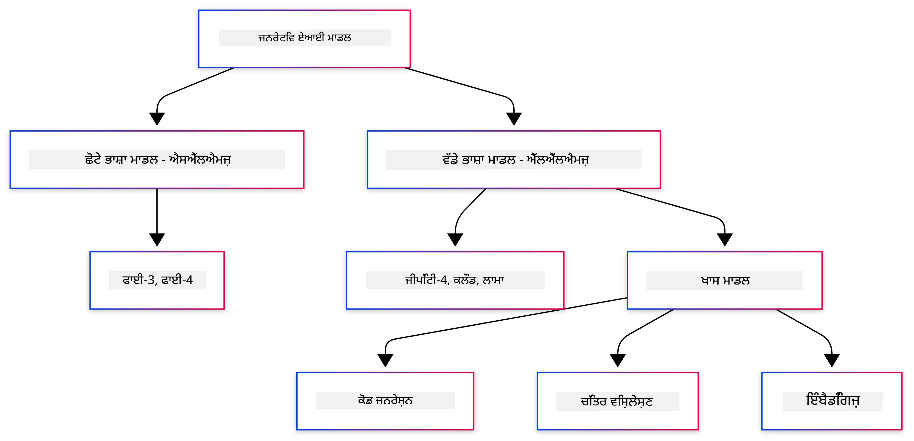
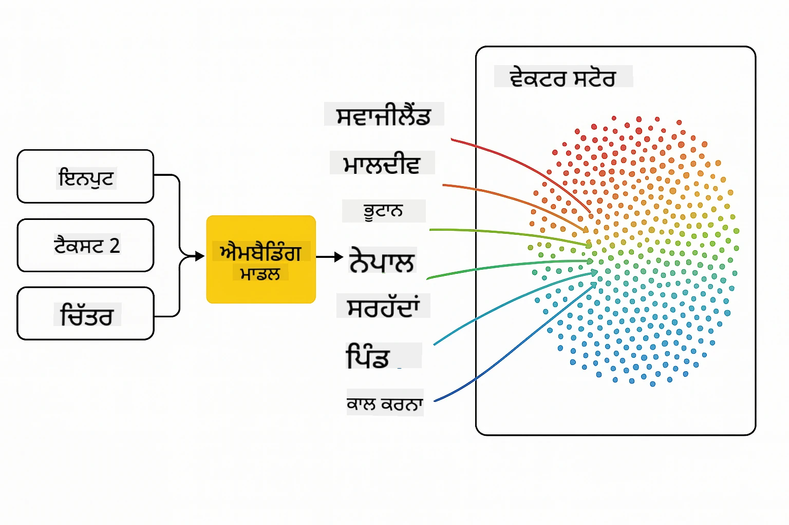
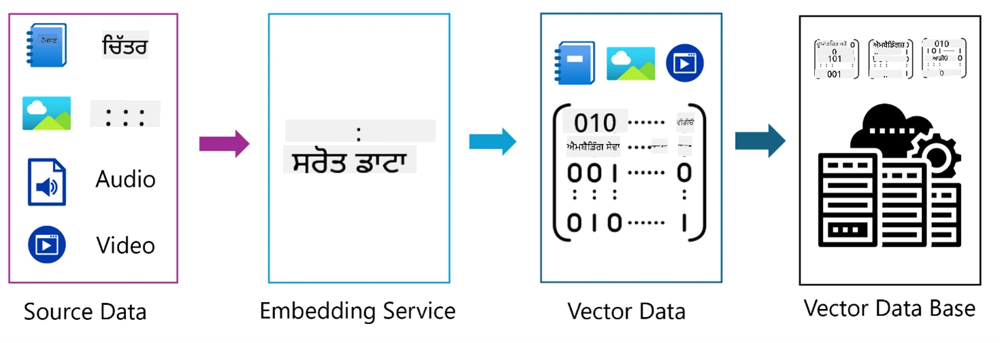
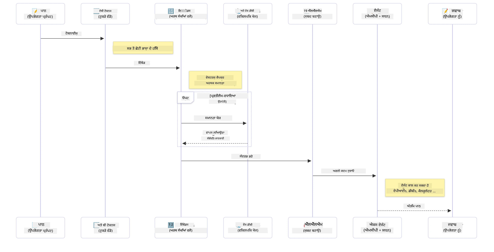

# ਜੈਨਰੇਟਿਵ ਏਆਈ ਦਾ ਪਰਚਿਆ - ਜਾਵਾ ਐਡੀਸ਼ਨ

> **ਵੀਡੀਓ**: [ਇਸ ਪਾਠ ਲਈ ਯੂਟਿਊਬ 'ਤੇ ਵੀਡੀਓ ਓਵਰਵਿਊ ਵੇਖੋ।](https://www.youtube.com/watch?v=XH46tGp_eSw) ਤੁਸੀਂ ਉਪਰ ਦਿੱਤੇ ਥੰਬਨੇਲ ਇਮੇਜ 'ਤੇ ਵੀ ਕਲਿੱਕ ਕਰ ਸਕਦੇ ਹੋ।

## ਤੁਸੀਂ ਕੀ ਸਿੱਖੋਗੇ

- **ਜੈਨਰੇਟਿਵ ਏਆਈ ਦੇ ਮੁਢਲੇ ਤੱਤ** ਜਿਵੇਂ ਕਿ LLMs, ਪ੍ਰਾਪੜ ਇੰਜੀਨੀਅਰਿੰਗ, ਟੋਕਨ, ਐਂਬੈਡਿੰਗਜ਼, ਅਤੇ ਵੈਕਟਰ ਡੇਟਾਬੇਸ
- **ਜਾਵਾ ਏਆਈ ਵਿਕਾਸ ਟੂਲਾਂ ਦੀ ਤੁਲਨਾ** ਜਿਵੇਂ ਕਿ Azure OpenAI SDK, Spring AI, ਅਤੇ OpenAI ਜਾਵਾ SDK
- **ਮਾਡਲ ਕਾਂਟੈਕਸਟ ਪ੍ਰੋਟੋਕਾਲ** ਅਤੇ ਇਸ ਦਾ ਏਆਈ ਏਜੰਟ ਕਮਿਊਨੀਕੇਸ਼ਨ ਵਿੱਚ ਭੂਮਿਕਾ ਜਾਣੋ

## ਮੋਜੂਦ ਸਾਰਣੀ

- [ਪਰੇਚਿਆ](#ਪਰਚਿਆ)
- [ਜੈਨਰੇਟਿਵ ਏਆਈ ਸੰਕਲਪਾਂ ਤੇ ਇੱਕ ਛੋਟਾ ਰਿਵਿਊ](#ਜੈਨਰੇਟਿਵ-ਏਆਈ-ਸੰਕਲਪਾਂ-ਤੇ-ਇੱਕ-ਛੋਟਾ-ਰੀਵਿਊ)
- [ਪ੍ਰਾਪੜ ਇੰਜੀਨੀਅਰਿੰਗ ਦਾ ਰੀਵਿਊ](#ਪ੍ਰਾਪੜ-ਇੰਜੀਨੀਅਰਿੰਗ-ਦਾ-ਰੀਵਿਊ)
- [ਟੋਕਨ, ਐਂਬੈਡਿੰਗਜ਼, ਅਤੇ ਏਜੰਟ](#ਟੋਕਨ-ਐਂਬੈਡਿੰਗਜ਼-ਅਤੇ-ਏਜੰਟ)
- [ਜਾਵਾ ਲਈ ਏਆਈ ਵਿਕਾਸ ਟੂਲਾਂ ਅਤੇ ਲਾਇਬ੍ਰੇਰੀਜ਼](#ਜਾਵਾ-ਲਈ-ਏਆਈ-ਵਿਕਾਸ-ਟੂਲਾਂ-ਅਤੇ-ਲਾਇਬ੍ਰੇਰੀਜ਼)
  - [OpenAI ਜਾਵਾ SDK](#openai-ਜਾਵਾ-sdk)
  - [Spring AI](#spring-ai)
  - [Azure OpenAI ਜਾਵਾ SDK](#azure-openai-ਜਾਵਾ-sdk)
- [ਸੰਖੇਪ](#ਸੰਖੇਪ)
- [ਅਗਲੇ ਕਦਮ](#ਅਗਲੇ-ਕਦਮ)

## ਪਰਚਿਆ

ਜੈਨਰੇਟਿਵ ਏਆਈ ਫਾਰ ਬਿਗਿਨਰਜ਼ - ਜਾਵਾ ਐਡੀਸ਼ਨ ਦੇ ਪਹਿਲੇ ਅਧਿਆਇ ਵਿੱਚ ਤੁਹਾਡਾ ਸਵਾਗਤ ਹੈ! ਇਹ ਬੁਨਿਆਦੀ ਪਾਠ ਤੁਹਾਨੂੰ ਜੈਨਰੇਟਿਵ ਏਆਈ ਦੇ ਮੂਲ ਤੱਤਾਂ ਨਾਲ ਜਾਣੂ ਕਰਵਾਉਂਦਾ ਹੈ ਅਤੇ ਜਾਵਾ ਦੀ ਵਰਤੋਂ ਕਰਕੇ ਇਹਨਾਂ ਨਾਲ ਕੰਮ ਕਰਨ ਦਾ ਤਰੀਕਾ ਦਿਖਾਉਂਦਾ ਹੈ। ਤੁਸੀਂ ਏਆਈ ਐਪਲੀਕੇਸ਼ਨਾਂ ਦੇ ਅਹੰਕਾਰਕ ਇਮਾਰਤੀ ਪੱਟੜੇ, ਜਿਵੇਂ ਕਿ ਲਾਰਜ ਲੈਂਗਵੇਜ ਮਾਡਲ (LLMs), ਟੋਕਨ, ਐਂਬੈਡਿੰਗਜ਼, ਅਤੇ ਏਆਈ ਏਜੰਟ ਬਾਰੇ ਸਿੱਖੋਗੇ। ਅਸੀਂ ਇਸ ਕੋਰਸ ਦੌਰਾਨ ਤੁਹਾਡੇ ਵਰਤੋਂ ਵਿੱਚ ਆਉਣ ਵਾਲੇ ਪ੍ਰਮੁੱਖ ਜਾਵਾ ਟੂਲਿੰਗ ਨੂੰ ਵੀ ਖੰਗਾਲਾਂਗੇ।

### ਜੈਨਰੇਟਿਵ ਏਆਈ ਸੰਕਲਪਾਂ ਤੇ ਇੱਕ ਛੋਟਾ ਰੀਵਿਊ

ਜੈਨਰੇਟਿਵ ਏਆਈ ਇੱਕ ਕਿਸਮ ਦੀ ਕ੍ਰਿਤ੍ਰਿਮ ਬੁੱਧੀ ਹੈ ਜੋ ਡਾਟਾ ਵਿੱਚੋਂ ਸਿਖੇ ਪੈਟਰਨਾਂ ਤੇ ਸੰਬੰਧਾਂ ਅਧਾਰਿਤ ਨਵਾਂ ਸਮੱਗਰੀ ਤਿਆਰ ਕਰਦੀ ਹੈ, ਜਿਵੇਂ ਕਿ ਟੈਕਸਟ, ਚਿੱਤਰਾਂ ਜਾਂ ਕੋਡ। ਜੈਨਰੇਟਿਵ ਏਆਈ ਮਾਡਲ ਮਨੁੱਖੀ ਜਿਹਾ ਜਵਾਬ ਦੇ ਸਕਦੇ ਹਨ, ਸੰਦਰਭ ਨੂੰ ਸਮਝ ਸਕਦੇ ਹਨ ਅਤੇ ਕਦੇ-ਕਦੇ ਮਨੁੱਖੀ ਜਿਹਾ ਸਮੱਗਰੀ ਵੀ ਤਿਆਰ ਕਰ ਜਾਂਦੇ ਹਨ।

ਜਦੋਂ ਤੁਸੀਂ ਆਪਣੀਆਂ ਜਾਵਾ ਏਆਈ ਐਪਲੀਕੇਸ਼ਨਾਂ ਦਾ ਵਿਕਾਸ ਕਰਦੇ ਹੋ, ਤਾਂ ਤੁਸੀਂ **ਜੈਨਰੇਟਿਵ ਏਆਈ ਮਾਡਲਾਂ** ਨਾਲ ਸਮੱਗਰੀ ਬਣਾਉਂਦੇ ਹੋ। ਜੈਨਰੇਟਿਵ ਏਆਈ ਮਾਡਲਾਂ ਦੀਆਂ ਕੁਝ ਖੂਬੀਆਂ ਇਹ ਹਨ:

- **ਟੈਕਸਟ ਜੈਨਰੇਸ਼ਨ**: ਚੈਟਬੋਟ, ਸਮੱਗਰੀ ਅਤੇ ਟੈਕਸਟ ਪੂਰਨਤਾ ਲਈ ਮਨੁੱਖੀ ਜਿਹਾ ਟੈਕਸਟ ਤਿਆਰ ਕਰਨਾ।
- **ਚਿੱਤਰਾਂ ਦਾ ਜੈਨਰੇਸ਼ਨ ਅਤੇ ਵਿਸ਼ਲੇਸ਼ਣ**: ਵਾਸਤਵਿਕਤਾਪੂਰਨ ਚਿੱਤਰ ਬਣਾਉਣਾ, ਫੋਟੋਆਂ ਵਿੱਚ ਸੁਧਾਰ ਕਰਨਾ, ਅਤੇ ਵਸਤੂਆਂ ਦੀ ਘੋਸ਼ਣਾ ਕਰਨਾ।
- **ਕੋਡ ਜੈਨਰੇਸ਼ਨ**: ਕੋਡ ਸਿੱਪਟ ਜਾਂ ਸਕ੍ਰਿਪਟ ਲਿਖਣਾ।

ਵੱਖ-ਵੱਖ ਕਾਰਜਾਂ ਲਈ ਖਾਸ ਕਿਸਮਾਂ ਦੇ ਮਾਡਲ ਹੁੰਦੇ ਹਨ। ਉਦਾਹਰਨ ਵਜੋਂ, ਦੋਹਾਂ **ਸਮਾਲ ਲੈਂਗਵੇਜ ਮਾਡਲ (SLMs)** ਅਤੇ **ਲਾਰਜ ਲੈਂਗਵੇਜ ਮਾਡਲ (LLMs)** ਟੈਕਸਟ ਜੈਨਰੇਸ਼ਨ ਕਰ ਸਕਦੇ ਹਨ, ਪਰ LLMs ਜ਼ਿਆਦਾ ਕੌਂਪਲੈਕਸ ਕਾਰਜਾਂ ਲਈ ਬਿਹਤਰ ਪ੍ਰਦਰਸ਼ਨ ਦਿੰਦੇ ਹਨ। ਚਿੱਤਰ-ਸਬੰਧੀ ਕਾਰਜਾਂ ਲਈ ਤੁਸੀਂ ਖ਼ਾਸ ਦ੍ਰਿਸ਼ ਮਾਡਲ ਜਾਂ ਮਲਟੀ-ਮੋਡਲ ਮਾਡਲ ਵਰਤੋਂਗੇ।

ਅਗਰਮੈ, ਇਨ੍ਹਾਂ ਮਾਡਲਾਂ ਦੇ ਜਵਾਬ ਹਰ ਵਾਰੀ ਪਰਫੈਕਟ ਨਹੀਂ ਹੁੰਦੇ। ਤੁਸੀਂ ਸ਼ਾਇਦ ਸੁਣਿਆ ਹੋਵੇ ਕਿ ਮਾਡਲ "ਹੈਲੂਸੀਨੇਟ" ਕਰਦੇ ਹਨ ਜਾਂ ਕਦੇ-ਕਦੇ ਗਲਤ ਜਾਣਕਾਰੀ ਪ੍ਰਮਾਣਿਤ ਢੰਗ ਨਾਲ ਦੇ ਦਿੰਦੇ ਹਨ। ਪਰ ਤੁਸੀਂ ਮਾਡਲ ਨੂੰ ਬਿਹਤਰ ਜਵਾਬ ਦੇਣ ਵਿੱਚ ਮਦਦ ਕਰ ਸਕਦੇ ਹੋ ਜਦੋਂ ਤੁਸੀਂ ਉਹਨਾਂ ਨੂੰ ਸਪਸ਼ਟ ਹੁਕਮ ਅਤੇ ਸੰਦਰਭ ਦਿੰਦੇ ਹੋ। ਇਹੀ ਥਾਂ **ਪ੍ਰਾਪੜ ਇੰਜੀਨੀਅਰਿੰਗ** ਦੀ ਭੂਮਿਕਾ ਹੁੰਦੀ ਹੈ।

#### ਪ੍ਰਾਪੜ ਇੰਜੀਨੀਅਰਿੰਗ ਦਾ ਰੀਵਿਊ

ਪ੍ਰਾਪੜ ਇੰਜੀਨੀਅਰਿੰਗ ਇਸ ਗੱਲ ਨੂੰ ਕਹਿੰਦੀ ਹੈ ਕਿ ਕਿਵੇਂ ਪ੍ਰਭਾਵਸ਼ਾਲੀ ਇਨਪੁਟ ਡਿਜ਼ਾਈਨ ਕਰਕੇ ਏਆਈ ਮਾਡਲਾਂ ਨੂੰ ਚਾਹੀਦੇ ਨਤੀਜੇ ਵੱਲ ਲਿਜਾਇਆ ਜਾਵੇ। ਇਸ ਵਿੱਚ ਸ਼ਾਮਲ ਹਨ:

- **ਸਪਸ਼ਟਤਾ**: ਹੁਕਮ ਸਪਸ਼ਟ ਅਤੇ ਸਪੱਸ਼ਟ ਹੋਣ।
- **ਸੰਦਰਭ**: ਜ਼ਰੂਰੀ ਪਿਛੋਕੜ ਜਾਣਕਾਰੀ ਦੇਣਾ।
- **ਸੀਮਾਵਾਂ**: ਕਿਸੇ ਵੀ ਸੀਮਾਵਾਂ ਜਾਂ ਫਾਰਮੈਟ ਦੱਸਣਾ।

ਪ੍ਰਾਪੜ ਇੰਜੀਨੀਅਰਿੰਗ ਦੀਆਂ ਕੁਝ ਵਧੀਆ ਰੀਤੀ-ਰਿਵਾਜਾਂ ਵਿੱਚ ਪ੍ਰਾਪੜ ਡਿਜ਼ਾਈਨ, ਸਪਸ਼ਟ ਹੁਕਮ, ਕੰਮ ਦਾ ਵਿਭਾਜਨ, ਇੱਕਦੋਸ਼ ਅਤੇ ਕੁਝ-ਸ਼ਾਟ ਸਿੱਖਿਆ, ਅਤੇ ਪ੍ਰਾਪੜ ਟਿਊਨਿੰਗ ਸ਼ਾਮਲ ਹਨ। ਵੱਖ-ਵੱਖ ਪ੍ਰਾਪੜਾਂ ਦੀ ਜਾਂਚ ਕਰਨੀ ਜ਼ਰੂਰੀ ਹੁੰਦੀ ਹੈ ਤਾਂ ਜੋ ਤੁਹਾਡੇ ਖ਼ਾਸ ਕੇਸ ਲਈ ਸਭ ਤੋਂ ਵਧੀਆ ਚੁਣਿਆ ਜਾ ਸਕੇ।

ਐਪਲੀਕੇਸ਼ਨ ਵਿਕਾਸ ਕਰਦੇ ਸਮੇਂ, ਤੁਸੀਂ ਵੱਖਰੇ ਪ੍ਰਾਪੜ ਕਿਸਮਾਂ ਨਾਲ ਕੰਮ ਕਰੋਗੇ:
- **ਸਿਸਟਮ ਪ੍ਰਾਪੜ**: ਮਾਡਲ ਦੇ ਵਿਹਾਰ ਲਈ ਬੇਸ ਨਿਯਮ ਅਤੇ ਸੰਦਰਭ ਸੈੱਟ ਕਰਦੇ ਹਨ
- **ਯੂਜ਼ਰ ਪ੍ਰਾਪੜ**: ਤੁਹਾਡੇ ਐਪਲੀਕੇਸ਼ਨ ਦੇ ਯੂਜ਼ਰਾਂ ਵੱਲੋਂ ਦਿੱਤੇ ਇਨਪੁਟ ਡਾਟਾ
- **ਅਸਿਸਟੈਂਟ ਪ੍ਰਾਪੜ**: ਸਿਸਟਮ ਅਤੇ ਯੂਜ਼ਰ ਪ੍ਰਾਪੜਾਂ ਅਧਾਰਿਤ ਮਾਡਲ ਦੇ ਜਵਾਬ

> **ਹੋਰ ਜਾਣੋ**: [ਜੈਨੇਰੇਟਿਵ ਏਆਈ ਬਿਗਿਨਰਜ਼ ਕੋਰਸ ਦੇ ਪ੍ਰਾਪੜ ਇੰਜੀਨੀਅਰਿੰਗ ਚੈਪਟਰ](https://github.com/microsoft/generative-ai-for-beginners/tree/main/04-prompt-engineering-fundamentals) ਵਿੱਚ ਪ੍ਰਾਪੜ ਇੰਜੀਨੀਅਰਿੰਗ ਬਾਰੇ ਹੋਰ ਜਾਣਕਾਰੀ ਲਓ।

#### ਟੋਕਨ, ਐਂਬੈਡਿੰਗਜ਼, ਅਤੇ ਏਜੰਟ

ਜੈਨਰੇਟਿਵ ਏਆਈ ਮਾਡਲਾਂ ਨਾਲ ਕੰਮ ਕਰਦੇ ਸਮੇਂ, ਤੁਸੀਂ ਸ਼ਬਦਾਂ ਜਿਵੇਂ **ਟੋਕਨ**, **ਐਂਬੈਡਿੰਗਜ਼**, **ਏਜੰਟ**, ਅਤੇ **ਮਾਡਲ ਕਾਂਟੈਕਸਟ ਪ੍ਰੋਟੋਕਾਲ (MCP)** ਦੇ ਮਾਇਨੇ ਜਾਣੋਗੇ। ਇੱਥੇ ਇਨ੍ਹਾਂ ਸੰਕਲਪਾਂ ਦਾ ਵਿਸਥਾਰ ਨਾਲ ਵਰਣਨ ਹੈ:

- **ਟੋਕਨ**: ਟੋਕਨ ਮਾਡਲ ਵਿੱਚ ਟੈਕਸਟ ਦੀ ਸਭ ਤੋਂ ਛੋਟੀ ਇਕਾਈ ਹੁੰਦੀ ਹੈ। ਇਹ ਸ਼ਬਦ, ਅੱਖਰ, ਜਾਂ ਉਪ-ਸ਼ਬਦ ਹੋ ਸਕਦੇ ਹਨ। ਟੋਕਨ ਟੈਕਸਟ ਡਾਟਾ ਨੂੰ ਇਸ ਫਰਮੈਟ ਵਿੱਚ ਦਰਸਾਉਂਦੇ ਹਨ ਜਿਸ ਨੂੰ ਮਾਡਲ ਸਮਝ ਸਕੇ। ਉਦਾਹਰਨ ਵਜੋਂ, ਵਾਕ "The quick brown fox jumped over the lazy dog" ਨੂੰ ["The", " quick", " brown", " fox", " jumped", " over", " the", " lazy", " dog"] ਜਾਂ ["The", " qu", "ick", " br", "own", " fox", " jump", "ed", " over", " the", " la", "zy", " dog"] ਵਿੱਥ ਟੋਕਨ ਕੀਤਾ ਜਾ ਸਕਦਾ ਹੈ ਜੋ ਟੋਕਨਾਈਜ਼ੇਸ਼ਨ ਸਟ੍ਰੈਟਜੀ 'ਤੇ ਨਿਰਭਰ ਕਰਦਾ ਹੈ।

ਟੋਕਨਾਈਜ਼ੇਸ਼ਨ ਟੈਕਸਟ ਨੂੰ ਛੋਟੀਆਂ ਇਕਾਈਆਂ ਵਿੱਚ ਬੰਡਣ ਦਾ ਪ੍ਰਕਿਰਿਆ ਹੈ। ਇਹ ਜ਼ਰੂਰੀ ਹੈ ਕਿਉਂਕਿ ਮਾਡਲ ਤਾਜ਼ਾ ਟੈਕਸਟ ਤੋਂ ਬਜਾਏ ਟੋਕਨ ਤੇ ਕੰਮ ਕਰਦਾ ਹੈ। ਕਿਸੇ ਪ੍ਰਾਪੜ ਵਿੱਚ ਟੋਕਨਾਂ ਦੀ ਗਿਣਤੀ ਮਾਡਲ ਦੇ ਜਵਾਬ ਦੀ ਲੰਬਾਈ ਅਤੇ ਗুণਵੱਤਾ 'ਤੇ ਅਸਰ ਪਾਂਦੀ ਹੈ, ਕਿਉਂਕਿ ਮਾਡਲਾਂ ਦੇ ਕੋਲ ਆਪਣੇ ਸੰਦਰਭ ਖਿੜਕੀ ਲਈ ਟੋਕਨ ਸੀਮਾਵਾਂ ਹੁੰਦੀਆਂ ਹਨ (ਜਿਵੇਂ ਕਿ GPT-4o ਲਈ ਕੁੱਲ 128K ਟੋਕਨ—ਇਨਪੁਟ ਅਤੇ ਆਉਟਪੁਟ ਦੋਹਾਂ ਸਮੇਤ)।

  ਜਾਵਾ ਵਿੱਚ, ਤੁਸੀਂ OpenAI SDK ਵਰਗੇ ਲਾਇਬ੍ਰੇਰੀਜ਼ ਦੀ ਵਰਤੋਂ ਕਰ ਸਕਦੇ ਹੋ ਜੋ ਅਟੋਮੇਟਿਕਲੀ ਟੋਕਨਾਈਜ਼ੇਸ਼ਨ ਕਰਦੀਆਂ ਹਨ ਜਦੋਂ ਤੁਸੀਂ ਏਆਈ ਮਾਡਲਾਂ ਨੂੰ ਬੇਨਤੀਆਂ ਭੇਜਦੇ ਹੋ।

- **ਐਂਬੈਡਿੰਗਜ਼**: ਐਂਬੈਡਿੰਗਜ਼ ਟੋਕਨਾਂ ਦੀ ਵੈਕਟਰ ਪ੍ਰਤਿਨਿਧੀ ਹੁੰਦੇ ਹਨ ਜੋ ਅਰਥਾਤਮਕ ਮਾਇਨੇ ਦਰਸਾਉਂਦੇ ਹਨ। ਇਹ ਨੰਬਰਿਕ (ਆਮ ਤੌਰ 'ਤੇ ਫਲੋਟਿੰਗ-ਪੁਆਇੰਟ ਨੰਬਰਾਂ ਦੀਆਂ ਲੜੀਆਂ) ਪ੍ਰਤਿਨਿਧੀਆਂ ਹੁੰਦੀਆਂ ਹਨ ਜੋ ਮਾਡਲਾਂ ਨੂੰ ਸ਼ਬਦਾਂ ਦੇ ਸੰਬੰਧਾਂ ਸਮਝਣ ਅਤੇ ਸੰਦਰਭ ਅਨੁਕੂਲ ਜਵਾਬ ਤਿਆਰ ਕਰਨ ਯੋਗ ਬਣਾਉਂਦੀਆਂ ਹਨ। ਮਿਲਦੇ-ਜੁਲਦੇ ਸ਼ਬਦਾਂ ਦੀਆਂ ਮਿਲਦੀਆਂ ਰਾਹਤੀਆਂ ਐਂਬੈਡਿੰਗਜ਼ ਹੁੰਦੀਆਂ ਹਨ, ਜੋ ਮਾਡਲ ਨੂੰ ਪਰੇਯਾਰਥਕ ਸ਼ਬਦਾਂ ਅਤੇ ਅਰਥਾਤਮਕ ਸੰਬੰਧਾਂ ਨੂੰ ਸਮਝਣ ਦਾ ਮੌਕਾ ਦਿੰਦਾ ਹੈ।

  ਜਾਵਾ ਵਿੱਚ, ਤੁਸੀਂ OpenAI SDK ਜਾਂ ਹੋਰ ਲਾਇਬ੍ਰੇਰੀਆਂ ਦੀ ਵਰਤੋਂ ਕਰਕੇ ਐਂਬੈਡਿੰਗਜ਼ ਤਿਆਰ ਕਰ ਸਕਦੇ ਹੋ ਜੋ ਐਂਬੈਡਿੰਗ ਬਣਾਉਂਦੇ ਹਨ। ਇਹ ਐਂਬੈਡਿੰਗਜ਼ ਸਮੈਟਿਕ ਖੋਜ ਵਰਗੇ ਕੰਮਾਂ ਲਈ ਅਹੰਕਾਰਕ ਹਨ, ਜਿਥੇ ਤੁਸੀਂ ਟੈਕਸਟ ਦੀ ਸਟੀਕ ਮੈਚਿੰਗ ਤੋਂ ਬਜਾਏ ਅਰਥ ਦੇ ਆਧਾਰ ਤੇ ਸਮੱਗਰੀ ਲੱਭਦੇ ਹੋ।

- **ਵੈਕਟਰ ਡੇਟਾਬੇਸ**: ਵੈਕਟਰ ਡੇਟਾਬੇਸ ਖਾਸ ਤੌਰ 'ਤੇ ਐਂਬੈਡਿੰਗਜ਼ ਲਈ ਬਣਾਏ ਗਏ ਸਟੋਰੇਜ ਸਿਸਟਮ ਹੁੰਦੇ ਹਨ। ਇਹ ਪ੍ਰਭਾਵਸ਼ਾਲੀ ਸਮਾਨਤਾ ਖੋਜ ਦੀ ਸਹੂਲਤ ਦਿੰਦੇ ਹਨ ਅਤੇ ਰਿਟਰੀਵਲ-਑ਗਮੈਂਟਡ ਜੈਨਰੇਸ਼ਨ (RAG) ਪੈਟਰਨਾਂ ਵਿੱਚ ਬਹੁਤ ਜ਼ਰੂਰੀ ਹਨ ਜਿੱਥੇ ਤੁਸੀਂ ਵੱਡੇ ਡੇਟਾਸੈੱਟਾਂ ਤੋਂ ਸੰਬੰਧਿਤ ਜਾਣਕਾਰੀ ਲੱਭਦੇ ਹੋ ਜੋ ਅਰਥਾਤਮਕ ਮਿਲਾਪ 'ਤੇ ਆਧਾਰਤ ਹੁੰਦੀ ਹੈ, ਨਾ ਕਿ ਇਕਦਮ ਸਟੀਕ ਟੈਕਸਟ ਮੈਚਿੰਗ 'ਤੇ।

> **ਨੋਟ**: ਇਸ ਕੋਰਸ ਵਿੱਚ ਅਸੀਂ ਵੈਕਟਰ ਡੇਟਾਬੇਸ ਨੂੰ ਕਵਰ ਨਹੀਂ ਕਰਾਂਗੇ ਪਰ ਇਹਨਾਂ ਦੀ ਜ਼ਿਕਰ ਕਰਨਾ ਜ਼ਰੂਰੀ ਹੈ ਕਿਉਂਕਿ ਇਹ ਅਸਲੀ ਦੁਨੀਆ ਵਿੱਚ ਵਿਆਪਕ ਤੌਰ 'ਤੇ ਵਰਤੇ ਜਾਂਦੇ ਹਨ।

- **ਏਜੰਟ ਅਤੇ MCP**: ਏਆਈ ਦੇ ਉਹ ਹਿੱਸੇ ਜੋ ਖੁਦਮੁਖਤਿਆਰ ਤਰੀਕੇ ਨਾਲ ਮਾਡਲਾਂ, ਟੂਲਾਂ ਅਤੇ ਬਾਹਰੀ ਸਿਸਟਮਾਂ ਨਾਲ ਸੰਚਾਰ ਕਰਦੇ ਹਨ। ਮਾਡਲ ਕਾਂਟੈਕਸਟ ਪ੍ਰੋਟੋਕਾਲ (MCP) ਇੱਕ ਮਿਆਰੀ ਤਰੀਕਾ ਹੈ ਜੋ ਏਜੰਟਾਂ ਨੂੰ ਬਾਹਰੀ ਡੇਟਾ ਸ੍ਰੋਤਾਂ ਅਤੇ ਟੂਲਾਂ ਤੱਕ ਸੁਰੱਖਿਅਤ ਪਹੁੰਚ ਦਿੰਦਾ ਹੈ। ਹੋਰ ਜਾਣੋ ਸਾਡੇ [MCP ਫਾਰ ਬਿਗਿਨਰਜ਼](https://github.com/microsoft/mcp-for-beginners) ਕੋਰਸ ਵਿੱਚ।

ਜਾਵਾ ਏਆਈ ਐਪਲੀਕੇਸ਼ਨਾਂ ਵਿੱਚ, ਤੁਸੀਂ ਟੈਕਸਟ ਪ੍ਰੋਸੈਸਿੰਗ ਲਈ ਟੋਕਨ, ਸਮੈਟਿਕ ਖੋਜ ਅਤੇ RAG ਲਈ ਐਂਬੈਡਿੰਗਜ਼, ਡੇਟਾ ਰਿਟਰੀਵਲ ਲਈ ਵੈਕਟਰ ਡੇਟਾਬੇਸ, ਅਤੇ ਸਿਆਣੇ, ਟੂਲ-ਵਰਤੋਂ ਵਾਲੇ ਸਿਸਟਮ ਬਣਾਉਣ ਲਈ MCP ਵਾਲੇ ਏਜੰਟ ਵਰਤੋਂਗੇ।

### ਜਾਵਾ ਲਈ ਏਆਈ ਵਿਕਾਸ ਟੂਲਾਂ ਅਤੇ ਲਾਇਬ੍ਰੇਰੀਜ਼

ਜਾਵਾ ਏਆਈ ਵਿਕਾਸ ਲਈ ਬਿਹਤਰੀਨ ਟੂਲਿੰਗ ਮੁਹੱਈਆ ਕਰਵਾਉਂਦਾ ਹੈ। ਇੱਥੇ ਤਿੰਨ ਪ੍ਰਮੁੱਖ ਲਾਇਬ੍ਰੇਰੀਆਂ ਹਨ ਜੋ ਅਸੀਂ ਇਸ ਕੋਰਸ ਦੌਰਾਨ ਖੰਗਾਲਾਂਗੇ - OpenAI ਜਾਵਾ SDK, Azure OpenAI SDK, ਅਤੇ Spring AI।

ਇਹ ਇੱਕ ਸਾਦਾ ਸੂਚੀ ਹੈ ਜੋ ਦਿੱਖਾਉਂਦੀ ਹੈ ਕਿ ਕਿਸ ਅਧਿਆਇ ਵਿੱਚ ਕਿਹੜਾ SDK ਵਰਤਿਆ ਗਿਆ ਹੈ:

| ਅਧਿਆਇ | ਉਦਾਹਰਨ | SDK |
|---------|--------|-----|
| 02-SetupDevEnvironment | github-models | OpenAI ਜਾਵਾ SDK |
| 02-SetupDevEnvironment | basic-chat-azure | Spring AI Azure OpenAI |
| 03-CoreGenerativeAITechniques | examples | Azure OpenAI SDK |
| 04-PracticalSamples | petstory | OpenAI ਜਾਵਾ SDK |
| 04-PracticalSamples | foundrylocal | OpenAI ਜਾਵਾ SDK |
| 04-PracticalSamples | calculator | Spring AI MCP SDK + LangChain4j |

**SDK ਡੌਕਯੂਮੈਂਟੇਸ਼ਨ ਲਿੰਕ:**
- [Azure OpenAI ਜਾਵਾ SDK](https://github.com/Azure/azure-sdk-for-java/tree/azure-ai-openai_1.0.0-beta.16/sdk/openai/azure-ai-openai)
- [Spring AI](https://docs.spring.io/spring-ai/reference/)
- [OpenAI ਜਾਵਾ SDK](https://github.com/openai/openai-java)
- [LangChain4j](https://docs.langchain4j.dev/)

#### OpenAI ਜਾਵਾ SDK

OpenAI SDK OpenAI ਏਪੀਆਈ ਲਈ ਅਧਿਕਾਰਕ ਜਾਵਾ ਲਾਇਬ੍ਰੇਰੀ ਹੈ। ਇਹ OpenAI ਦੇ ਮਾਡਲਾਂ ਦੀ ਸੰਚਾਰ ਕਰਨ ਲਈ ਇੱਕ ਸਧਾਰਣ ਅਤੇ ਇੱਕਸਾਰ ਇੰਟਰਫੇਸ ਮੁਹੱਈਆ ਕਰਵਾਉਂਦਾ ਹੈ, ਜਿਸ ਨਾਲ ਜਾਵਾ ਐਪਲੀਕੇਸ਼ਨਾਂ ਵਿੱਚ ਏਆਈ ਖਾਸੀਅਤਾਂ ਨੂੰ ਅਸਾਨੀ ਨਾਲ ਜੋੜਿਆ ਜਾ ਸਕਦਾ ਹੈ। ਅਧਿਆਇ 2 ਵਿੱਚ GitHub ਮਾਡਲ, ਅਧਿਆਇ 4 ਵਿੱਚ ਪੈਟ ਸਟੋਰੀ ਐਪਲੀਕੇਸ਼ਨ ਅਤੇ ਫਾਊਂਡਰੀ ਲੋਕਲ ਉਦਾਹਰਨਾਂ ਨਾਲ OpenAI SDK ਦਾ ਤਰੀਕਾ ਦਰਸਾਇਆ ਗਿਆ ਹੈ।

#### Spring AI

Spring AI ਇੱਕ ਵਿਸਤ੍ਰਿਤ ਫਰੇਮਵਰਕ ਹੈ ਜੋ Spring ਐਪਲੀਕੇਸ਼ਨਾਂ ਲਈ AI ਖਾਸੀਅਤਾਂ ਲਿਆਉਂਦਾ ਹੈ ਅਤੇ ਵੱਖ-ਵੱਖ AI ਪ੍ਰੋਵਾਈਡਰਾਂ ਲਈ ਇੱਕਸਾਰ ਅਬਸਟ੍ਰੈਕਸ਼ਨ ਲੇਅਰ ਦਿੰਦਾ ਹੈ। ਇਹ Spring ਪੈਰਾਡਾਈਮਾਂ ਨਾਲ ਸੁਗਮ ਇੰਟਿਗ੍ਰੇਸ਼ਨ ਕਰਦਾ ਹੈ, ਜਿਸ ਨਾਲ ਇਹ ਏਆਈ ਖਾਸੀਅਤਾਂ ਵਾਲੀਆਂ ਉੱਦਮੀ ਜਾਵਾ ਐਪਲੀਕੇਸ਼ਨਾਂ ਲਈ ਅਦਭੁੱਤ ਚੋਣ ਬਣ ਜਾਂਦਾ ਹੈ।

Spring AI ਦੀ ਮਜ਼ਬੂਤੀ ਇਸਦੀ ਅਸਾਨ ਸੰਗਠਨ ਹੈ ਜੋ Spring ਬੇਸ ਸਿਸਟਮ ਨਾਲ ਇਕੱਠੇ ਕੰਮ ਕਰਦਾ ਹੈ, ਜਿਵੇਂ ਕੁਝ ਮਸ਼ਹੂਰ Spring ਨਮੂਨੇ - ਡਿਪੇਂਡੈਂਸੀ ਇੰਜੈਕਸ਼ਨ, ਕਨਫਿਗਰੇਸ਼ਨ ਮੈਨੇਜਮੈਂਟ, ਅਤੇ ਟੈਸਟਿੰਗ ਫਰੇਮਵਰਕ। ਤੁਸੀਂ ਅਧਿਆਇ 2 ਅਤੇ 4 ਵਿੱਚ Spring AI ਵਰਤੋਂਗੇ ਜੋ OpenAI ਅਤੇ Model Context Protocol (MCP) Spring AI ਲਾਇਬ੍ਰੇਰੀਜ਼ ਨੂੰ ਮਿਲਾ ਕੇ ਐਪਲੀਕੇਸ਼ਨਾਂ ਬਣਾਉਂਦਾ ਹੈ।

##### ਮਾਡਲ ਕਾਂਟੈਕਸਟ ਪ੍ਰੋਟੋਕਾਲ (MCP)

[Model Context Protocol (MCP)](https://modelcontextprotocol.io/) ਇੱਕ ਨਵਾਂ ਮਿਆਰੀਕ੍ਰਿਤ ਤਰੀਕਾ ਹੈ ਜੋ ਏਆਈ ਐਪਲੀਕੇਸ਼ਨਾਂ ਨੂੰ ਬਾਹਰੀ ਡੇਟਾ ਸ੍ਰੋਤਾਂ ਅਤੇ ਟੂਲਾਂ ਨਾਲ ਸੁਰੱਖਿਅਤ ਤਰੀਕੇ ਨਾਲ ਇੰਟਰਐਕਟ ਕਰਨ ਦਾ ਮੌਕਾ ਦਿੰਦਾ ਹੈ। MCP ਇੱਕ ਇੱਕਸਾਰ ਤਰੀਕਾ ਦਿੰਦਾ ਹੈ ਜੋ ਏਆਈ ਮਾਡਲਾਂ ਨੂੰ ਸੰਦਰਭ ਜਾਣਕਾਰੀ ਤੱਕ ਪਹੁੰਚ ਅਤੇ ਤੁਹਾਡੇ ਐਪਲੀਕੇਸ਼ਨਾਂ ਵਿੱਚ ਕਾਰਵਾਈ ਕਰਨ ਯੋਗ ਬਣਾਉਂਦਾ ਹੈ।

ਅਧਿਆਇ 4 ਵਿੱਚ, ਤੁਸੀਂ ਇੱਕ ਸਾਦਾ MCP ਕੈਲਕुलेਟਰ ਸਰਵਿਸ ਬਣਾਉਗੇ ਜੋ ਮਾਡਲ ਕਾਂਟੈਕਸਟ ਪ੍ਰੋਟੋਕਾਲ ਦੇ ਮੁਢਲੇ ਅਸੂਲਾਂ ਨੂੰ Spring AI ਨਾਲ ਦਰਸਾਉਂਦਾ ਹੈ, ਜਿਸ ਵਿੱਚ ਬੇਸਿਕ ਟੂਲ ਇੰਟੀਗ੍ਰੇਸ਼ਨ ਅਤੇ ਸਰਵਿਸ ਆਰਕੀਟੈਕਚਰ ਦਿਖਾਏ ਜਾਂਦੇ ਹਨ।

#### Azure OpenAI ਜਾਵਾ SDK

Azure OpenAI ਜਾਵਾ ਕਲਾਇੰਟ ਲਾਇਬ੍ਰੇਰੀ OpenAI ਦੇ REST ਏਪੀਆਈਜ਼ ਦਾ ਇੱਕ ਅਨੁਕੂਲਿਤ ਸੰਸਕਰਣ ਹੈ ਜੋ Azure SDK ਪ੍ਰਣਾਲੀ ਨਾਲ ਗਹਿਰਾਈ ਨਾਲ ਜੁੜਦਾ ਹੈ। ਅਧਿਆਇ 3 ਵਿੱਚ, ਤੁਸੀਂ Azure OpenAI SDK ਦੀ ਵਰਤੋਂ ਕਰਦਿਆਂ ਚੈਟ ਐਪਲੀਕੇਸ਼ਨਾਂ, ਫੰਕਸ਼ਨ ਕਾਲਿੰਗ, ਅਤੇ RAG (Retrieval-Augmented Generation) ਪੈਟਰਨਾਂ ਵਾਲੀਆਂ ਐਪਲੀਕੇਸ਼ਨਾਂ ਬਣਾਉਂਦੇ ਹੋ।

> ਨੋਟ: Azure OpenAI SDK ਫੀਚਰਾਂ ਵਿੱਚ OpenAI ਜਾਵਾ SDK ਦੇ ਮੁਕਾਬਲੇ ਪਿੱਛੇ ਹੈ, ਇਸ ਲਈ ਭਵਿੱਖ ਲਈ ਪ੍ਰੋਜੈਕਟਾਂ ਵਿੱਚ OpenAI ਜਾਵਾ SDK ਦੀ ਵਰਤੋਂ ਕਰਨ ਦੀ ਸੋਚੋ।

## ਸੰਖੇਪ

ਇਨ੍ਹਾਂ ਨਾਲ ਬੁਨਿਆਦੀਆਂ ਸਮਝ ਸਾਰੀ ਸਮਾਪਤ! ਹੁਣ ਤੁਹਾਨੂੰ ਪਤਾ ਹੈ:

- ਜੈਨਰੇਟਿਵ ਏਆਈ ਦੇ ਮੂਲ ਸੰਕਲਪ - LLMs ਤੇ ਪ੍ਰਾਪੜ ਇੰਜੀਨੀਅਰਿੰਗ ਤੋਂ ਲੈ ਕੇ ਟੋਕਨ, ਐਂਬੈਡਿੰਗਜ਼, ਅਤੇ ਵੈਕਟਰ ਡੇਟਾਬੇਸ ਤੱਕ
- ਜਾਵਾ ਏਆਈ ਵਿਕਾਸ ਲਈ ਤੁਹਾਡੇ ਟੂਲਕਿਟ ਵਿਕਲਪ: Azure OpenAI SDK, Spring AI ਅਤੇ OpenAI ਜਾਵਾ SDK
- ਮਾਡਲ ਕਾਂਟੈਕਸਟ ਪ੍ਰੋਟੋਕਾਲ ਕੀ ਹੈ ਅਤੇ ਕਿਵੇਂ ਇਹ ਏਆਈ ਏਜੰਟਾਂ ਨੂੰ ਬਾਹਰੀ ਟੂਲਾਂ ਨਾਲ ਕੰਮ ਕਰਨ ਯੋਗ ਬਣਾਉਂਦਾ ਹੈ

## ਅਗਲੇ ਕਦਮ

[ਅਧਿਆਇ 2: ਵਿਕਾਸ ਵਾਲਾ ਮਾਹੌਲ ਸੈਟਅੱਪ ਕਰਨਾ](../02-SetupDevEnvironment/README.md)

---

<!-- CO-OP TRANSLATOR DISCLAIMER START -->
**ਅਸਪષ્ટਤਾ**:  
ਇਹ ਦਸਤਾਵੇਜ਼ AI ਅਨੁਵਾਦ ਸੇਵਾ [Co-op Translator](https://github.com/Azure/co-op-translator) ਦੀ ਵਰਤੋਂ ਕਰਕੇ ਅਨੁਵਾਦ ਕੀਤਾ ਗਿਆ ਹੈ। ਜਦੋਂ ਕਿ ਅਸੀਂ ਸਹੀਤਾ ਲਈ ਪ੍ਰਯਾਸ ਕਰਦੇ ਹਾਂ, ਕਿਰਪਾ ਕਰਕੇ ਇਸ ਗੱਲ ਦਾ ਧਿਆਨ ਰੱਖੋ ਕਿ ਆਟੋਮੈਟਿਡ ਅਨੁਵਾਦਾਂ ਵਿੱਚ ਗਲਤੀਆਂ ਜਾਂ ਅਸਪਸ਼ਟਤਾਵਾਂ ਹੋ ਸਕਦੀਆਂ ਹਨ। ਮੂਲ ਦਸਤਾਵੇਜ਼ ਆਪਣੇ ਮੂਲ ਭਾਸ਼ਾ ਵਿੱਚ ਅਧਿਕਾਰਤ ਸਰੋਤ ਮੰਨਿਆ ਜਾਣਾ ਚਾਹੀਦਾ ਹੈ। ਜਰੂਰੀ ਜਾਣਕਾਰੀ ਲਈ, ਪੇਸ਼ੇਵਰ ਮਨੁੱਖੀ ਅਨੁਵਾਦ ਦੀ ਸਿਫਾਰਸ਼ ਕੀਤੀ ਜਾਂਦੀ ਹੈ। ਅਸੀਂ ਇਸ ਅਨੁਵਾਦ ਦੇ ਉਪਯੋਗ ਤੋਂ ਉਠਣ ਵਾਲੀਆਂ ਕਿਸੇ ਵੀ ਗਲਤਫਹਿਮੀਆਂ ਜਾਂ ਮਿਸਇੰਟਰਪਰੇਟੇਸ਼ਨਾਂ ਲਈ ਜ਼ਿੰਮੇਵਾਰ ਨਹੀਂ ਹਾਂ।
<!-- CO-OP TRANSLATOR DISCLAIMER END -->