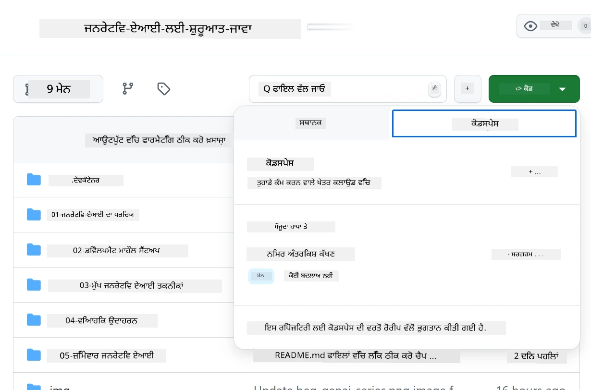
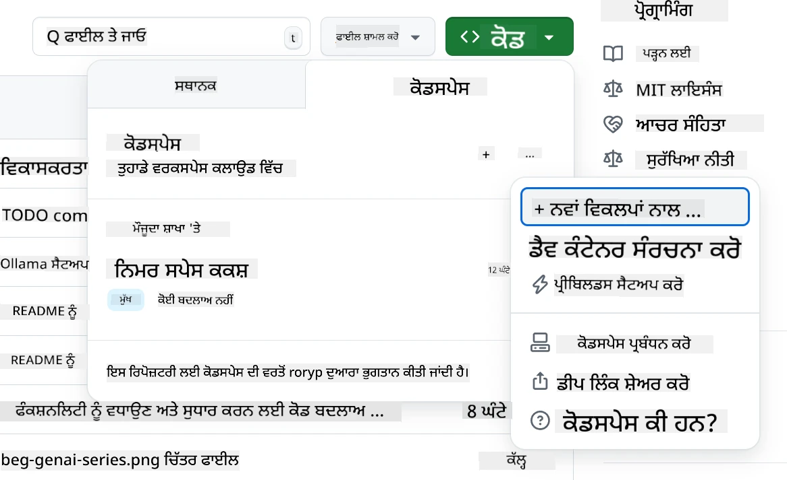
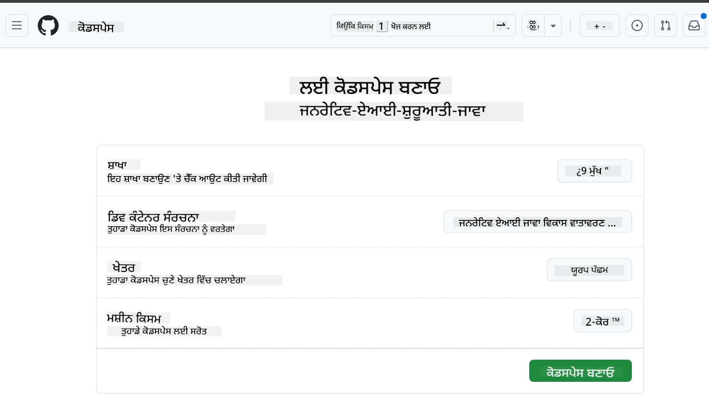
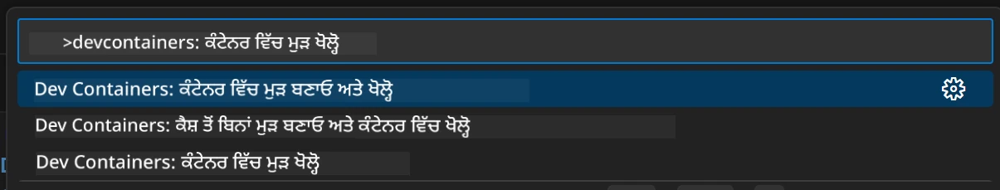
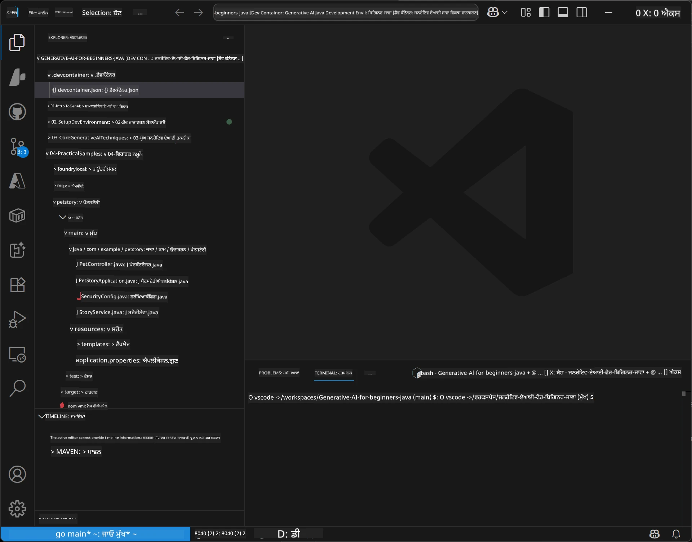

# ਜੇਨੇਰੇਟਿਵ ਏਆਈ ਲਈ ਜਾਵਾ ਦੇ ਵਿਕਾਸਕਾਰੀ ਮਾਹੌਲ ਨੂੰ ਸੈਟਅਪ ਕਰਨਾ

> **ਥੋੜ੍ਹੀ ਦੇਰ ਵਿੱਚ ਸ਼ੁਰੂ ਕਰੋ**: 2 ਮਿੰਟਾਂ ਵਿੱਚ ਕਲਾਉਡ ਵਿੱਚ ਕੋਡ ਕਰੋ - [GitHub ਕੋਡਸਪੇਸ ਸੈਟਅਪ](../../../02-SetupDevEnvironment) ਤੇ ਜਾਓ - ਕੋਈ ਸਥਾਨਕ ਇੰਸਟਾਲੇਸ਼ਨ ਲੋੜੀਂਦੀ ਨਹੀਂ ਅਤੇ github ਮਾਡਲ ਉਪਯੋਗ ਕਰਦਾ ਹੈ!

> **Azure OpenAI ਵਿੱਚ ਦਿਲਚਸਪੀ ਹੈ?**, ਸਾਡੇ [Azure OpenAI ਸੈਟਅਪ ਗਾਈਡ](getting-started-azure-openai.md) ਵਿੱਚ ਵੇਖੋ ਜਿੱਦੇ ਵਿੱਚ ਨਵਾਂ Azure OpenAI ਰਿਸੋਰਸ ਬਣਾਉਣ ਦੇ ਕਦਮ ਹਨ।

## ਤੁਸੀਂ ਕੀ ਸਿੱਖੋਗੇ

- AI ਐਪਲੀਕੇਸ਼ਨਾਂ ਲਈ ਜਾਵਾ ਦੇ ਵਿਕਾਸਕਾਰੀ ਮਾਹੌਲ ਦੀ ਸੈਟਅਪ ਕਰਨਾ
- ਆਪਣੀ ਪਸੰਦ ਨੁਸਰ ਵਿਕਾਸਕਾਰੀ ਮਾਹੌਲ ਚੁਣੋ ਅਤੇ ਅਨੁਕੂਲਿਤ ਕਰੋ (Codespaces ਨਾਲ ਕਲਾਉਡ-ਪਹਿਲਾ, ਸਥਾਨਕ ਡੇਵ ਕਨਟੇਨਰ, ਜਾਂ ਪੂਰੀ ਸਥਾਨਕ ਸੈਟਅਪ)
- GitHub ਮਾਡਲ ਨਾਲ ਕਨੈਕਟ ਕਰਕੇ ਆਪਣੀ ਸੈਟਅਪ ਦੀ ਜਾਂਚ ਕਰੋ

## ਮਾਹਿਰ ਸੂਚੀ

- [ਤੁਸੀਂ ਕੀ ਸਿੱਖੋਗੇ](../../../02-SetupDevEnvironment)
- [ਪਰਿਚਇ](../../../02-SetupDevEnvironment)
- [ਕਦਮ 1: ਆਪਣਾ ਵਿਕਾਸਕਾਰੀ ਮਾਹੌਲ ਸੈਟਅਪ ਕਰੋ](../../../02-SetupDevEnvironment)
  - [ਵਿਕਲਪ ਏ: GitHub ਕੋਡਸਪੇਸ (ਸਿਫਾਰਸ਼ੀ)](../../../02-SetupDevEnvironment)
  - [ਵਿਕਲਪ ਬੀ: ਸਥਾਨਕ ਡੇਵ ਕਨਟੇਨਰ](../../../02-SetupDevEnvironment)
  - [ਵਿਕਲਪ ਸੀ: ਆਪਣੀ ਮੌਜੂਦਾ ਸਥਾਨਕ ਇੰਸਟਾਲੇਸ਼ਨ ਵਰਤੋਂ](../../../02-SetupDevEnvironment)
- [ਕਦਮ 2: GitHub ਪ੍ਰਸਨਲ ਐਕਸੈਸ ਟੋਕਨ ਬਣਾਓ](../../../02-SetupDevEnvironment)
- [ਕਦਮ 3: GitHub ਮਾਡਲਾਂ ਨਾਲ ਆਪਣੀ ਸੈਟਅਪ ਦੀ ਜਾਂਚ ਕਰੋ](../../../02-SetupDevEnvironment)
- [ਸਮੱਸਿਆ ਸਮਾਧਾਨ](../../../02-SetupDevEnvironment)
- [ਸਾਰ](../../../02-SetupDevEnvironment)
- [ਅਗਲੇ ਕਦਮ](../../../02-SetupDevEnvironment)

## ਪਰਿਚਇ

ਇਹ ਅਧਿਆਇ ਤੁਹਾਨੂੰ ਵਿਕਾਸਕਾਰੀ ਮਾਹੌਲ ਸੈਟਅਪ ਕਰਨ ਵਿੱਚ ਮਦਦ ਦੇਵੇਗਾ। ਅਸੀਂ ਆਪਣਾ ਮੁੱਖ ਉਦਾਹਰਨ ਵਜੋਂ **GitHub Models** ਨੂੰ ਉਪਯੋਗ ਕਰਾਂਗੇ ਕਿਉਂਕਿ ਇਹ ਮੁਫਤ ਹੈ, ਸਿਰਫ ਇੱਕ GitHub ਅਕਾਉਂਟ ਨਾਲ ਆਸਾਨੀ ਨਾਲ ਸੈਟਅਪ ਹੁੰਦਾ ਹੈ, ਕਿਸੇ ਕਰੈਡਿਟ ਕਾਰਡ ਦੀ ਲੋੜ ਨਹੀਂ ਹੈ, ਅਤੇ ਪ੍ਰਯੋਗ ਲਈ ਇਕੱਠੇ ਕਈ ਮਾਡਲ ਮੁਹੱਈਆ ਕਰਵਾਉਂਦਾ ਹੈ।

**ਕੋਈ ਸਥਾਨਕ ਸੈਟਅਪ ਲੋੜੀਂਦੀ ਨਹੀਂ!** ਤੁਸੀਂ ਤੁਰੰਤ GitHub Codespaces ਦੀ ਵਰਤੋਂ ਕਰਕੇ ਬ੍ਰਾਊਜ਼ਰ ਵਿੱਚ ਪੂਰਾ ਵਿਕਾਸਕਾਰੀ ਮਾਹੌਲ ਵਰਤ ਸਕਦੇ ਹੋ।


ਅਸੀਂ ਇਸ ਕੋਰਸ ਲਈ [**GitHub Models**](https://github.com/marketplace?type=models) ਵਰਤੋਂ ਦੀ ਸਿਫਾਰਸ਼ ਕਰਦੇ ਹਾਂ ਕਿਉਂਕਿ ਇਹ:
- ਸ਼ੁਰੂ ਕਰਨ ਲਈ **ਮੁਫਤ** ਹੈ
- ਸਿਰਫ ਇੱਕ GitHub ਅਕਾਉਂਟ ਨਾਲ **ਆਸਾਨ** ਸੈਟਅਪ
- **ਕੋਈ ਕਰੈਡਿਟ ਕਾਰਡ ਚਾਹੀਦਾ ਨਹੀਂ**
- **ਕਈ ਮਾਡਲ** ਪ੍ਰਯੋਗ ਲਈ ਉਪਲਬਧ

> **ਨੋਟ**: ਇਸ ਟ੍ਰੇਨਿੰਗ ਵਿੱਚ ਵਰਤੇ GitHub Models ਲਈ ਮੁਫਤ ਸੀਮਾਵਾਂ ਹਨ:
> - 15 ਬੇਨਤੀਆਂ ਪ੍ਰਤੀ ਮਿੰਟ (150 ਪ੍ਰਤੀ ਦਿਨ)
> - ਹਰ ਬੇਨਤੀ ਵਿੱਚ ਲਗਭਗ 8,000 ਸ਼ਬਦ ਇਹਨਾਂ 'ਚ, ਲਗਭਗ 4,000 ਸ਼ਬਦ ਬਾਹਰ
> - 5 ਇਕਸਾਰ ਬੇਨਤੀਆਂ
> 
> ਉਤਪਾਦਨ ਲਈ, Azure ਖਾਤੇ ਨਾਲ Azure AI Foundry ਮਾਡਲਾਂ ਵਿੱਚ ਅੱਪਗਰੇਡ ਕਰੋ। ਤੁਹਾਡੇ ਕੋਡ ਵਿੱਚ ਕੋਈ ਬਦਲਾਅ ਦੀ ਲੋੜ ਨਹੀਂ। ਵੇਖੋ [Azure AI Foundry ਡੌਕਯੂਮੈਂਟੇਸ਼ਨ](https://learn.microsoft.com/azure/ai-foundry/foundry-models/how-to/quickstart-github-models)।

## ਕਦਮ 1: ਆਪਣਾ ਵਿਕਾਸਕਾਰੀ ਮਾਹੌਲ ਸੈਟਅਪ ਕਰੋ

<a name="quick-start-cloud"></a>

ਅਸੀਂ ਇੱਕ ਪਹਿਲਾਂ ਤਿਆਰ ਕੀਤਾ ਡੇਵ ਕਨਟੇਨਰ ਬਣਾਇਆ ਹੈ ਤਾਂ ਜੋ ਸੈਟਅਪ ਦਾ ਸਮਾਂ ਘੱਟ ਹੋਵੇ ਅਤੇ ਤੁਹਾਡੇ ਕੋਲ ਜ਼ਰੂਰੀ ਟੂਲ ਹੋਣ। ਆਪਣੀ ਪਸੰਦ ਦਾ ਵਿਕਾਸਕਾਰੀ ਤਰੀਕਾ ਚੁਣੋ:

### ਮਾਹੌਲ ਸੈਟਅਪ ਦੇ ਵਿਕਲਪ:

#### ਵਿਕਲਪ ਏ: GitHub ਕੋਡਸਪੇਸ (ਸਿਫਾਰਸ਼ੀ)

**2 ਮਿੰਟਾਂ ਵਿੱਚ ਕੋਡਿੰਗ ਸ਼ੁਰੂ ਕਰੋ - ਕੋਈ ਸਥਾਨਕ ਸੈਟਅਪ ਲੋੜੀਂਦੀ ਨਹੀਂ!**

1. ਇਸ ਰਿਪੋਜਿਟਰੀ ਨੂੰ ਆਪਣੇ GitHub ਅਕਾਉਂਟ ਤੇ fork ਕਰੋ
   > **ਨੋਟ**: ਜੇ ਤੁਸੀਂ ਮੂਲ ਕੰਫਿਗਰੇਸ਼ਨ ਸੋਧਣਾ ਚਾਹੁੰਦੇ ਹੋ ਤਾਂ [Dev Container Configuration](../../../.devcontainer/devcontainer.json) ਵੇਖੋ
2. **Code** → **Codespaces** ਟੈਬ → **...** → **New with options...** ਤੇ ਕਲਿਕ ਕਰੋ
3. ਡੀਫੌਲਟ ਵਰਤੋਂ – ਇਹ **Dev container configuration** ਚੁਣੇਗਾ: **Generative AI Java Development Environment** ਕਸਟਮ devcontainer ਜੋ ਇਸ ਕੋਰਸ ਲਈ ਬਣਾਇਆ ਗਿਆ ਹੈ
4. **Create codespace** ਤੇ ਕਲਿਕ ਕਰੋ
5. ਮਾਹੌਲ ਤਿਆਰ ਹੋਣ ਲਈ ਲਗਭਗ 2 ਮਿੰਟ ਉਡੀਕ ਕਰੋ
6. [ਕਦਮ 2: GitHub ਟੋਕਨ ਬਣਾਓ](../../../02-SetupDevEnvironment) ਤੇ ਜਾਓ







> **Codespaces ਦੇ ਫਾਇਦੇ**:
> - ਕੋਈ ਸਥਾਨਕ ਇੰਸਟਾਲੇਸ਼ਨ ਨਹੀਂ
> - ਕਿਸੇ ਵੀ ਡਿਵਾਈਸ ਤੇ ਜੋ ਬ੍ਰਾਊਜਰ ਰੱਖਦਾ ਹੈ ਉਹ ਕੰਮ ਕਰਦਾ ਹੈ
> - ਸਾਰੇ ਟੂਲ ਅਤੇ ਡਿਪੈਂਡਨਸੀਆਂ ਨਾਲ ਪਹਿਲਾਂ ਤੋਂ ਕਨਫਿਗਰਡ
> - ਨਿੱਜੀ ਅਕਾਉਂਟਾਂ ਲਈ ਮਾਸਿਕ 60 ਘੰਟੇ ਮੁਫ਼ਤ
> - ਸਾਰੇ ਵਿਦਿਆਰਥੀਆਂ ਲਈ ਇੱਕਸਾਰ ਮਾਹੌਲ

#### ਵਿਕਲਪ ਬੀ: ਸਥਾਨਕ ਡੇਵ ਕਨਟੇਨਰ

**ਉਹ ਵਿਕਾਸਕਾਰ ਜਿਹੜੇ Docker ਨਾਲ ਸਥਾਨਕ ਵਿਕਾਸ ਪਸੰਦ ਕਰਦੇ ਹਨ**

1. ਇਸ ਰਿਪੋਜਿਟਰੀ ਨੂੰ fork ਅਤੇ clone ਕਰੋ ਆਪਣੇ ਸਥਾਨਕ ਮਸ਼ੀਨ 'ਤੇ
   > **ਨੋਟ**: ਜੇ ਤੁਸੀਂ ਮੂਲ ਕੰਫਿਗਰੇਸ਼ਨ ਸੋਧਣਾ ਚਾਹੁੰਦੇ ਹੋ ਤਾਂ [Dev Container Configuration](../../../.devcontainer/devcontainer.json) ਵੇਖੋ
2. [Docker Desktop](https://www.docker.com/products/docker-desktop/) ਅਤੇ [VS Code](https://code.visualstudio.com/) ਇੰਸਟਾਲ ਕਰੋ
3. VS Code ਵਿੱਚ [Dev Containers ਐਕਸਟੈਂਸ਼ਨ](https://marketplace.visualstudio.com/items?itemName=ms-vscode-remote.remote-containers) ਇੰਸਟਾਲ ਕਰੋ
4. VS Code ਵਿੱਚ ਰਿਪੋਜਿਟਰੀ ਫੋਲਡਰ ਖੋਲ੍ਹੋ
5. ਪ੍ਰੰਪਟ ਆਉਣ 'ਤੇ, **Reopen in Container** 'ਤੇ ਕਲਿਕ ਕਰੋ (ਜਾਂ `Ctrl+Shift+P` → "Dev Containers: Reopen in Container" ਵਰਤੋਂ)
6. ਕਨਟੇਨਰ ਬਣਨ ਅਤੇ ਸਟਾਰਟ ਹੋਣ ਲਈ ਉਡੀਕ ਕਰੋ
7. [ਕਦਮ 2: GitHub ਟੋਕਨ ਬਣਾਓ](../../../02-SetupDevEnvironment) ਤੇ ਜਾਓ





#### ਵਿਕਲਪ ਸੀ: ਆਪਣੀ ਮੌਜੂਦਾ ਸਥਾਨਕ ਇੰਸਟਾਲੇਸ਼ਨ ਵਰਤੋਂ

**ਜਿਨ੍ਹਾਂ ਵਿਕਾਸਕਾਰਾਂ ਕੋਲ ਮੌਜੂਦਾ ਜਾਵਾ ਮਾਹੌਲ ਹੈ**

ਜ਼ਰੂਰੀ ਸਮੱਗਰੀ:
- [Java 21+](https://www.oracle.com/java/technologies/javase/jdk21-archive-downloads.html) 
- [Maven 3.9+](https://maven.apache.org/download.cgi)
- [VS Code](https://code.visualstudio.com) ਜਾਂ ਆਪਣਾ ਪਸੰਦੀਦਾ IDE

ਕਦਮ:
1. ਇਸ ਰਿਪੋਜਿਟਰੀ ਨੂੰ ਸਥਾਨਕ ਮਸ਼ੀਨ 'ਤੇ clone ਕਰੋ
2. ਆਪਣੇ IDE ਵਿੱਚ ਪ੍ਰੋਜੈਕਟ ਖੋਲ੍ਹੋ
3. [ਕਦਮ 2: GitHub ਟੋਕਨ ਬਣਾਓ](../../../02-SetupDevEnvironment) ਤੇ ਜਾਓ

> **ਪ੍ਰੋ ਟਿੱਪ**: ਜੇ ਤੁਹਾਡੇ ਕੋਲ ਘੱਟ-ਸਮਰੱਥਾ ਵਾਲਾ ਮਸ਼ੀਨ ਹੈ ਪਰ VS Code ਸਥਾਨਕ ਚਾਹੁੰਦੇ ਹੋ ਤਾਂ GitHub ਕੋਡਸਪੇਸ ਵਰਤੋ! ਤੁਸੀਂ ਆਪਣੇ ਸਥਾਨਕ VS Code ਨੂੰ ਇੱਕ ਕਲਾਉਡ-ਹੋਸਟੇਡ ਕੋਡਸਪੇਸ ਨਾਲ ਜੋੜ ਸਕਦੇ ਹੋ ਜੋ ਦੋਹਾਂ ਦੁਨੀਆਂ ਦਾ ਵਧੀਆ ਹੈ।


## ਕਦਮ 2: GitHub ਪ੍ਰਸਨਲ ਐਕਸੈਸ ਟੋਕਨ ਬਣਾਓ

1. [GitHub ਸੈਟਿੰਗਜ਼](https://github.com/settings/profile) 'ਤੇ ਜਾਓ ਅਤੇ ਆਪਣੇ ਪ੍ਰੋਫਾਈਲ ਮੀਨੂ ਵਿੱਚੋਂ **Settings** ਚੁਣੋ।
2. ਖੱਬੇ ਫਲੈਸ਼ਤਰ ਵਿੱਚ **Developer settings** 'ਤੇ ਕਲਿਕ ਕਰੋ (ਆਮਤੌਰ 'ਤੇ ਹੇਠਾਂ)
3. **Personal access tokens** ਹੇਠਾਂ, **Fine-grained tokens** 'ਤੇ ਕਲਿਕ ਕਰੋ (ਜਾਂ ਇਹ [ਸਿੱਧਾ ਲਿੰਕ](https://github.com/settings/personal-access-tokens) ਵਰਤੋਂ)
4. **Generate new token** 'ਤੇ ਕਲਿਕ ਕਰੋ
5. "ਟੋਕਨ ਨਾਮ" ਵਿੱਚ ਵਰਣਨਾਤਮਕ ਨਾਮ ਦਿਓ (ਜਿਵੇਂ `GenAI-Java-Course-Token`)
6. ਇੱਕ ਮਿਆਦ-ਅੰਤ ਦੀ ਤਾਰੀਖ ਸੈੱਟ ਕਰੋ (ਸੁਰੱਖਿਆ ਲਈ 7 ਦਿਨ ਸੁਝਾਏ ਗਏ ਹਨ)
7. "Resource owner" ਹੇਠ ਆਪਣੇ ਯੂਜ਼ਰ ਅਕਾਉਂਟ ਨੂੰ ਚੁਣੋ
8. "Repository access" ਵਿੱਚ ਆਪਣੀ ਵਰਤੋਂ ਲਈ ਰਿਪੋਜਿਟਰੀਆਂ ਚੁਣੋ (ਜਾਂ ਸਾਰੇ ਰਿਪੋ 'ਚਾਵੋ)
9. "Account permissions" ਵਿੱਚ **Models** ਨੂੰ **Read-only** ਸੈੱਟ ਕਰੋ
10. **Generate token** 'ਤੇ ਕਲਿਕ ਕਰੋ
11. ਹੁਣੇ ਹੀ ਆਪਣੇ ਟੋਕਨ ਨੂੰ ਕਾਪੀ ਅਤੇ ਸੰਭਾਲੋ – ਇਹ ਫਿਰ ਨਹੀਂ ਦਿਖਾਇਆ ਜਾਵੇਗਾ!

> **ਸੁਰੱਖਿਆ ਟਿੱਪ**: ਆਪਣੀ ਐਕਸੈਸ ਟੋਕਨ ਲਈ ਘੱਟੋ-ਘੱਟ ਲੋੜੀਂਦਾ ਸਕੋਪ ਅਤੇ ਸਭ ਤੋਂ ਛੋਟਾ ਕਾਰਗਰ ਮਿਆਦ ਅੰਤ ਵਰਤੋਂ।

## ਕਦਮ 3: GitHub ਮਾਡਲ ਨਾਲ ਆਪਣੀ ਸੈਟਅਪ ਦੀ ਜਾਂਚ ਕਰੋ

ਜਦੋਂ ਤੁਹਾਡਾ ਵਿਕਾਸਕਾਰੀ ਮਾਹੌਲ ਤਿਆਰ ਹੋ ਜਾਵੇ, ਤਾਂ ਆਓ ਇੱਕ ਸਧਾਰਣ ਐਪਲੀਕੇਸ਼ਨ ਵਿੱਚ GitHub Models ਇন্টੈਗਰੇਸ਼ਨ ਦੀ ਜਾਂਚ ਕਰੀਏ ਜਾਂ [examples/github-models](../../../02-SetupDevEnvironment/examples/github-models) ਵਿੱਚ।

1. ਆਪਣੀ ਵਿਕਾਸਕਾਰੀ ਮਾਹੌਲ ਵਿੱਚ ਟਰਮੀਨਲ ਖੋਲੋ।
2. GitHub Models ਉਦਾਹਰਨ ਵਾਲੇ ਫੋਲਡਰ ਵਿਚ ਜਾਓ:
   ```bash
   cd 02-SetupDevEnvironment/examples/github-models
   ```
3. ਆਪਣਾ GitHub ਟੋਕਨ ਇੱਕ ਵਾਤਾਵਰਣ ਵੈਰੀਏਬਲ ਵਜੋਂ ਸੈੱਟ ਕਰੋ:
   ```bash
   # ਮੈਕਓਐਸ/ਲਿਨਕਸ
   export GITHUB_TOKEN=your_token_here
   
   # ਵਿੰਡੋਜ਼ (ਕਮਾਂਡ ਪ੍ਰਾਂਪਟ)
   set GITHUB_TOKEN=your_token_here
   
   # ਵਿੰਡੋਜ਼ (ਪਾਵਰਸ਼ੈੱਲ)
   $env:GITHUB_TOKEN="your_token_here"
   ```

4. ਐਪਲੀਕੇਸ਼ਨ ਚਲਾਓ:
   ```bash
   mvn compile exec:java -Dexec.mainClass="com.example.githubmodels.App"
   ```

ਤੁਸੀਂ ਇਸ ਤਰ੍ਹਾਂ ਦਾ ਆਉਟਪੁੱਟ ਵੇਖੋਗੇ:
```text
Using model: gpt-4.1-nano
Sending request to GitHub Models...
Response: Hello World!
```


### ਉਦਾਹਰਨ ਕੋਡ ਨੂੰ ਸਮਝਣਾ

ਸਭ ਤੋਂ ਪਹਿਲਾਂ, ਦੇਖੀਏ ਅਸੀਂ ਜੋ ਚਲਾਇਆ ਉਹ ਕੀ ਕਰਦਾ ਹੈ। `examples/github-models` ਹੇਠ ਦਿੱਤਾ ਉਦਾਹਰਨ OpenAI Java SDK ਵਰਤ ਕੇ GitHub Models ਨਾਲ ਕਨੈਕਟ ਕਰਦਾ ਹੈ:

**ਇਹ ਕੋਡ ਕੀ ਕਰਦਾ ਹੈ:**
- ਤੁਹਾਡੇ ਪ੍ਰਸਨਲ ਐਕਸੈਸ ਟੋਕਨ ਦੀ ਵਰਤੋਂ ਕਰਕੇ GitHub Models ਨਾਲ **ਕਨੈਕਟ ਹੋਣਾ**
- AI ਮਾਡਲ ਨੂੰ ਇੱਕ ਸਧਾਰਣ "Say Hello World!" ਸੁਨੇਹਾ ਭੇਜਣਾ
- AI ਦਾ ਪ੍ਰਤਿਕਿਰਿਆ ਪ੍ਰਾਪਤ ਕਰਨਾ ਅਤੇ ਦਿਖਾਉਣਾ
- ਤੁਹਾਡੀ ਸੈਟਅਪ ਦੀ ਸਹੀ ਕਾਰਗੁਜ਼ਾਰੀ ਦੀ ਪੁਸ਼ਟੀ ਕਰਨਾ

**ਮੁੱਖ ਡਿਪੈਂਡੈਂਸੀ** (`pom.xml` ਵਿੱਚ):
```xml
<dependency>
    <groupId>com.openai</groupId>
    <artifactId>openai-java</artifactId>
    <version>2.12.0</version>
</dependency>
```


**ਮੁੱਖ ਕੋਡ** (`App.java`):
```java
// OpenAI ਜਾਵਾ SDK ਦੀ ਵਰਤੋਂ ਕਰਕੇ GitHub ਮਾਡਲਾਂ ਨਾਲ ਜੁੜੋ
OpenAIClient client = OpenAIOkHttpClient.builder()
    .apiKey(pat)
    .baseUrl("https://models.inference.ai.azure.com")
    .build();

// ਚੈਟ ਮੁਕੰਮਲ ਕਰਨ ਦੀ ਬੇਨਤੀ ਬਣਾਓ
ChatCompletionCreateParams params = ChatCompletionCreateParams.builder()
    .model(modelId)
    .addSystemMessage("You are a concise assistant.")
    .addUserMessage("Say Hello World!")
    .build();

// AI ਜਵਾਬ ਪ੍ਰਾਪਤ ਕਰੋ
ChatCompletion response = client.chat().completions().create(params);
System.out.println("Response: " + response.choices().get(0).message().content().orElse("No response content"));
```


## ਸਾਰ

ਸ਼ਾਬਾਸ਼! ਹੁਣ ਤੁਹਾਡੇ ਕੋਲ ਸਾਰੇ ਕੁਝ ਸੈਟਅਪ ਹੈ:

- AI ਮਾਡਲ ਦੀ ਪਹੁੰਚ ਲਈ ਉਚਿਤ ਅਧਿਕਾਰਾਂ ਨਾਲ GitHub ਪ੍ਰਸਨਲ ਐਕਸੈਸ ਟੋਕਨ ਬਣਾਇਆ
- ਆਪਣਾ ਜਾਵਾ ਵਿਕਾਸਕਾਰੀ ਮਾਹੌਲ ਚਲਾਇਆ (ਚਾਹੇ Codespaces ਹੋਵੇ, ਡੇਵ ਕਨਟੇਨਰ, ਜਾਂ ਸਥਾਨਕ)
- ਮੁਫ਼ਤ AI ਵਿਕਾਸ ਲਈ OpenAI Java SDK ਨਾਲ GitHub Models ਨਾਲ ਕਨੈਕਟ ਕੀਤਾ
- ਇੱਕ ਸਾਦਾ ਉਦਾਹਰਨ ਨਾਲ ਟੈਸਟ ਕੀਤਾ ਜੋ AI ਮਾਡਲਾਂ ਨਾਲ ਗੱਲ ਕਰਦਾ ਹੈ

## ਅਗਲੇ ਕਦਮ

[ਅਧਿਆਇ 3: ਕੋਰ ਜੇਨੇਰੇਟਿਵ ਏਆਈ ਤਕਨੀਕਾਂ](../03-CoreGenerativeAITechniques/README.md)

## ਸਮੱਸਿਆ ਸਮਾਧਾਨ

ਮੁਸ਼ਕਿਲ ਹੋ ਰਹੀ ਹੈ? ਇਹ ਸਭ ਤੋਂ ਆਮ ਸਮੱਸਿਆਵਾਂ ਅਤੇ ਹੱਲ ਹਨ:

- **ਟੋਕਨ ਕੰਮ ਨਹੀਂ ਕਰ ਰਿਹਾ?** 
  - ਪੂਰਾ ਟੋਕਨ ਕਾਪੀ ਕੀਤਾ ਹੈ ਬਿਨਾਂ ਕਿਸੇ ਵਾਧੂ ਖਾਲੀ ਥਾਂ ਦੇ
  - ਟੋਕਨ ਸਹੀ ਤਰ੍ਹਾਂ ਵਾਤਾਵਰਣ ਵੈਰੀਏਬਲ ਵਿੱਚ ਸੈਟ ਹੈ ਜਾਂ ਨਹੀਂ ਜਾਂਚ ਕਰੋ
  - ਆਪਣੇ ਟੋਕਨ ਦੀ ਅਧਿਕਾਰਾਂ (Models: Read-only) ਨੂੰ ਵੇਰੀਫਾਈ ਕਰੋ

- **Maven ਨਹੀਂ ਮਿਲ ਰਿਹਾ?** 
  - ਜੇ dev ਕਨਟੇਨਰ/ਕੋਡਸਪੇਸ ਵਰਤ ਰਹੇ ਹੋ ਤਾਂ Maven ਪਹਿਲਾਂ ਤੋਂ ਇੰਸਟਾਲ ਹੋਣਾ ਚਾਹੀਦਾ ਹੈ
  - ਸਥਾਨਕ ਸੈਟਅਪ ਲਈ, Java 21+ ਅਤੇ Maven 3.9+ ਇੰਸਟਾਲ ਹੈ ਯਕੀਨੀ ਬਣਾਓ
  - `mvn --version` ਚਲਾਕੇ ਇੰਸਟਾਲੇਸ਼ਨ ਚੈੱਕ ਕਰੋ

- **ਕਨੈਕਸ਼ਨ ਸਮੱਸਿਆ?** 
  - ਇੰਟਰਨੈੱਟ ਕਨੈਕਸ਼ਨ ਚੈੱਕ ਕਰੋ
  - ਜਾਂਚੋ ਕਿ ਤੁਹਾਡੀ ਨੈੱਟਵਰਕ ਤੋਂ GitHub ਐਕਸੈਸਬਲ ਹੈ
  - ਯਕੀਨ ਕਰੋ ਕਿ ਤੁਰੰਤ GitHub Models ਐਂਡਪੌਇੰਟ ਬੰਦ ਕਰਨ ਵਾਲਾ ਕੋਈ ਫਾਇਰਵਾਲ ਨਹੀਂ ਹੈ

- **ਡੇਵ ਕਨਟੇਨਰ ਸਟਾਰਟ ਨਹੀਂ ਹੋ ਰਿਹਾ?** 
  - ਯਕੀਨ ਕਰੋ Docker Desktop ਚੱਲ ਰਿਹਾ ਹੈ (ਸਥਾਨਕ ਵਿਖਸਾਸ ਲਈ)
  - ਕਨਟੇਨਰ ਨੂੰ ਦੁਬਾਰਾ ਬਣਾਉਣ ਦੀ ਕੋਸ਼ਿਸ਼ ਕਰੋ: `Ctrl+Shift+P` → "Dev Containers: Rebuild Container"

- **ਐਪਲੀਕੇਸ਼ਨ ਕੰਪਾਈਲ ਕਰਨ 'ਚ ਗਲਤੀਆਂ?**
  - ਯਕੀਨ ਕਰੋ ਕਿ ਤੁਸੀਂ ਸਹੀ ਡਾਇਰੈਕਟਰੀ 'ਚ ਹੋ: `02-SetupDevEnvironment/examples/github-models`
  - ਸਾਫ਼ ਅਤੇ ਦੁਬਾਰਾ ਬਣਾਉਣ ਦੀ ਕੋਸ਼ਿਸ਼ ਕਰੋ: `mvn clean compile`

> **ਮਦਦ ਚਾਹੀਦੀ ਹੈ?**: ਅਜੇ ਵੀ ਪ੍ਰਸ਼ਨ ਹਨ? ਰਿਪੋਜਿਟਰੀ ਵਿੱਚ ਇੱਕ ਮੁੱਦਾ ਖੋਲ੍ਹੋ ਅਤੇ ਅਸੀਂ ਤੁਹਾਡੀ ਮਦਦ ਕਰਾਂਗੇ।

---

<!-- CO-OP TRANSLATOR DISCLAIMER START -->
**ਅਸਵੀਕਾਰੋਕ্তੀ**:  
ਇਹ ਦਸਤਾਵੇਜ਼ AI ਅਨੁਵਾਦ ਸੇਵਾ [Co-op Translator](https://github.com/Azure/co-op-translator) ਦੀ ਵਰਤੋਂ ਕਰਕੇ ਅਨੁਵਾਦਿਤ ਕੀਤਾ ਗਿਆ ਹੈ। ਜਦੋਂ ਕਿ ਅਸੀਂ ਸਹੀਤਾ ਲਈ ਯਤਨਸ਼ੀਲ ਹਾਂ, ਕਿਰਪਾ ਕਰਕੇ ਧਿਆਨ ਦੇਵੋ ਕਿ ਆਟੋਮੈਟਿਕ ਅਨੁਵਾਦਾਂ ਵਿੱਚ ਗਲਤੀਆਂ ਜਾਂ ਅਣਸੁਚਿਤਤਾ ਹੋ ਸਕਦੀ ਹੈ। ਮੂਲ ਦਸਤਾਵੇਜ਼ ਆਪਣੀ ਮੂਲ ਭਾਸ਼ਾ ਵਿੱਚ ਹੀ ਪ੍ਰਮਾਣਿਕ ਸਰੋਤ ਮੰਨਿਆ ਜਾਣਾ ਚਾਹੀਦਾ ਹੈ। ਮਹੱਤਵਪੂਰਨ ਜਾਣਕਾਰੀ ਲਈ, ਪ੍ਰੋਫੈਸ਼ਨਲ ਮਨੁੱਖੀ ਅਨੁਵਾਦ ਦੀ ਸਿਫ਼ਾਰਸ਼ ਕੀਤੀ ਜਾਂਦੀ ਹੈ। ਇਸ ਅਨੁਵਾਦ ਦੀ ਵਰਤੋਂ ਕਰਕੇ ਪੈਦਾ ਹੋਣ ਵਾਲੇ ਕਿਸੇ ਵੀ ਗਲਤਫ਼ਹਮੀਆਂ ਜਾਂ ਵਿਵਾਦਾਂ ਲਈ ਅਸੀਂ ਜਵਾਬਦੇਹ ਨਹੀਂ ਹਾਂ।
<!-- CO-OP TRANSLATOR DISCLAIMER END -->