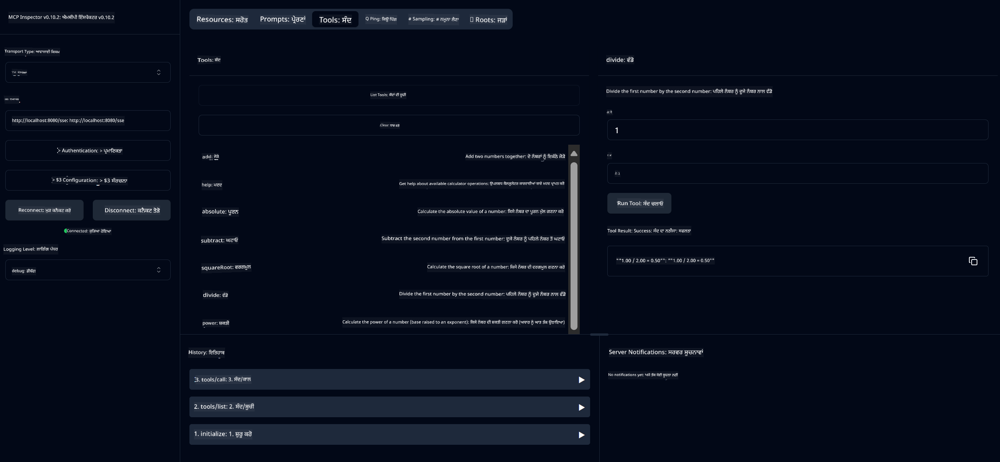

<!--
CO_OP_TRANSLATOR_METADATA:
{
  "original_hash": "7bf9a4a832911269a8bd0decb97ff36c",
  "translation_date": "2025-07-21T18:24:05+00:00",
  "source_file": "04-PracticalSamples/mcp/calculator/README.md",
  "language_code": "pa"
}
-->
# ਬੇਸਿਕ ਕੈਲਕੁਲੇਟਰ MCP ਸੇਵਾ

>**Note**: ਇਸ ਅਧਿਆਇ ਵਿੱਚ ਇੱਕ [**ਟਿਊਟੋਰਿਯਲ**](./TUTORIAL.md) ਸ਼ਾਮਲ ਹੈ ਜੋ ਤੁਹਾਨੂੰ ਤਿਆਰ ਨਮੂਨਿਆਂ ਨੂੰ ਚਲਾਉਣ ਦੀ ਪ੍ਰਕਿਰਿਆ ਦਿਖਾਉਂਦਾ ਹੈ।

**ਮਾਡਲ ਕਾਂਟੈਕਸਟ ਪ੍ਰੋਟੋਕੋਲ (MCP)** ਨਾਲ ਤੁਹਾਡਾ ਪਹਿਲਾ ਹੱਥ-ਅਨੁਭਵ ਸਵਾਗਤਯੋਗ ਹੈ! ਪਿਛਲੇ ਅਧਿਆਇਆਂ ਵਿੱਚ, ਤੁਸੀਂ ਜਨਰੇਟਿਵ AI ਦੇ ਮੂਲ ਸਿਧਾਂਤਾਂ ਬਾਰੇ ਸਿੱਖਿਆ ਅਤੇ ਆਪਣਾ ਵਿਕਾਸ ਵਾਤਾਵਰਣ ਸੈਟਅੱਪ ਕੀਤਾ। ਹੁਣ ਸਮਾਂ ਹੈ ਕੁਝ ਪ੍ਰਯੋਗਿਕ ਬਣਾਉਣ ਦਾ।

ਇਹ ਕੈਲਕੁਲੇਟਰ ਸੇਵਾ ਦਿਖਾਉਂਦੀ ਹੈ ਕਿ ਕਿਵੇਂ AI ਮਾਡਲ MCP ਦੀ ਵਰਤੋਂ ਕਰਕੇ ਬਾਹਰੀ ਟੂਲਾਂ ਨਾਲ ਸੁਰੱਖਿਅਤ ਤਰੀਕੇ ਨਾਲ ਸੰਚਾਰ ਕਰ ਸਕਦੇ ਹਨ। AI ਮਾਡਲ ਦੀ ਕਈ ਵਾਰ ਅਣਭਰੋਸੇਯੋਗ ਗਣਿਤ ਸਮਰੱਥਾ 'ਤੇ ਨਿਰਭਰ ਹੋਣ ਦੀ ਬਜਾਏ, ਅਸੀਂ ਦਿਖਾਵਾਂਗੇ ਕਿ ਕਿਵੇਂ ਇੱਕ ਮਜ਼ਬੂਤ ਪ੍ਰਣਾਲੀ ਬਣਾਈ ਜਾ ਸਕਦੀ ਹੈ ਜਿੱਥੇ AI ਸਹੀ ਗਣਨਾਵਾਂ ਲਈ ਵਿਸ਼ੇਸ਼ ਸੇਵਾਵਾਂ ਨੂੰ ਕਾਲ ਕਰ ਸਕਦਾ ਹੈ।

## ਸੂਚੀ

- [ਤੁਸੀਂ ਕੀ ਸਿੱਖੋਗੇ](../../../../../04-PracticalSamples/mcp/calculator)
- [ਪੂਰਵ ਸ਼ਰਤਾਂ](../../../../../04-PracticalSamples/mcp/calculator)
- [ਮੁੱਖ ਧਾਰਨਾਵਾਂ](../../../../../04-PracticalSamples/mcp/calculator)
- [ਤੁਰੰਤ ਸ਼ੁਰੂਆਤ](../../../../../04-PracticalSamples/mcp/calculator)
- [ਉਪਲਬਧ ਕੈਲਕੁਲੇਟਰ ਕਾਰਵਾਈਆਂ](../../../../../04-PracticalSamples/mcp/calculator)
- [ਟੈਸਟ ਕਲਾਇੰਟ](../../../../../04-PracticalSamples/mcp/calculator)
  - [1. ਡਾਇਰੈਕਟ MCP ਕਲਾਇੰਟ (SDKClient)](../../../../../04-PracticalSamples/mcp/calculator)
  - [2. AI-ਚਲਿਤ ਕਲਾਇੰਟ (LangChain4jClient)](../../../../../04-PracticalSamples/mcp/calculator)
- [MCP ਇੰਸਪੈਕਟਰ (ਵੈੱਬ UI)](../../../../../04-PracticalSamples/mcp/calculator)
  - [ਕਦਮ-ਦਰ-ਕਦਮ ਨਿਰਦੇਸ਼](../../../../../04-PracticalSamples/mcp/calculator)

## ਤੁਸੀਂ ਕੀ ਸਿੱਖੋਗੇ

ਇਸ ਉਦਾਹਰਨ 'ਤੇ ਕੰਮ ਕਰਕੇ, ਤੁਸੀਂ ਸਮਝ ਪਾਵੋਗੇ:
- ਕਿਵੇਂ Spring Boot ਦੀ ਵਰਤੋਂ ਕਰਕੇ MCP-ਅਨੁਕੂਲ ਸੇਵਾਵਾਂ ਬਣਾਈਆਂ ਜਾਂਦੀਆਂ ਹਨ
- ਸਿੱਧੇ ਪ੍ਰੋਟੋਕੋਲ ਸੰਚਾਰ ਅਤੇ AI-ਚਲਿਤ ਸੰਚਾਰ ਵਿੱਚ ਅੰਤਰ
- AI ਮਾਡਲ ਕਿਵੇਂ ਫੈਸਲਾ ਕਰਦੇ ਹਨ ਕਿ ਕਦੋਂ ਅਤੇ ਕਿਵੇਂ ਬਾਹਰੀ ਟੂਲਾਂ ਦੀ ਵਰਤੋਂ ਕਰਨੀ ਹੈ
- ਟੂਲ-ਸਮਰੱਥ AI ਐਪਲੀਕੇਸ਼ਨ ਬਣਾਉਣ ਲਈ ਸਭ ਤੋਂ ਵਧੀਆ ਅਭਿਆਸ

ਇਹ ਸ਼ੁਰੂਆਤ ਕਰਨ ਵਾਲਿਆਂ ਲਈ ਬਹੁਤ ਹੀ ਉਚਿਤ ਹੈ ਜੋ MCP ਧਾਰਨਾਵਾਂ ਸਿੱਖ ਰਹੇ ਹਨ ਅਤੇ ਆਪਣੀ ਪਹਿਲੀ AI ਟੂਲ ਇੰਟੀਗ੍ਰੇਸ਼ਨ ਬਣਾਉਣ ਲਈ ਤਿਆਰ ਹਨ!

## ਪੂਰਵ ਸ਼ਰਤਾਂ

- Java 21+
- Maven 3.6+
- **GitHub Token**: AI-ਚਲਿਤ ਕਲਾਇੰਟ ਲਈ ਲੋੜੀਂਦਾ। ਜੇ ਤੁਸੀਂ ਇਸਨੂੰ ਅਜੇ ਤੱਕ ਸੈਟਅੱਪ ਨਹੀਂ ਕੀਤਾ, ਤਾਂ [ਅਧਿਆਇ 2: ਆਪਣਾ ਵਿਕਾਸ ਵਾਤਾਵਰਣ ਸੈਟਅੱਪ ਕਰਨਾ](../../../02-SetupDevEnvironment/README.md) ਵੇਖੋ।

## ਮੁੱਖ ਧਾਰਨਾਵਾਂ

**ਮਾਡਲ ਕਾਂਟੈਕਸਟ ਪ੍ਰੋਟੋਕੋਲ (MCP)** ਇੱਕ ਮਿਆਰੀਕ੍ਰਿਤ ਤਰੀਕਾ ਹੈ ਜੋ AI ਐਪਲੀਕੇਸ਼ਨਾਂ ਨੂੰ ਬਾਹਰੀ ਟੂਲਾਂ ਨਾਲ ਸੁਰੱਖਿਅਤ ਤਰੀਕੇ ਨਾਲ ਜੁੜਨ ਦੀ ਆਗਿਆ ਦਿੰਦਾ ਹੈ। ਇਸਨੂੰ ਇੱਕ "ਪੁਲ" ਵਜੋਂ ਸੋਚੋ ਜੋ AI ਮਾਡਲਾਂ ਨੂੰ ਸਾਡੇ ਕੈਲਕੁਲੇਟਰ ਵਰਗੀਆਂ ਬਾਹਰੀ ਸੇਵਾਵਾਂ ਦੀ ਵਰਤੋਂ ਕਰਨ ਦੀ ਆਗਿਆ ਦਿੰਦਾ ਹੈ। AI ਮਾਡਲ ਦੇ ਗਣਿਤ ਕਰਨ ਦੀ ਕੋਸ਼ਿਸ਼ ਕਰਨ ਦੀ ਬਜਾਏ (ਜੋ ਅਣਭਰੋਸੇਯੋਗ ਹੋ ਸਕਦੀ ਹੈ), ਇਹ ਸਾਡੇ ਕੈਲਕੁਲੇਟਰ ਸੇਵਾ ਨੂੰ ਸਹੀ ਨਤੀਜੇ ਪ੍ਰਾਪਤ ਕਰਨ ਲਈ ਕਾਲ ਕਰ ਸਕਦਾ ਹੈ। MCP ਇਹ ਯਕੀਨੀ ਬਣਾਉਂਦਾ ਹੈ ਕਿ ਇਹ ਸੰਚਾਰ ਸੁਰੱਖਿਅਤ ਅਤੇ ਲਗਾਤਾਰ ਹੋਵੇ।

**ਸਰਵਰ-ਭੇਜੇ ਘਟਨਾ (SSE)** ਸਰਵਰ ਅਤੇ ਕਲਾਇੰਟਾਂ ਦੇ ਵਿਚਕਾਰ ਰੀਅਲ-ਟਾਈਮ ਸੰਚਾਰ ਦੀ ਆਗਿਆ ਦਿੰਦਾ ਹੈ। ਰਵਾਇਤੀ HTTP ਬੇਨਤੀ ਦੇ ਬਜਾਏ ਜਿੱਥੇ ਤੁਸੀਂ ਪੁੱਛਦੇ ਹੋ ਅਤੇ ਜਵਾਬ ਦੀ ਉਡੀਕ ਕਰਦੇ ਹੋ, SSE ਸਰਵਰ ਨੂੰ ਕਲਾਇੰਟ ਨੂੰ ਲਗਾਤਾਰ ਅੱਪਡੇਟ ਭੇਜਣ ਦੀ ਆਗਿਆ ਦਿੰਦਾ ਹੈ। ਇਹ AI ਐਪਲੀਕੇਸ਼ਨਾਂ ਲਈ ਬਹੁਤ ਹੀ ਉਚਿਤ ਹੈ ਜਿੱਥੇ ਜਵਾਬ ਸਟ੍ਰੀਮ ਹੋ ਸਕਦੇ ਹਨ ਜਾਂ ਪ੍ਰਕਿਰਿਆ ਕਰਨ ਵਿੱਚ ਸਮਾਂ ਲੱਗ ਸਕਦਾ ਹੈ।

**AI ਟੂਲ ਅਤੇ ਫੰਕਸ਼ਨ ਕਾਲਿੰਗ** AI ਮਾਡਲਾਂ ਨੂੰ ਆਪਣੇ ਆਪ ਬਾਹਰੀ ਫੰਕਸ਼ਨਾਂ (ਜਿਵੇਂ ਕਿ ਕੈਲਕੁਲੇਟਰ ਕਾਰਵਾਈਆਂ) ਦੀ ਚੋਣ ਕਰਨ ਅਤੇ ਵਰਤੋਂ ਕਰਨ ਦੀ ਆਗਿਆ ਦਿੰਦਾ ਹੈ। ਜਦੋਂ ਤੁਸੀਂ ਪੁੱਛਦੇ ਹੋ "15 + 27 ਕੀ ਹੈ?", ਤਾਂ AI ਮਾਡਲ ਸਮਝਦਾ ਹੈ ਕਿ ਤੁਸੀਂ ਜੋੜ ਚਾਹੁੰਦੇ ਹੋ, ਸਹੀ ਪੈਰਾਮੀਟਰਾਂ (15, 27) ਨਾਲ ਸਾਡੇ `add` ਟੂਲ ਨੂੰ ਕਾਲ ਕਰਦਾ ਹੈ, ਅਤੇ ਨਤੀਜਾ ਕੁਦਰਤੀ ਭਾਸ਼ਾ ਵਿੱਚ ਵਾਪਸ ਕਰਦਾ ਹੈ। AI ਇੱਕ ਸਮਰੱਥ ਕੋਆਰਡੀਨੇਟਰ ਵਜੋਂ ਕੰਮ ਕਰਦਾ ਹੈ ਜੋ ਜਾਣਦਾ ਹੈ ਕਿ ਕਦੋਂ ਅਤੇ ਕਿਵੇਂ ਹਰ ਟੂਲ ਦੀ ਵਰਤੋਂ ਕਰਨੀ ਹੈ।

## ਤੁਰੰਤ ਸ਼ੁਰੂਆਤ

### 1. ਕੈਲਕੁਲੇਟਰ ਐਪਲੀਕੇਸ਼ਨ ਡਾਇਰੈਕਟਰੀ 'ਤੇ ਜਾਓ
```bash
cd Generative-AI-for-beginners-java/04-PracticalSamples/mcp/calculator
```

### 2. ਬਣਾਓ ਅਤੇ ਚਲਾਓ
```bash
mvn clean install -DskipTests
java -jar target/calculator-server-0.0.1-SNAPSHOT.jar
```

### 2. ਕਲਾਇੰਟਾਂ ਨਾਲ ਟੈਸਟ ਕਰੋ
- **SDKClient**: ਸਿੱਧਾ MCP ਪ੍ਰੋਟੋਕੋਲ ਸੰਚਾਰ
- **LangChain4jClient**: AI-ਚਲਿਤ ਕੁਦਰਤੀ ਭਾਸ਼ਾ ਸੰਚਾਰ (GitHub ਟੋਕਨ ਦੀ ਲੋੜ ਹੈ)

## ਉਪਲਬਧ ਕੈਲਕੁਲੇਟਰ ਕਾਰਵਾਈਆਂ

- `add(a, b)`, `subtract(a, b)`, `multiply(a, b)`, `divide(a, b)`
- `power(base, exponent)`, `squareRoot(number)`, `absolute(number)`
- `modulus(a, b)`, `help()`

## ਟੈਸਟ ਕਲਾਇੰਟ

### 1. ਡਾਇਰੈਕਟ MCP ਕਲਾਇੰਟ (SDKClient)
ਕੱਚੇ MCP ਪ੍ਰੋਟੋਕੋਲ ਸੰਚਾਰ ਦੀ ਜਾਂਚ ਕਰਦਾ ਹੈ। ਚਲਾਓ:
```bash
mvn test-compile exec:java -Dexec.mainClass="com.microsoft.mcp.sample.client.SDKClient" -Dexec.classpathScope=test
```

### 2. AI-ਚਲਿਤ ਕਲਾਇੰਟ (LangChain4jClient)
GitHub ਮਾਡਲਾਂ ਨਾਲ ਕੁਦਰਤੀ ਭਾਸ਼ਾ ਸੰਚਾਰ ਦਿਖਾਉਂਦਾ ਹੈ। GitHub ਟੋਕਨ ਦੀ ਲੋੜ ਹੈ (ਵੇਖੋ [ਪੂਰਵ ਸ਼ਰਤਾਂ](../../../../../04-PracticalSamples/mcp/calculator))।

**ਚਲਾਓ:**
```bash
mvn test-compile exec:java -Dexec.mainClass="com.microsoft.mcp.sample.client.LangChain4jClient" -Dexec.classpathScope=test
```

## MCP ਇੰਸਪੈਕਟਰ (ਵੈੱਬ UI)

MCP ਇੰਸਪੈਕਟਰ ਇੱਕ ਵਿਜੁਅਲ ਵੈੱਬ ਇੰਟਰਫੇਸ ਪ੍ਰਦਾਨ ਕਰਦਾ ਹੈ ਜੋ ਤੁਹਾਨੂੰ ਕੋਡ ਲਿਖਣ ਤੋਂ ਬਿਨਾਂ ਆਪਣੀ MCP ਸੇਵਾ ਦੀ ਜਾਂਚ ਕਰਨ ਦੀ ਆਗਿਆ ਦਿੰਦਾ ਹੈ। ਸ਼ੁਰੂਆਤ ਕਰਨ ਵਾਲਿਆਂ ਲਈ ਬਹੁਤ ਹੀ ਉਚਿਤ ਹੈ ਜੋ ਸਮਝਣਾ ਚਾਹੁੰਦੇ ਹਨ ਕਿ MCP ਕਿਵੇਂ ਕੰਮ ਕਰਦਾ ਹੈ!

### ਕਦਮ-ਦਰ-ਕਦਮ ਨਿਰਦੇਸ਼:

1. **ਕੈਲਕੁਲੇਟਰ ਸਰਵਰ ਸ਼ੁਰੂ ਕਰੋ** (ਜੇ ਅਜੇ ਤੱਕ ਚਲਾਇਆ ਨਹੀਂ):
   ```bash
   java -jar target/calculator-server-0.0.1-SNAPSHOT.jar
   ```

2. **ਨਵੀਂ ਟਰਮੀਨਲ ਵਿੱਚ MCP ਇੰਸਪੈਕਟਰ ਇੰਸਟਾਲ ਅਤੇ ਚਲਾਓ**:
   ```bash
   npx @modelcontextprotocol/inspector
   ```

3. **ਵੈੱਬ ਇੰਟਰਫੇਸ ਖੋਲ੍ਹੋ**:
   - "Inspector running at http://localhost:6274" ਵਰਗਾ ਸੁਨੇਹਾ ਲੱਭੋ
   - ਉਸ URL ਨੂੰ ਆਪਣੇ ਵੈੱਬ ਬ੍ਰਾਊਜ਼ਰ ਵਿੱਚ ਖੋਲ੍ਹੋ

4. **ਆਪਣੀ ਕੈਲਕੁਲੇਟਰ ਸੇਵਾ ਨਾਲ ਜੁੜੋ**:
   - ਵੈੱਬ ਇੰਟਰਫੇਸ ਵਿੱਚ, ਟ੍ਰਾਂਸਪੋਰਟ ਕਿਸਮ ਨੂੰ "SSE" 'ਤੇ ਸੈਟ ਕਰੋ
   - URL ਸੈਟ ਕਰੋ: `http://localhost:8080/sse`
   - "Connect" ਬਟਨ 'ਤੇ ਕਲਿੱਕ ਕਰੋ

5. **ਉਪਲਬਧ ਟੂਲਾਂ ਦੀ ਪੜਤਾਲ ਕਰੋ**:
   - "List Tools" 'ਤੇ ਕਲਿੱਕ ਕਰੋ ਤਾਂ ਜੋ ਸਾਰੀਆਂ ਕੈਲਕੁਲੇਟਰ ਕਾਰਵਾਈਆਂ ਵੇਖ ਸਕੋ
   - ਤੁਹਾਨੂੰ `add`, `subtract`, `multiply`, ਆਦਿ ਵਰਗੇ ਫੰਕਸ਼ਨ ਦਿਖਾਈ ਦੇਣਗੇ

6. **ਕੈਲਕੁਲੇਟਰ ਕਾਰਵਾਈ ਦੀ ਜਾਂਚ ਕਰੋ**:
   - ਇੱਕ ਟੂਲ ਚੁਣੋ (ਜਿਵੇਂ "add")
   - ਪੈਰਾਮੀਟਰ ਦਰਜ ਕਰੋ (ਜਿਵੇਂ, `a: 15`, `b: 27`)
   - "Run Tool" 'ਤੇ ਕਲਿੱਕ ਕਰੋ
   - ਆਪਣੀ MCP ਸੇਵਾ ਦੁਆਰਾ ਵਾਪਸ ਕੀਤਾ ਨਤੀਜਾ ਵੇਖੋ!

ਇਹ ਵਿਜੁਅਲ ਪਹੁੰਚ ਤੁਹਾਨੂੰ ਇਹ ਸਮਝਣ ਵਿੱਚ ਮਦਦ ਕਰਦੀ ਹੈ ਕਿ MCP ਸੰਚਾਰ ਕਿਵੇਂ ਕੰਮ ਕਰਦਾ ਹੈ, ਇਸ ਤੋਂ ਪਹਿਲਾਂ ਕਿ ਤੁਸੀਂ ਆਪਣੇ ਕਲਾਇੰਟ ਬਣਾਉ।



---
**ਸੰਦਰਭ:** [MCP ਸਰਵਰ ਬੂਟ ਸਟਾਰਟਰ ਡੌਕਸ](https://docs.spring.io/spring-ai/reference/api/mcp/mcp-server-boot-starter-docs.html)

**ਅਸਵੀਕਾਰਨਾ**:  
ਇਹ ਦਸਤਾਵੇਜ਼ AI ਅਨੁਵਾਦ ਸੇਵਾ [Co-op Translator](https://github.com/Azure/co-op-translator) ਦੀ ਵਰਤੋਂ ਕਰਕੇ ਅਨੁਵਾਦ ਕੀਤਾ ਗਿਆ ਹੈ। ਜਦੋਂ ਕਿ ਅਸੀਂ ਸਹੀਤਾ ਲਈ ਯਤਨਸ਼ੀਲ ਹਾਂ, ਕਿਰਪਾ ਕਰਕੇ ਧਿਆਨ ਦਿਓ ਕਿ ਸਵੈਚਾਲਿਤ ਅਨੁਵਾਦਾਂ ਵਿੱਚ ਗਲਤੀਆਂ ਜਾਂ ਅਸੁਚੀਤਤਾਵਾਂ ਹੋ ਸਕਦੀਆਂ ਹਨ। ਮੂਲ ਦਸਤਾਵੇਜ਼ ਨੂੰ ਇਸਦੀ ਮੂਲ ਭਾਸ਼ਾ ਵਿੱਚ ਅਧਿਕਾਰਤ ਸਰੋਤ ਮੰਨਿਆ ਜਾਣਾ ਚਾਹੀਦਾ ਹੈ। ਮਹੱਤਵਪੂਰਨ ਜਾਣਕਾਰੀ ਲਈ, ਪੇਸ਼ੇਵਰ ਮਨੁੱਖੀ ਅਨੁਵਾਦ ਦੀ ਸਿਫਾਰਸ਼ ਕੀਤੀ ਜਾਂਦੀ ਹੈ। ਇਸ ਅਨੁਵਾਦ ਦੀ ਵਰਤੋਂ ਤੋਂ ਪੈਦਾ ਹੋਣ ਵਾਲੇ ਕਿਸੇ ਵੀ ਗਲਤਫਹਿਮੀ ਜਾਂ ਗਲਤ ਵਿਆਖਿਆ ਲਈ ਅਸੀਂ ਜ਼ਿੰਮੇਵਾਰ ਨਹੀਂ ਹਾਂ।