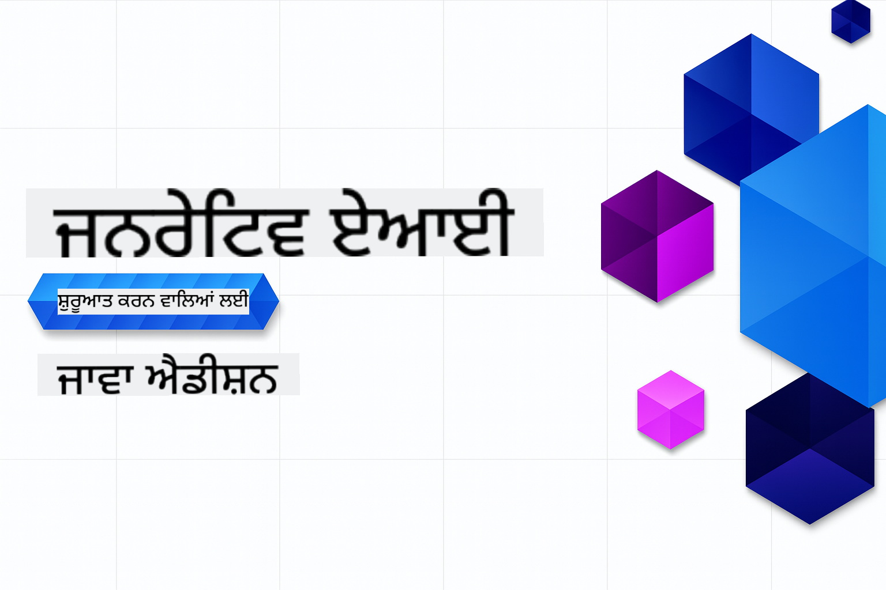

<!--
CO_OP_TRANSLATOR_METADATA:
{
  "original_hash": "2ee0f50497c11d1941347ac61fb017a9",
  "translation_date": "2025-07-21T17:31:58+00:00",
  "source_file": "README.md",
  "language_code": "pa"
}
-->
# ਜਨਰੇਟਿਵ AI ਸ਼ੁਰੂਆਤੀਆਂ ਲਈ - ਜਾਵਾ ਐਡੀਸ਼ਨ  
  

  

> **NOTE: Quick Start**: ਪੂਰਾ ਕੋਰਸ ਆਨਲਾਈਨ ਕੀਤਾ ਜਾ ਸਕਦਾ ਹੈ - ਕੋਈ ਲੋਕਲ ਸੈਟਅੱਪ ਦੀ ਲੋੜ ਨਹੀਂ!  
1. ਇਸ ਰਿਪੋਜ਼ਟਰੀ ਨੂੰ ਆਪਣੇ GitHub ਅਕਾਊਂਟ ਵਿੱਚ ਫੋਰਕ ਕਰੋ  
2. **Code** → **Codespaces** ਟੈਬ → **...** → **New with options...** 'ਤੇ ਕਲਿੱਕ ਕਰੋ  
3. ਡਿਫਾਲਟ ਸੈਟਿੰਗਾਂ ਵਰਤੋ – ਇਹ ਕੋਰਸ ਲਈ ਬਣਾਏ ਗਏ ਡਿਵੈਲਪਮੈਂਟ ਕੰਟੇਨਰ ਨੂੰ ਚੁਣੇਗਾ  
4. **Create codespace** 'ਤੇ ਕਲਿੱਕ ਕਰੋ  
5. ਮਾਹੌਲ ਤਿਆਰ ਹੋਣ ਲਈ ~2 ਮਿੰਟ ਰੁਕੋ  
6. ਸਿੱਧੇ [ਆਪਣਾ GitHub ਮਾਡਲ ਟੋਕਨ ਬਣਾਉਣ](./02-SetupDevEnvironment/README.md#step-2-create-a-github-personal-access-token) 'ਤੇ ਜਾਓ  

## ਬਹੁ-ਭਾਸ਼ਾਈ ਸਹਾਇਤਾ  

### GitHub Action ਰਾਹੀਂ ਸਹਾਇਕ (ਆਟੋਮੈਟਿਕ ਅਤੇ ਹਮੇਸ਼ਾ ਅਪ-ਟੂ-ਡੇਟ)  

[French](../fr/README.md) | [Spanish](../es/README.md) | [German](../de/README.md) | [Russian](../ru/README.md) | [Arabic](../ar/README.md) | [Persian (Farsi)](../fa/README.md) | [Urdu](../ur/README.md) | [Chinese (Simplified)](../zh/README.md) | [Chinese (Traditional, Macau)](../mo/README.md) | [Chinese (Traditional, Hong Kong)](../hk/README.md) | [Chinese (Traditional, Taiwan)](../tw/README.md) | [Japanese](../ja/README.md) | [Korean](../ko/README.md) | [Hindi](../hi/README.md) | [Bengali](../bn/README.md) | [Marathi](../mr/README.md) | [Nepali](../ne/README.md) | [Punjabi (Gurmukhi)](./README.md) | [Portuguese (Portugal)](../pt/README.md) | [Portuguese (Brazil)](../br/README.md) | [Italian](../it/README.md) | [Polish](../pl/README.md) | [Turkish](../tr/README.md) | [Greek](../el/README.md) | [Thai](../th/README.md) | [Swedish](../sv/README.md) | [Danish](../da/README.md) | [Norwegian](../no/README.md) | [Finnish](../fi/README.md) | [Dutch](../nl/README.md) | [Hebrew](../he/README.md) | [Vietnamese](../vi/README.md) | [Indonesian](../id/README.md) | [Malay](../ms/README.md) | [Tagalog (Filipino)](../tl/README.md) | [Swahili](../sw/README.md) | [Hungarian](../hu/README.md) | [Czech](../cs/README.md) | [Slovak](../sk/README.md) | [Romanian](../ro/README.md) | [Bulgarian](../bg/README.md) | [Serbian (Cyrillic)](../sr/README.md) | [Croatian](../hr/README.md) | [Slovenian](../sl/README.md) | [Ukrainian](../uk/README.md) | [Burmese (Myanmar)](../my/README.md)  

## ਕੋਰਸ ਦੀ ਬਣਤਰ ਅਤੇ ਸਿੱਖਣ ਦਾ ਰਸਤਾ  

**ਸਮਾਂ ਲਗਣ ਵਾਲਾ**: ਮਾਹੌਲ ਸੈਟਅੱਪ ਕਰਨ ਵਿੱਚ 2 ਮਿੰਟ ਲੱਗਦੇ ਹਨ, ਜਦਕਿ ਹੱਥ-ਅਨੁਭਵ ਟਿਊਟੋਰਿਅਲਾਂ ਵਿੱਚ 1-3 ਘੰਟੇ ਲੱਗਦੇ ਹਨ, ਖੋਜ ਦੀ ਗਹਿਰਾਈ 'ਤੇ ਨਿਰਭਰ ਕਰਦਾ ਹੈ।  

### **ਅਧਿਆਇ 1: ਜਨਰੇਟਿਵ AI ਦਾ ਪਰਚੇ**  
- **ਮੁੱਖ ਧਾਰਨਾਵਾਂ**: ਵੱਡੇ ਭਾਸ਼ਾ ਮਾਡਲਾਂ, ਟੋਕਨ, ਐਮਬੈਡਿੰਗਜ਼, ਅਤੇ AI ਸਮਰੱਥਾਵਾਂ ਨੂੰ ਸਮਝਣਾ  
- **ਜਾਵਾ AI ਪਰਿਪੇਖ**: Spring AI ਅਤੇ OpenAI SDKs ਦਾ ਜਾਇਜ਼ਾ  
- **ਮਾਡਲ ਕਾਂਟੈਕਸਟ ਪ੍ਰੋਟੋਕੋਲ**: MCP ਅਤੇ AI ਏਜੰਟ ਸੰਚਾਰ ਵਿੱਚ ਇਸ ਦੀ ਭੂਮਿਕਾ ਦਾ ਪਰਚੇ  
- **ਵਿਆਵਹਾਰਿਕ ਐਪਲੀਕੇਸ਼ਨ**: ਚੈਟਬੋਟ ਅਤੇ ਸਮੱਗਰੀ ਸਿਰਜਣ ਸਮੇਤ ਅਸਲ ਦੁਨੀਆ ਦੇ ਉਦਾਹਰਨ  
- **[→ ਅਧਿਆਇ 1 ਸ਼ੁਰੂ ਕਰੋ](./01-IntroToGenAI/README.md)**  

### **ਅਧਿਆਇ 2: ਡਿਵੈਲਪਮੈਂਟ ਮਾਹੌਲ ਸੈਟਅੱਪ**  
- **ਮਲਟੀ-ਪ੍ਰੋਵਾਈਡਰ ਕਾਨਫਿਗਰੇਸ਼ਨ**: GitHub ਮਾਡਲ, Azure OpenAI, ਅਤੇ OpenAI ਜਾਵਾ SDK ਇੰਟੀਗ੍ਰੇਸ਼ਨ ਸੈਟਅੱਪ ਕਰੋ  
- **Spring Boot + Spring AI**: ਉਦਯੋਗਿਕ AI ਐਪਲੀਕੇਸ਼ਨ ਵਿਕਾਸ ਲਈ ਸਭ ਤੋਂ ਵਧੀਆ ਅਭਿਆਸ  
- **GitHub ਮਾਡਲ**: ਪ੍ਰੋਟੋਟਾਈਪਿੰਗ ਅਤੇ ਸਿੱਖਣ ਲਈ ਮੁਫ਼ਤ AI ਮਾਡਲ ਪਹੁੰਚ (ਕੋਈ ਕਰੈਡਿਟ ਕਾਰਡ ਦੀ ਲੋੜ ਨਹੀਂ)  
- **ਡਿਵੈਲਪਮੈਂਟ ਟੂਲਜ਼**: Docker ਕੰਟੇਨਰ, VS Code, ਅਤੇ GitHub Codespaces ਕਾਨਫਿਗਰੇਸ਼ਨ  
- **[→ ਅਧਿਆਇ 2 ਸ਼ੁਰੂ ਕਰੋ](./02-SetupDevEnvironment/README.md)**  

### **ਅਧਿਆਇ 3: ਮੁੱਖ ਜਨਰੇਟਿਵ AI ਤਕਨੀਕਾਂ**  
- **ਪ੍ਰਾਂਪਟ ਇੰਜੀਨੀਅਰਿੰਗ**: AI ਮਾਡਲ ਦੇ ਉੱਤਮ ਜਵਾਬਾਂ ਲਈ ਤਕਨੀਕਾਂ  
- **ਐਮਬੈਡਿੰਗਜ਼ ਅਤੇ ਵੇਕਟਰ ਓਪਰੇਸ਼ਨ**: ਸੈਮੈਂਟਿਕ ਖੋਜ ਅਤੇ ਸਮਾਨਤਾ ਮੈਚਿੰਗ ਲਾਗੂ ਕਰੋ  
- **ਰਿਟਰੀਵਲ-ਅਗਮੈਂਟਡ ਜਨਰੇਸ਼ਨ (RAG)**: ਆਪਣੇ ਡਾਟਾ ਸਰੋਤਾਂ ਨਾਲ AI ਨੂੰ ਜੋੜੋ  
- **ਫੰਕਸ਼ਨ ਕਾਲਿੰਗ**: ਕਸਟਮ ਟੂਲਜ਼ ਅਤੇ ਪਲੱਗਇਨ ਨਾਲ AI ਸਮਰੱਥਾਵਾਂ ਨੂੰ ਵਧਾਓ  
- **[→ ਅਧਿਆਇ 3 ਸ਼ੁਰੂ ਕਰੋ](./03-CoreGenerativeAITechniques/README.md)**  

### **ਅਧਿਆਇ 4: ਵਿਆਵਹਾਰਿਕ ਐਪਲੀਕੇਸ਼ਨ ਅਤੇ ਪ੍ਰੋਜੈਕਟ**  
- **ਪੈਟ ਸਟੋਰੀ ਜਨਰੇਟਰ** (`petstory/`): GitHub ਮਾਡਲਾਂ ਨਾਲ ਰਚਨਾਤਮਕ ਸਮੱਗਰੀ ਸਿਰਜਣਾ  
- **Foundry Local Demo** (`foundrylocal/`): OpenAI ਜਾਵਾ SDK ਨਾਲ ਲੋਕਲ AI ਮਾਡਲ ਇੰਟੀਗ੍ਰੇਸ਼ਨ  
- **MCP ਕੈਲਕੂਲੇਟਰ ਸੇਵਾ** (`mcp/calculator/`): Spring AI ਨਾਲ ਮਾਡਲ ਕਾਂਟੈਕਸਟ ਪ੍ਰੋਟੋਕੋਲ ਦੀ ਬੁਨਿਆਦੀ ਲਾਗੂਆਤ  
- **[→ ਅਧਿਆਇ 4 ਸ਼ੁਰੂ ਕਰੋ](./04-PracticalSamples/README.md)**  

### **ਅਧਿਆਇ 5: ਜ਼ਿੰਮੇਵਾਰ AI ਵਿਕਾਸ**  
- **GitHub ਮਾਡਲ ਸੁਰੱਖਿਆ**: ਸਮੱਗਰੀ ਫਿਲਟਰੀਂਗ ਅਤੇ ਸੁਰੱਖਿਆ ਮਕੈਨਿਜ਼ਮ ਦੀ ਜਾਂਚ ਕਰੋ  
- **ਜ਼ਿੰਮੇਵਾਰ AI ਡੈਮੋ**: ਹੱਥ-ਅਨੁਭਵ ਉਦਾਹਰਨ ਜੋ ਦਿਖਾਉਂਦਾ ਹੈ ਕਿ AI ਸੁਰੱਖਿਆ ਫਿਲਟਰ ਕਿਵੇਂ ਕੰਮ ਕਰਦੇ ਹਨ  
- **ਸਭ ਤੋਂ ਵਧੀਆ ਅਭਿਆਸ**: ਨੈਤਿਕ AI ਵਿਕਾਸ ਅਤੇ ਤੈਨਾਤੀ ਲਈ ਜ਼ਰੂਰੀ ਦਿਸ਼ਾ-ਨਿਰਦੇਸ਼  
- **[→ ਅਧਿਆਇ 5 ਸ਼ੁਰੂ ਕਰੋ](./05-ResponsibleGenAI/README.md)**  

## ਵਾਧੂ ਸਰੋਤ  

- [AI Agents For Beginners](https://github.com/microsoft/ai-agents-for-beginners)  
- [Generative AI for Beginners using .NET](https://github.com/microsoft/Generative-AI-for-beginners-dotnet)  
- [Generative AI for Beginners using JavaScript](https://github.com/microsoft/generative-ai-with-javascript)  
- [Generative AI for Beginners](https://github.com/microsoft/generative-ai-for-beginners)  
- [ML for Beginners](https://aka.ms/ml-beginners)  
- [Data Science for Beginners](https://aka.ms/datascience-beginners)  
- [AI for Beginners](https://aka.ms/ai-beginners)  
- [Cybersecurity for Beginners](https://github.com/microsoft/Security-101)  
- [Web Dev for Beginners](https://aka.ms/webdev-beginners)  
- [IoT for Beginners](https://aka.ms/iot-beginners)  
- [XR Development for Beginners](https://github.com/microsoft/xr-development-for-beginners)  
- [Mastering GitHub Copilot for AI Paired Programming](https://aka.ms/GitHubCopilotAI)  
- [Mastering GitHub Copilot for C#/.NET Developers](https://github.com/microsoft/mastering-github-copilot-for-dotnet-csharp-developers)  
- [Choose Your Own Copilot Adventure](https://github.com/microsoft/CopilotAdventures)  
- [RAG Chat App with Azure AI Services](https://github.com/Azure-Samples/azure-search-openai-demo-java)  

**ਅਸਵੀਕਾਰਨਾ**:  
ਇਹ ਦਸਤਾਵੇਜ਼ AI ਅਨੁਵਾਦ ਸੇਵਾ [Co-op Translator](https://github.com/Azure/co-op-translator) ਦੀ ਵਰਤੋਂ ਕਰਕੇ ਅਨੁਵਾਦ ਕੀਤਾ ਗਿਆ ਹੈ। ਜਦੋਂ ਕਿ ਅਸੀਂ ਸਹੀਤਾ ਲਈ ਯਤਨਸ਼ੀਲ ਹਾਂ, ਕਿਰਪਾ ਕਰਕੇ ਧਿਆਨ ਦਿਓ ਕਿ ਸਵੈਚਾਲਿਤ ਅਨੁਵਾਦਾਂ ਵਿੱਚ ਗਲਤੀਆਂ ਜਾਂ ਅਸੁਚੀਤਤਾਵਾਂ ਹੋ ਸਕਦੀਆਂ ਹਨ। ਮੂਲ ਦਸਤਾਵੇਜ਼ ਨੂੰ ਇਸਦੀ ਮੂਲ ਭਾਸ਼ਾ ਵਿੱਚ ਅਧਿਕਾਰਤ ਸਰੋਤ ਮੰਨਿਆ ਜਾਣਾ ਚਾਹੀਦਾ ਹੈ। ਮਹੱਤਵਪੂਰਨ ਜਾਣਕਾਰੀ ਲਈ, ਪੇਸ਼ੇਵਰ ਮਨੁੱਖੀ ਅਨੁਵਾਦ ਦੀ ਸਿਫਾਰਸ਼ ਕੀਤੀ ਜਾਂਦੀ ਹੈ। ਇਸ ਅਨੁਵਾਦ ਦੀ ਵਰਤੋਂ ਤੋਂ ਪੈਦਾ ਹੋਣ ਵਾਲੇ ਕਿਸੇ ਵੀ ਗਲਤਫਹਿਮੀ ਜਾਂ ਗਲਤ ਵਿਆਖਿਆ ਲਈ ਅਸੀਂ ਜ਼ਿੰਮੇਵਾਰ ਨਹੀਂ ਹਾਂ।