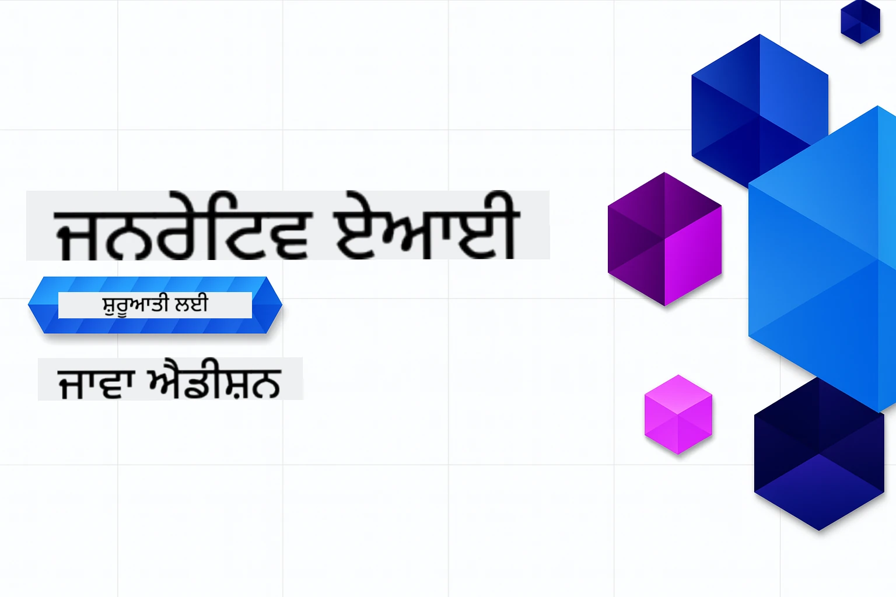

# Generative AI for Beginners - ਜਾਵਾ ਸੰਪਾਦਨ
[](https://discord.gg/nTYy5BXMWG)



**ਸਮਾਂ ਦਾਖਲਾ**: ਪੂਰਾ ਵਰਕਸ਼ਾਪ ਹੋਸਟਿੰਗ ਬਿਨਾਂ ਸਥਾਨਕ ਸੈੱਟਅਪ ਦੇ ਆਨਲਾਈਨ ਪੂਰਾ ਕੀਤਾ ਜਾ ਸਕਦਾ ਹੈ। ਵਾਤਾਵਰਨ ਸੈੱਟਅਪ ਲਈ 2 ਮਿੰਟ ਲੱਗਦੇ ਹਨ, ਨਾਲੇ ਨਮੂਨਿਆਂ ਦੀ ਖੋਜ ਕਰਨਾ 1-3 ਘੰਟੇ ਲਗ ਸਕਦੇ ਹਨ ਖੋਜ ਦੀ ਗਹਿਰਾਈ 'ਤੇ ਨਿਰਭਰ ਕਰਦਾ ਹੈ।

> **ਤੇਜ਼ ਸ਼ੁਰੂਆਤ**

1. ਇਸ ਰਿਪੋਜ਼ਿਟਰੀ ਨੂੰ ਆਪਣੇ GitHub ਖਾਤੇ ਵਿੱਚ ਫੋਰਕ ਕਰੋ
2. **Code** → **Codespaces** ਟੈੱਬ → **...** → **New with options...** 'ਤੇ ਕਲਿਕ ਕਰੋ
3. ਡੀਫਾਲਟ ਵਰਤੋਂ – ਇਹ ਇਸ ਕੋਰਸ ਲਈ ਬਣਾਏ ਡਿਵੈਲਪਮੈਂਟ ਕੰਟੇਨਰ ਨੂੰ ਚੁਣੇਗਾ
4. **Create codespace** 'ਤੇ ਕਲਿਕ ਕਰੋ
5. ਵਾਤਾਵਰਨ ਤਿਆਰ ਹੋਣ ਲਈ ~2 ਮਿੰਟ ਦੀ ਉਡੀਕ ਕਰੋ
6. ਸਿੱਧਾ [ਪਹਿਲਾ ਉਦਾਹਰਣ](./02-SetupDevEnvironment/README.md#step-2-create-a-github-personal-access-token) 'ਤੇ ਜਾਓ

## ਬਹੁਭਾਸ਼ਾਈ ਸਹਾਇਤਾ

### GitHub ਐਕਸ਼ਨ ਦੁਆਰਾ ਸਮਰਥਿਤ (ਆਟੋਮੈਟਿਕ ਅਤੇ ਹਮੇਸ਼ਾ ਅਪ-ਟੂ-ਡੇਟ)

<!-- CO-OP TRANSLATOR LANGUAGES TABLE START -->
[Arabic](../ar/README.md) | [Bengali](../bn/README.md) | [Bulgarian](../bg/README.md) | [Burmese (Myanmar)](../my/README.md) | [Chinese (Simplified)](../zh-CN/README.md) | [Chinese (Traditional, Hong Kong)](../zh-HK/README.md) | [Chinese (Traditional, Macau)](../zh-MO/README.md) | [Chinese (Traditional, Taiwan)](../zh-TW/README.md) | [Croatian](../hr/README.md) | [Czech](../cs/README.md) | [Danish](../da/README.md) | [Dutch](../nl/README.md) | [Estonian](../et/README.md) | [Finnish](../fi/README.md) | [French](../fr/README.md) | [German](../de/README.md) | [Greek](../el/README.md) | [Hebrew](../he/README.md) | [Hindi](../hi/README.md) | [Hungarian](../hu/README.md) | [Indonesian](../id/README.md) | [Italian](../it/README.md) | [Japanese](../ja/README.md) | [Kannada](../kn/README.md) | [Khmer](../km/README.md) | [Korean](../ko/README.md) | [Lithuanian](../lt/README.md) | [Malay](../ms/README.md) | [Malayalam](../ml/README.md) | [Marathi](../mr/README.md) | [Nepali](../ne/README.md) | [Nigerian Pidgin](../pcm/README.md) | [Norwegian](../no/README.md) | [Persian (Farsi)](../fa/README.md) | [Polish](../pl/README.md) | [Portuguese (Brazil)](../pt-BR/README.md) | [Portuguese (Portugal)](../pt-PT/README.md) | [Punjabi (Gurmukhi)](./README.md) | [Romanian](../ro/README.md) | [Russian](../ru/README.md) | [Serbian (Cyrillic)](../sr/README.md) | [Slovak](../sk/README.md) | [Slovenian](../sl/README.md) | [Spanish](../es/README.md) | [Swahili](../sw/README.md) | [Swedish](../sv/README.md) | [Tagalog (Filipino)](../tl/README.md) | [Tamil](../ta/README.md) | [Telugu](../te/README.md) | [Thai](../th/README.md) | [Turkish](../tr/README.md) | [Ukrainian](../uk/README.md) | [Urdu](../ur/README.md) | [Vietnamese](../vi/README.md)

> **ਸਥਾਨਕ ਕਲੋਨਿੰਗ ਪਸੰਦ ਕਰਦੇ ਹੋ?**
>
> ਇਸ ਰਿਪੋਜ਼ਿਟਰੀ ਵਿੱਚ 50+ ਭਾਸ਼ਾ ਅਨੁਵਾਦ ਸ਼ਾਮਲ ਹਨ ਜੋ ਡਾਊਨਲੋਡ ਆਕਾਰ ਨੂੰ ਕਾਫੀ ਵਧਾਉਂਦੇ ਹਨ। ਬਿਨਾਂ ਅਨੁਵਾਦਾਂ ਦੇ ਕਲੋਨ ਕਰਨ ਲਈ sparse checkout ਵਰਤੋਂ:
>
> **Bash / macOS / Linux:**
> ```bash
> git clone --filter=blob:none --sparse https://github.com/microsoft/Generative-AI-for-beginners-java.git
> cd Generative-AI-for-beginners-java
> git sparse-checkout set --no-cone '/*' '!translations' '!translated_images'
> ```
>
> **CMD (Windows):**
> ```cmd
> git clone --filter=blob:none --sparse https://github.com/microsoft/Generative-AI-for-beginners-java.git
> cd Generative-AI-for-beginners-java
> git sparse-checkout set --no-cone "/*" "!translations" "!translated_images"
> ```
>
> ਤੁਹਾਨੂੰ ਕੋਰਸ ਪੂਰਾ ਕਰਨ ਲਈ ਸਭ ਕੁਝ ਜਲਦੀ ਡਾਊਨਲੋਡ ਮਿਲ ਜਾਵੇਗਾ।
<!-- CO-OP TRANSLATOR LANGUAGES TABLE END -->

## ਕੋਰਸ ਦੀ ਰਚਨਾ ਅਤੇ ਸਿੱਖਣ ਦਾ ਰਸਤਾ

### **ਅਧਿਆਇ 1: ਜਨਰੇਟਿਵ AI ਦਾ ਪਰਚਆ**
- **ਮੁੱਖ ਧਾਰਣਾਵਾਂ**: ਵੱਡੇ ਭਾਸ਼ਾਈ ਮਾਡਲ, ਟੋਕਨ, ਇੰਬੈੱਡਿੰਗਜ਼ ਅਤੇ AI ਸਮਰੱਥਾਵਾਂ ਨੂੰ ਸਮਝਣਾ
- **ਜਾਵਾ AI ਪਰਿਸਰ**: ਸਪ੍ਰਿੰਗ AI ਅਤੇ OpenAI SDKs ਦਾ ਜਾਇਜ਼ਾ
- **ਮਾਡਲ ਸੰਦਰਭ ਪ੍ਰੋਟੋਕੋਲ**: MCP ਦਾ ਪਰਚਆ ਅਤੇ AI ਏਜੰਟ ਸੰਚਾਰ ਵਿੱਚ ਇਸ ਦੀ ਭੂਮਿਕਾ
- **ਵਿਹਲਤਮਕ ਅਪਲਿਕੇਸ਼ਨਸ**: ਚੈਟਬੋਟ ਅਤੇ ਸਮੱਗਰੀ ਉਤਪਾਦਨ ਸਮੇਤ ਹਕੀਕਤੀ ਦ੍ਰਿਸ਼
- **[→ ਅਧਿਆਇ 1 ਸ਼ੁਰੂ ਕਰੋ](./01-IntroToGenAI/README.md)**

### **ਅਧਿਆਇ 2: ਵਿਕਾਸੀ ਵਾਤਾਵਰਨ ਸੈੱਟਅਪ**
- **ਬਹੁ-ਪ੍ਰਦਾਤਾ ਸੰਰਚਨਾ**: GitHub ਮਾਡਲ, Azure OpenAI, ਅਤੇ OpenAI ਜਾਵਾ SDK ਇੰਟਿਗ੍ਰੇਸ਼ਨ ਸੈੱਟਅਪ
- **ਸਪ੍ਰਿੰਗ ਬੂਟ + ਸਪ੍ਰਿੰਗ AI**: ਕਾਰੋਬਾਰੀ AI ਐਪਲੀਕੇਸ਼ਨ ਵਿਕਾਸ ਲਈ ਸੇਰਵੋਚਿਤ ਅਚਰਣ
- **GitHub ਮਾਡਲ**: ਪ੍ਰੋਟੋਟਾਇਪਿੰਗ ਅਤੇ ਸਿੱਖਣ ਲਈ ਮੁਫ਼ਤ AI ਮਾਡਲ ਐਕਸੈੱਸ (ਕੋਈ ਕਰੈਡਿਟ ਕਾਰਡ ਨਹੀ)
- **ਵਿਕਾਸ ਸੰਦ**: ਡੋੱਕਰ ਕੰਟੇਨਰ, VS ਕੋਡ, ਅਤੇ GitHub Codespaces ਸੰਰਚਨਾ
- **[→ ਅਧਿਆਇ 2 ਸ਼ੁਰੂ ਕਰੋ](./02-SetupDevEnvironment/README.md)**

### **ਅਧਿਆਇ 3: ਮੁੱਖ ਜਨਰੇਟਿਵ AI ਤਕਨੀਕਾਂ**
- **ਪ੍ਰਾਂਪਟ ਇੰਜੀਨੀਅਰਿੰਗ**: ਵਧੀਆ AI ਮਾਡਲ ਜਵਾਬ ਲਈ ਤਕਨਿਕਾਂ
- **ਇੰਬੈੱਡਿੰਗਜ਼ ਅਤੇ ਵੈਕਟਰ ਚਾਲੂਆਏਸ਼ਨ**: ਸੈਂਮਾਂਟਿਕ ਖੋਜ ਅਤੇ ਸਮਾਨਤਾ ਮਿਲਾਪ ਅਮਲ ਕਰਨਾ
- **ਰਿਟਰੀਵਲ-ਵਧਾਈ ਗਨਰੇਸ਼ਨ (RAG)**: AI ਨੂੰ ਆਪਣੇ ਡੇਟਾ ਸਰੋਤਾਂ ਨਾਲ ਜੋੜਨਾ
- **ਫੰਕਸ਼ਨ ਕਾਲਿੰਗ**: ਕਸਟਮ ਟੂਲ ਅਤੇ ਪਲੱਗਇਨ ਨਾਲ AI ਸਮਰੱਥਾਵਾਂ ਵਧਾਉਣਾ
- **[→ ਅਧਿਆਇ 3 ਸ਼ੁਰੂ ਕਰੋ](./03-CoreGenerativeAITechniques/README.md)**

### **ਅਧਿਆਇ 4: ਵਿਹਲਤਮਕ ਐਪਲੀਕੇਸ਼ਨ ਅਤੇ ਪ੍ਰੋਜੈਕਟਸ**
- **ਪੈਟ ਸਟੋਰੀ ਜెనਰੇਟਰ** (`petstory/`): GitHub ਮਾਡਲ ਨਾਲ ਕ੍ਰੀਏਟਿਵ ਸਮੱਗਰੀ ਉਤਪਾਦਨ
- **ਫਾਊਂਡਰੀ ਲੋਕਲ ਡੈਮੋ** (`foundrylocal/`): OpenAI ਜਾਵਾ SDK ਨਾਲ ਸਥਾਨਕ AI ਮਾਡਲ ਇੰਟਿਗ੍ਰੇਸ਼ਨ
- **MCP ਕੈਲਕੂਲੇਟਰ ਸੇਵਾ** (`calculator/`): ਸਪ੍ਰਿੰਗ AI ਨਾਲ ਬੇਸਿਕ ਮਾਡਲ ਸੰਦਰਭ ਪ੍ਰੋਟੋਕੋਲ ਅਮਲ
- **[→ ਅਧਿਆਇ 4 ਸ਼ੁਰੂ ਕਰੋ](./04-PracticalSamples/README.md)**

### **ਅਧਿਆਇ 5: ਜ਼ਿੰਮੇਵਾਰ AI ਵਿਕਾਸ**
- **GitHub ਮਾਡਲ ਸੁਰੱਖਿਆ**: ਬਣੇ ਹੋਏ ਸਮੱਗਰੀ ਫਿਲਟਰਿੰਗ ਅਤੇ ਸੁਰੱਖਿਆ ਤੰਤਰਾਂ ਦੀ ਜਾਂਚ (ਕਠੋਰ ਰੋਕ ਅਤੇ ਮ੍ਰਦੁ ਇਨਕਾਰ)
- **ਜ਼ਿੰਮੇਵਾਰ AI ਡੈਮੋ**: ਹੱਥੋਂ-ਹੱਥ ਉਦਾਹਰਣ ਜੋ ਕਿ ਅਧੁਨਿਕ AI ਸੁਰੱਖਿਆ ਪ੍ਰਣਾਲੀਆਂ ਨੂੰ ਦਰਸਾਉਂਦਾ ਹੈ
- **ਸਰਵੋਚਿਤ ਪ੍ਰਥਾਵਾਂ**: ਨੈਤਿਕ AI ਵਿਕਾਸ ਅਤੇ ਤਾਇਨਾਤੀ ਲਈ ਜਰੂਰੀ ਦਿਸ਼ਾ-ਨਿਰਦੇਸ਼
- **[→ ਅਧਿਆਇ 5 ਸ਼ੁਰੂ ਕਰੋ](./05-ResponsibleGenAI/README.md)**

## ਹੋਰ ਸਰੋਤ

<!-- CO-OP TRANSLATOR OTHER COURSES START -->
### LangChain
[](https://aka.ms/langchain4j-for-beginners)
[](https://aka.ms/langchainjs-for-beginners?WT.mc_id=m365-94501-dwahlin)
[](https://github.com/microsoft/langchain-for-beginners?WT.mc_id=m365-94501-dwahlin)
---

### Azure / Edge / MCP / ਏਜੰਟ
[](https://github.com/microsoft/AZD-for-beginners?WT.mc_id=academic-105485-koreyst)
[](https://github.com/microsoft/edgeai-for-beginners?WT.mc_id=academic-105485-koreyst)
[](https://github.com/microsoft/mcp-for-beginners?WT.mc_id=academic-105485-koreyst)
[](https://github.com/microsoft/ai-agents-for-beginners?WT.mc_id=academic-105485-koreyst)

---

### ਜਨਰੇਟਿਵ AI ਸੀਰੀਜ਼
[](https://github.com/microsoft/generative-ai-for-beginners?WT.mc_id=academic-105485-koreyst)
[-9333EA?style=for-the-badge&labelColor=E5E7EB&color=9333EA)](https://github.com/microsoft/Generative-AI-for-beginners-dotnet?WT.mc_id=academic-105485-koreyst)
[-C084FC?style=for-the-badge&labelColor=E5E7EB&color=C084FC)](https://github.com/microsoft/generative-ai-for-beginners-java?WT.mc_id=academic-105485-koreyst)
[-E879F9?style=for-the-badge&labelColor=E5E7EB&color=E879F9)](https://github.com/microsoft/generative-ai-with-javascript?WT.mc_id=academic-105485-koreyst)

---

### ਮੁੱਖ ਸਿੱਖਣ
[](https://aka.ms/ml-beginners?WT.mc_id=academic-105485-koreyst)
[](https://aka.ms/datascience-beginners?WT.mc_id=academic-105485-koreyst)
[](https://aka.ms/ai-beginners?WT.mc_id=academic-105485-koreyst)
[](https://github.com/microsoft/Security-101?WT.mc_id=academic-96948-sayoung)

[](https://aka.ms/webdev-beginners?WT.mc_id=academic-105485-koreyst)
[](https://aka.ms/iot-beginners?WT.mc_id=academic-105485-koreyst)
[](https://github.com/microsoft/xr-development-for-beginners?WT.mc_id=academic-105485-koreyst)

---

### ਕੋਪਾਇਲਟ ਸੀਰੀਜ਼  
[](https://aka.ms/GitHubCopilotAI?WT.mc_id=academic-105485-koreyst)  
[](https://github.com/microsoft/mastering-github-copilot-for-dotnet-csharp-developers?WT.mc_id=academic-105485-koreyst)  
[](https://github.com/microsoft/CopilotAdventures?WT.mc_id=academic-105485-koreyst)  
<!-- CO-OP TRANSLATOR OTHER COURSES END -->

## ਮਦਦ ਪ੍ਰਾਪਤ ਕਰਨਾ

ਜੇ ਤੁਸੀਂ ਫਸ ਜਾਂਦੇ ਹੋ ਜਾਂ AI ਐਪਸ ਬਣਾਉਣ ਬਾਰੇ ਕੋਈ ਪ੍ਰਸ਼ਨ ਹੈ। ਸਾਥੀ ਸਿੱਖਿਅਰਥੀਆਂ ਅਤੇ ਅਨੁਭਵੀ ਡਿਵੈਲਪਰਾਂ ਨਾਲ MCP ਬਾਰੇ ਗੱਲ-ਬਾਤ ਵਿੱਚ ਸ਼ਾਮਲ ਹੋਵੋ। ਇਹੇ ਇੱਕ ਸਹਾਇਕ ਸਮੁਦਾਇ ਹੈ ਜਿੱਥੇ ਪ੍ਰਸ਼ਨਾਂ ਦਾ ਸਵਾਗਤ ਹੈ ਅਤੇ ਗਿਆਨ ਮੁਫ਼ਤ ਸਾਂਝਾ ਕੀਤਾ ਜਾਂਦਾ ਹੈ।

[](https://discord.gg/nTYy5BXMWG)

ਜੇ ਤੁਹਾਡੇ ਕੋਲ ਉਤਪਾਦ ਫੀਡਬੈਕ ਜਾਂ ਤਿਆਰ ਕਰਦਿਆਂ ਕੋਈ ਗਲਤੀਆਂ ਹਨ ਤਾਂ ਜਾਓ:

[](https://aka.ms/foundry/forum)

---

<!-- CO-OP TRANSLATOR DISCLAIMER START -->
**ਇਨਕਾਰਨਾਮਾ**:  
ਇਸ ਦਸਤਾਵੇਜ਼ ਦਾ ਅਨੁਵਾਦ AI ਅਨੁਵਾਦ ਸੇਵਾ [Co-op Translator](https://github.com/Azure/co-op-translator) ਦੀ ਵਰਤੋਂ ਕਰਕੇ ਕੀਤਾ ਗਿਆ ਹੈ। ਜਦੋਂ ਕਿ ਅਸੀਂ ਸਹੀਤਾ ਲਈ ਕੋਸ਼ਿਸ਼ ਕਰਦੇ ਹਾਂ, ਕਿਰਪਾ ਕਰਕੇ ਧਿਆਨ ਵਿੱਚ ਰੱਖੋ ਕਿ ਸਵੈਚਾਲਿਤ ਅਨੁਵਾਦਾਂ ਵਿੱਚ ਗਲਤੀਆਂ ਜਾਂ ਅਸੁਚਿਤਾਵਾਂ ਹੋ ਸਕਦੀਆਂ ਹਨ। ਮੂਲ ਦਸਤਾਵੇਜ਼ ਆਪਣੀ ਮੂਲ ਭਾਸ਼ਾ ਵਿੱਚ ਹੀ ਅਧਿਕਾਰਕ ਸਰੋਤ ਮੰਨਿਆ ਜਾਣਾ ਚਾਹੀਦਾ ਹੈ। ਮਹੱਤਵਪੂਰਨ ਜਾਣਕਾਰੀ ਲਈ, ਪ੍ਰੋਫੈਸ਼ਨਲ ਮਨੁੱਖੀ ਅਨੁਵਾਦ ਦੀ ਸਿਫ਼ਾਰਸ਼ ਕੀਤੀ ਜਾਂਦੀ ਹੈ। ਅਸੀਂ ਇਸ ਅਨੁਵਾਦ ਦੇ ਇਸਤੇਮਾਲ ਤੋਂ ਉੱਪਜੀ ਕਿਸੇ ਵੀ ਗਲਤਫਹਿਮੀ ਜਾਂ ਗਲਤ ਅਰਥ ਲਾਉਣ ਲਈ ਜ਼ਿੰਮੇਵਾਰ ਨਹੀਂ ਹਾਂ।
<!-- CO-OP TRANSLATOR DISCLAIMER END -->