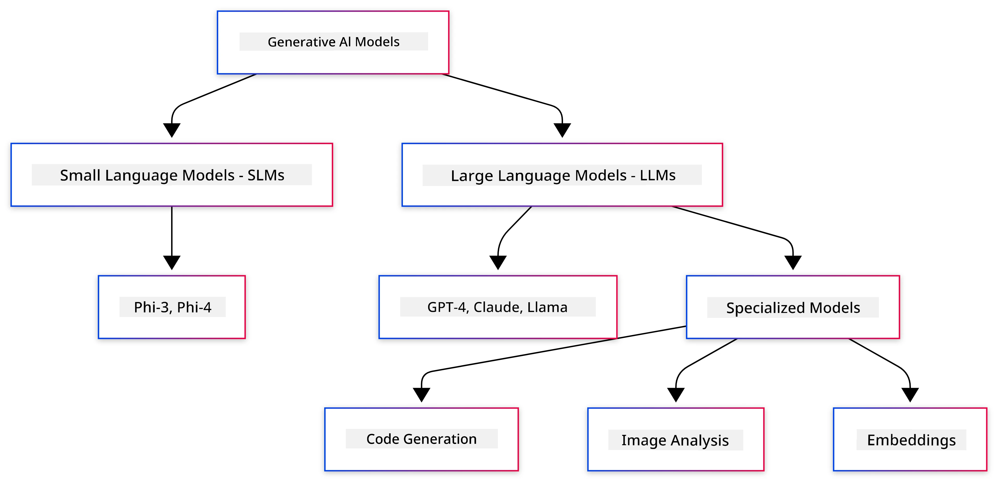
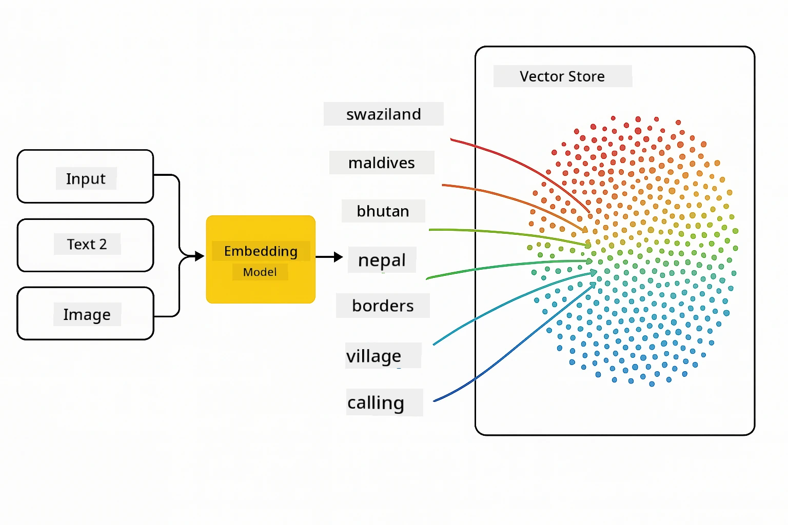
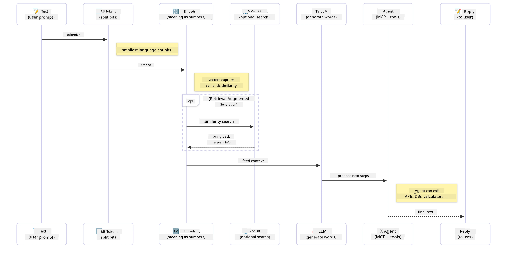

# Introduction to Generative AI - Java Edition

## Wetin You Go Learn

- **Generative AI basics** like LLMs, prompt engineering, tokens, embeddings, and vector databases
- **Compare Java AI development tools** like Azure OpenAI SDK, Spring AI, and OpenAI Java SDK
- **Learn about Model Context Protocol** and how e dey help AI agents communicate

## Table of Contents

- [Introduction](../../../01-IntroToGenAI)
- [Quick refresh on Generative AI concepts](../../../01-IntroToGenAI)
- [Prompt engineering review](../../../01-IntroToGenAI)
- [Tokens, embeddings, and agents](../../../01-IntroToGenAI)
- [AI Development Tools and Libraries for Java](../../../01-IntroToGenAI)
  - [OpenAI Java SDK](../../../01-IntroToGenAI)
  - [Spring AI](../../../01-IntroToGenAI)
  - [Azure OpenAI Java SDK](../../../01-IntroToGenAI)
- [Summary](../../../01-IntroToGenAI)
- [Next Steps](../../../01-IntroToGenAI)

## Introduction

Welcome to di first chapter of Generative AI for Beginners - Java Edition! Dis lesson go show you di main ideas for generative AI and how you fit use am with Java. You go sabi di key things wey dey make AI apps work, like Large Language Models (LLMs), tokens, embeddings, and AI agents. We go also look di main Java tools wey you go use for dis course.

### Quick refresh on Generative AI concepts

Generative AI na one kind artificial intelligence wey dey create new things, like text, images, or code, based on di patterns and relationships wey e learn from data. Generative AI models fit generate human-like responses, sabi context, and sometimes even create things wey be like say na human do am.

As you dey build your Java AI apps, you go dey use **generative AI models** to create content. Some things wey generative AI models fit do na:

- **Text Generation**: Write human-like text for chatbots, content, and text completion.
- **Image Generation and Analysis**: Create realistic images, improve photos, and find objects.
- **Code Generation**: Write code snippets or scripts.

Different models dey for different tasks. For example, **Small Language Models (SLMs)** and **Large Language Models (LLMs)** fit handle text generation, but LLMs dey perform better for complex tasks. For image tasks, you go use special vision models or multi-modal models.

But no be every time di models dey give correct answers. You don hear say models dey "hallucinate" or talk wrong things like say na true. You fit help di model give better answers by giving am clear instructions and context. Dis na where **prompt engineering** dey important.

#### Prompt engineering review

Prompt engineering na di way wey people dey design better inputs to make AI models give di kind answer wey dem want. E involve:

- **Clarity**: Make instructions clear and easy to understand.
- **Context**: Give di background information wey di model need.
- **Constraints**: Tell di model any limits or format wey you want.

Some good ways to do prompt engineering na prompt design, clear instructions, task breakdown, one-shot and few-shot learning, and prompt tuning. You go need test different prompts to see which one go work well for your app.

When you dey build apps, you go use different prompt types:
- **System prompts**: Set di base rules and context for di model behavior
- **User prompts**: Di input wey your app users dey give
- **Assistant prompts**: Di model response based on system and user prompts

> **Learn more**: Learn more about prompt engineering for [Prompt Engineering chapter of GenAI for Beginners course](https://github.com/microsoft/generative-ai-for-beginners/tree/main/04-prompt-engineering-fundamentals)

#### Tokens, embeddings, and agents

When you dey work with generative AI models, you go hear words like **tokens**, **embeddings**, **agents**, and **Model Context Protocol (MCP)**. Make we explain wetin dem mean:

- **Tokens**: Tokens na di smallest part of text wey di model dey understand. E fit be words, characters, or subwords. Tokens dey represent text data in way wey di model fit understand. For example, di sentence "The quick brown fox jumped over the lazy dog" fit turn to ["The", " quick", " brown", " fox", " jumped", " over", " the", " lazy", " dog"] or ["The", " qu", "ick", " br", "own", " fox", " jump", "ed", " over", " the", " la", "zy", " dog"] based on di tokenization method.

Tokenization na di process of breaking text into dis small parts. E dey important because models dey work with tokens, no be raw text. Di number of tokens for prompt fit affect di model response length and quality, as models get token limits for di context window (e.g., 128K tokens for GPT-4o total context, including input and output).

  For Java, you fit use libraries like OpenAI SDK to handle tokenization automatically when you dey send requests to AI models.

- **Embeddings**: Embeddings na vector representations of tokens wey dey show di meaning. Dem be numbers (usually arrays of floating-point numbers) wey help di model understand di relationship between words and give answers wey make sense. Words wey mean di same thing go get similar embeddings, so di model fit understand things like synonyms and relationships.

  For Java, you fit create embeddings with OpenAI SDK or other libraries wey support embedding generation. Embeddings dey important for things like semantic search, where you dey find similar content based on meaning, no be exact text match.

- **Vector databases**: Vector databases na special storage systems wey dey work well with embeddings. Dem dey help find similar things fast and dey important for Retrieval-Augmented Generation (RAG) patterns where you dey look for relevant information from big datasets based on meaning, no be exact match.

> **Note**: For dis course, we no go cover Vector databases but e dey important because people dey use am for real-world apps.

- **Agents & MCP**: AI parts wey dey work on their own to interact with models, tools, and external systems. Di Model Context Protocol (MCP) dey provide standard way for agents to access external data sources and tools securely. Learn more for [MCP for Beginners](https://github.com/microsoft/mcp-for-beginners) course.

For Java AI apps, you go use tokens for text processing, embeddings for semantic search and RAG, vector databases for data retrieval, and agents with MCP to build smart systems wey fit use tools.

### AI Development Tools and Libraries for Java

Java get better tools for AI development. Three main libraries dey wey we go look for dis course - OpenAI Java SDK, Azure OpenAI SDK, and Spring AI.

Dis table show di SDK wey dey used for each chapter example:

| Chapter | Sample | SDK |
|---------|--------|-----|
| 02-SetupDevEnvironment | github-models | OpenAI Java SDK |
| 02-SetupDevEnvironment | basic-chat-azure | Spring AI Azure OpenAI |
| 03-CoreGenerativeAITechniques | examples | Azure OpenAI SDK |
| 04-PracticalSamples | petstory | OpenAI Java SDK |
| 04-PracticalSamples | foundrylocal | OpenAI Java SDK |
| 04-PracticalSamples | calculator | Spring AI MCP SDK + LangChain4j |

**SDK Documentation Links:**
- [Azure OpenAI Java SDK](https://github.com/Azure/azure-sdk-for-java/tree/azure-ai-openai_1.0.0-beta.16/sdk/openai/azure-ai-openai)
- [Spring AI](https://docs.spring.io/spring-ai/reference/)
- [OpenAI Java SDK](https://github.com/openai/openai-java)
- [LangChain4j](https://docs.langchain4j.dev/)

#### OpenAI Java SDK

Di OpenAI SDK na di official Java library for OpenAI API. E dey provide simple and consistent way to interact with OpenAI models, so e easy to add AI features to Java apps. Chapter 2 GitHub Models example, Chapter 4 Pet Story app and Foundry Local example go show how OpenAI SDK dey work.

#### Spring AI

Spring AI na one framework wey dey bring AI features to Spring apps, and e dey provide consistent way to use different AI providers. E dey work well with di Spring ecosystem, so e dey good for enterprise Java apps wey need AI features.

Spring AI dey shine because e dey work well with di Spring ecosystem, so e easy to build production-ready AI apps with Spring patterns like dependency injection, configuration management, and testing frameworks. You go use Spring AI for Chapter 2 and 4 to build apps wey dey use OpenAI and Model Context Protocol (MCP) Spring AI libraries.

##### Model Context Protocol (MCP)

Di [Model Context Protocol (MCP)](https://modelcontextprotocol.io/) na new standard wey dey help AI apps interact securely with external data sources and tools. MCP dey provide standard way for AI models to access context information and do actions for your apps.

For Chapter 4, you go build one simple MCP calculator service wey go show di basics of Model Context Protocol with Spring AI, and how to create basic tool integrations and service architectures.

#### Azure OpenAI Java SDK

Di Azure OpenAI client library for Java na di version of OpenAI REST APIs wey dey work well with di Azure SDK ecosystem. For Chapter 3, you go build apps with Azure OpenAI SDK, like chat apps, function calling, and RAG (Retrieval-Augmented Generation) patterns.

> Note: Azure OpenAI SDK no get all di features wey OpenAI Java SDK get, so for future projects, e better make you use OpenAI Java SDK.

## Summary

Dis na di foundation! You don learn:

- Di main ideas behind generative AI - from LLMs and prompt engineering to tokens, embeddings, and vector databases
- Di tools wey you fit use for Java AI development: Azure OpenAI SDK, Spring AI, and OpenAI Java SDK
- Wetin Model Context Protocol be and how e dey help AI agents work with external tools

## Next Steps

[Chapter 2: Setting Up the Development Environment](../02-SetupDevEnvironment/README.md)

---

<!-- CO-OP TRANSLATOR DISCLAIMER START -->
**Disclaimer**:  
Dis dokyument don use AI translation service [Co-op Translator](https://github.com/Azure/co-op-translator) do di translation. Even as we dey try make am correct, abeg sabi say automated translations fit get mistake or no dey accurate well. Di original dokyument for im native language na di main source wey you go fit trust. For important information, e good make professional human translation dey use. We no go fit take blame for any misunderstanding or wrong interpretation wey fit happen because you use dis translation.
<!-- CO-OP TRANSLATOR DISCLAIMER END -->