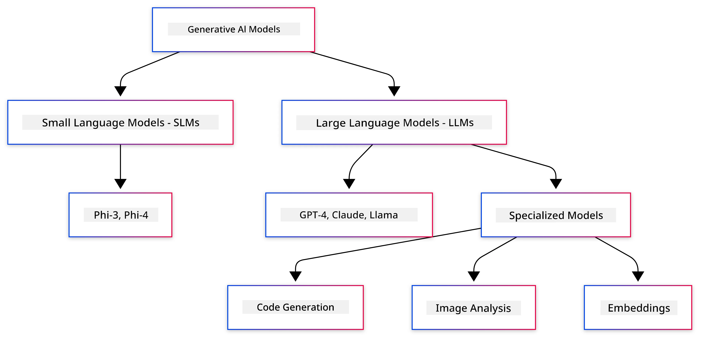
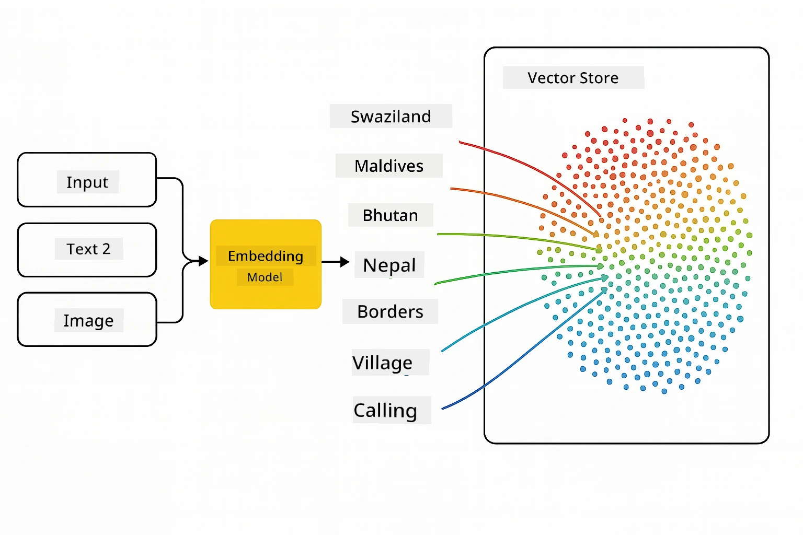
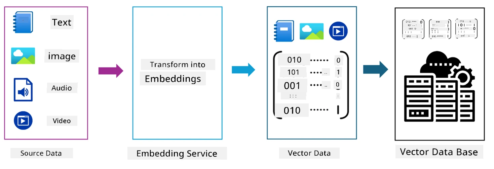
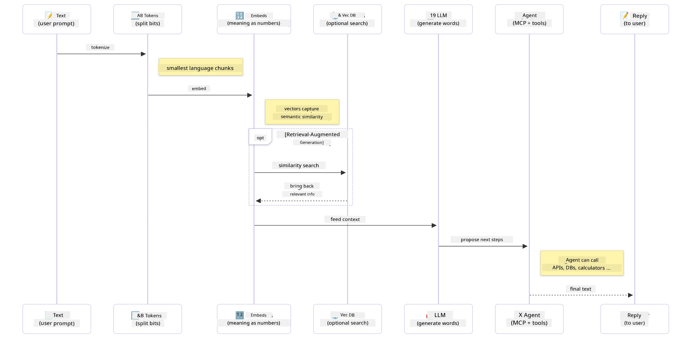

# Introduction to Generative AI - Java Edition

> **Video**: [Watch di video overview for dis lesson for YouTube.](https://www.youtube.com/watch?v=XH46tGp_eSw) You fit also click di thumbnail image wey dey above.

## Wetin You Go Learn

- **Generative AI fundamentals** like LLMs, prompt engineering, tokens, embeddings, and vector databases
- **Compare Java AI development tools** like Azure OpenAI SDK, Spring AI, and OpenAI Java SDK
- **Discover di Model Context Protocol** and how e dey work for AI agent communication

## Table of Contents

- [Introduction](#introduction)
- [A quick refresh on Generative AI concepts](#a-quick-refresh-on-generative-ai-concepts)
- [Prompt engineering review](#prompt-engineering-review)
- [Tokens, embeddings, and agents](#tokens-embeddings-and-agents)
- [AI Development Tools and Libraries for Java](#ai-development-tools-and-libraries-for-java)
  - [OpenAI Java SDK](#openai-java-sdk)
  - [Spring AI](#spring-ai)
  - [Azure OpenAI Java SDK](#azure-openai-java-sdk)
- [Summary](#summary)
- [Next Steps](#next-steps)

## Introduction

Welcome to di first chapter of Generative AI for Beginners - Java Edition! Dis foundational lesson go show you di core concepts of generative AI and how to handle dem using Java. You go learn about di basic building blocks of AI applications, including Large Language Models (LLMs), tokens, embeddings, and AI agents. We go also explore di main Java tools wey you go use through dis course.

### A quick refresh on Generative AI concepts

Generative AI na type artificial intelligence wey dey create new content, like text, images, or code, based on patterns and relationships wey e don learn from data. Generative AI models fit generate human-like responses, understand context, and sometin time even create content wey dey look like human.

As you dey develop your Java AI applications, you go dey use **generative AI models** to create content. Some capabilities of generative AI models na:

- **Text Generation**: Make human-like text for chatbots, content, and text completion.
- **Image Generation and Analysis**: Produce realistic images, improve photos, and find objects.
- **Code Generation**: Write code snippets or scripts.

Some special types of models dey wey dem optimize for different tasks. For example, both **Small Language Models (SLMs)** and **Large Language Models (LLMs)** fit handle text generation, with LLMs usually get better performance for complex tasks. For image-related tasks, you go use special vision models or multi-modal models.

Of course, di responses from dis models no dey perfect all di time. You don maybe hear about models wey dey "hallucinate" or dey generate wrong information wey sound serious. But you fit help guide di model to generate better responses by giving dem clear instructions and context. Na here **prompt engineering** dey important.

#### Prompt engineering review

Prompt engineering na di work of designing correct inputs to guide AI models make dem output wetin you want. E involve:

- **Clarity**: Make instructions clear and no dey confuse.
- **Context**: Give all di necessary background information.
- **Constraints**: Talk any rules or formats wey you want make e follow.

Some better ways for prompt engineering na prompt design, clear instructions, task breakdown, one-shot and few-shot learning, and prompt tuning. You need test different prompts to find wetin work best for your specific case.

When you dey develop applications, you go work with different prompt types:
- **System prompts**: Dem dey set base rules and context for how di model go act
- **User prompts**: Na di input data wey fans of your app dey give
- **Assistant prompts**: Na di model responses based on system and user prompts

> **Learn more**: Learn more about prompt engineering for [Prompt Engineering chapter of GenAI for Beginners course](https://github.com/microsoft/generative-ai-for-beginners/tree/main/04-prompt-engineering-fundamentals)

#### Tokens, embeddings, and agents

When you dey work with generative AI models, you go hear words like **tokens**, **embeddings**, **agents**, and **Model Context Protocol (MCP)**. Here na better explanation of these concepts:

- **Tokens**: Tokens na di smallest part of text for model. E fit be words, characters, or subwords. Tokens dey represent text data in way wey model fit understand. Example, di sentence "The quick brown fox jumped over the lazy dog" fit tokenize as ["The", " quick", " brown", " fox", " jumped", " over", " the", " lazy", " dog"] or ["The", " qu", "ick", " br", "own", " fox", " jump", "ed", " over", " the", " la", "zy", " dog"] depending on how tokenization take work.

Tokenization na di process wey break text into these small pieces. E important because models dey work with tokens not raw text. Number of tokens for prompt fit affect how long and how good di model response go be, because models get token limit for their context window (example, 128K tokens for GPT-4o total context, wey include input and output).

  For Java, you fit use libraries like di OpenAI SDK to handle tokenization automatically when you dey send requests to AI models.

- **Embeddings**: Embeddings na vector way wey tokens take represent meaning. Dem be numbers (usually arrays of floating-point numbers) wey help model understand relationship between words and generate context-based answers. Similar words get similar embeddings, so model fit sabi concepts like synonyms and meaning connections.

  For Java, you fit create embeddings using di OpenAI SDK or other libraries wey fit generate embeddings. Dis embeddings dey very important for tasks like semantic search, where you want to find similar content based on meaning no just exact text.

- **Vector databases**: Vector databases na special storage systems wey optimize for embeddings. Dem dey allow efficient similarity search and na key for Retrieval-Augmented Generation (RAG) patterns where you must find relevant info from big data based semantic similarity no just exact matching.

> **Note**: For this course, we no go focus on Vector databases but we wan mention dem because people dey use am well for real-world apps.

- **Agents & MCP**: AI parts wey dey work by themselves dey interact with models, tools, and external systems. Model Context Protocol (MCP) na standardized way wey agents fit securely access external data sources and tools. Learn more for our [MCP for Beginners](https://github.com/microsoft/mcp-for-beginners) course.

For Java AI applications, you go use tokens for text work, embeddings for semantic search and RAG, vector databases for data retrieval, and agents with MCP to build smart, tool-using systems.

### AI Development Tools and Libraries for Java

Java get beta tools for AI development. We get three main libraries wey we go explore for dis course - OpenAI Java SDK, Azure OpenAI SDK, and Spring AI.

Dis na quick table to show which SDK dem dey use for each chapter example:

| Chapter | Sample | SDK |
|---------|--------|-----|
| 02-SetupDevEnvironment | github-models | OpenAI Java SDK |
| 02-SetupDevEnvironment | basic-chat-azure | Spring AI Azure OpenAI |
| 03-CoreGenerativeAITechniques | examples | Azure OpenAI SDK |
| 04-PracticalSamples | petstory | OpenAI Java SDK |
| 04-PracticalSamples | foundrylocal | OpenAI Java SDK |
| 04-PracticalSamples | calculator | Spring AI MCP SDK + LangChain4j |

**SDK Documentation Links:**
- [Azure OpenAI Java SDK](https://github.com/Azure/azure-sdk-for-java/tree/azure-ai-openai_1.0.0-beta.16/sdk/openai/azure-ai-openai)
- [Spring AI](https://docs.spring.io/spring-ai/reference/)
- [OpenAI Java SDK](https://github.com/openai/openai-java)
- [LangChain4j](https://docs.langchain4j.dev/)

#### OpenAI Java SDK

OpenAI SDK na official Java library for OpenAI API. E provide simple and steady interface to interact with OpenAI models, making am easy to add AI power inside Java apps. Chapter 2 GitHub Models example, Chapter 4 Pet Story app and Foundry Local example show how OpenAI SDK dey work.

#### Spring AI

Spring AI na wide framework wey bring AI power to Spring apps, e provide constant abstraction layer for different AI providers. E sabi join well with Spring ecosystem, making am correct choice for enterprise Java apps wey need AI power.

Spring AI strong because e fit join well with Spring ecosystem, making am easy to build production-ready AI apps with familiar Spring styles like dependency injection, config management, and testing frameworks. You go use Spring AI for Chapter 2 and 4 to build apps wey dey use both OpenAI and Model Context Protocol (MCP) Spring AI libraries.

##### Model Context Protocol (MCP)

Di [Model Context Protocol (MCP)](https://modelcontextprotocol.io/) na new standard wey allow AI apps to interact safely with outside data sources and tools. MCP dey provide one standard way for AI models to access context info and run actions inside your apps.

For Chapter 4, you go build simple MCP calculator service wey show di basics of Model Context Protocol with Spring AI, show how to make basic tool integrations and service designs.

#### Azure OpenAI Java SDK

Azure OpenAI client library for Java na adjustment of OpenAI REST APIs wey provide native interface and joins well with di rest of Azure SDK ecosystem. For Chapter 3, you go build apps using Azure OpenAI SDK, including chat apps, function calling, and RAG (Retrieval-Augmented Generation) patterns.

> Note: Azure OpenAI SDK dey later than OpenAI Java SDK for features, so for future projects, try use OpenAI Java SDK.

## Summary

Na so we finish di foundations! Now you sabi:

- Core concepts behind generative AI - from LLMs and prompt engineering to tokens, embeddings, and vector databases
- Your toolkit choices for Java AI development: Azure OpenAI SDK, Spring AI, and OpenAI Java SDK
- Wetin di Model Context Protocol be and how e make AI agents fit work with outside tools

## Next Steps

[Chapter 2: Setting Up the Development Environment](../02-SetupDevEnvironment/README.md)

---

<!-- CO-OP TRANSLATOR DISCLAIMER START -->
**Disclaimer**:  
Dis document don be translate wit AI translation service [Co-op Translator](https://github.com/Azure/co-op-translator). Even though we try make e correct well, abeg make una sabi say automated translation fit get mistake or no too correct. Di original document wey e be for e own language na di correct source. For important mata, e good make professional person wey sabi human translation do am. We no go take any blame if pesin no understand or misinterpret wetin dis translation talk.
<!-- CO-OP TRANSLATOR DISCLAIMER END -->