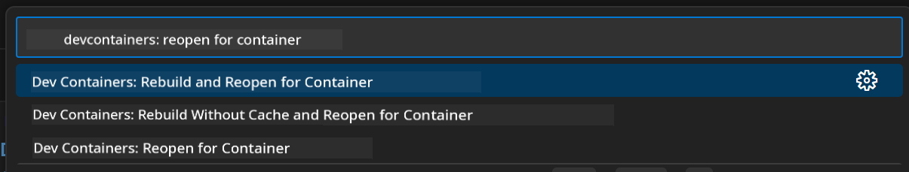

<!--
CO_OP_TRANSLATOR_METADATA:
{
  "original_hash": "4bdff5070d182c64143dfe5a581d0ec7",
  "translation_date": "2025-11-18T17:59:01+00:00",
  "source_file": "02-SetupDevEnvironment/README.md",
  "language_code": "pcm"
}
-->
# How to Set Up Development Environment for Generative AI for Java

> **Quick Start**: Code for cloud in 2 minutes - Go check [GitHub Codespaces Setup](../../../02-SetupDevEnvironment) - no need to install anything for your computer and e dey use github models!

> **You wan try Azure OpenAI?**, check our [Azure OpenAI Setup Guide](getting-started-azure-openai.md) wey get steps to create new Azure OpenAI resource.

## Wetin You Go Learn

- How to set up Java development environment for AI apps
- Choose and configure the development environment wey you like (cloud-first with Codespaces, local dev container, or full local setup)
- Test your setup by connecting to GitHub Models

## Table of Contents

- [Wetin You Go Learn](../../../02-SetupDevEnvironment)
- [Introduction](../../../02-SetupDevEnvironment)
- [Step 1: Set Up Your Development Environment](../../../02-SetupDevEnvironment)
  - [Option A: GitHub Codespaces (Recommended)](../../../02-SetupDevEnvironment)
  - [Option B: Local Dev Container](../../../02-SetupDevEnvironment)
  - [Option C: Use Your Existing Local Installation](../../../02-SetupDevEnvironment)
- [Step 2: Create GitHub Personal Access Token](../../../02-SetupDevEnvironment)
- [Step 3: Test Your Setup](../../../02-SetupDevEnvironment)
- [Troubleshooting](../../../02-SetupDevEnvironment)
- [Summary](../../../02-SetupDevEnvironment)
- [Next Steps](../../../02-SetupDevEnvironment)

## Introduction

This chapter go show you how to set up development environment. We go use **GitHub Models** as example because e dey free, easy to set up with just GitHub account, no need credit card, and e dey give access to plenty models wey you fit use test.

**No need local setup!** You fit start to code straight away with GitHub Codespaces wey dey give full development environment inside your browser.


We dey recommend [**GitHub Models**](https://github.com/marketplace?type=models) for this course because e:
- **Free** to start
- **Easy** to set up with just GitHub account
- **No credit card** needed
- **Plenty models** dey available for testing

> **Note**: The GitHub Models wey we dey use for this training get these free limits:
> - 15 requests per minute (150 per day)
> - ~8,000 words in, ~4,000 words out per request
> - 5 concurrent requests
> 
> For production use, upgrade to Azure AI Foundry Models with your Azure account. Your code no need change. Check the [Azure AI Foundry documentation](https://learn.microsoft.com/azure/ai-foundry/foundry-models/how-to/quickstart-github-models).


## Step 1: Set Up Your Development Environment

<a name="quick-start-cloud"></a>

We don create preconfigured development container to make setup easy and make sure you get all the tools wey you need for this Generative AI for Java course. Choose the development approach wey you like:

### Environment Setup Options:

#### Option A: GitHub Codespaces (Recommended)

**Start to code in 2 minutes - no need local setup!**

1. Fork this repository go your GitHub account
   > **Note**: If you wan edit the basic config, check the [Dev Container Configuration](../../../.devcontainer/devcontainer.json)
2. Click **Code** → **Codespaces** tab → **...** → **New with options...**
3. Use the defaults – this go select the **Dev container configuration**: **Generative AI Java Development Environment** custom devcontainer wey we create for this course
4. Click **Create codespace**
5. Wait ~2 minutes make the environment ready
6. Go [Step 2: Create GitHub Token](../../../02-SetupDevEnvironment)


> **Benefits of Codespaces**:
> - No need local installation
> - E dey work for any device wey get browser
> - Pre-configured with all tools and dependencies
> - Free 60 hours per month for personal accounts
> - Consistent environment for all learners

#### Option B: Local Dev Container

**For developers wey prefer local development with Docker**

1. Fork and clone this repository go your local machine
   > **Note**: If you wan edit the basic config, check the [Dev Container Configuration](../../../.devcontainer/devcontainer.json)
2. Install [Docker Desktop](https://www.docker.com/products/docker-desktop/) and [VS Code](https://code.visualstudio.com/)
3. Install the [Dev Containers extension](https://marketplace.visualstudio.com/items?itemName=ms-vscode-remote.remote-containers) for VS Code
4. Open the repository folder for VS Code
5. When e ask you, click **Reopen in Container** (or use `Ctrl+Shift+P` → "Dev Containers: Reopen in Container")
6. Wait make the container build and start
7. Go [Step 2: Create GitHub Token](../../../02-SetupDevEnvironment)




#### Option C: Use Your Existing Local Installation

**For developers wey don already get Java environment**

Prerequisites:
- [Java 21+](https://www.oracle.com/java/technologies/javase/jdk21-archive-downloads.html) 
- [Maven 3.9+](https://maven.apache.org/download.cgi)
- [VS Code](https://code.visualstudio.com) or any IDE wey you like

Steps:
1. Clone this repository go your local machine
2. Open the project for your IDE
3. Go [Step 2: Create GitHub Token](../../../02-SetupDevEnvironment)

> **Pro Tip**: If your machine no strong but you wan use VS Code locally, try GitHub Codespaces! You fit connect your local VS Code to cloud-hosted Codespace for better experience.


## Step 2: Create a GitHub Personal Access Token

1. Go [GitHub Settings](https://github.com/settings/profile) and select **Settings** from your profile menu.
2. For the left sidebar, click **Developer settings** (e dey usually for bottom).
3. Under **Personal access tokens**, click **Fine-grained tokens** (or follow this direct [link](https://github.com/settings/personal-access-tokens)).
4. Click **Generate new token**.
5. For "Token name", give am descriptive name (e.g., `GenAI-Java-Course-Token`).
6. Set expiration date (we recommend 7 days for security).
7. For "Resource owner", select your user account.
8. For "Repository access", select the repositories wey you wan use with GitHub Models (or "All repositories" if e dey necessary).
9. For "Account permissions", find **Models** and set am to **Read-only**.
10. Click **Generate token**.
11. **Copy and save your token now** – you no go fit see am again!

> **Security Tip**: Use the minimum scope wey you need and shortest expiration time wey you fit use for your access tokens.

## Step 3: Test Your Setup with the GitHub Models Example

Once your development environment don ready, make we test the GitHub Models integration with our example app wey dey [`02-SetupDevEnvironment/examples/github-models`](../../../02-SetupDevEnvironment/examples/github-models).

1. Open the terminal for your development environment.
2. Go the GitHub Models example:
   ```bash
   cd 02-SetupDevEnvironment/examples/github-models
   ```
3. Set your GitHub token as environment variable:
   ```bash
   # macOS/Linux
   export GITHUB_TOKEN=your_token_here
   
   # Windows (Command Prompt)
   set GITHUB_TOKEN=your_token_here
   
   # Windows (PowerShell)
   $env:GITHUB_TOKEN="your_token_here"
   ```

4. Run the app:
   ```bash
   mvn compile exec:java -Dexec.mainClass="com.example.githubmodels.App"
   ```

You go see output wey be like:
```text
Using model: gpt-4.1-nano
Sending request to GitHub Models...
Response: Hello World!
```

### Wetin the Example Code Mean

First, make we understand wetin we just run. The example wey dey `examples/github-models` dey use OpenAI Java SDK to connect to GitHub Models:

**Wetin this code dey do:**
- **Connect** to GitHub Models with your personal access token
- **Send** simple "Say Hello World!" message to the AI model
- **Receive** and show the AI response
- **Validate** say your setup dey work well

**Key Dependency** (for `pom.xml`):
```xml
<dependency>
    <groupId>com.openai</groupId>
    <artifactId>openai-java</artifactId>
    <version>2.12.0</version>
</dependency>
```

**Main Code** (`App.java`):
```java
// Connect to GitHub Models using OpenAI Java SDK
OpenAIClient client = OpenAIOkHttpClient.builder()
    .apiKey(pat)
    .baseUrl("https://models.inference.ai.azure.com")
    .build();

// Create chat completion request
ChatCompletionCreateParams params = ChatCompletionCreateParams.builder()
    .model(modelId)
    .addSystemMessage("You are a concise assistant.")
    .addUserMessage("Say Hello World!")
    .build();

// Get AI response
ChatCompletion response = client.chat().completions().create(params);
System.out.println("Response: " + response.choices().get(0).message().content().orElse("No response content"));
```

## Summary

Nice one! You don set everything up:

- Create GitHub Personal Access Token wey get correct permissions for AI model access
- Get your Java development environment ready (whether na Codespaces, dev containers, or local)
- Connect to GitHub Models with OpenAI Java SDK for free AI development
- Test say everything dey work with simple example wey dey talk to AI models

## Next Steps

[Chapter 3: Core Generative AI Techniques](../03-CoreGenerativeAITechniques/README.md)

## Troubleshooting

You dey face wahala? Check these common problems and solutions:

- **Token no dey work?** 
  - Make sure say you copy the full token without extra space
  - Confirm say the token dey set well as environment variable
  - Check say your token get correct permissions (Models: Read and write)

- **Maven no dey?** 
  - If you dey use dev containers/Codespaces, Maven suppose don dey pre-installed
  - For local setup, make sure say Java 21+ and Maven 3.9+ dey installed
  - Try `mvn --version` to confirm installation

- **Connection wahala?** 
  - Check your internet connection
  - Confirm say GitHub dey accessible from your network
  - Make sure say firewall no dey block GitHub Models endpoint

- **Dev container no dey start?** 
  - Make sure say Docker Desktop dey run (for local development)
  - Try rebuild the container: `Ctrl+Shift+P` → "Dev Containers: Rebuild Container"

- **App dey show compilation errors?**
  - Make sure say you dey inside correct directory: `02-SetupDevEnvironment/examples/github-models`
  - Try clean and rebuild: `mvn clean compile`

> **Need help?**: You still dey face wahala? Open issue for the repository and we go help you.

---

<!-- CO-OP TRANSLATOR DISCLAIMER START -->
**Disclaimer**:  
Dis dokyument don translate wit AI translation service [Co-op Translator](https://github.com/Azure/co-op-translator). Even as we dey try make am accurate, abeg no forget say machine translation fit get mistake or no dey correct well. Di original dokyument for im native language na di main source wey you go trust. For important information, e better make professional human translator check am. We no go fit take blame for any misunderstanding or wrong interpretation wey fit happen because you use dis translation.
<!-- CO-OP TRANSLATOR DISCLAIMER END -->