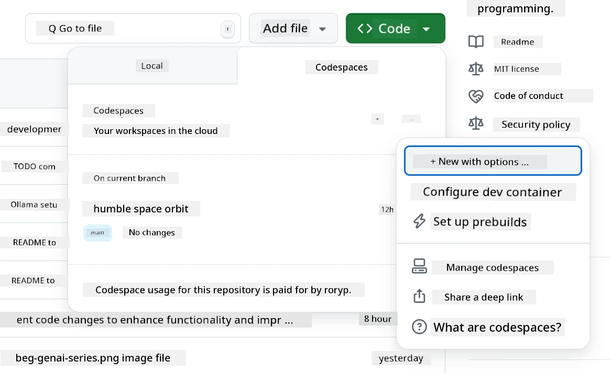
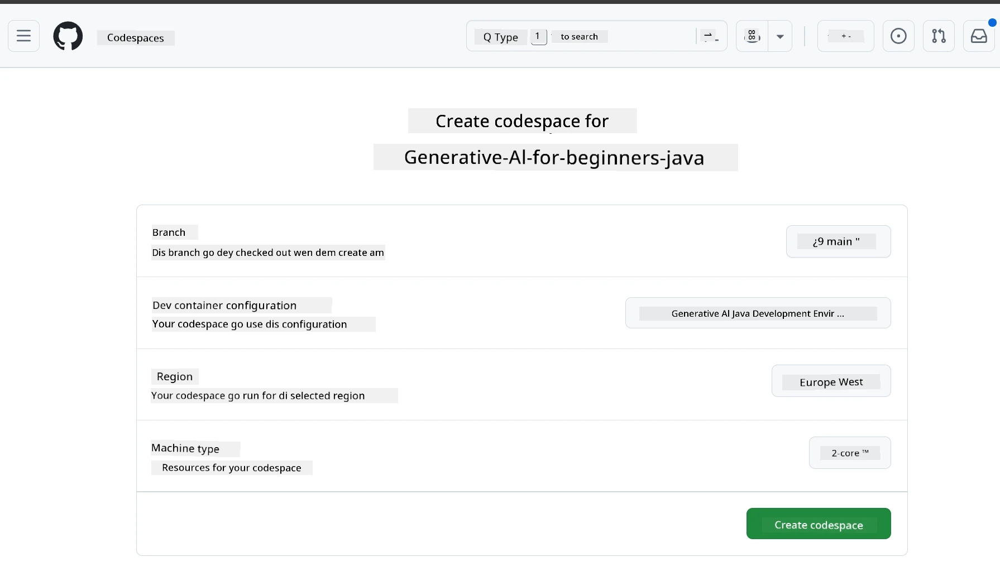
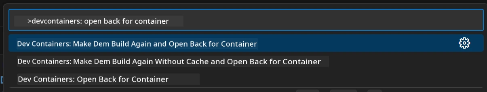
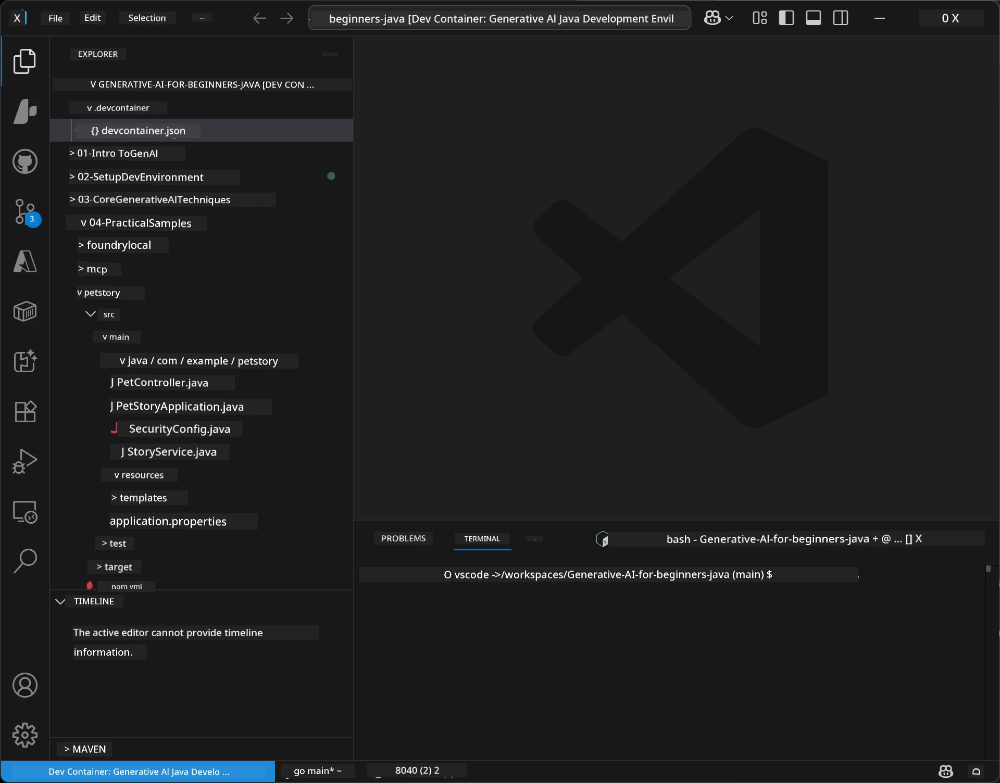
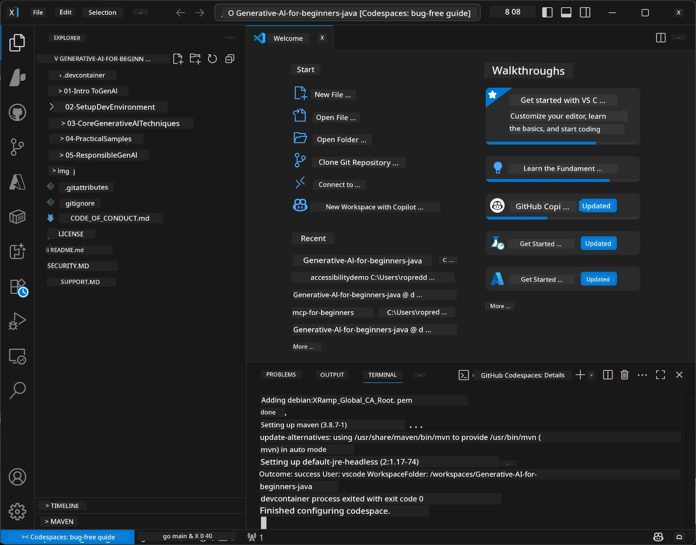

# Setting Up the Development Environment for Generative AI for Java

> **Quick Start**: Code for Cloud for 2 minutes - Jump go [GitHub Codespaces Setup](../../../02-SetupDevEnvironment) - no need install for local and e dey use github models!

> **You dey interested for Azure OpenAI?**, see our [Azure OpenAI Setup Guide](getting-started-azure-openai.md) with steps to create new Azure OpenAI resource.

## Wetin You Go Learn

- How to set up Java development environment for AI applications
- How to select and arrange your preferred development environment (cloud-first with Codespaces, local dev container, or full local setup)
- Test your setup by connecting to GitHub Models

## Table of Contents

- [Wetin You Go Learn](../../../02-SetupDevEnvironment)
- [Introduction](../../../02-SetupDevEnvironment)
- [Step 1: Set Up Your Development Environment](../../../02-SetupDevEnvironment)
  - [Option A: GitHub Codespaces (Recommended)](../../../02-SetupDevEnvironment)
  - [Option B: Local Dev Container](../../../02-SetupDevEnvironment)
  - [Option C: Use Your Existing Local Installation](../../../02-SetupDevEnvironment)
- [Step 2: Create GitHub Personal Access Token](../../../02-SetupDevEnvironment)
- [Step 3: Test Your Setup](../../../02-SetupDevEnvironment)
- [Troubleshooting](../../../02-SetupDevEnvironment)
- [Summary](../../../02-SetupDevEnvironment)
- [Next Steps](../../../02-SetupDevEnvironment)

## Introduction

Dis chapter go guide you how to set up development environment. We go use **GitHub Models** be our main example because e dey free, e easy to set up with just GitHub account, no need credit card, and e dey give access to plenty models for testing.

**No need set up anything for local!** You fit start to code sharp sharp using GitHub Codespaces, wey dey provide full development environment for your browser.


We recommend make you use [**GitHub Models**](https://github.com/marketplace?type=models) for dis course because e be:
- **Free** to start
- **Easy** to set up with just GitHub account
- **No credit card** needed
- **Plenty models** dey for testing

> **Note**: The GitHub Models wey dem dey use for this training get dis free limits:
> - 15 requests per minute (150 per day)
> - ~8,000 words input, ~4,000 words output per request
> - 5 requests fit run at the same time
> 
> For production use, upgrade to Azure AI Foundry Models with your Azure account. Your code no need change. See the [Azure AI Foundry documentation](https://learn.microsoft.com/azure/ai-foundry/foundry-models/how-to/quickstart-github-models).


## Step 1: Set Up Your Development Environment

<a name="quick-start-cloud"></a>

We don create preconfigured development container to make setup quick and make sure say you get all di tools you need for dis Generative AI for Java course. Choose di development method wey you like:

### Environment Setup Options:

#### Option A: GitHub Codespaces (Recommended)

**Start to code for 2 minutes - no need to install anything for local!**

1. Fork this repository go your GitHub account
   > **Note**: If you want edit basic config make you check the [Dev Container Configuration](../../../.devcontainer/devcontainer.json)
2. Click **Code** → **Codespaces** tab → **...** → **New with options...**
3. Use di defaults – e go pick di **Dev container configuration**: **Generative AI Java Development Environment** custom devcontainer wey dem create for dis course
4. Click **Create codespace**
5. Wait about 2 minutes to make environment ready
6. Continue go [Step 2: Create GitHub Token](../../../02-SetupDevEnvironment)







> **Benefits of Codespaces**:
> - No need local installation
> - E dey work for any device wey get browser
> - Pre-configured with all tools and dependencies
> - Free 60 hours per month for personal accounts
> - Environment dey consistent for all learners

#### Option B: Local Dev Container

**For developers who like local development with Docker**

1. Fork and clone this repository go your local machine
   > **Note**: If you want edit basic config make you check the [Dev Container Configuration](../../../.devcontainer/devcontainer.json)
2. Install [Docker Desktop](https://www.docker.com/products/docker-desktop/) and [VS Code](https://code.visualstudio.com/)
3. Install the [Dev Containers extension](https://marketplace.visualstudio.com/items?itemName=ms-vscode-remote.remote-containers) for VS Code
4. Open the repository folder for VS Code
5. When prompt show, click **Reopen in Container** (or use `Ctrl+Shift+P` → "Dev Containers: Reopen in Container")
6. Wait make container build and start
7. Continue go [Step 2: Create GitHub Token](../../../02-SetupDevEnvironment)





#### Option C: Use Your Existing Local Installation

**For developers wey get Java environment already**

Prerequisites:
- [Java 21+](https://www.oracle.com/java/technologies/javase/jdk21-archive-downloads.html) 
- [Maven 3.9+](https://maven.apache.org/download.cgi)
- [VS Code](https://code.visualstudio.com) or your preferred IDE

Steps:
1. Clone this repository go your local machine
2. Open di project for your IDE
3. Continue go [Step 2: Create GitHub Token](../../../02-SetupDevEnvironment)

> **Pro Tip**: If your machine no strong well but you want VS Code for local, just use GitHub Codespaces! You fit connect your local VS Code to cloud-hosted Codespace to enjoy best of both worlds.




## Step 2: Create a GitHub Personal Access Token

1. Go [GitHub Settings](https://github.com/settings/profile) then select **Settings** from your profile menu.
2. For the left side, click **Developer settings** (usually for bottom).
3. Under **Personal access tokens**, click **Fine-grained tokens** (or use this direct [link](https://github.com/settings/personal-access-tokens)).
4. Click **Generate new token**.
5. Under "Token name", put name wey fit describe am (like `GenAI-Java-Course-Token`).
6. Set expiration date (recommended: 7 days to keep am secure).
7. Under "Resource owner", select your user account.
8. Under "Repository access", choose repositories wey you want use for GitHub Models (or choose "All repositories" if you want).
9. Under "Account permissions", find **Models** and set am to **Read-only**.
10. Click **Generate token**.
11. **Copy and save your token now** – you no go see am again after!

> **Security Tip**: Use smallest scope wey you need and shortest possible expiration time for your tokens.

## Step 3: Test Your Setup with the GitHub Models Example

Once your development environment ready, make we test GitHub Models integration with our example app inside [`02-SetupDevEnvironment/examples/github-models`](../../../02-SetupDevEnvironment/examples/github-models).

1. Open terminal inside your development environment.
2. Go the GitHub Models example:
   ```bash
   cd 02-SetupDevEnvironment/examples/github-models
   ```
3. Set your GitHub token as environment variable:
   ```bash
   # macOS/Linux
   export GITHUB_TOKEN=your_token_here
   
   # Windows (Command Prompt)
   set GITHUB_TOKEN=your_token_here
   
   # Windows (PowerShell)
   $env:GITHUB_TOKEN="your_token_here"
   ```

4. Run the application:
   ```bash
   mvn compile exec:java -Dexec.mainClass="com.example.githubmodels.App"
   ```

You go see output like this:
```text
Using model: gpt-4.1-nano
Sending request to GitHub Models...
Response: Hello World!
```

### Understanding the Example Code

First, make we understand wetin we run just now. The example inside `examples/github-models` dey use OpenAI Java SDK to connect with GitHub Models:

**Wetindis code dey do:**
- **Connect** to GitHub Models with your personal access token
- **Send** simple "Say Hello World!" message to AI model
- **Receive** and show AI response
- **Confirm** say your setup dey work well

**Main Dependency** (inside `pom.xml`):
```xml
<dependency>
    <groupId>com.openai</groupId>
    <artifactId>openai-java</artifactId>
    <version>2.12.0</version>
</dependency>
```

**Main Code** (`App.java`):
```java
// Connect to GitHub Models using OpenAI Java SDK
OpenAIClient client = OpenAIOkHttpClient.builder()
    .apiKey(pat)
    .baseUrl("https://models.inference.ai.azure.com")
    .build();

// Make chat completion request
ChatCompletionCreateParams params = ChatCompletionCreateParams.builder()
    .model(modelId)
    .addSystemMessage("You are a concise assistant.")
    .addUserMessage("Say Hello World!")
    .build();

// Collect AI response
ChatCompletion response = client.chat().completions().create(params);
System.out.println("Response: " + response.choices().get(0).message().content().orElse("No response content"));
```

## Summary

Great! You don set everything:

- You don create GitHub Personal Access Token with right AI model permissions
- Your Java development environment dey run (whether na Codespaces, dev containers, or local)
- You don connect to GitHub Models using OpenAI Java SDK for free AI development
- You test am with simple example wey dey talk to AI models

## Next Steps

[Chapter 3: Core Generative AI Techniques](../03-CoreGenerativeAITechniques/README.md)

## Troubleshooting

Get wahala? Here be common problems and how you fit solve dem:

- **Token no dey work?** 
  - Check say you copy full token with no space inside
  - Make sure token dey set well as environment variable
  - Confirm your token get correct permissions (Models: Read-only)

- **Maven no show?** 
  - If you dey use dev containers/Codespaces, Maven suppose dey pre-installed
  - For local setup, make sure Java 21+ and Maven 3.9+ don install
  - Try run `mvn --version` to confirm e dey

- **Connection wahala?** 
  - Check your internet connection
  - Confirm say GitHub fit open from your network
  - Make sure firewall no dey block GitHub Models endpoint

- **Dev container no dey start?** 
  - Make sure Docker Desktop dey run (for local)
  - Try rebuild container: `Ctrl+Shift+P` → "Dev Containers: Rebuild Container"

- **App compile error?**
  - Make sure you dey correct directory: `02-SetupDevEnvironment/examples/github-models`
  - Try clean and rebuild: `mvn clean compile`

> **Need help?**: If you still get wahala, open issue for the repository and we go help you.

---

<!-- CO-OP TRANSLATOR DISCLAIMER START -->
**Disclaimer**:
Dis document na wetin AI translation service [Co-op Translator](https://github.com/Azure/co-op-translator) translate. Even though we try make e correct, abeg sabi say automated translation fit get mistakes or no too correct. Di original document wey dem write for im own language na di correct one wey you suppose rely on. If na serious matter, e better make human professional translate am. We no go responsible if pesin misunderstand or misinterpret anything because of dis translation.
<!-- CO-OP TRANSLATOR DISCLAIMER END -->