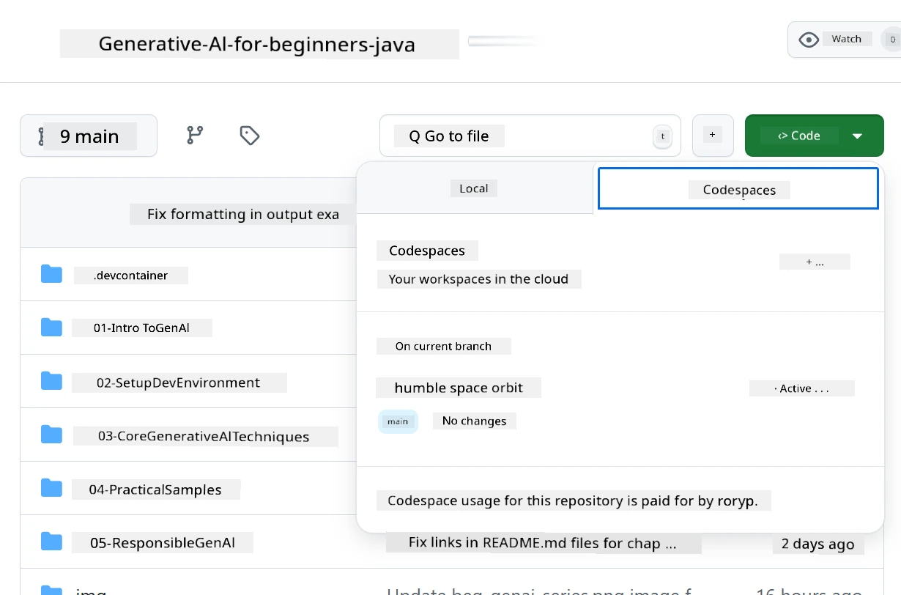

# How to Set Up Di Development Environment for Azure OpenAI

> **Quick Start**: Dis guide na for Azure OpenAI setup. If you wan start quick-quick with free models, use [GitHub Models with Codespaces](./README.md#quick-start-cloud).

Dis guide go show you how you fit set up Azure AI Foundry models for your Java AI apps for dis course.

## Table of Contents

- [Quick Setup Overview](../../../02-SetupDevEnvironment)
- [Step 1: Create Azure AI Foundry Resources](../../../02-SetupDevEnvironment)
  - [Create a Hub and Project](../../../02-SetupDevEnvironment)
  - [Deploy GPT-4o-mini Model](../../../02-SetupDevEnvironment)
- [Step 2: Create Your Codespace](../../../02-SetupDevEnvironment)
- [Step 3: Configure Your Environment](../../../02-SetupDevEnvironment)
- [Step 4: Test Your Setup](../../../02-SetupDevEnvironment)
- [What's Next?](../../../02-SetupDevEnvironment)
- [Resources](../../../02-SetupDevEnvironment)
- [Additional Resources](../../../02-SetupDevEnvironment)

## Quick Setup Overview

1. Create Azure AI Foundry resources (Hub, Project, Model)
2. Create one Codespace wey get Java development container
3. Configure your .env file with Azure OpenAI credentials
4. Test your setup with di example project

## Step 1: Create Azure AI Foundry Resources

### Create a Hub and Project

1. Go [Azure AI Foundry Portal](https://ai.azure.com/) and log in
2. Click **+ Create** → **New hub** (or go **Management** → **All hubs** → **+ New hub**)
3. Set up your hub:
   - **Hub name**: e.g., "MyAIHub"
   - **Subscription**: Choose your Azure subscription
   - **Resource group**: Create new one or choose existing one
   - **Location**: Pick di one wey near you pass
   - **Storage account**: Use di default or set custom one
   - **Key vault**: Use di default or set custom one
   - Click **Next** → **Review + create** → **Create**
4. After you don create am, click **+ New project** (or **Create project** from hub overview)
   - **Project name**: e.g., "GenAIJava"
   - Click **Create**

### Deploy GPT-4o-mini Model

1. For your project, go **Model catalog** and search for **gpt-4o-mini**
   - *Alternative: Go **Deployments** → **+ Create deployment***
2. Click **Deploy** for di gpt-4o-mini model card
3. Set up di deployment:
   - **Deployment name**: "gpt-4o-mini"
   - **Model version**: Use di latest one
   - **Deployment type**: Standard
4. Click **Deploy**
5. After e don deploy, go **Deployments** tab and copy dis values:
   - **Deployment name** (e.g., "gpt-4o-mini")
   - **Target URI** (e.g., `https://your-hub-name.openai.azure.com/`) 
      > **Important**: Copy only di base URL (e.g., `https://myhub.openai.azure.com/`) no copy di full endpoint path.
   - **Key** (from di Keys and Endpoint section)

> **Still dey get wahala?** Check di official [Azure AI Foundry Documentation](https://learn.microsoft.com/azure/ai-foundry/how-to/create-projects?tabs=ai-foundry&pivots=hub-project)

## Step 2: Create Your Codespace

1. Fork dis repository go your GitHub account
   > **Note**: If you wan change di basic config, check di [Dev Container Configuration](../../../.devcontainer/devcontainer.json)
2. For your forked repo, click **Code** → **Codespaces** tab
3. Click **...** → **New with options...**

4. Choose **Dev container configuration**: 
   - **Generative AI Java Development Environment**
5. Click **Create codespace**

## Step 3: Configure Your Environment

When your Codespace don ready, set up your Azure OpenAI credentials:

1. **Go di example project from di repository root:**
   ```bash
   cd 02-SetupDevEnvironment/examples/basic-chat-azure
   ```

2. **Create your .env file:**
   ```bash
   cp .env.example .env
   ```

3. **Edit di .env file with your Azure OpenAI credentials:**
   ```bash
   # Your Azure OpenAI API key (from Azure AI Foundry portal)
   AZURE_AI_KEY=your-actual-api-key-here
   
   # Your Azure OpenAI endpoint URL (e.g., https://myhub.openai.azure.com/)
   AZURE_AI_ENDPOINT=https://your-hub-name.openai.azure.com/
   ```

   > **Security Note**: 
   > - No ever commit your `.env` file for version control
   > - Di `.env` file don already dey for `.gitignore`
   > - Keep your API keys secure and dey rotate dem regularly

## Step 4: Test Your Setup

Run di example application to test your Azure OpenAI connection:

```bash
mvn clean spring-boot:run
```

You go see response from di GPT-4o-mini model!

> **VS Code Users**: You fit also press `F5` for VS Code to run di application. Di launch configuration don already set up to load your `.env` file automatically.

> **Full example**: Check di [End-to-End Azure OpenAI Example](./examples/basic-chat-azure/README.md) for full instructions and troubleshooting.

## What's Next?

**Setup don complete!** You don get:
- Azure OpenAI with gpt-4o-mini wey don deploy
- Local .env file configuration
- Java development environment wey don ready

**Continue to** [Chapter 3: Core Generative AI Techniques](../03-CoreGenerativeAITechniques/README.md) to start to build AI applications!

## Resources

- [Azure AI Foundry Documentation](https://learn.microsoft.com/azure/ai-services/)
- [Spring AI Azure OpenAI Documentation](https://docs.spring.io/spring-ai/reference/api/clients/azure-openai-chat.html)
- [Azure OpenAI Java SDK](https://learn.microsoft.com/java/api/overview/azure/ai-openai-readme)

## Additional Resources

- [Download VS Code](https://code.visualstudio.com/Download)
- [Get Docker Desktop](https://www.docker.com/products/docker-desktop)
- [Dev Container Configuration](../../../.devcontainer/devcontainer.json)

---

<!-- CO-OP TRANSLATOR DISCLAIMER START -->
**Disclaimer**:  
Dis dokyument don use AI transleto service [Co-op Translator](https://github.com/Azure/co-op-translator) do di translation. Even as we dey try make am correct, abeg sabi say machine translation fit get mistake or no dey accurate well. Di original dokyument wey dey for im native language na di one wey you go take as di correct source. For important mata, e good make professional human translator check am. We no go fit take blame for any misunderstanding or wrong interpretation wey fit happen because you use dis translation.
<!-- CO-OP TRANSLATOR DISCLAIMER END -->