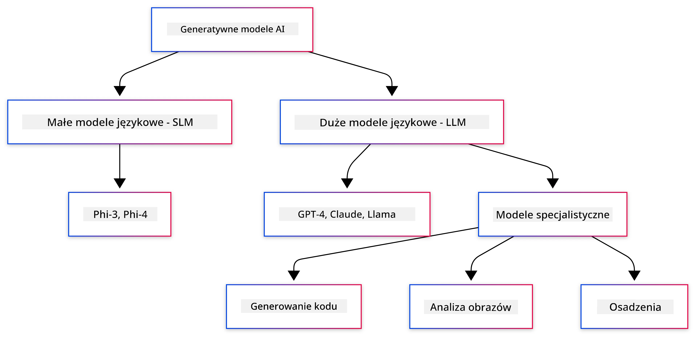
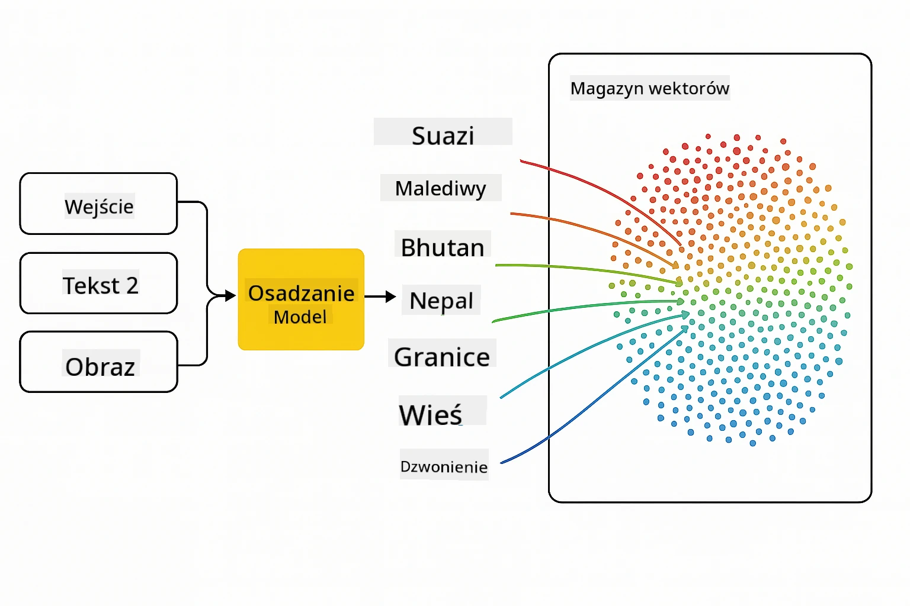
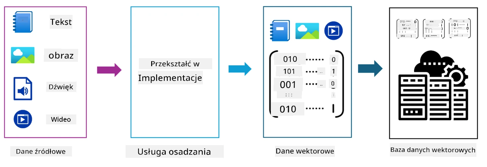
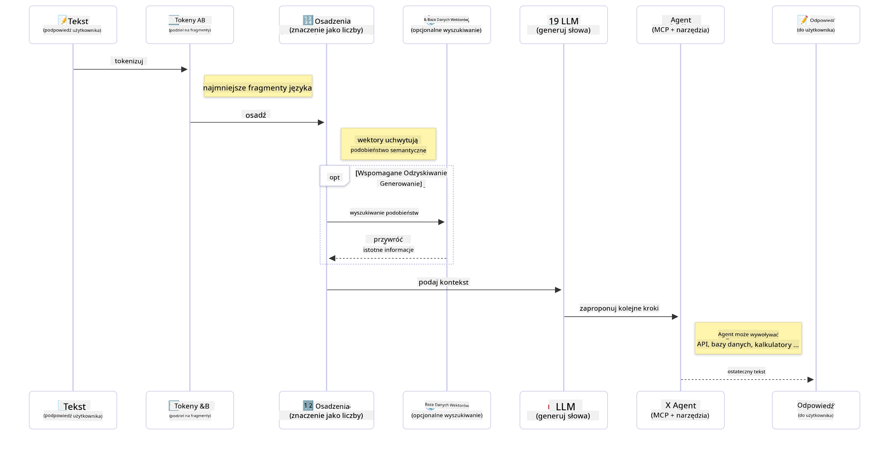

# Wprowadzenie do Generatywnej Sztucznej Inteligencji - Edycja Java

> **Wideo**: [Obejrzyj przegląd wideo do tej lekcji na YouTube.](https://www.youtube.com/watch?v=XH46tGp_eSw) Możesz także kliknąć powyższy obraz miniatury.

## Czego się nauczysz

- **Podstawy generatywnej SI** obejmujące LLM, inżynierię promptów, tokeny, embedingi i bazy danych wektorowych
- **Porównanie narzędzi do rozwoju SI w Javie** w tym Azure OpenAI SDK, Spring AI i OpenAI Java SDK
- **Poznasz Model Context Protocol** i jego rolę w komunikacji agentów SI

## Spis treści

- [Wprowadzenie](#wprowadzenie)
- [Szybkie przypomnienie koncepcji Generatywnej SI](#szybkie-przypomnienie-koncepcji-generatywnej-si)
- [Przegląd inżynierii promptów](#przegląd-inżynierii-promptów)
- [Tokeny, embedingi i agenci](#tokeny-embedingi-i-agenci)
- [Narzędzia i biblioteki do rozwoju SI dla Java](#narzędzia-i-biblioteki-do-rozwoju-si-dla-java)
  - [OpenAI Java SDK](#openai-java-sdk)
  - [Spring AI](#spring-ai)
  - [Azure OpenAI Java SDK](#azure-openai-java-sdk)
- [Podsumowanie](#podsumowanie)
- [Kolejne kroki](#kolejne-kroki)

## Wprowadzenie

Witamy w pierwszym rozdziale Generatywnej SI dla początkujących - Edycja Java! Ta podstawowa lekcja wprowadza Cię w kluczowe koncepcje generatywnej SI oraz sposoby pracy z nimi za pomocą Javy. Poznasz niezbędne elementy budulcowe aplikacji SI, w tym Duże Modele Językowe (LLM), tokeny, embedingi i agentów SI. Przeanalizujemy także podstawowe narzędzia Java, które będziesz używać w trakcie tego kursu.

### Szybkie przypomnienie koncepcji Generatywnej SI

Generatywna SI to rodzaj sztucznej inteligencji, która tworzy nowe treści, takie jak tekst, obrazy czy kod, na podstawie wzorców i zależności wyuczonych z danych. Modele generatywnej SI potrafią generować odpowiedzi przypominające ludzkie, rozumieć kontekst, a czasem nawet tworzyć treści wydające się być ludzkie.

Rozwijając aplikacje AI w Javie, będziesz pracować z **modelami generatywnej SI** do tworzenia treści. Niektóre możliwości modeli generatywnej SI to:

- **Generowanie tekstu**: tworzenie tekstu przypominającego ludzki, do chatbotów, treści i uzupełniania tekstu.
- **Generowanie i analiza obrazów**: tworzenie realistycznych obrazów, ulepszanie zdjęć i wykrywanie obiektów.
- **Generowanie kodu**: pisanie fragmentów kodu lub skryptów.

Istnieją różne typy modeli optymalizowanych do różnych zadań. Na przykład zarówno **Małe Modele Językowe (SLM)**, jak i **Duże Modele Językowe (LLM)** mogą obsługiwać generowanie tekstu, przy czym LLM zazwyczaj oferują lepszą wydajność dla zadań złożonych. W zadaniach związanych z obrazami używa się specjalistycznych modeli wizualnych lub modeli multimodalnych.

Oczywiście odpowiedzi tych modeli nie są zawsze idealne. Pewnie słyszałeś o modelach „halucynujących” lub generujących błędne informacje w sposób autorytatywny. Jednak możesz pomóc modelowi tworzyć lepsze odpowiedzi, podając mu jasne instrukcje i kontekst. Tu właśnie wchodzi w grę **inżynieria promptów**.

#### Przegląd inżynierii promptów

Inżynieria promptów to praktyka projektowania skutecznych wejść, które kierują modele AI do pożądanych wyników. Obejmuje ona:

- **Jasność**: tworzenie instrukcji klarownych i jednoznacznych.
- **Kontekst**: dostarczanie niezbędnych informacji w tle.
- **Ograniczenia**: określanie wszelkich limitów lub formatów.

Niektóre dobre praktyki inżynierii promptów to projektowanie promptów, jasne instrukcje, dzielenie zadań na kroki, uczenie jednokrotne i kilku-krotne oraz strojenie promptów. Testowanie różnych promptów jest kluczowe, aby znaleźć najlepsze rozwiązanie dla Twojego konkretnego zastosowania.

Podczas tworzenia aplikacji będziesz pracować z różnymi typami promptów:
- **Prompty systemowe**: ustalają podstawowe zasady i kontekst zachowania modelu
- **Prompty użytkownika**: dane wejściowe od użytkowników Twojej aplikacji
- **Prompty asystenta**: odpowiedzi modelu bazujące na promptach systemowych i użytkowników

> **Dowiedz się więcej**: Dowiedz się więcej o inżynierii promptów w [rozdziale Inżynieria Promptów kursu GenAI dla początkujących](https://github.com/microsoft/generative-ai-for-beginners/tree/main/04-prompt-engineering-fundamentals)

#### Tokeny, embedingi i agenci

Pracując z modelami generatywnej SI, spotkasz terminy takie jak **tokeny**, **embedingi**, **agenci** i **Model Context Protocol (MCP)**. Oto szczegółowy przegląd tych koncepcji:

- **Tokeny**: Tokeny to najmniejsze jednostki tekstu w modelu. Mogą to być słowa, znaki lub pod-słowa. Tokeny są używane do reprezentowania danych tekstowych w formacie zrozumiałym dla modelu. Na przykład zdanie "The quick brown fox jumped over the lazy dog" może zostać ztokenizowane jako ["The", " quick", " brown", " fox", " jumped", " over", " the", " lazy", " dog"] lub ["The", " qu", "ick", " br", "own", " fox", " jump", "ed", " over", " the", " la", "zy", " dog"] w zależności od użytej strategii tokenizacji.

Tokenizacja to proces rozbijania tekstu na te mniejsze jednostki. To kluczowe, ponieważ modele operują na tokenach, a nie surowym tekście. Liczba tokenów w promptcie wpływa na długość i jakość odpowiedzi modelu, ponieważ modele mają limity tokenów dla okna kontekstowego (np. 128K tokenów dla całkowitego kontekstu GPT-4o, obejmującego zarówno wejście, jak i wyjście).

  W Javie możesz użyć bibliotek, takich jak OpenAI SDK, aby automatycznie obsługiwać tokenizację podczas wysyłania zapytań do modeli AI.

- **Embedingi**: Embedingi to wektorowe reprezentacje tokenów, które odzwierciedlają znaczenie semantyczne. Są to reprezentacje numeryczne (zwykle tablice liczb zmiennoprzecinkowych), które pozwalają modelom rozumieć relacje między słowami i generować odpowiedzi odpowiednie semantycznie. Podobne słowa mają podobne embedingi, co umożliwia modelowi rozumienie takich pojęć jak synonimy i relacje semantyczne.

  W Javie możesz generować embedingi za pomocą OpenAI SDK lub innych bibliotek obsługujących generowanie embedingów. Embedingi są niezbędne dla zadań takich jak wyszukiwanie semantyczne, gdzie wyszukujesz podobne treści na podstawie znaczenia, a nie dokładnego dopasowania tekstu.

- **Bazy danych wektorowych**: Bazy danych wektorowych to wyspecjalizowane systemy przechowywania zoptymalizowane pod kątem embedingów. Umożliwiają efektywne wyszukiwanie podobieństw i są kluczowe dla wzorców Retrieval-Augmented Generation (RAG), gdzie potrzebujesz znaleźć istotne informacje z dużych zbiorów danych na podstawie podobieństwa semantycznego, a nie dokładnego dopasowania.

> **Uwaga**: W kursie nie będziemy omawiać baz danych wektorowych, ale warto o nich wspomnieć, ponieważ są często używane w rzeczywistych zastosowaniach.

- **Agenci i MCP**: Komponenty SI, które autonomicznie współdziałają z modelami, narzędziami i systemami zewnętrznymi. Model Context Protocol (MCP) dostarcza standardowy sposób umożliwiający agentom bezpieczny dostęp do zewnętrznych źródeł danych i narzędzi. Dowiedz się więcej w naszym kursie [MCP dla początkujących](https://github.com/microsoft/mcp-for-beginners).

W aplikacjach SI w Javie użyjesz tokenów do przetwarzania tekstu, embedingów do wyszukiwania semantycznego i RAG, baz danych wektorowych do pobierania danych oraz agentów z MCP do budowania inteligentnych systemów korzystających z narzędzi.

### Narzędzia i biblioteki do rozwoju SI dla Java

Java oferuje znakomite narzędzia do rozwoju SI. Istnieją trzy główne biblioteki, które poznamy w tym kursie - OpenAI Java SDK, Azure OpenAI SDK i Spring AI.

Oto szybka tabela referencyjna pokazująca, którego SDK użyto w przykładach poszczególnych rozdziałów:

| Rozdział | Przykład | SDK |
|---------|--------|-----|
| 02-SetupDevEnvironment | github-models | OpenAI Java SDK |
| 02-SetupDevEnvironment | basic-chat-azure | Spring AI Azure OpenAI |
| 03-CoreGenerativeAITechniques | examples | Azure OpenAI SDK |
| 04-PracticalSamples | petstory | OpenAI Java SDK |
| 04-PracticalSamples | foundrylocal | OpenAI Java SDK |
| 04-PracticalSamples | calculator | Spring AI MCP SDK + LangChain4j |

**Linki do dokumentacji SDK:**
- [Azure OpenAI Java SDK](https://github.com/Azure/azure-sdk-for-java/tree/azure-ai-openai_1.0.0-beta.16/sdk/openai/azure-ai-openai)
- [Spring AI](https://docs.spring.io/spring-ai/reference/)
- [OpenAI Java SDK](https://github.com/openai/openai-java)
- [LangChain4j](https://docs.langchain4j.dev/)

#### OpenAI Java SDK

OpenAI SDK to oficjalna biblioteka Java dla API OpenAI. Zapewnia prosty i spójny interfejs do interakcji z modelami OpenAI, ułatwiając integrację możliwości SI w aplikacjach Java. Przykład GitHub Models z rozdziału 2, aplikacja Pet Story i przykład Foundry Local z rozdziału 4 demonstrują podejście OpenAI SDK.

#### Spring AI

Spring AI to kompleksowy framework, który wprowadza możliwości SI do aplikacji Spring, dostarczając jednolitą warstwę abstrakcji dla różnych dostawców SI. Integruje się bezproblemowo z ekosystemem Spring, co czyni go idealnym wyborem dla firmowych aplikacji Java potrzebujących możliwości SI.

Siła Spring AI tkwi w płynnej integracji z ekosystemem Spring, ułatwiającej budowanie produkcyjnych aplikacji SI za pomocą znanych wzorców Spring, takich jak wstrzykiwanie zależności, zarządzanie konfiguracją i frameworki testowe. Spring AI wykorzystasz w rozdziałach 2 i 4, aby tworzyć aplikacje korzystające zarówno z OpenAI, jak i Model Context Protocol (MCP).

##### Model Context Protocol (MCP)

[Model Context Protocol (MCP)](https://modelcontextprotocol.io/) to rozwijający się standard umożliwiający aplikacjom SI bezpieczną interakcję z zewnętrznymi źródłami danych i narzędziami. MCP zapewnia ustandaryzowany sposób dla modeli SI na dostęp do informacji kontekstowych i wykonywanie działań w Twoich aplikacjach.

W rozdziale 4 zbudujesz prostą usługę kalkulatora MCP, która ilustruje podstawy Model Context Protocol w Spring AI, pokazując, jak tworzyć podstawowe integracje narzędzi i architektury usług.

#### Azure OpenAI Java SDK

Biblioteka kliencka Azure OpenAI dla Java to adaptacja REST API OpenAI, która oferuje idiomatyczny interfejs i integrację z resztą ekosystemu SDK Azure. W rozdziale 3 zbudujesz aplikacje za pomocą Azure OpenAI SDK, w tym aplikacje czatujące, wywoływanie funkcji i wzorce RAG (Retrieval-Augmented Generation).

> Uwaga: Azure OpenAI SDK jest w tyle za OpenAI Java SDK pod względem funkcji, dlatego do przyszłych projektów rozważ użycie OpenAI Java SDK.

## Podsumowanie

To kończy podstawy! Teraz rozumiesz:

- Kluczowe koncepcje stojące za generatywną SI – od LLM i inżynierii promptów po tokeny, embedingi i bazy danych wektorowych
- Dostępne opcje narzędzi dla rozwoju SI w Javie: Azure OpenAI SDK, Spring AI i OpenAI Java SDK
- Czym jest Model Context Protocol i jak umożliwia agentom SI współpracę z narzędziami zewnętrznymi

## Kolejne kroki

[Rozdział 2: Konfiguracja środowiska programistycznego](../02-SetupDevEnvironment/README.md)

---

<!-- CO-OP TRANSLATOR DISCLAIMER START -->
**Zastrzeżenie**:  
Niniejszy dokument został przetłumaczony za pomocą automatycznej usługi tłumaczeniowej AI [Co-op Translator](https://github.com/Azure/co-op-translator). Chociaż staramy się zapewnić dokładność tłumaczenia, prosimy mieć na uwadze, że tłumaczenia automatyczne mogą zawierać błędy lub nieścisłości. Oryginalny dokument w języku źródłowym powinien być traktowany jako źródło autorytatywne. W przypadku informacji krytycznych zalecane jest skorzystanie z profesjonalnego tłumaczenia wykonanego przez człowieka. Nie ponosimy odpowiedzialności za jakiekolwiek nieporozumienia lub błędne interpretacje wynikające z korzystania z tego tłumaczenia.
<!-- CO-OP TRANSLATOR DISCLAIMER END -->