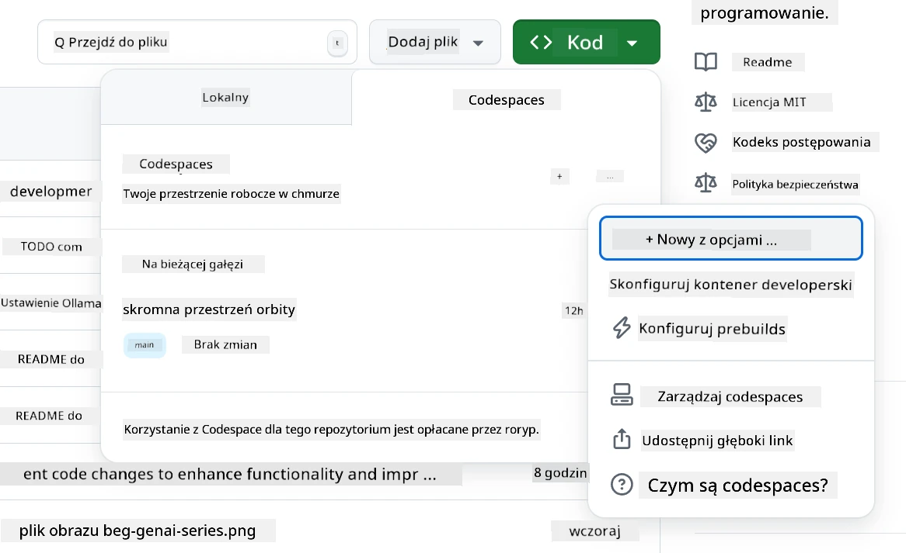
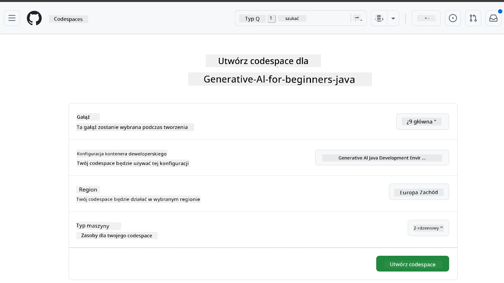
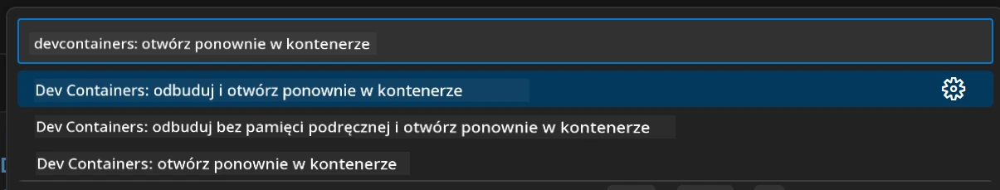
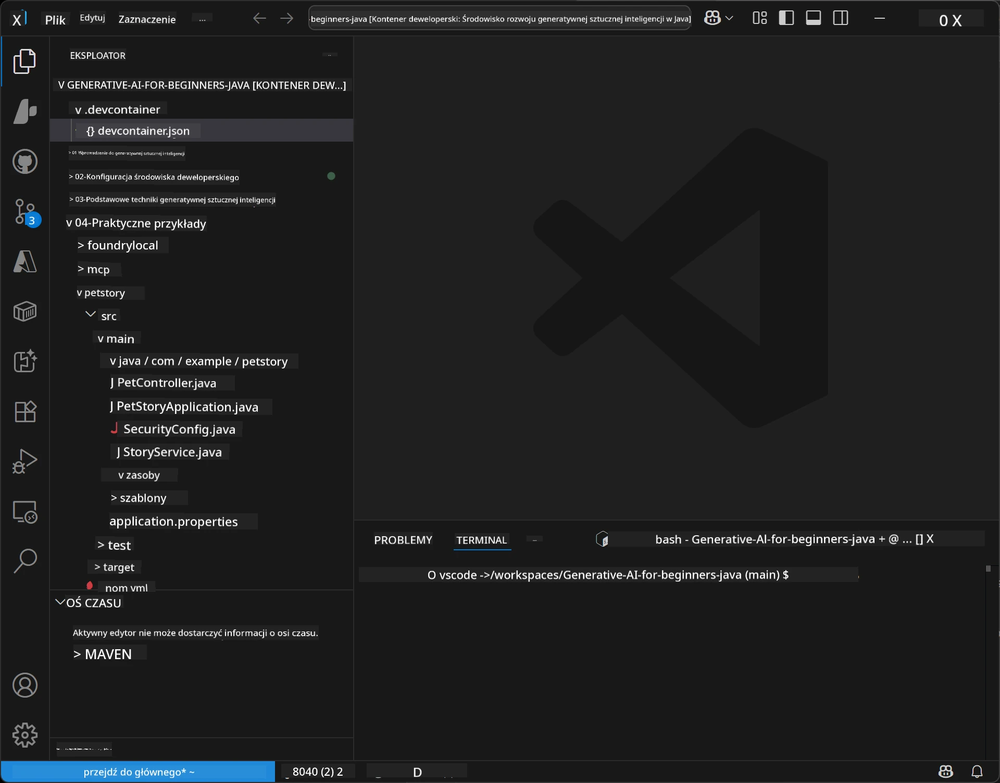
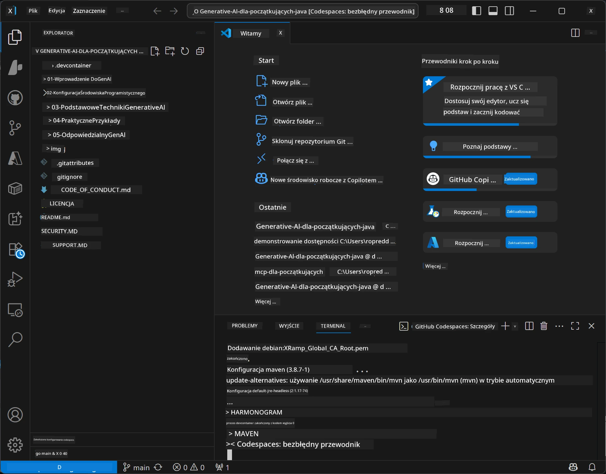

<!--
CO_OP_TRANSLATOR_METADATA:
{
  "original_hash": "96a30d42b9751a3d4e4b20e28d29d459",
  "translation_date": "2026-01-28T04:57:55+00:00",
  "source_file": "02-SetupDevEnvironment/README.md",
  "language_code": "pl"
}
-->
# Konfiguracja środowiska programistycznego dla Generative AI dla Java

> **Szybki start**: Koduj w chmurze w 2 minuty – przejdź do [Konfiguracja GitHub Codespaces](../../../02-SetupDevEnvironment) – brak instalacji lokalnej, korzysta z modeli GitHub!

> **Zainteresowany Azure OpenAI?**, zobacz nasz [Przewodnik konfiguracji Azure OpenAI](getting-started-azure-openai.md) z krokami tworzenia nowego zasobu Azure OpenAI.

## Czego się nauczysz

- Skonfigurować środowisko programistyczne Java dla aplikacji AI
- Wybrać i skonfigurować preferowane środowisko programistyczne (priorytet chmura z Codespaces, lokalny dev container lub pełna lokalna konfiguracja)
- Przetestować konfigurację, łącząc się z modelami GitHub

## Spis treści

- [Czego się nauczysz](../../../02-SetupDevEnvironment)
- [Wprowadzenie](../../../02-SetupDevEnvironment)
- [Krok 1: Skonfiguruj środowisko programistyczne](../../../02-SetupDevEnvironment)
  - [Opcja A: GitHub Codespaces (zalecane)](../../../02-SetupDevEnvironment)
  - [Opcja B: Lokalny Dev Container](../../../02-SetupDevEnvironment)
  - [Opcja C: Użyj swojej istniejącej lokalnej instalacji](../../../02-SetupDevEnvironment)
- [Krok 2: Utwórz token dostępu osobistego GitHub](../../../02-SetupDevEnvironment)
- [Krok 3: Przetestuj konfigurację](../../../02-SetupDevEnvironment)
- [Rozwiązywanie problemów](../../../02-SetupDevEnvironment)
- [Podsumowanie](../../../02-SetupDevEnvironment)
- [Następne kroki](../../../02-SetupDevEnvironment)

## Wprowadzenie

Ten rozdział przeprowadzi Cię przez proces konfiguracji środowiska programistycznego. Użyjemy **GitHub Models** jako naszego głównego przykładu, ponieważ jest darmowy, łatwy do konfiguracji z użyciem tylko konta GitHub, nie wymaga karty kredytowej i oferuje dostęp do wielu modeli do eksperymentów.

**Brak konieczności lokalnej instalacji!** Możesz zacząć kodować od razu, używając GitHub Codespaces, które zapewnia pełne środowisko programistyczne w przeglądarce.


Polecamy korzystać z [**GitHub Models**](https://github.com/marketplace?type=models) na ten kurs, ponieważ jest to:
- **Darmowe** aby zacząć
- **Łatwe** do skonfigurowania tylko z kontem GitHub
- **Bez karty kredytowej**
- **Wiele modeli** dostępnych do eksperymentów

> **Uwaga**: Modele GitHub używane w tym szkoleniu mają następujące darmowe limity:
> - 15 zapytań na minutę (150 dziennie)
> - ~8 000 słów wejściowych, ~4 000 słów wyjściowych na zapytanie
> - 5 zapytań jednocześnie
> 
> Do zastosowań produkcyjnych zaktualizuj do Azure AI Foundry Models z kontem Azure. Twój kod nie musi być modyfikowany. Zobacz [dokumentację Azure AI Foundry](https://learn.microsoft.com/azure/ai-foundry/foundry-models/how-to/quickstart-github-models).


## Krok 1: Skonfiguruj swoje środowisko programistyczne

<a name="quick-start-cloud"></a>

Utworzyliśmy prekonfigurowany kontener developerski, aby zminimalizować czas konfiguracji i zapewnić, że masz wszystkie potrzebne narzędzia do kursu Generative AI dla Java. Wybierz preferowany sposób pracy:

### Opcje konfiguracji środowiska:

#### Opcja A: GitHub Codespaces (zalecane)

**Zacznij kodować w 2 minuty – bez lokalnej instalacji!**

1. Zforkuj to repozytorium na swoje konto GitHub
   > **Uwaga**: Jeśli chcesz edytować podstawową konfigurację, zobacz [Konfigurację Dev Container](../../../.devcontainer/devcontainer.json)
2. Kliknij **Code** → zakładka **Codespaces** → **...** → **New with options...**
3. Użyj domyślnych ustawień – wybierze to konfigurację **Dev container**: **Generative AI Java Development Environment** utworzony na ten kurs
4. Kliknij **Create codespace**
5. Poczekaj około 2 minut na gotowość środowiska
6. Przejdź do [Kroku 2: Utwórz token GitHub](../../../02-SetupDevEnvironment)






> **Zalety Codespaces**:
> - Brak konieczności instalacji lokalnej
> - Działa na dowolnym urządzeniu z przeglądarką
> - Wstępnie skonfigurowane ze wszystkimi narzędziami i zależnościami
> - Darmowe 60 godzin miesięcznie dla kont osobistych
> - Spójne środowisko dla wszystkich uczących się

#### Opcja B: Lokalny Dev Container

**Dla programistów preferujących lokalny rozwój z Dockerem**

1. Zforkuj i sklonuj to repozytorium na swoją maszynę lokalną
   > **Uwaga**: Jeśli chcesz edytować podstawową konfigurację, zobacz [Konfigurację Dev Container](../../../.devcontainer/devcontainer.json)
2. Zainstaluj [Docker Desktop](https://www.docker.com/products/docker-desktop/) i [VS Code](https://code.visualstudio.com/)
3. Zainstaluj rozszerzenie [Dev Containers](https://marketplace.visualstudio.com/items?itemName=ms-vscode-remote.remote-containers) w VS Code
4. Otwórz folder repozytorium w VS Code
5. Po wyświetleniu monitu kliknij **Reopen in Container** (lub użyj `Ctrl+Shift+P` → "Dev Containers: Reopen in Container")
6. Poczekaj na zbudowanie i uruchomienie kontenera
7. Przejdź do [Kroku 2: Utwórz token GitHub](../../../02-SetupDevEnvironment)





#### Opcja C: Użyj swojej istniejącej lokalnej instalacji

**Dla programistów z istniejącym środowiskiem Java**

Wymagania:
- [Java 21+](https://www.oracle.com/java/technologies/javase/jdk21-archive-downloads.html)
- [Maven 3.9+](https://maven.apache.org/download.cgi)
- [VS Code](https://code.visualstudio.com) lub preferowane IDE

Kroki:
1. Sklonuj to repozytorium na swoją maszynę lokalną
2. Otwórz projekt w swoim IDE
3. Przejdź do [Kroku 2: Utwórz token GitHub](../../../02-SetupDevEnvironment)

> **Porada**: Jeśli masz mało wydajny sprzęt, ale chcesz używać VS Code lokalnie, korzystaj z GitHub Codespaces! Możesz połączyć lokalne VS Code z chmurowym Codespace, łącząc zalety obu środowisk.




## Krok 2: Utwórz GitHub Personal Access Token

1. Przejdź do [Ustawień GitHub](https://github.com/settings/profile) i wybierz **Settings** z menu profilu.
2. W lewym pasku bocznym kliknij **Developer settings** (zazwyczaj na dole).
3. W sekcji **Personal access tokens** kliknij **Fine-grained tokens** (lub użyj tego bezpośredniego [linku](https://github.com/settings/personal-access-tokens)).
4. Kliknij **Generate new token**.
5. W polu „Token name” podaj opisową nazwę (np. `GenAI-Java-Course-Token`).
6. Ustaw datę wygaśnięcia (zalecane: 7 dni dla najlepszych praktyk bezpieczeństwa).
7. W sekcji „Resource owner” wybierz swoje konto użytkownika.
8. W sekcji „Repository access” wybierz repozytoria, których chcesz używać z GitHub Models (lub „All repositories”, jeśli potrzebne).
9. W sekcji „Account permissions” znajdź **Models** i ustaw na **Read-only**.
10. Kliknij **Generate token**.
11. **Skopiuj i zapisz swój token teraz** – nie zobaczysz go ponownie!

> **Wskazówka bezpieczeństwa**: Używaj minimalnego wymaganego zakresu i jak najkrótszego praktycznego czasu ważności tokenów dostępowych.

## Krok 3: Przetestuj konfigurację na przykładzie GitHub Models

Gdy środowisko programistyczne jest gotowe, przetestuj integrację z GitHub Models za pomocą przykładowej aplikacji w [`02-SetupDevEnvironment/examples/github-models`](../../../02-SetupDevEnvironment/examples/github-models).

1. Otwórz terminal w środowisku programistycznym.
2. Przejdź do przykładu GitHub Models:
   ```bash
   cd 02-SetupDevEnvironment/examples/github-models
   ```
3. Ustaw token GitHub jako zmienną środowiskową:
   ```bash
   # macOS/Linux
   export GITHUB_TOKEN=your_token_here
   
   # Windows (Wiersz poleceń)
   set GITHUB_TOKEN=your_token_here
   
   # Windows (PowerShell)
   $env:GITHUB_TOKEN="your_token_here"
   ```

4. Uruchom aplikację:
   ```bash
   mvn compile exec:java -Dexec.mainClass="com.example.githubmodels.App"
   ```

Powinieneś zobaczyć podobne wyjście:
```text
Using model: gpt-4.1-nano
Sending request to GitHub Models...
Response: Hello World!
```

### Zrozumienie przykładowego kodu

Najpierw zrozummy, co właśnie uruchomiliśmy. Przykład w `examples/github-models` używa Java SDK OpenAI, aby połączyć się z GitHub Models:

**Co robi ten kod:**
- **Łączy się** z GitHub Models za pomocą twojego tokena dostępu osobistego
- **Wysyła** prostą wiadomość "Say Hello World!" do modelu AI
- **Odbiera** i wyświetla odpowiedź AI
- **Sprawdza**, czy konfiguracja działa poprawnie

**Kluczowa zależność** (w pliku `pom.xml`):
```xml
<dependency>
    <groupId>com.openai</groupId>
    <artifactId>openai-java</artifactId>
    <version>2.12.0</version>
</dependency>
```

**Główny kod** (`App.java`):
```java
// Połącz się z modelami GitHub za pomocą OpenAI Java SDK
OpenAIClient client = OpenAIOkHttpClient.builder()
    .apiKey(pat)
    .baseUrl("https://models.inference.ai.azure.com")
    .build();

// Utwórz żądanie uzupełnienia czatu
ChatCompletionCreateParams params = ChatCompletionCreateParams.builder()
    .model(modelId)
    .addSystemMessage("You are a concise assistant.")
    .addUserMessage("Say Hello World!")
    .build();

// Pobierz odpowiedź AI
ChatCompletion response = client.chat().completions().create(params);
System.out.println("Response: " + response.choices().get(0).message().content().orElse("No response content"));
```

## Podsumowanie

Świetnie! Masz teraz wszystko skonfigurowane:

- Utworzono GitHub Personal Access Token z odpowiednimi uprawnieniami do dostępu do modelu AI
- Twoje środowisko Java jest uruchomione (czy to Codespaces, dev containers czy lokalne)
- Połączyłeś się z GitHub Models używając OpenAI Java SDK do darmowego rozwoju AI
- Przetestowałeś wszystko za pomocą prostego przykładu rozmawiającego z modelami AI

## Następne kroki

[Rozdział 3: Kluczowe techniki Generative AI](../03-CoreGenerativeAITechniques/README.md)

## Rozwiązywanie problemów

Masz problemy? Oto typowe problemy i rozwiązania:

- **Token nie działa?** 
  - Upewnij się, że skopiowałeś cały token bez dodatkowych spacji
  - Sprawdź, czy token jest poprawnie ustawiony jako zmienna środowiskowa
  - Zweryfikuj, że token ma właściwe uprawnienia (Models: Read-only)

- **Maven nie znaleziony?** 
  - Jeśli używasz dev containers/Codespaces, Maven powinien być preinstalowany
  - W przypadku lokalnej instalacji upewnij się, że masz Java 21+ i Maven 3.9+
  - Sprawdź instalację poleceniem `mvn --version`

- **Problemy z połączeniem?** 
  - Sprawdź połączenie internetowe
  - Upewnij się, że GitHub jest dostępny w twojej sieci
  - Sprawdź, czy nie masz zapory, która blokuje endpoint GitHub Models

- **Dev container nie startuje?** 
  - Upewnij się, że Docker Desktop działa (dla rozwoju lokalnego)
  - Spróbuj przebudować kontener: `Ctrl+Shift+P` → "Dev Containers: Rebuild Container"

- **Błędy kompilacji aplikacji?**
  - Sprawdź, czy jesteś w poprawnym katalogu: `02-SetupDevEnvironment/examples/github-models`
  - Spróbuj wykonać czyszczenie i kompilację: `mvn clean compile`

> **Potrzebujesz pomocy?**: Nadal masz problemy? Otwórz zgłoszenie w repozytorium, a pomożemy Ci.

---

<!-- CO-OP TRANSLATOR DISCLAIMER START -->
**Zastrzeżenie**:  
Niniejszy dokument został przetłumaczony za pomocą usługi tłumaczeniowej AI [Co-op Translator](https://github.com/Azure/co-op-translator). Mimo że dokładamy wszelkich starań, aby tłumaczenie było jak najdokładniejsze, prosimy pamiętać, że automatyczne tłumaczenia mogą zawierać błędy lub nieścisłości. Oryginalny dokument w języku źródłowym powinien być traktowany jako źródło autorytatywne. W przypadku ważnych informacji zalecane jest skorzystanie z profesjonalnego, ludzkiego tłumaczenia. Nie ponosimy odpowiedzialności za jakiekolwiek nieporozumienia lub błędne interpretacje wynikające z korzystania z tego tłumaczenia.
<!-- CO-OP TRANSLATOR DISCLAIMER END -->