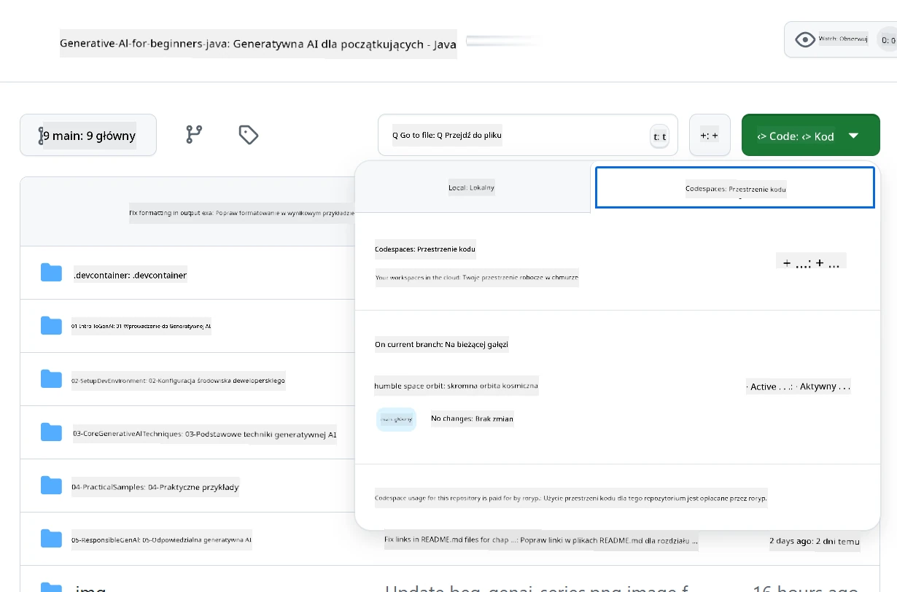

# Konfigurowanie środowiska deweloperskiego dla Azure OpenAI

> **Szybki start**: Ten przewodnik dotyczy konfiguracji Azure OpenAI. Aby szybko rozpocząć pracę z darmowymi modelami, skorzystaj z [GitHub Models with Codespaces](./README.md#quick-start-cloud).

Ten przewodnik pomoże Ci skonfigurować modele Azure AI Foundry dla aplikacji Java AI w tym kursie.

## Spis treści

- [Szybki przegląd konfiguracji](../../../02-SetupDevEnvironment)
- [Krok 1: Utwórz zasoby Azure AI Foundry](../../../02-SetupDevEnvironment)
  - [Utwórz Hub i Projekt](../../../02-SetupDevEnvironment)
  - [Wdróż model GPT-4o-mini](../../../02-SetupDevEnvironment)
- [Krok 2: Utwórz Codespace](../../../02-SetupDevEnvironment)
- [Krok 3: Skonfiguruj środowisko](../../../02-SetupDevEnvironment)
- [Krok 4: Przetestuj konfigurację](../../../02-SetupDevEnvironment)
- [Co dalej?](../../../02-SetupDevEnvironment)
- [Zasoby](../../../02-SetupDevEnvironment)
- [Dodatkowe zasoby](../../../02-SetupDevEnvironment)

## Szybki przegląd konfiguracji

1. Utwórz zasoby Azure AI Foundry (Hub, Projekt, Model)
2. Utwórz Codespace z kontenerem deweloperskim dla Javy
3. Skonfiguruj plik `.env` z poświadczeniami Azure OpenAI
4. Przetestuj konfigurację za pomocą przykładowego projektu

## Krok 1: Utwórz zasoby Azure AI Foundry

### Utwórz Hub i Projekt

1. Przejdź do [Azure AI Foundry Portal](https://ai.azure.com/) i zaloguj się
2. Kliknij **+ Create** → **New hub** (lub przejdź do **Management** → **All hubs** → **+ New hub**)
3. Skonfiguruj swój hub:
   - **Hub name**: np. "MyAIHub"
   - **Subscription**: Wybierz swoją subskrypcję Azure
   - **Resource group**: Utwórz nową lub wybierz istniejącą
   - **Location**: Wybierz najbliższą lokalizację
   - **Storage account**: Użyj domyślnego lub skonfiguruj własny
   - **Key vault**: Użyj domyślnego lub skonfiguruj własny
   - Kliknij **Next** → **Review + create** → **Create**
4. Po utworzeniu kliknij **+ New project** (lub **Create project** z widoku hubu)
   - **Project name**: np. "GenAIJava"
   - Kliknij **Create**

### Wdróż model GPT-4o-mini

1. W swoim projekcie przejdź do **Model catalog** i wyszukaj **gpt-4o-mini**
   - *Alternatywa: Przejdź do **Deployments** → **+ Create deployment***
2. Kliknij **Deploy** na karcie modelu gpt-4o-mini
3. Skonfiguruj wdrożenie:
   - **Deployment name**: "gpt-4o-mini"
   - **Model version**: Użyj najnowszej
   - **Deployment type**: Standard
4. Kliknij **Deploy**
5. Po wdrożeniu przejdź do zakładki **Deployments** i skopiuj następujące wartości:
   - **Deployment name** (np. "gpt-4o-mini")
   - **Target URI** (np. `https://your-hub-name.openai.azure.com/`)  
      > **Ważne**: Skopiuj tylko podstawowy URL (np. `https://myhub.openai.azure.com/`), a nie pełną ścieżkę endpointu.
   - **Key** (z sekcji Keys and Endpoint)

> **Masz problemy?** Odwiedź oficjalną [dokumentację Azure AI Foundry](https://learn.microsoft.com/azure/ai-foundry/how-to/create-projects?tabs=ai-foundry&pivots=hub-project)

## Krok 2: Utwórz Codespace

1. Sforkuj to repozytorium na swoje konto GitHub
   > **Uwaga**: Jeśli chcesz edytować podstawową konfigurację, zapoznaj się z [Dev Container Configuration](../../../.devcontainer/devcontainer.json)
2. W swoim sforkowanym repozytorium kliknij **Code** → zakładka **Codespaces**
3. Kliknij **...** → **New with options...**

4. Wybierz **Dev container configuration**: 
   - **Generative AI Java Development Environment**
5. Kliknij **Create codespace**

## Krok 3: Skonfiguruj środowisko

Gdy Twój Codespace będzie gotowy, skonfiguruj poświadczenia Azure OpenAI:

1. **Przejdź do przykładowego projektu z katalogu głównego repozytorium:**
   ```bash
   cd 02-SetupDevEnvironment/examples/basic-chat-azure
   ```

2. **Utwórz plik `.env`:**
   ```bash
   cp .env.example .env
   ```

3. **Edytuj plik `.env`, dodając swoje poświadczenia Azure OpenAI:**
   ```bash
   # Your Azure OpenAI API key (from Azure AI Foundry portal)
   AZURE_AI_KEY=your-actual-api-key-here
   
   # Your Azure OpenAI endpoint URL (e.g., https://myhub.openai.azure.com/)
   AZURE_AI_ENDPOINT=https://your-hub-name.openai.azure.com/
   ```

   > **Uwaga dotycząca bezpieczeństwa**: 
   > - Nigdy nie commituj pliku `.env` do systemu kontroli wersji
   > - Plik `.env` jest już uwzględniony w `.gitignore`
   > - Chroń swoje klucze API i regularnie je rotuj

## Krok 4: Przetestuj konfigurację

Uruchom przykładową aplikację, aby przetestować połączenie z Azure OpenAI:

```bash
mvn clean spring-boot:run
```

Powinieneś zobaczyć odpowiedź od modelu GPT-4o-mini!

> **Użytkownicy VS Code**: Możesz również nacisnąć `F5` w VS Code, aby uruchomić aplikację. Konfiguracja uruchamiania jest już ustawiona tak, aby automatycznie ładować plik `.env`.

> **Pełny przykład**: Zobacz [End-to-End Azure OpenAI Example](./examples/basic-chat-azure/README.md) dla szczegółowych instrukcji i rozwiązywania problemów.

## Co dalej?

**Konfiguracja zakończona!** Masz teraz:
- Azure OpenAI z wdrożonym gpt-4o-mini
- Lokalną konfigurację pliku `.env`
- Gotowe środowisko deweloperskie dla Javy

**Przejdź do** [Rozdział 3: Podstawowe techniki generatywnej AI](../03-CoreGenerativeAITechniques/README.md), aby rozpocząć budowanie aplikacji AI!

## Zasoby

- [Dokumentacja Azure AI Foundry](https://learn.microsoft.com/azure/ai-services/)
- [Dokumentacja Spring AI Azure OpenAI](https://docs.spring.io/spring-ai/reference/api/clients/azure-openai-chat.html)
- [Azure OpenAI Java SDK](https://learn.microsoft.com/java/api/overview/azure/ai-openai-readme)

## Dodatkowe zasoby

- [Pobierz VS Code](https://code.visualstudio.com/Download)
- [Pobierz Docker Desktop](https://www.docker.com/products/docker-desktop)
- [Dev Container Configuration](../../../.devcontainer/devcontainer.json)

**Zastrzeżenie**:  
Ten dokument został przetłumaczony za pomocą usługi tłumaczenia AI [Co-op Translator](https://github.com/Azure/co-op-translator). Chociaż dokładamy wszelkich starań, aby tłumaczenie było precyzyjne, prosimy pamiętać, że automatyczne tłumaczenia mogą zawierać błędy lub nieścisłości. Oryginalny dokument w jego rodzimym języku powinien być uznawany za autorytatywne źródło. W przypadku informacji o kluczowym znaczeniu zaleca się skorzystanie z profesjonalnego tłumaczenia przez człowieka. Nie ponosimy odpowiedzialności za jakiekolwiek nieporozumienia lub błędne interpretacje wynikające z użycia tego tłumaczenia.