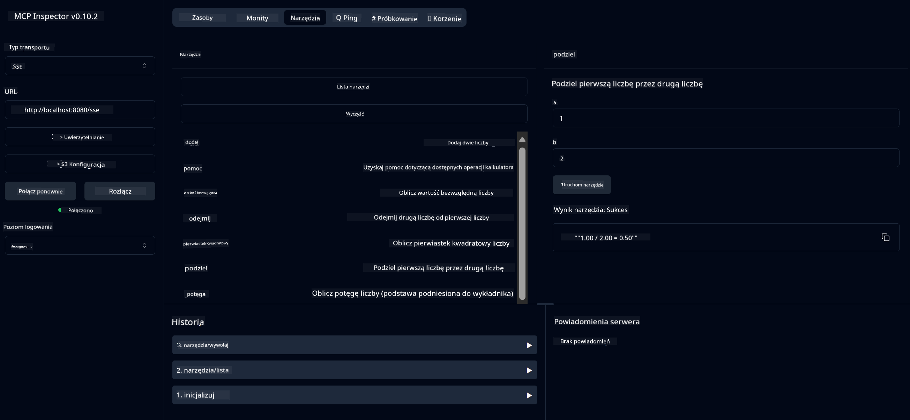

<!--
CO_OP_TRANSLATOR_METADATA:
{
  "original_hash": "7bf9a4a832911269a8bd0decb97ff36c",
  "translation_date": "2025-07-21T16:45:55+00:00",
  "source_file": "04-PracticalSamples/mcp/calculator/README.md",
  "language_code": "pl"
}
-->
# Podstawowa Usługa Kalkulatora MCP

>**Note**: Ten rozdział zawiera [**Samouczek**](./TUTORIAL.md), który krok po kroku pokazuje, jak uruchomić gotowe przykłady.

Witaj w swoim pierwszym praktycznym doświadczeniu z **Model Context Protocol (MCP)**! W poprzednich rozdziałach nauczyłeś się podstaw generatywnej sztucznej inteligencji i skonfigurowałeś swoje środowisko programistyczne. Teraz nadszedł czas, aby stworzyć coś praktycznego.

Ta usługa kalkulatora pokazuje, jak modele AI mogą bezpiecznie współpracować z zewnętrznymi narzędziami za pomocą MCP. Zamiast polegać na czasami zawodnych zdolnościach matematycznych modelu AI, pokażemy, jak zbudować solidny system, w którym AI może wywoływać wyspecjalizowane usługi w celu uzyskania dokładnych obliczeń.

## Spis treści

- [Czego się nauczysz](../../../../../04-PracticalSamples/mcp/calculator)
- [Wymagania wstępne](../../../../../04-PracticalSamples/mcp/calculator)
- [Kluczowe pojęcia](../../../../../04-PracticalSamples/mcp/calculator)
- [Szybki start](../../../../../04-PracticalSamples/mcp/calculator)
- [Dostępne operacje kalkulatora](../../../../../04-PracticalSamples/mcp/calculator)
- [Klienci testowi](../../../../../04-PracticalSamples/mcp/calculator)
  - [1. Bezpośredni klient MCP (SDKClient)](../../../../../04-PracticalSamples/mcp/calculator)
  - [2. Klient wspierany przez AI (LangChain4jClient)](../../../../../04-PracticalSamples/mcp/calculator)
- [MCP Inspector (Interfejs Webowy)](../../../../../04-PracticalSamples/mcp/calculator)
  - [Instrukcje krok po kroku](../../../../../04-PracticalSamples/mcp/calculator)

## Czego się nauczysz

Pracując z tym przykładem, dowiesz się:
- Jak tworzyć usługi zgodne z MCP za pomocą Spring Boot
- Różnicy między bezpośrednią komunikacją protokołową a interakcją wspieraną przez AI
- Jak modele AI decydują, kiedy i jak korzystać z zewnętrznych narzędzi
- Najlepszych praktyk w budowaniu aplikacji AI z obsługą narzędzi

Idealne dla początkujących, którzy uczą się koncepcji MCP i są gotowi zbudować swoją pierwszą integrację narzędzi AI!

## Wymagania wstępne

- Java 21+
- Maven 3.6+
- **Token GitHub**: Wymagany dla klienta wspieranego przez AI. Jeśli jeszcze go nie skonfigurowałeś, zobacz [Rozdział 2: Konfiguracja środowiska programistycznego](../../../02-SetupDevEnvironment/README.md) w celu uzyskania instrukcji.

## Kluczowe pojęcia

**Model Context Protocol (MCP)** to ustandaryzowany sposób, w jaki aplikacje AI mogą bezpiecznie łączyć się z zewnętrznymi narzędziami. Można go porównać do "mostu", który pozwala modelom AI korzystać z zewnętrznych usług, takich jak nasz kalkulator. Zamiast model AI próbować samodzielnie wykonywać obliczenia (co może być zawodne), może wywołać naszą usługę kalkulatora, aby uzyskać dokładne wyniki. MCP zapewnia, że ta komunikacja odbywa się bezpiecznie i konsekwentnie.

**Server-Sent Events (SSE)** umożliwia komunikację w czasie rzeczywistym między serwerem a klientami. W przeciwieństwie do tradycyjnych żądań HTTP, gdzie pytasz i czekasz na odpowiedź, SSE pozwala serwerowi na ciągłe wysyłanie aktualizacji do klienta. Jest to idealne rozwiązanie dla aplikacji AI, gdzie odpowiedzi mogą być przesyłane strumieniowo lub wymagać czasu na przetworzenie.

**Narzędzia AI i wywoływanie funkcji** pozwalają modelom AI automatycznie wybierać i korzystać z zewnętrznych funkcji (takich jak operacje kalkulatora) na podstawie żądań użytkownika. Gdy zapytasz "Ile to 15 + 27?", model AI rozumie, że chcesz wykonać dodawanie, automatycznie wywołuje naszą funkcję `add` z odpowiednimi parametrami (15, 27) i zwraca wynik w naturalnym języku. AI działa jako inteligentny koordynator, który wie, kiedy i jak używać każdego narzędzia.

## Szybki start

### 1. Przejdź do katalogu aplikacji kalkulatora
```bash
cd Generative-AI-for-beginners-java/04-PracticalSamples/mcp/calculator
```

### 2. Zbuduj i uruchom
```bash
mvn clean install -DskipTests
java -jar target/calculator-server-0.0.1-SNAPSHOT.jar
```

### 3. Testuj za pomocą klientów
- **SDKClient**: Bezpośrednia interakcja z protokołem MCP
- **LangChain4jClient**: Interakcja w naturalnym języku wspierana przez AI (wymaga tokena GitHub)

## Dostępne operacje kalkulatora

- `add(a, b)`, `subtract(a, b)`, `multiply(a, b)`, `divide(a, b)`
- `power(base, exponent)`, `squareRoot(number)`, `absolute(number)`
- `modulus(a, b)`, `help()`

## Klienci testowi

### 1. Bezpośredni klient MCP (SDKClient)
Testuje surową komunikację protokołu MCP. Uruchom za pomocą:
```bash
mvn test-compile exec:java -Dexec.mainClass="com.microsoft.mcp.sample.client.SDKClient" -Dexec.classpathScope=test
```

### 2. Klient wspierany przez AI (LangChain4jClient)
Pokazuje interakcję w naturalnym języku z modelami GitHub. Wymaga tokena GitHub (zobacz [Wymagania wstępne](../../../../../04-PracticalSamples/mcp/calculator)).

**Uruchom:**
```bash
mvn test-compile exec:java -Dexec.mainClass="com.microsoft.mcp.sample.client.LangChain4jClient" -Dexec.classpathScope=test
```

## MCP Inspector (Interfejs Webowy)

MCP Inspector oferuje wizualny interfejs webowy do testowania Twojej usługi MCP bez konieczności pisania kodu. Idealne dla początkujących, aby zrozumieć, jak działa MCP!

### Instrukcje krok po kroku:

1. **Uruchom serwer kalkulatora** (jeśli jeszcze nie działa):
   ```bash
   java -jar target/calculator-server-0.0.1-SNAPSHOT.jar
   ```

2. **Zainstaluj i uruchom MCP Inspector** w nowym terminalu:
   ```bash
   npx @modelcontextprotocol/inspector
   ```

3. **Otwórz interfejs webowy**:
   - Poszukaj komunikatu typu "Inspector running at http://localhost:6274"
   - Otwórz ten adres URL w swojej przeglądarce

4. **Połącz się z usługą kalkulatora**:
   - W interfejsie webowym ustaw typ transportu na "SSE"
   - Ustaw URL na: `http://localhost:8080/sse`
   - Kliknij przycisk "Connect"

5. **Przeglądaj dostępne narzędzia**:
   - Kliknij "List Tools", aby zobaczyć wszystkie operacje kalkulatora
   - Zobaczysz funkcje takie jak `add`, `subtract`, `multiply`, itd.

6. **Przetestuj operację kalkulatora**:
   - Wybierz narzędzie (np. "add")
   - Wprowadź parametry (np. `a: 15`, `b: 27`)
   - Kliknij "Run Tool"
   - Zobacz wynik zwrócony przez Twoją usługę MCP!

To wizualne podejście pomaga zrozumieć dokładnie, jak działa komunikacja MCP, zanim zaczniesz budować własnych klientów.



---
**Referencja:** [Dokumentacja MCP Server Boot Starter](https://docs.spring.io/spring-ai/reference/api/mcp/mcp-server-boot-starter-docs.html)

**Zastrzeżenie**:  
Ten dokument został przetłumaczony za pomocą usługi tłumaczenia AI [Co-op Translator](https://github.com/Azure/co-op-translator). Chociaż dokładamy wszelkich starań, aby tłumaczenie było precyzyjne, prosimy pamiętać, że automatyczne tłumaczenia mogą zawierać błędy lub nieścisłości. Oryginalny dokument w jego rodzimym języku powinien być uznawany za źródło autorytatywne. W przypadku informacji o kluczowym znaczeniu zaleca się skorzystanie z profesjonalnego tłumaczenia przez człowieka. Nie ponosimy odpowiedzialności za jakiekolwiek nieporozumienia lub błędne interpretacje wynikające z użycia tego tłumaczenia.