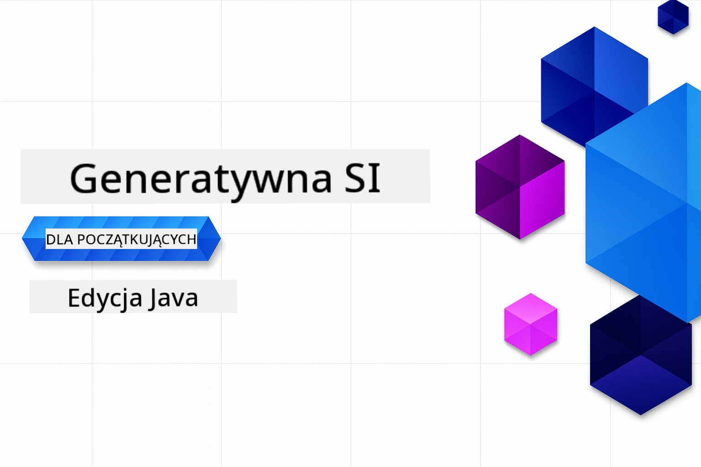

<!--
CO_OP_TRANSLATOR_METADATA:
{
  "original_hash": "d83a4cd2f465a83b72b5a5284d3a72fd",
  "translation_date": "2025-10-24T09:05:21+00:00",
  "source_file": "README.md",
  "language_code": "pl"
}
-->
# Generatywna AI dla początkujących - Edycja Java

**Czas trwania**: Cały warsztat można ukończyć online bez lokalnej konfiguracji. Przygotowanie środowiska zajmuje 2 minuty, a eksploracja przykładów od 1 do 3 godzin, w zależności od głębokości eksploracji.

> **Szybki start** 

1. Sforkuj to repozytorium na swoje konto GitHub
2. Kliknij **Code** → zakładka **Codespaces** → **...** → **New with options...**
3. Użyj domyślnych ustawień – zostanie wybrany kontener deweloperski stworzony dla tego kursu
4. Kliknij **Create codespace**
5. Poczekaj ~2 minuty na przygotowanie środowiska
6. Przejdź od razu do [Pierwszego przykładu](./02-SetupDevEnvironment/README.md#step-2-create-a-github-personal-access-token)

## Obsługa wielu języków

### Obsługiwane przez GitHub Action (Automatyczne i zawsze aktualne)

<!-- CO-OP TRANSLATOR LANGUAGES TABLE START -->
[Arabski](../ar/README.md) | [Bengalski](../bn/README.md) | [Bułgarski](../bg/README.md) | [Birmański (Myanmar)](../my/README.md) | [Chiński (uproszczony)](../zh/README.md) | [Chiński (tradycyjny, Hongkong)](../hk/README.md) | [Chiński (tradycyjny, Makau)](../mo/README.md) | [Chiński (tradycyjny, Tajwan)](../tw/README.md) | [Chorwacki](../hr/README.md) | [Czeski](../cs/README.md) | [Duński](../da/README.md) | [Holenderski](../nl/README.md) | [Estoński](../et/README.md) | [Fiński](../fi/README.md) | [Francuski](../fr/README.md) | [Niemiecki](../de/README.md) | [Grecki](../el/README.md) | [Hebrajski](../he/README.md) | [Hindi](../hi/README.md) | [Węgierski](../hu/README.md) | [Indonezyjski](../id/README.md) | [Włoski](../it/README.md) | [Japoński](../ja/README.md) | [Koreański](../ko/README.md) | [Litewski](../lt/README.md) | [Malajski](../ms/README.md) | [Marathi](../mr/README.md) | [Nepalski](../ne/README.md) | [Norweski](../no/README.md) | [Perski (Farsi)](../fa/README.md) | [Polski](./README.md) | [Portugalski (Brazylia)](../br/README.md) | [Portugalski (Portugalia)](../pt/README.md) | [Pendżabski (Gurmukhi)](../pa/README.md) | [Rumuński](../ro/README.md) | [Rosyjski](../ru/README.md) | [Serbski (cyrylica)](../sr/README.md) | [Słowacki](../sk/README.md) | [Słoweński](../sl/README.md) | [Hiszpański](../es/README.md) | [Suahili](../sw/README.md) | [Szwedzki](../sv/README.md) | [Tagalog (Filipiński)](../tl/README.md) | [Tamilski](../ta/README.md) | [Tajski](../th/README.md) | [Turecki](../tr/README.md) | [Ukraiński](../uk/README.md) | [Urdu](../ur/README.md) | [Wietnamski](../vi/README.md)
<!-- CO-OP TRANSLATOR LANGUAGES TABLE END -->

## Struktura kursu i ścieżka nauki

### **Rozdział 1: Wprowadzenie do generatywnej AI**
- **Podstawowe pojęcia**: Zrozumienie dużych modeli językowych, tokenów, osadzeń i możliwości AI
- **Ekosystem AI w Javie**: Przegląd Spring AI i OpenAI SDK
- **Protokół kontekstu modelu**: Wprowadzenie do MCP i jego roli w komunikacji agentów AI
- **Praktyczne zastosowania**: Scenariusze z życia wzięte, w tym chatboty i generowanie treści
- **[→ Rozpocznij Rozdział 1](./01-IntroToGenAI/README.md)**

### **Rozdział 2: Konfiguracja środowiska deweloperskiego**
- **Konfiguracja wielu dostawców**: Integracja GitHub Models, Azure OpenAI i OpenAI Java SDK
- **Spring Boot + Spring AI**: Najlepsze praktyki w tworzeniu aplikacji AI dla przedsiębiorstw
- **GitHub Models**: Darmowy dostęp do modeli AI do prototypowania i nauki (bez potrzeby karty kredytowej)
- **Narzędzia deweloperskie**: Konfiguracja kontenerów Docker, VS Code i GitHub Codespaces
- **[→ Rozpocznij Rozdział 2](./02-SetupDevEnvironment/README.md)**

### **Rozdział 3: Podstawowe techniki generatywnej AI**
- **Inżynieria promptów**: Techniki optymalizacji odpowiedzi modeli AI
- **Osadzenia i operacje na wektorach**: Implementacja wyszukiwania semantycznego i dopasowywania podobieństw
- **Generacja wspomagana wyszukiwaniem (RAG)**: Łączenie AI z własnymi źródłami danych
- **Wywoływanie funkcji**: Rozszerzanie możliwości AI za pomocą niestandardowych narzędzi i wtyczek
- **[→ Rozpocznij Rozdział 3](./03-CoreGenerativeAITechniques/README.md)**

### **Rozdział 4: Praktyczne zastosowania i projekty**
- **Generator opowieści o zwierzętach** (`petstory/`): Tworzenie kreatywnych treści z GitHub Models
- **Lokalna demonstracja Foundry** (`foundrylocal/`): Integracja lokalnych modeli AI z OpenAI Java SDK
- **Usługa kalkulatora MCP** (`calculator/`): Podstawowa implementacja protokołu kontekstu modelu z Spring AI
- **[→ Rozpocznij Rozdział 4](./04-PracticalSamples/README.md)**

### **Rozdział 5: Odpowiedzialny rozwój AI**
- **Bezpieczeństwo GitHub Models**: Testowanie wbudowanego filtrowania treści i mechanizmów bezpieczeństwa (blokady twarde i miękkie odmowy)
- **Demonstracja odpowiedzialnej AI**: Praktyczny przykład pokazujący działanie nowoczesnych systemów bezpieczeństwa AI
- **Najlepsze praktyki**: Kluczowe wytyczne dotyczące etycznego rozwoju i wdrażania AI
- **[→ Rozpocznij Rozdział 5](./05-ResponsibleGenAI/README.md)**

## Dodatkowe zasoby

<!-- CO-OP TRANSLATOR OTHER COURSES START -->
### Azure / Edge / MCP / Agenci

---
 
### Seria Generatywna AI

[-9333EA?style=for-the-badge&labelColor=E5E7EB&color=9333EA)](https://github.com/microsoft/Generative-AI-for-beginners-dotnet?WT.mc_id=academic-105485-koreyst)
[-C084FC?style=for-the-badge&labelColor=E5E7EB&color=C084FC)](https://github.com/microsoft/generative-ai-for-beginners-java?WT.mc_id=academic-105485-koreyst)
[-E879F9?style=for-the-badge&labelColor=E5E7EB&color=E879F9)](https://github.com/microsoft/generative-ai-with-javascript?WT.mc_id=academic-105485-koreyst)

---
 
### Podstawy nauki

---
 
### Seria Copilot

  
  
<!-- CO-OP TRANSLATOR OTHER COURSES END -->

## Uzyskiwanie pomocy

Jeśli utkniesz lub masz pytania dotyczące tworzenia aplikacji AI, dołącz do:

Jeśli masz uwagi dotyczące produktu lub napotkasz błędy podczas tworzenia, odwiedź:

---

**Zastrzeżenie**:  
Ten dokument został przetłumaczony za pomocą usługi tłumaczenia AI [Co-op Translator](https://github.com/Azure/co-op-translator). Chociaż staramy się zapewnić dokładność, prosimy pamiętać, że automatyczne tłumaczenia mogą zawierać błędy lub nieścisłości. Oryginalny dokument w jego rodzimym języku powinien być uznawany za autorytatywne źródło. W przypadku informacji krytycznych zaleca się skorzystanie z profesjonalnego tłumaczenia przez człowieka. Nie ponosimy odpowiedzialności za jakiekolwiek nieporozumienia lub błędne interpretacje wynikające z użycia tego tłumaczenia.