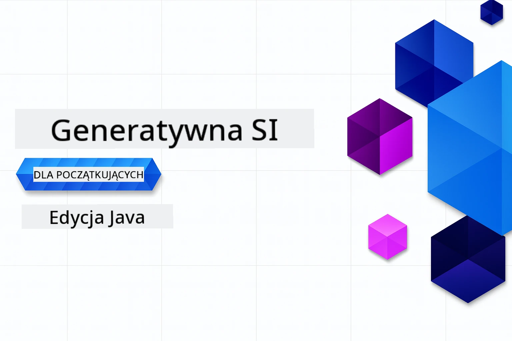

# Generatywna AI dla początkujących - wydanie Java
[](https://discord.gg/nTYy5BXMWG)



**Czas potrzebny**: Całe warsztaty można ukończyć online bez lokalnej konfiguracji. Konfiguracja środowiska trwa 2 minuty, eksploracja przykładów zajmuje od 1 do 3 godzin, w zależności od głębokości eksploracji.

> **Szybki start** 

1. Sforkuj to repozytorium na swoje konto GitHub
2. Kliknij **Code** → zakładka **Codespaces** → **...** → **New with options...**
3. Użyj domyślnych ustawień – to wybierze kontener deweloperski stworzony dla tego kursu
4. Kliknij **Create codespace**
5. Poczekaj około 2 minut na przygotowanie środowiska
6. Przejdź od razu do [Pierwszego przykładu](./02-SetupDevEnvironment/README.md#step-2-create-a-github-personal-access-token)

## Wsparcie wielojęzyczne

### Obsługiwane przez GitHub Action (automatyczne i zawsze aktualne)

<!-- CO-OP TRANSLATOR LANGUAGES TABLE START -->
[Arabski](../ar/README.md) | [Bengalski](../bn/README.md) | [Bułgarski](../bg/README.md) | [Birmański (Myanmar)](../my/README.md) | [Chiński (upr.)](../zh-CN/README.md) | [Chiński (trad., Hongkong)](../zh-HK/README.md) | [Chiński (trad., Makau)](../zh-MO/README.md) | [Chiński (trad., Tajwan)](../zh-TW/README.md) | [Chorwacki](../hr/README.md) | [Czeski](../cs/README.md) | [Duński](../da/README.md) | [Holenderski](../nl/README.md) | [Estoński](../et/README.md) | [Fiński](../fi/README.md) | [Francuski](../fr/README.md) | [Niemiecki](../de/README.md) | [Grecki](../el/README.md) | [Hebrajski](../he/README.md) | [Hindi](../hi/README.md) | [Węgierski](../hu/README.md) | [Indonezyjski](../id/README.md) | [Włoski](../it/README.md) | [Japoński](../ja/README.md) | [Kannada](../kn/README.md) | [Khmerski](../km/README.md) | [Koreański](../ko/README.md) | [Litewski](../lt/README.md) | [Malajski](../ms/README.md) | [Malajalam](../ml/README.md) | [Marathi](../mr/README.md) | [Nepalski](../ne/README.md) | [Nigeryjski Pidgin](../pcm/README.md) | [Norweski](../no/README.md) | [Perski (Farsi)](../fa/README.md) | [Polski](./README.md) | [Portugalski (Brazylia)](../pt-BR/README.md) | [Portugalski (Portugalia)](../pt-PT/README.md) | [Pendżabski (Gurmukhi)](../pa/README.md) | [Rumuński](../ro/README.md) | [Rosyjski](../ru/README.md) | [Serbski (cyrylica)](../sr/README.md) | [Słowacki](../sk/README.md) | [Słoweński](../sl/README.md) | [Hiszpański](../es/README.md) | [Suahili](../sw/README.md) | [Szwedzki](../sv/README.md) | [Tagalog (Filipiński)](../tl/README.md) | [Tamilski](../ta/README.md) | [Telugu](../te/README.md) | [Tajski](../th/README.md) | [Turecki](../tr/README.md) | [Ukraiński](../uk/README.md) | [Urdu](../ur/README.md) | [Wietnamski](../vi/README.md)

> **Wolisz klonować lokalnie?**
>
> To repozytorium zawiera tłumaczenia na ponad 50 języków, co znacząco zwiększa rozmiar pobierania. Aby sklonować bez tłumaczeń, użyj sparse checkout:
>
> **Bash / macOS / Linux:**
> ```bash
> git clone --filter=blob:none --sparse https://github.com/microsoft/Generative-AI-for-beginners-java.git
> cd Generative-AI-for-beginners-java
> git sparse-checkout set --no-cone '/*' '!translations' '!translated_images'
> ```
>
> **CMD (Windows):**
> ```cmd
> git clone --filter=blob:none --sparse https://github.com/microsoft/Generative-AI-for-beginners-java.git
> cd Generative-AI-for-beginners-java
> git sparse-checkout set --no-cone "/*" "!translations" "!translated_images"
> ```
>
> To zapewni wszystko, co potrzebne do ukończenia kursu, z dużo szybszym pobieraniem.
<!-- CO-OP TRANSLATOR LANGUAGES TABLE END -->

## Struktura kursu i ścieżka nauki

### **Rozdział 1: Wprowadzenie do Generatywnej AI**
- **Podstawowe pojęcia**: Zrozumienie dużych modeli językowych, tokenów, osadzania i możliwości AI
- **Ekosystem AI w Javie**: Przegląd Spring AI i bibliotek OpenAI SDK
- **Protokół kontekstu modelu**: Wprowadzenie do MCP i jego roli w komunikacji agentów AI
- **Praktyczne zastosowania**: Scenariusze rzeczywiste, w tym chatboty i generowanie treści
- **[→ Rozpocznij Rozdział 1](./01-IntroToGenAI/README.md)**

### **Rozdział 2: Konfiguracja środowiska programistycznego**
- **Konfiguracja wielodostawcy**: Ustawienia GitHub Models, Azure OpenAI i OpenAI Java SDK
- **Spring Boot + Spring AI**: Najlepsze praktyki w rozwijaniu aplikacji AI na potrzeby przedsiębiorstw
- **GitHub Models**: Darmowy dostęp do modeli AI do prototypowania i nauki (bez wymogu karty kredytowej)
- **Narzędzia deweloperskie**: Kontenery Docker, VS Code i konfiguracja GitHub Codespaces
- **[→ Rozpocznij Rozdział 2](./02-SetupDevEnvironment/README.md)**

### **Rozdział 3: Podstawowe techniki generatywnej AI**
- **Inżynieria promptów**: Techniki optymalizacji odpowiedzi modeli AI
- **Osadzania i operacje na wektorach**: Implementacja wyszukiwania semantycznego i dopasowywania podobieństw
- **Generowanie wspomagane wyszukiwaniem (RAG)**: Łączenie AI z własnymi źródłami danych
- **Wywoływanie funkcji**: Rozszerzanie możliwości AI za pomocą własnych narzędzi i wtyczek
- **[→ Rozpocznij Rozdział 3](./03-CoreGenerativeAITechniques/README.md)**

### **Rozdział 4: Praktyczne zastosowania i projekty**
- **Generator historii o zwierzętach** (`petstory/`): Kreatywne generowanie treści z wykorzystaniem GitHub Models
- **Demo lokalne Foundry** (`foundrylocal/`): Lokalna integracja modeli AI z użyciem OpenAI Java SDK
- **Usługa kalkulator MCP** (`calculator/`): Podstawowa implementacja Model Context Protocol ze Spring AI
- **[→ Rozpocznij Rozdział 4](./04-PracticalSamples/README.md)**

### **Rozdział 5: Odpowiedzialny rozwój AI**
- **Bezpieczeństwo GitHub Models**: Testowanie wbudowanych filtrów treści i mechanizmów bezpieczeństwa (twarde blokady i miękkie odmowy)
- **Demo odpowiedzialnej AI**: Praktyczny przykład działania systemów bezpieczeństwa w nowoczesnej AI
- **Najlepsze praktyki**: Podstawowe wytyczne etycznego rozwoju i wdrażania AI
- **[→ Rozpocznij Rozdział 5](./05-ResponsibleGenAI/README.md)**

## Dodatkowe zasoby

<!-- CO-OP TRANSLATOR OTHER COURSES START -->
### LangChain
[](https://aka.ms/langchain4j-for-beginners)
[](https://aka.ms/langchainjs-for-beginners?WT.mc_id=m365-94501-dwahlin)
[](https://github.com/microsoft/langchain-for-beginners?WT.mc_id=m365-94501-dwahlin)
---

### Azure / Edge / MCP / Agenci
[](https://github.com/microsoft/AZD-for-beginners?WT.mc_id=academic-105485-koreyst)
[](https://github.com/microsoft/edgeai-for-beginners?WT.mc_id=academic-105485-koreyst)
[](https://github.com/microsoft/mcp-for-beginners?WT.mc_id=academic-105485-koreyst)
[](https://github.com/microsoft/ai-agents-for-beginners?WT.mc_id=academic-105485-koreyst)

---
 
### Seria Generatywna AI
[](https://github.com/microsoft/generative-ai-for-beginners?WT.mc_id=academic-105485-koreyst)
[-9333EA?style=for-the-badge&labelColor=E5E7EB&color=9333EA)](https://github.com/microsoft/Generative-AI-for-beginners-dotnet?WT.mc_id=academic-105485-koreyst)
[-C084FC?style=for-the-badge&labelColor=E5E7EB&color=C084FC)](https://github.com/microsoft/generative-ai-for-beginners-java?WT.mc_id=academic-105485-koreyst)
[-E879F9?style=for-the-badge&labelColor=E5E7EB&color=E879F9)](https://github.com/microsoft/generative-ai-with-javascript?WT.mc_id=academic-105485-koreyst)

---
 
### Podstawy nauki
[](https://aka.ms/ml-beginners?WT.mc_id=academic-105485-koreyst)
[](https://aka.ms/datascience-beginners?WT.mc_id=academic-105485-koreyst)
[](https://aka.ms/ai-beginners?WT.mc_id=academic-105485-koreyst)
[](https://github.com/microsoft/Security-101?WT.mc_id=academic-96948-sayoung)

[](https://aka.ms/webdev-beginners?WT.mc_id=academic-105485-koreyst)
[](https://aka.ms/iot-beginners?WT.mc_id=academic-105485-koreyst)
[](https://github.com/microsoft/xr-development-for-beginners?WT.mc_id=academic-105485-koreyst)

---
 
### Seria Copilot
[](https://aka.ms/GitHubCopilotAI?WT.mc_id=academic-105485-koreyst)
[](https://github.com/microsoft/mastering-github-copilot-for-dotnet-csharp-developers?WT.mc_id=academic-105485-koreyst)
[](https://github.com/microsoft/CopilotAdventures?WT.mc_id=academic-105485-koreyst)
<!-- CO-OP TRANSLATOR OTHER COURSES END -->

## Uzyskaj Pomoc

Jeśli utkniesz lub masz pytania dotyczące tworzenia aplikacji AI, dołącz do innych uczących się i doświadczonych programistów w dyskusjach o MCP. To wspierająca społeczność, gdzie pytania są mile widziane, a wiedza jest otwarcie dzielona.

[](https://discord.gg/nTYy5BXMWG)

Jeśli masz opinie o produkcie lub napotkasz błędy podczas tworzenia, odwiedź:

[](https://aka.ms/foundry/forum)

---

<!-- CO-OP TRANSLATOR DISCLAIMER START -->
**Zastrzeżenie**:  
Niniejszy dokument został przetłumaczony za pomocą usługi tłumaczeń AI [Co-op Translator](https://github.com/Azure/co-op-translator). Chociaż dążymy do dokładności, prosimy pamiętać, że automatyczne tłumaczenia mogą zawierać błędy lub niedokładności. Oryginalny dokument w jego rodzimym języku powinien być uważany za źródło autorytatywne. W przypadku informacji krytycznych zalecane jest skorzystanie z profesjonalnego tłumaczenia wykonanego przez człowieka. Nie ponosimy odpowiedzialności za jakiekolwiek nieporozumienia lub błędne interpretacje wynikające z użycia tego tłumaczenia.
<!-- CO-OP TRANSLATOR DISCLAIMER END -->