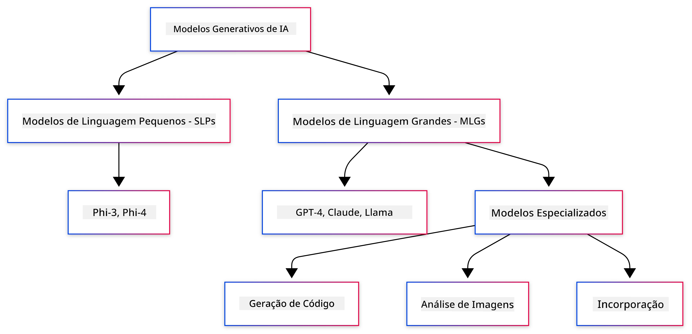
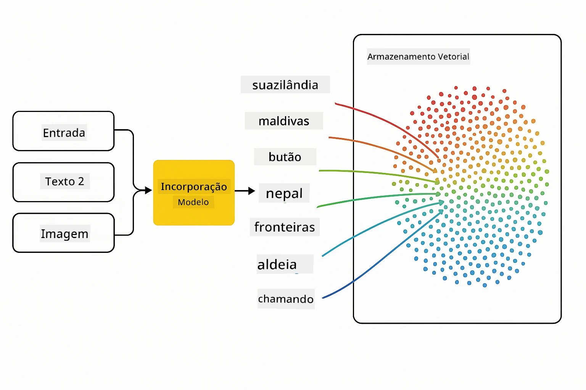
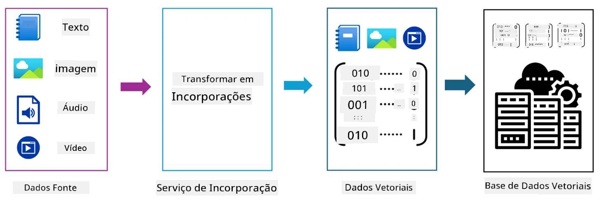
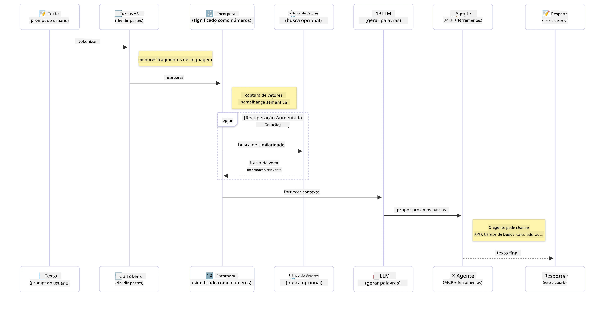

# Introdução à IA Generativa - Edição Java

> **Vídeo**: [Assista ao vídeo de visão geral desta lição no YouTube.](https://www.youtube.com/watch?v=XH46tGp_eSw) Você também pode clicar na imagem em miniatura acima.

## O que você aprenderá

- **Fundamentos da IA generativa**, incluindo LLMs, engenharia de prompts, tokens, embeddings e bancos de dados vetoriais
- **Comparar ferramentas de desenvolvimento de IA em Java**, incluindo Azure OpenAI SDK, Spring AI e OpenAI Java SDK
- **Descobrir o Protocolo de Contexto do Modelo** e seu papel na comunicação de agentes de IA

## Sumário

- [Introdução](#introdução)
- [Uma revisão rápida dos conceitos de IA generativa](#uma-revisão-rápida-dos-conceitos-de-ia-generativa)
- [Revisão de engenharia de prompt](#revisão-de-engenharia-de-prompt)
- [Tokens, embeddings e agentes](#tokens-embeddings-e-agentes)
- [Ferramentas e Bibliotecas de Desenvolvimento de IA para Java](#ferramentas-e-bibliotecas-de-desenvolvimento-de-ia-para-java)
  - [OpenAI Java SDK](#openai-java-sdk)
  - [Spring AI](#spring-ai)
  - [Azure OpenAI Java SDK](#azure-openai-java-sdk)
- [Resumo](#resumo)
- [Próximos Passos](#próximos-passos)

## Introdução

Bem-vindo ao primeiro capítulo de IA Generativa para Iniciantes - Edição Java! Esta lição fundamental apresenta os conceitos principais da IA generativa e como trabalhar com eles usando Java. Você aprenderá sobre os blocos essenciais para aplicações de IA, incluindo Grandes Modelos de Linguagem (LLMs), tokens, embeddings e agentes de IA. Também exploraremos as principais ferramentas Java que você utilizará ao longo deste curso.

### Uma revisão rápida dos conceitos de IA generativa

IA generativa é um tipo de inteligência artificial que cria novo conteúdo, como texto, imagens ou código, com base em padrões e relações aprendidas a partir de dados. Modelos de IA generativa podem gerar respostas semelhantes às humanas, entender o contexto e, às vezes, até criar conteúdo que parece humano.

À medida que você desenvolve suas aplicações de IA em Java, trabalhará com **modelos de IA generativa** para criar conteúdo. Algumas capacidades desses modelos incluem:

- **Geração de texto**: Criar textos semelhantes aos humanos para chatbots, conteúdo e preenchimento de texto.
- **Geração e análise de imagens**: Produzir imagens realistas, melhorar fotos e detectar objetos.
- **Geração de código**: Escrever trechos de código ou scripts.

Existem tipos específicos de modelos otimizados para diferentes tarefas. Por exemplo, tanto **Pequenos Modelos de Linguagem (SLMs)** quanto **Grandes Modelos de Linguagem (LLMs)** podem lidar com geração de texto, sendo os LLMs tipicamente melhores para tarefas complexas. Para tarefas relacionadas a imagens, você usaria modelos especializados de visão ou modelos multimodais.

Claro que as respostas desses modelos não são perfeitas o tempo todo. Você provavelmente já ouviu falar sobre modelos "alucinando" ou gerando informações incorretas de maneira autoritária. Mas você pode ajudar a guiar o modelo para gerar respostas melhores fornecendo instruções claras e contexto. É aí que a **engenharia de prompts** entra.

#### Revisão de engenharia de prompt

Engenharia de prompt é a prática de projetar entradas eficazes para guiar modelos de IA a obter os resultados desejados. Envolve:

- **Clareza**: Tornar as instruções claras e sem ambiguidades.
- **Contexto**: Fornecer informações de fundo necessárias.
- **Restrições**: Especificar quaisquer limitações ou formatos.

Algumas melhores práticas para engenharia de prompt incluem design de prompts, instruções claras, divisão de tarefas, aprendizado one-shot e few-shot, e ajuste de prompts. Testar diferentes prompts é essencial para encontrar o que funciona melhor para seu caso específico.

Ao desenvolver aplicações, você trabalhará com diferentes tipos de prompt:
- **Prompts do sistema**: Definem as regras base e o contexto para o comportamento do modelo
- **Prompts do usuário**: Os dados de entrada provenientes dos usuários da sua aplicação
- **Prompts do assistente**: As respostas do modelo baseadas nos prompts do sistema e do usuário

> **Saiba mais**: Saiba mais sobre engenharia de prompt no [Capítulo de Engenharia de Prompt do curso GenAI para Iniciantes](https://github.com/microsoft/generative-ai-for-beginners/tree/main/04-prompt-engineering-fundamentals)

#### Tokens, embeddings e agentes

Ao trabalhar com modelos de IA generativa, você encontrará termos como **tokens**, **embeddings**, **agentes** e **Protocolo de Contexto do Modelo (MCP)**. Aqui está uma visão detalhada desses conceitos:

- **Tokens**: Tokens são a menor unidade de texto em um modelo. Podem ser palavras, caracteres ou subpalavras. Tokens são usados para representar dados textuais em um formato que o modelo pode compreender. Por exemplo, a frase "The quick brown fox jumped over the lazy dog" pode ser tokenizada como ["The", " quick", " brown", " fox", " jumped", " over", " the", " lazy", " dog"] ou ["The", " qu", "ick", " br", "own", " fox", " jump", "ed", " over", " the", " la", "zy", " dog"] dependendo da estratégia de tokenização.

Tokenização é o processo de dividir o texto em unidades menores. Isso é crucial porque os modelos operam sobre tokens e não sobre texto bruto. O número de tokens em um prompt afeta o comprimento e a qualidade da resposta do modelo, pois há limites de tokens para a janela de contexto do modelo (por exemplo, 128 mil tokens para o contexto total do GPT-4o, incluindo entrada e saída).

  Em Java, você pode usar bibliotecas como o OpenAI SDK para lidar automaticamente com a tokenização ao enviar solicitações para modelos de IA.

- **Embeddings**: Embeddings são representações vetoriais de tokens que capturam significado semântico. São representações numéricas (tipicamente arrays de números de ponto flutuante) que permitem que os modelos entendam relações entre palavras e gerem respostas contextualmente relevantes. Palavras semelhantes têm embeddings semelhantes, permitindo que o modelo compreenda conceitos como sinônimos e relações semânticas.

  Em Java, você pode gerar embeddings usando o OpenAI SDK ou outras bibliotecas que suportem essa geração. Esses embeddings são essenciais para tarefas como busca semântica, onde você deseja encontrar conteúdo similar com base no significado ao invés de correspondências exatas de texto.

- **Bancos de dados vetoriais**: Bancos de dados vetoriais são sistemas de armazenamento especializados e otimizados para embeddings. Eles permitem buscas de similaridade eficientes e são cruciais para padrões de Recuperação-Aumentada por Geração (RAG), onde você precisa encontrar informações relevantes em grandes conjuntos de dados baseando-se em similaridade semântica e não em correspondência exata.

> **Nota**: Neste curso, não cobriremos bancos de dados vetoriais, mas achamos importante mencioná-los pois são comumente usados em aplicações do mundo real.

- **Agentes e MCP**: Componentes de IA que interagem autonomamente com modelos, ferramentas e sistemas externos. O Protocolo de Contexto do Modelo (MCP) fornece uma maneira padronizada para agentes acessarem com segurança fontes de dados e ferramentas externas. Saiba mais em nosso curso [MCP para Iniciantes](https://github.com/microsoft/mcp-for-beginners).

Nas aplicações de IA em Java, você usará tokens para processamento de texto, embeddings para busca semântica e RAG, bancos de dados vetoriais para recuperação de dados, e agentes com MCP para construir sistemas inteligentes que usam ferramentas.

### Ferramentas e Bibliotecas de Desenvolvimento de IA para Java

Java oferece excelentes ferramentas para desenvolvimento de IA. Existem três bibliotecas principais que exploraremos durante este curso - OpenAI Java SDK, Azure OpenAI SDK e Spring AI.

Aqui está uma tabela de referência rápida mostrando qual SDK é usado nos exemplos de cada capítulo:

| Capítulo | Exemplo | SDK |
|---------|--------|-----|
| 02-SetupDevEnvironment | github-models | OpenAI Java SDK |
| 02-SetupDevEnvironment | basic-chat-azure | Spring AI Azure OpenAI |
| 03-CoreGenerativeAITechniques | examples | Azure OpenAI SDK |
| 04-PracticalSamples | petstory | OpenAI Java SDK |
| 04-PracticalSamples | foundrylocal | OpenAI Java SDK |
| 04-PracticalSamples | calculator | Spring AI MCP SDK + LangChain4j |

**Links da Documentação do SDK:**
- [Azure OpenAI Java SDK](https://github.com/Azure/azure-sdk-for-java/tree/azure-ai-openai_1.0.0-beta.16/sdk/openai/azure-ai-openai)
- [Spring AI](https://docs.spring.io/spring-ai/reference/)
- [OpenAI Java SDK](https://github.com/openai/openai-java)
- [LangChain4j](https://docs.langchain4j.dev/)

#### OpenAI Java SDK

O OpenAI SDK é a biblioteca oficial Java para a API OpenAI. Ele fornece uma interface simples e consistente para interagir com os modelos OpenAI, facilitando a integração de capacidades de IA em aplicações Java. O exemplo GitHub Models do Capítulo 2, a aplicação Pet Story e o exemplo Foundry Local do Capítulo 4 demonstram a abordagem do OpenAI SDK.

#### Spring AI

O Spring AI é um framework abrangente que traz capacidades de IA para aplicações Spring, oferecendo uma camada de abstração consistente entre diferentes provedores de IA. Ele se integra perfeitamente ao ecossistema Spring, sendo a escolha ideal para aplicações Java empresariais que precisam de capacidades de IA.

A força do Spring AI está na sua integração perfeita com o ecossistema Spring, facilitando a criação de aplicações de IA prontas para produção com padrões Spring familiares como injeção de dependência, gerenciamento de configuração e frameworks de teste. Você usará o Spring AI nos Capítulos 2 e 4 para construir aplicações que aproveitam tanto o OpenAI quanto o Protocolo de Contexto do Modelo (MCP) nas bibliotecas Spring AI.

##### Protocolo de Contexto do Modelo (MCP)

O [Protocolo de Contexto do Modelo (MCP)](https://modelcontextprotocol.io/) é um padrão emergente que permite que aplicações de IA interajam com segurança com fontes de dados e ferramentas externas. O MCP fornece uma maneira padronizada para modelos de IA acessarem informações contextuais e executarem ações nas suas aplicações.

No Capítulo 4, você construirá um serviço de calculadora simples MCP que demonstra os fundamentos do Protocolo de Contexto do Modelo com Spring AI, mostrando como criar integrações básicas de ferramentas e arquiteturas de serviço.

#### Azure OpenAI Java SDK

A biblioteca cliente Azure OpenAI para Java é uma adaptação das APIs REST da OpenAI que fornece uma interface idiomática e integração com o restante do ecossistema Azure SDK. No Capítulo 3, você construirá aplicações usando o Azure OpenAI SDK, incluindo aplicações de chat, chamadas de função e padrões RAG (Recuperação-Aumentada por Geração).

> Nota: O Azure OpenAI SDK está atrás do OpenAI Java SDK em termos de funcionalidades, então para projetos futuros, considere usar o OpenAI Java SDK.

## Resumo

Isso encerra as bases! Agora você entende:

- Os conceitos principais por trás da IA generativa - desde LLMs e engenharia de prompt até tokens, embeddings e bancos de dados vetoriais
- Suas opções de ferramentas para desenvolvimento de IA em Java: Azure OpenAI SDK, Spring AI e OpenAI Java SDK
- O que é o Protocolo de Contexto do Modelo e como ele permite que agentes de IA trabalhem com ferramentas externas

## Próximos Passos

[Capítulo 2: Configurando o Ambiente de Desenvolvimento](../02-SetupDevEnvironment/README.md)

---

<!-- CO-OP TRANSLATOR DISCLAIMER START -->
**Aviso Legal**:  
Este documento foi traduzido usando o serviço de tradução por IA [Co-op Translator](https://github.com/Azure/co-op-translator). Embora nos esforcemos pela precisão, esteja ciente de que traduções automatizadas podem conter erros ou imprecisões. O documento original em seu idioma nativo deve ser considerado a fonte autorizada. Para informações críticas, recomenda-se tradução profissional humana. Não nos responsabilizamos por quaisquer mal-entendidos ou interpretações equivocadas decorrentes do uso desta tradução.
<!-- CO-OP TRANSLATOR DISCLAIMER END -->