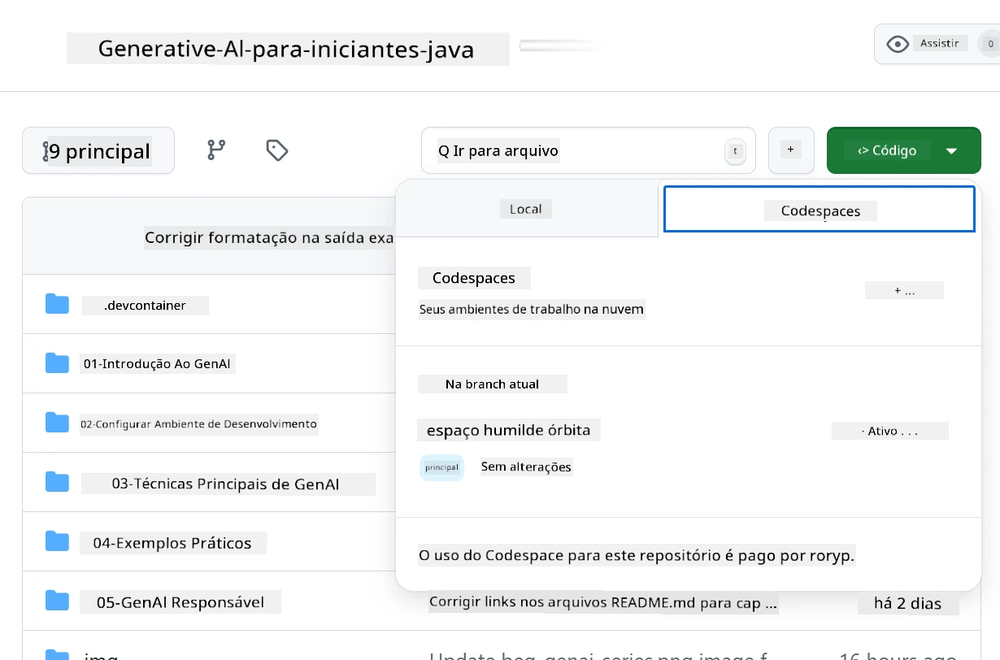
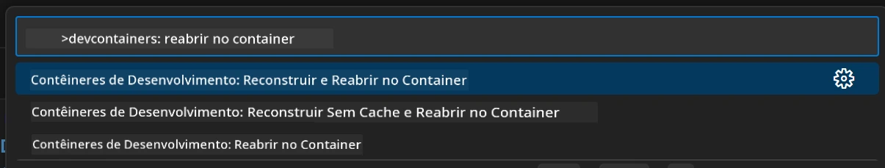
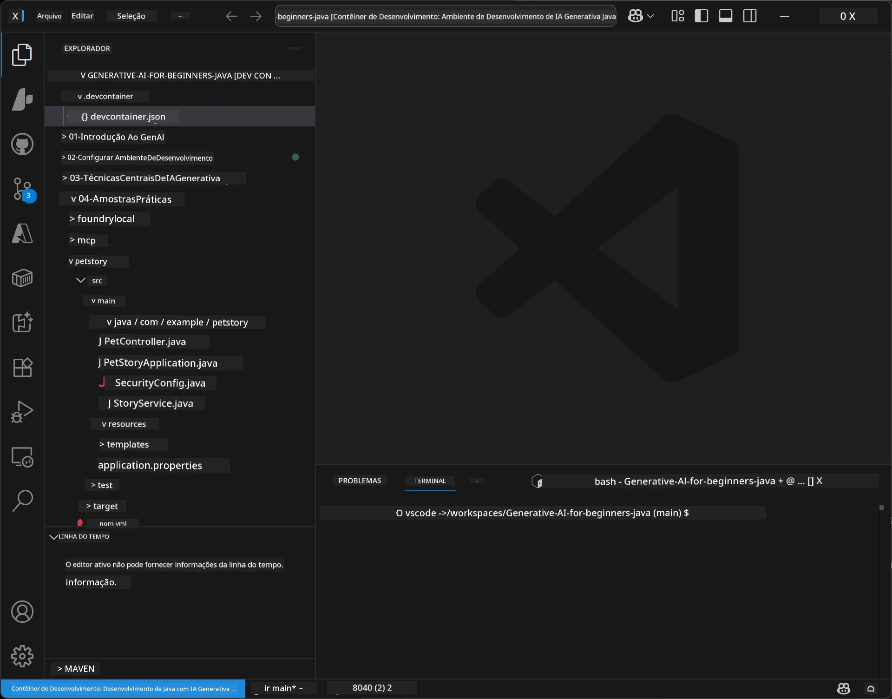
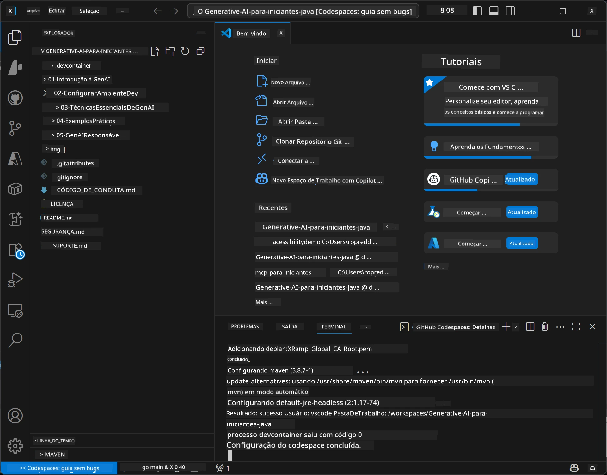

# Configurando o Ambiente de Desenvolvimento para IA Generativa para Java

> **Início Rápido**: Codifique na nuvem em 2 minutos - Vá para [Configuração do GitHub Codespaces](../../../02-SetupDevEnvironment) - não é necessário instalar localmente e usa modelos do GitHub!

> **Interessado em Azure OpenAI?**, veja nosso [Guia de Configuração do Azure OpenAI](getting-started-azure-openai.md) com passos para criar um novo recurso Azure OpenAI.

## O que você vai aprender

- Configurar um ambiente de desenvolvimento Java para aplicações de IA
- Escolher e configurar seu ambiente de desenvolvimento preferido (priorizando nuvem com Codespaces, contêiner dev local ou configuração local completa)
- Testar sua configuração conectando-se aos Modelos do GitHub

## Sumário

- [O que você vai aprender](../../../02-SetupDevEnvironment)
- [Introdução](../../../02-SetupDevEnvironment)
- [Passo 1: Configure seu Ambiente de Desenvolvimento](../../../02-SetupDevEnvironment)
  - [Opção A: GitHub Codespaces (Recomendado)](../../../02-SetupDevEnvironment)
  - [Opção B: Contêiner Dev Local](../../../02-SetupDevEnvironment)
  - [Opção C: Use sua Instalação Local Existente](../../../02-SetupDevEnvironment)
- [Passo 2: Crie um Token de Acesso Pessoal do GitHub](../../../02-SetupDevEnvironment)
- [Passo 3: Teste sua Configuração](../../../02-SetupDevEnvironment)
- [Resolução de Problemas](../../../02-SetupDevEnvironment)
- [Resumo](../../../02-SetupDevEnvironment)
- [Próximos Passos](../../../02-SetupDevEnvironment)

## Introdução

Este capítulo irá guiá-lo na configuração de um ambiente de desenvolvimento. Usaremos **Modelos do GitHub** como nosso exemplo principal porque são gratuitos, fáceis de configurar com apenas uma conta GitHub, não exigem cartão de crédito e fornecem acesso a múltiplos modelos para experimentação.

**Nenhuma configuração local necessária!** Você pode começar a programar imediatamente usando GitHub Codespaces, que oferece um ambiente de desenvolvimento completo no seu navegador.


Recomendamos usar [**Modelos do GitHub**](https://github.com/marketplace?type=models) para este curso porque são:
- **Gratuitos** para começar
- **Fáceis** de configurar com apenas uma conta GitHub
- **Sem cartão de crédito** necessário
- **Vários modelos** disponíveis para experimentação

> **Nota**: Os Modelos do GitHub usados neste treinamento possuem estes limites gratuitos:
> - 15 requisições por minuto (150 por dia)
> - ~8.000 palavras de entrada, ~4.000 palavras de saída por requisição
> - 5 requisições simultâneas
> 
> Para uso em produção, faça upgrade para Modelos Azure AI Foundry com sua conta Azure. Seu código não precisa mudar. Veja a [documentação Azure AI Foundry](https://learn.microsoft.com/azure/ai-foundry/foundry-models/how-to/quickstart-github-models).


## Passo 1: Configure seu Ambiente de Desenvolvimento

<a name="quick-start-cloud"></a>

Criamos um contêiner de desenvolvimento pré-configurado para minimizar o tempo de configuração e garantir que você tenha todas as ferramentas necessárias para este curso de IA Generativa para Java. Escolha a abordagem de desenvolvimento preferida:

### Opções de Configuração do Ambiente:

#### Opção A: GitHub Codespaces (Recomendado)

**Comece a programar em 2 minutos - sem necessidade de instalação local!**

1. Faça fork deste repositório para sua conta GitHub  
   > **Nota**: Se quiser editar a configuração básica, dê uma olhada na [Configuração do Contêiner Dev](../../../.devcontainer/devcontainer.json)  
2. Clique em **Code** → aba **Codespaces** → **...** → **Novo com opções...**  
3. Use os padrões – isso selecionará a **configuração do Contêiner Dev**: **Ambiente de Desenvolvimento IA Generativa Java**, contêiner personalizado criado para este curso  
4. Clique em **Create codespace**  
5. Aguarde cerca de 2 minutos até o ambiente ficar pronto  
6. Proceda para [Passo 2: Criar Token GitHub](../../../02-SetupDevEnvironment)




> **Benefícios dos Codespaces**:
> - Nenhuma instalação local necessária
> - Funciona em qualquer dispositivo com navegador
> - Pré-configurado com todas as ferramentas e dependências
> - 60 horas grátis por mês para contas pessoais
> - Ambiente consistente para todos os alunos

#### Opção B: Contêiner Dev Local

**Para desenvolvedores que preferem desenvolvimento local com Docker**

1. Faça fork e clone este repositório na sua máquina local  
   > **Nota**: Se quiser editar a configuração básica, dê uma olhada na [Configuração do Contêiner Dev](../../../.devcontainer/devcontainer.json)  
2. Instale [Docker Desktop](https://www.docker.com/products/docker-desktop/) e [VS Code](https://code.visualstudio.com/)  
3. Instale a [extensão Dev Containers](https://marketplace.visualstudio.com/items?itemName=ms-vscode-remote.remote-containers) no VS Code  
4. Abra a pasta do repositório no VS Code  
5. Quando solicitado, clique em **Reabrir no Contêiner** (ou use `Ctrl+Shift+P` → "Dev Containers: Reopen in Container")  
6. Aguarde o contêiner ser construído e iniciado  
7. Proceda para [Passo 2: Criar Token GitHub](../../../02-SetupDevEnvironment)





#### Opção C: Use sua Instalação Local Existente

**Para desenvolvedores com ambientes Java já existentes**

Pré-requisitos:
- [Java 21+](https://www.oracle.com/java/technologies/javase/jdk21-archive-downloads.html)  
- [Maven 3.9+](https://maven.apache.org/download.cgi)  
- [VS Code](https://code.visualstudio.com) ou sua IDE preferida

Passos:
1. Clone este repositório na sua máquina local  
2. Abra o projeto na sua IDE  
3. Proceda para [Passo 2: Criar Token GitHub](../../../02-SetupDevEnvironment)

> **Dica profissional**: Se você tem uma máquina com pouca capacidade mas quer usar VS Code localmente, use GitHub Codespaces! Você pode conectar seu VS Code local a um Codespace hospedado na nuvem para aproveitar o melhor dos dois mundos.




## Passo 2: Crie um Token de Acesso Pessoal do GitHub

1. Navegue para [Configurações do GitHub](https://github.com/settings/profile) e selecione **Settings** no menu do seu perfil.  
2. Na barra lateral esquerda, clique em **Developer settings** (geralmente no final).  
3. Em **Personal access tokens**, clique em **Fine-grained tokens** (ou siga este [link direto](https://github.com/settings/personal-access-tokens)).  
4. Clique em **Generate new token**.  
5. Em "Token name", forneça um nome descritivo (ex: `GenAI-Java-Course-Token`).  
6. Defina uma data de expiração (recomendado: 7 dias para melhores práticas de segurança).  
7. Em "Resource owner", selecione sua conta de usuário.  
8. Em "Repository access", selecione os repositórios que deseja usar com os Modelos do GitHub (ou "All repositories" se necessário).  
9. Em "Account permissions", encontre **Models** e defina como **Somente leitura**.  
10. Clique em **Generate token**.  
11. **Copie e salve seu token agora** – você não verá ele novamente!

> **Dica de Segurança**: Use o escopo mínimo necessário e o menor tempo de expiração viável para seus tokens de acesso.

## Passo 3: Teste sua Configuração com o Exemplo dos Modelos do GitHub

Quando seu ambiente de desenvolvimento estiver pronto, vamos testar a integração com os Modelos do GitHub usando nossa aplicação exemplo em [`02-SetupDevEnvironment/examples/github-models`](../../../02-SetupDevEnvironment/examples/github-models).

1. Abra o terminal no seu ambiente de desenvolvimento.  
2. Navegue para o exemplo dos Modelos do GitHub:  
   ```bash
   cd 02-SetupDevEnvironment/examples/github-models
   ```
  
3. Defina seu token GitHub como variável de ambiente:  
   ```bash
   # macOS/Linux
   export GITHUB_TOKEN=your_token_here
   
   # Windows (Prompt de Comando)
   set GITHUB_TOKEN=your_token_here
   
   # Windows (PowerShell)
   $env:GITHUB_TOKEN="your_token_here"
   ```
  
4. Execute a aplicação:  
   ```bash
   mvn compile exec:java -Dexec.mainClass="com.example.githubmodels.App"
   ```
  
Você deverá ver uma saída semelhante a:  
```text
Using model: gpt-4.1-nano
Sending request to GitHub Models...
Response: Hello World!
```
  
### Entendendo o Código Exemplo

Primeiro, vamos entender o que acabamos de executar. O exemplo em `examples/github-models` usa o SDK Java OpenAI para conectar-se aos Modelos do GitHub:

**O que este código faz:**
- **Conecta** aos Modelos do GitHub usando seu token de acesso pessoal  
- **Envia** uma mensagem simples "Say Hello World!" para o modelo de IA  
- **Recebe** e exibe a resposta da IA  
- **Valida** que sua configuração está funcionando corretamente

**Dependência Principal** (em `pom.xml`):  
```xml
<dependency>
    <groupId>com.openai</groupId>
    <artifactId>openai-java</artifactId>
    <version>2.12.0</version>
</dependency>
```
  
**Código Principal** (`App.java`):  
```java
// Conectar aos Modelos do GitHub usando o SDK Java do OpenAI
OpenAIClient client = OpenAIOkHttpClient.builder()
    .apiKey(pat)
    .baseUrl("https://models.inference.ai.azure.com")
    .build();

// Criar solicitação de conclusão de chat
ChatCompletionCreateParams params = ChatCompletionCreateParams.builder()
    .model(modelId)
    .addSystemMessage("You are a concise assistant.")
    .addUserMessage("Say Hello World!")
    .build();

// Obter resposta da IA
ChatCompletion response = client.chat().completions().create(params);
System.out.println("Response: " + response.choices().get(0).message().content().orElse("No response content"));
```
  
## Resumo

Ótimo! Agora você tem tudo configurado:

- Criou um Token de Acesso Pessoal do GitHub com as permissões corretas para acesso a modelos de IA  
- Colocou seu ambiente de desenvolvimento Java para funcionar (seja Codespaces, contêineres dev ou local)  
- Conectou-se aos Modelos do GitHub usando o SDK Java OpenAI para desenvolvimento gratuito de IA  
- Testou se tudo funciona com um exemplo simples que conversa com modelos de IA

## Próximos Passos

[Capítulo 3: Técnicas de IA Generativa Core](../03-CoreGenerativeAITechniques/README.md)

## Resolução de Problemas

Está com problemas? Aqui estão problemas comuns e soluções:

- **Token não está funcionando?**  
  - Certifique-se de que copiou todo o token sem espaços extras  
  - Verifique se o token está corretamente definido como variável de ambiente  
  - Confira se seu token tem as permissões corretas (Models: Somente leitura)  

- **Maven não encontrado?**  
  - Se estiver usando contêineres dev/Codespaces, Maven já vem pré-instalado  
  - Para configuração local, certifique-se de ter Java 21+ e Maven 3.9+ instalados  
  - Tente `mvn --version` para verificar a instalação  

- **Problemas de conexão?**  
  - Verifique sua conexão de internet  
  - Confirme que o GitHub está acessível a partir da sua rede  
  - Assegure-se de que não está atrás de firewall bloqueando o endpoint dos Modelos GitHub  

- **Contêiner dev não inicia?**  
  - Garanta que o Docker Desktop está rodando (para desenvolvimento local)  
  - Tente reconstruir o contêiner: `Ctrl+Shift+P` → "Dev Containers: Rebuild Container"  

- **Erros de compilação da aplicação?**  
  - Verifique se você está no diretório correto: `02-SetupDevEnvironment/examples/github-models`  
  - Tente limpar e compilar novamente: `mvn clean compile`  

> **Precisa de ajuda?**: Ainda com problemas? Abra uma issue no repositório e ajudaremos você.

---

<!-- CO-OP TRANSLATOR DISCLAIMER START -->
**Aviso Legal**:  
Este documento foi traduzido utilizando o serviço de tradução automática [Co-op Translator](https://github.com/Azure/co-op-translator). Embora nos esforcemos para garantir a precisão, esteja ciente de que traduções automatizadas podem conter erros ou imprecisões. O documento original em seu idioma nativo deve ser considerado a fonte autorizada. Para informações críticas, recomenda-se tradução profissional humana. Não nos responsabilizamos por quaisquer mal-entendidos ou interpretações incorretas decorrentes do uso desta tradução.
<!-- CO-OP TRANSLATOR DISCLAIMER END -->