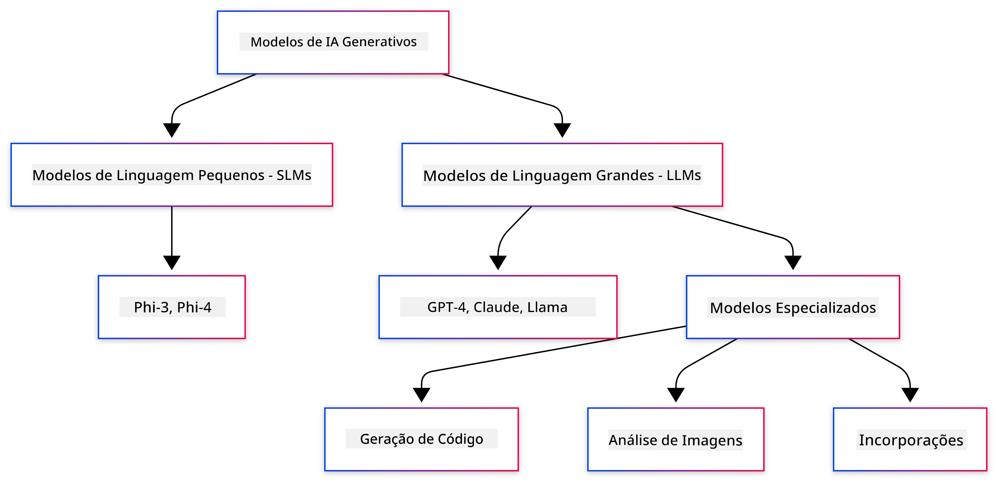
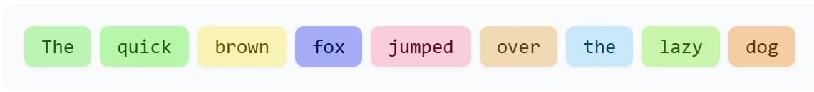
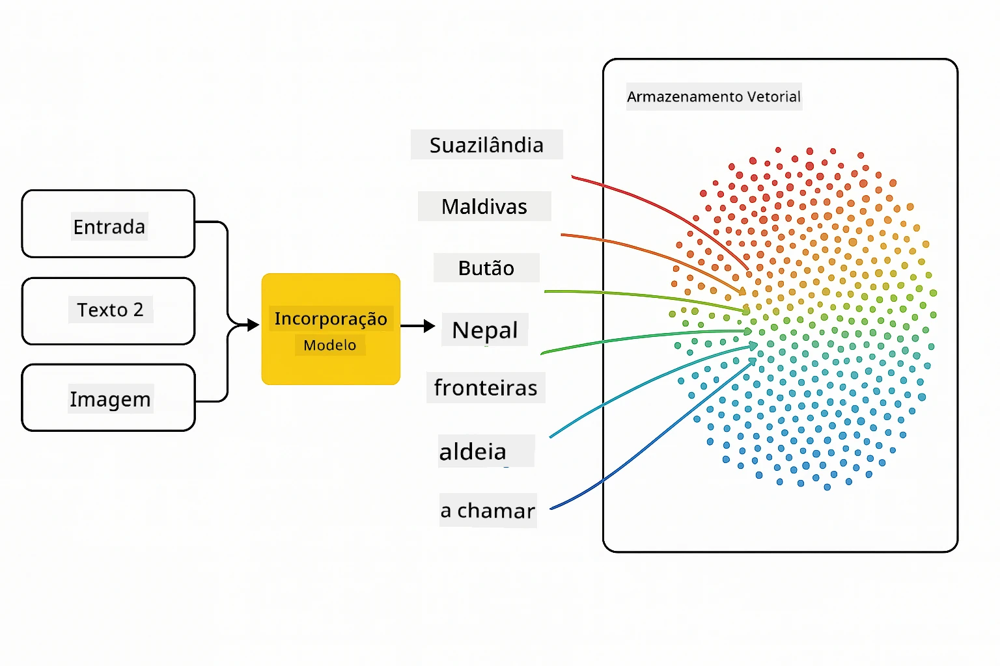
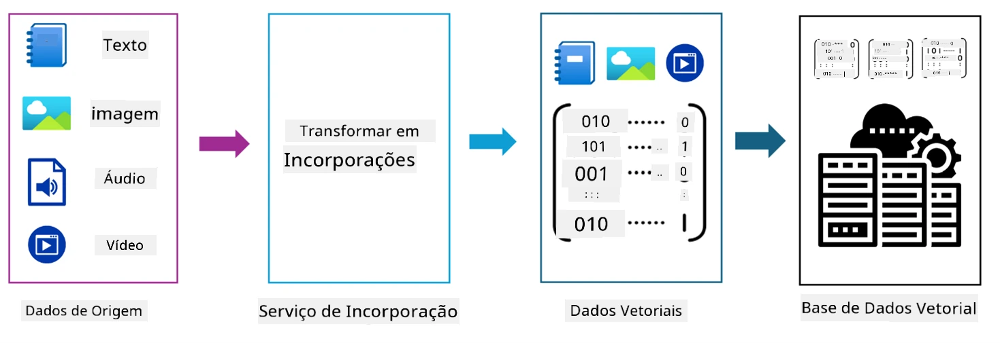
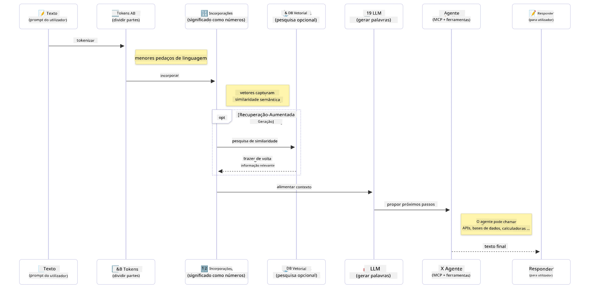

# Introdução à IA Generativa - Edição Java

> **Vídeo**: [Veja a visão geral em vídeo desta lição no YouTube.](https://www.youtube.com/watch?v=XH46tGp_eSw) Também pode clicar na imagem em miniatura acima.

## O que Vai Aprender

- **Fundamentos da IA generativa** incluindo LLMs, engenharia de prompts, tokens, embeddings e bases de dados vetoriais
- **Comparar ferramentas de desenvolvimento de IA em Java** incluindo Azure OpenAI SDK, Spring AI e OpenAI Java SDK
- **Descobrir o Protocolo de Contexto de Modelo** e o seu papel na comunicação de agentes de IA

## Índice

- [Introdução](#introdução)
- [Uma rápida revisão dos conceitos de IA generativa](#uma-rápida-revisão-dos-conceitos-de-ia-generativa)
- [Revisão da engenharia de prompts](#revisão-da-engenharia-de-prompts)
- [Tokens, embeddings e agentes](#tokens-embeddings-e-agentes)
- [Ferramentas e bibliotecas de desenvolvimento de IA para Java](#ferramentas-e-bibliotecas-de-desenvolvimento-de-ia-para-java)
  - [OpenAI Java SDK](#openai-java-sdk)
  - [Spring AI](#spring-ai)
  - [Azure OpenAI Java SDK](#azure-openai-java-sdk)
- [Resumo](#resumo)
- [Próximos Passos](#próximos-passos)

## Introdução

Bem-vindo ao primeiro capítulo de IA Generativa para Iniciantes - Edição Java! Esta lição fundamental apresenta-lhe os conceitos principais da IA generativa e como trabalhar com eles usando Java. Vai aprender sobre os blocos essenciais das aplicações de IA, incluindo Grandes Modelos de Linguagem (LLMs), tokens, embeddings e agentes de IA. Também exploraremos as principais ferramentas Java que usará ao longo deste curso.

### Uma rápida revisão dos conceitos de IA generativa

A IA generativa é um tipo de inteligência artificial que cria conteúdo novo, como texto, imagens ou código, baseado em padrões e relações aprendidos a partir de dados. Os modelos de IA generativa podem gerar respostas semelhantes às humanas, compreender o contexto e, por vezes, até criar conteúdo que parece humano.

Ao desenvolver as suas aplicações de IA em Java, irá trabalhar com **modelos de IA generativa** para criar conteúdo. Algumas capacidades destes modelos incluem:

- **Geração de texto**: Criar texto com aparência humana para chatbots, conteúdos e complementação de texto.
- **Geração e análise de imagens**: Produzir imagens realistas, melhorar fotos e detetar objetos.
- **Geração de código**: Escrever fragmentos de código ou scripts.

Existem tipos específicos de modelos otimizados para diferentes tarefas. Por exemplo, tanto **Modelos de Linguagem Pequenos (SLMs)** como **Grandes Modelos de Linguagem (LLMs)** podem lidar com a geração de texto, com os LLMs tipicamente a oferecer melhor desempenho para tarefas complexas. Para tarefas relacionadas com imagens, usaria modelos de visão especializados ou modelos multimodais.

Obviamente, as respostas destes modelos não são perfeitas o tempo todo. Provavelmente já ouviu falar sobre modelos a "alucinar" ou a gerar informação incorreta de forma autoritária. Mas pode ajudar a orientar o modelo para gerar melhores respostas, fornecendo instruções claras e contexto. É aqui que a **engenharia de prompts** entra.

#### Revisão da engenharia de prompts

Engenharia de prompts é a prática de conceber entradas eficazes para orientar os modelos de IA para as saídas desejadas. Envolve:

- **Clareza**: Tornar as instruções claras e inequívocas.
- **Contexto**: Fornecer a informação de fundo necessária.
- **Restrições**: Especificar quaisquer limitações ou formatos.

Algumas boas práticas para engenharia de prompts incluem design de prompts, instruções claras, divisão de tarefas, aprendizagem one-shot e few-shot, e ajuste de prompts. Testar diferentes prompts é essencial para encontrar o que funciona melhor para o seu caso de uso específico.

Ao desenvolver aplicações, irá trabalhar com diferentes tipos de prompts:
- **Prompts do sistema**: Definem as regras base e o contexto para o comportamento do modelo
- **Prompts do utilizador**: Os dados de entrada dos utilizadores da sua aplicação
- **Prompts do assistente**: As respostas do modelo baseadas nos prompts do sistema e do utilizador

> **Saiba mais**: Saiba mais sobre engenharia de prompts no [capítulo de Engenharia de Prompts do curso GenAI para Iniciantes](https://github.com/microsoft/generative-ai-for-beginners/tree/main/04-prompt-engineering-fundamentals)

#### Tokens, embeddings e agentes

Ao trabalhar com modelos de IA generativa, vai encontrar termos como **tokens**, **embeddings**, **agentes** e **Protocolo de Contexto de Modelo (MCP)**. Aqui está uma visão detalhada destes conceitos:

- **Tokens**: Tokens são a menor unidade de texto num modelo. Podem ser palavras, caracteres ou subpalavras. Os tokens são usados para representar dados de texto num formato que o modelo possa compreender. Por exemplo, a frase "The quick brown fox jumped over the lazy dog" pode ser tokenizada como ["The", " quick", " brown", " fox", " jumped", " over", " the", " lazy", " dog"] ou ["The", " qu", "ick", " br", "own", " fox", " jump", "ed", " over", " the", " la", "zy", " dog"] dependendo da estratégia de tokenização.

Tokenização é o processo de dividir texto nestas unidades menores. Isto é crucial porque os modelos operam com tokens em vez de texto cru. O número de tokens num prompt afeta o comprimento e a qualidade da resposta do modelo, pois os modelos têm limites de tokens para a sua janela de contexto (por exemplo, 128K tokens para o contexto total do GPT-4o, incluindo entrada e saída).

  Em Java, pode usar bibliotecas como o OpenAI SDK para lidar automaticamente com a tokenização ao enviar pedidos a modelos de IA.

- **Embeddings**: Embeddings são representações vetoriais de tokens que capturam o significado semântico. São representações numéricas (tipicamente arrays de números de ponto flutuante) que permitem aos modelos entender as relações entre palavras e gerar respostas relevantes no contexto. Palavras semelhantes têm embeddings semelhantes, permitindo ao modelo compreender conceitos como sinónimos e relações semânticas.

  Em Java, pode gerar embeddings usando o OpenAI SDK ou outras bibliotecas que suportem a geração de embeddings. Estes embeddings são essenciais para tarefas como pesquisa semântica, onde quer encontrar conteúdos semelhantes baseados no significado em vez de correspondências exatas de texto.

- **Bases de dados vetoriais**: Bases de dados vetoriais são sistemas de armazenamento especializados otimizados para embeddings. Permitem uma pesquisa eficiente por similaridade e são cruciais para padrões de Geração Aumentada por Recuperação (RAG) onde precisa encontrar informação relevante em grandes conjuntos de dados baseada na similaridade semântica em vez de correspondências exatas.

> **Nota**: Neste curso, não cobriremos bases de dados vetoriais mas achamos que vale a pena mencionar pois são frequentemente usadas em aplicações reais.

- **Agentes & MCP**: Componentes de IA que interagem autonomamente com modelos, ferramentas e sistemas externos. O Protocolo de Contexto de Modelo (MCP) fornece uma forma padronizada para agentes acederem de forma segura a fontes de dados externas e ferramentas. Saiba mais no nosso curso [MCP para Iniciantes](https://github.com/microsoft/mcp-for-beginners).

Nas aplicações Java IA, usará tokens para processamento de texto, embeddings para pesquisa semântica e RAG, bases de dados vetoriais para recuperação de dados, e agentes com MCP para construir sistemas inteligentes que usam ferramentas. 

### Ferramentas e Bibliotecas de Desenvolvimento de IA para Java

Java oferece excelentes ferramentas para desenvolvimento de IA. Existem três bibliotecas principais que exploraremos ao longo deste curso - OpenAI Java SDK, Azure OpenAI SDK e Spring AI.

Aqui está uma tabela rápida de referência mostrando qual SDK é usado nos exemplos de cada capítulo:

| Capítulo | Exemplo | SDK |
|---------|--------|-----|
| 02-SetupDevEnvironment | github-models | OpenAI Java SDK |
| 02-SetupDevEnvironment | basic-chat-azure | Spring AI Azure OpenAI |
| 03-CoreGenerativeAITechniques | examples | Azure OpenAI SDK |
| 04-PracticalSamples | petstory | OpenAI Java SDK |
| 04-PracticalSamples | foundrylocal | OpenAI Java SDK |
| 04-PracticalSamples | calculator | Spring AI MCP SDK + LangChain4j |

**Links para Documentação dos SDKs:**
- [Azure OpenAI Java SDK](https://github.com/Azure/azure-sdk-for-java/tree/azure-ai-openai_1.0.0-beta.16/sdk/openai/azure-ai-openai)
- [Spring AI](https://docs.spring.io/spring-ai/reference/)
- [OpenAI Java SDK](https://github.com/openai/openai-java)
- [LangChain4j](https://docs.langchain4j.dev/)

#### OpenAI Java SDK

O OpenAI SDK é a biblioteca oficial Java para a API OpenAI. Fornece uma interface simples e consistente para interagir com os modelos OpenAI, facilitando a integração de capacidades de IA em aplicações Java. O exemplo GitHub Models do Capítulo 2, a aplicação Pet Story e o exemplo Foundry Local do Capítulo 4 demonstram a abordagem do OpenAI SDK.

#### Spring AI

O Spring AI é um framework abrangente que traz capacidades de IA para aplicações Spring, providenciando uma camada de abstração consistente através de diferentes fornecedores de IA. Integra-se perfeitamente no ecossistema Spring, tornando-se a escolha ideal para aplicações Java empresariais que necessitam de capacidades de IA.

A força do Spring AI reside na sua integração fluída com o ecossistema Spring, facilitando a construção de aplicações IA prontas para produção com padrões Spring familiares, como injeção de dependências, gestão de configuração e frameworks de teste. Vai usar o Spring AI nos Capítulos 2 e 4 para construir aplicações que aproveitam tanto o OpenAI como o Protocolo de Contexto de Modelo (MCP) nas bibliotecas Spring AI.

##### Protocolo de Contexto de Modelo (MCP)

O [Protocolo de Contexto de Modelo (MCP)](https://modelcontextprotocol.io/) é um padrão emergente que permite que aplicações de IA interajam de forma segura com fontes externas de dados e ferramentas. O MCP provê uma forma padronizada para modelos de IA acederem a informação contextual e executarem ações nas suas aplicações.

No Capítulo 4, vai construir um serviço simples de calculadora MCP que demonstra os fundamentos do Protocolo de Contexto de Modelo com Spring AI, mostrando como criar integrações básicas de ferramentas e arquiteturas de serviço.

#### Azure OpenAI Java SDK

A biblioteca cliente Azure OpenAI para Java é uma adaptação das APIs REST da OpenAI que fornece uma interface idiomática e integração com o restante do ecossistema Azure SDK. No Capítulo 3, vai construir aplicações usando o Azure OpenAI SDK, incluindo aplicações de chat, chamada de funções e padrões RAG (Geração Aumentada por Recuperação).

> Nota: O Azure OpenAI SDK fica atrás do OpenAI Java SDK em termos de funcionalidades, pelo que para projetos futuros, considere usar o OpenAI Java SDK.

## Resumo

Aqui ficam as bases concluídas! Agora compreende:

- Os conceitos centrais por trás da IA generativa – desde LLMs e engenharia de prompts até tokens, embeddings e bases de dados vetoriais
- As opções na sua caixa de ferramentas para desenvolvimento de IA em Java: Azure OpenAI SDK, Spring AI e OpenAI Java SDK
- O que é o Protocolo de Contexto de Modelo e como permite que agentes de IA trabalhem com ferramentas externas

## Próximos Passos

[Capítulo 2: Configurar o Ambiente de Desenvolvimento](../02-SetupDevEnvironment/README.md)

---

<!-- CO-OP TRANSLATOR DISCLAIMER START -->
**Aviso Legal**:  
Este documento foi traduzido utilizando o serviço de tradução por IA [Co-op Translator](https://github.com/Azure/co-op-translator). Embora nos esforcemos por garantir a precisão, por favor esteja ciente de que traduções automáticas podem conter erros ou imprecisões. O documento original na sua língua nativa deve ser considerado a fonte autoritativa. Para informações críticas, recomenda-se a tradução profissional feita por humanos. Não nos responsabilizamos por quaisquer mal-entendidos ou interpretações incorretas resultantes da utilização desta tradução.
<!-- CO-OP TRANSLATOR DISCLAIMER END -->