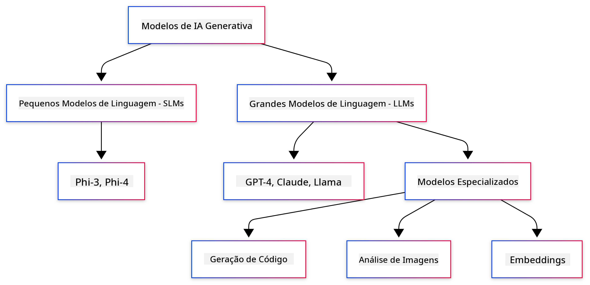
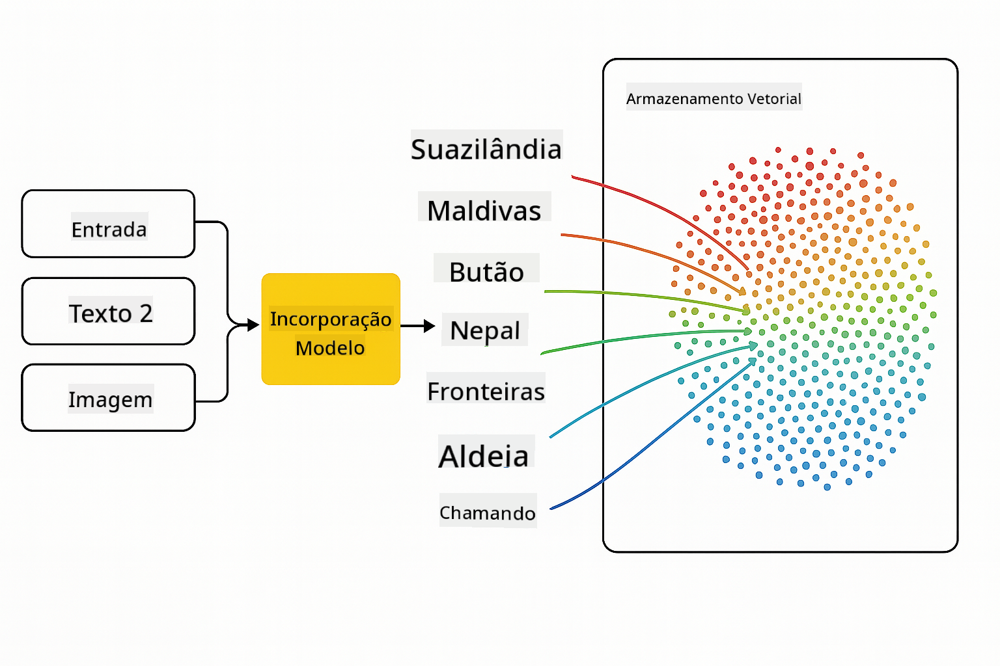

<!--
CO_OP_TRANSLATOR_METADATA:
{
  "original_hash": "6d8b4a0d774dc2a1e97c95859a6d6e4b",
  "translation_date": "2025-07-21T17:01:09+00:00",
  "source_file": "01-IntroToGenAI/README.md",
  "language_code": "pt"
}
-->
# Introdução à IA Generativa - Edição Java

## O que vai aprender

- **Fundamentos da IA Generativa**, incluindo LLMs, engenharia de prompts, tokens, embeddings e bases de dados vetoriais
- **Comparar ferramentas de desenvolvimento de IA em Java**, como Azure OpenAI SDK, Spring AI e OpenAI Java SDK
- **Descobrir o Protocolo de Contexto de Modelo (MCP)** e o seu papel na comunicação de agentes de IA

## Índice

- [Introdução](../../../01-IntroToGenAI)
- [Uma breve revisão dos conceitos de IA Generativa](../../../01-IntroToGenAI)
- [Revisão da engenharia de prompts](../../../01-IntroToGenAI)
- [Tokens, embeddings e agentes](../../../01-IntroToGenAI)
- [Ferramentas e bibliotecas de desenvolvimento de IA para Java](../../../01-IntroToGenAI)
  - [OpenAI Java SDK](../../../01-IntroToGenAI)
  - [Spring AI](../../../01-IntroToGenAI)
  - [Azure OpenAI Java SDK](../../../01-IntroToGenAI)
- [Resumo](../../../01-IntroToGenAI)
- [Próximos Passos](../../../01-IntroToGenAI)

## Introdução

Bem-vindo ao primeiro capítulo de IA Generativa para Iniciantes - Edição Java! Esta lição introdutória apresenta os conceitos fundamentais da IA generativa e como trabalhar com eles utilizando Java. Vai aprender sobre os blocos de construção essenciais das aplicações de IA, incluindo Modelos de Linguagem de Grande Escala (LLMs), tokens, embeddings e agentes de IA. Também exploraremos as principais ferramentas Java que utilizará ao longo deste curso.

### Uma breve revisão dos conceitos de IA Generativa

A IA Generativa é um tipo de inteligência artificial que cria novos conteúdos, como texto, imagens ou código, com base em padrões e relações aprendidos a partir de dados. Os modelos de IA generativa podem gerar respostas semelhantes às humanas, compreender o contexto e, por vezes, até criar conteúdos que parecem humanos.

Ao desenvolver as suas aplicações de IA em Java, trabalhará com **modelos de IA generativa** para criar conteúdos. Algumas das capacidades dos modelos de IA generativa incluem:

- **Geração de Texto**: Criar texto semelhante ao humano para chatbots, conteúdos e conclusão de texto.
- **Geração e Análise de Imagens**: Produzir imagens realistas, melhorar fotografias e detetar objetos.
- **Geração de Código**: Escrever trechos de código ou scripts.

Existem tipos específicos de modelos otimizados para diferentes tarefas. Por exemplo, tanto os **Modelos de Linguagem Pequenos (SLMs)** como os **Modelos de Linguagem de Grande Escala (LLMs)** podem lidar com a geração de texto, sendo que os LLMs geralmente oferecem melhor desempenho para tarefas complexas. Para tarefas relacionadas a imagens, utilizaria modelos de visão especializados ou modelos multimodais.

Claro, as respostas desses modelos nem sempre são perfeitas. Provavelmente já ouviu falar de modelos que "alucinam" ou geram informações incorretas de forma autoritária. No entanto, pode ajudar a orientar o modelo a gerar melhores respostas fornecendo instruções e contextos claros. É aqui que entra a **engenharia de prompts**.

#### Revisão da engenharia de prompts

A engenharia de prompts é a prática de projetar entradas eficazes para orientar os modelos de IA em direção aos resultados desejados. Envolve:

- **Clareza**: Tornar as instruções claras e inequívocas.
- **Contexto**: Fornecer informações de fundo necessárias.
- **Restrições**: Especificar quaisquer limitações ou formatos.

Algumas boas práticas para a engenharia de prompts incluem o design de prompts, instruções claras, divisão de tarefas, aprendizagem de um ou poucos exemplos (one-shot e few-shot learning) e ajuste de prompts. Testar diferentes prompts é essencial para encontrar o que funciona melhor para o seu caso de uso específico.

Ao desenvolver aplicações, trabalhará com diferentes tipos de prompts:
- **Prompts do sistema**: Definem as regras base e o contexto para o comportamento do modelo
- **Prompts do utilizador**: Os dados de entrada fornecidos pelos utilizadores da sua aplicação
- **Prompts do assistente**: As respostas do modelo com base nos prompts do sistema e do utilizador

> **Saiba mais**: Saiba mais sobre engenharia de prompts no [capítulo de Engenharia de Prompts do curso GenAI para Iniciantes](https://github.com/microsoft/generative-ai-for-beginners/tree/main/04-prompt-engineering-fundamentals)

#### Tokens, embeddings e agentes

Ao trabalhar com modelos de IA generativa, encontrará termos como **tokens**, **embeddings**, **agentes** e **Protocolo de Contexto de Modelo (MCP)**. Aqui está uma visão geral detalhada desses conceitos:

- **Tokens**: Tokens são as menores unidades de texto em um modelo. Podem ser palavras, caracteres ou subpalavras. Tokens são usados para representar dados de texto em um formato que o modelo pode entender. Por exemplo, a frase "The quick brown fox jumped over the lazy dog" pode ser tokenizada como ["The", " quick", " brown", " fox", " jumped", " over", " the", " lazy", " dog"] ou ["The", " qu", "ick", " br", "own", " fox", " jump", "ed", " over", " the", " la", "zy", " dog"], dependendo da estratégia de tokenização.

A tokenização é o processo de dividir o texto nessas unidades menores. Isso é crucial porque os modelos operam em tokens em vez de texto bruto. O número de tokens em um prompt afeta o comprimento e a qualidade da resposta do modelo, já que os modelos têm limites de tokens para sua janela de contexto (por exemplo, 128K tokens para o contexto total do GPT-4o, incluindo entrada e saída).

  Em Java, pode usar bibliotecas como o OpenAI SDK para lidar com a tokenização automaticamente ao enviar pedidos para modelos de IA.

- **Embeddings**: Embeddings são representações vetoriais de tokens que capturam o significado semântico. São representações numéricas (tipicamente matrizes de números de ponto flutuante) que permitem aos modelos compreender relações entre palavras e gerar respostas contextualmente relevantes. Palavras semelhantes têm embeddings semelhantes, permitindo que o modelo compreenda conceitos como sinónimos e relações semânticas.

  Em Java, pode gerar embeddings usando o OpenAI SDK ou outras bibliotecas que suportam a geração de embeddings. Esses embeddings são essenciais para tarefas como pesquisa semântica, onde deseja encontrar conteúdos semelhantes com base no significado em vez de correspondências exatas de texto.

- **Bases de dados vetoriais**: Bases de dados vetoriais são sistemas de armazenamento especializados otimizados para embeddings. Permitem uma pesquisa eficiente por similaridade e são cruciais para padrões de Geração Aumentada por Recuperação (RAG), onde precisa encontrar informações relevantes em grandes conjuntos de dados com base na similaridade semântica em vez de correspondências exatas.

> **Nota**: Neste curso, não abordaremos bases de dados vetoriais, mas achamos que vale a pena mencioná-las, pois são comumente usadas em aplicações do mundo real.

- **Agentes e MCP**: Componentes de IA que interagem autonomamente com modelos, ferramentas e sistemas externos. O Protocolo de Contexto de Modelo (MCP) fornece uma forma padronizada para agentes acessarem de forma segura fontes de dados externas e ferramentas. Saiba mais no nosso curso [MCP para Iniciantes](https://github.com/microsoft/mcp-for-beginners).

Nas aplicações de IA em Java, usará tokens para processamento de texto, embeddings para pesquisa semântica e RAG, bases de dados vetoriais para recuperação de dados e agentes com MCP para construir sistemas inteligentes que utilizam ferramentas.

### Ferramentas e bibliotecas de desenvolvimento de IA para Java

Java oferece excelentes ferramentas para desenvolvimento de IA. Existem três bibliotecas principais que exploraremos ao longo deste curso - OpenAI Java SDK, Azure OpenAI SDK e Spring AI.

Aqui está uma tabela de referência rápida mostrando qual SDK é usado nos exemplos de cada capítulo:

| Capítulo | Exemplo | SDK |
|----------|---------|-----|
| 02-SetupDevEnvironment | src/github-models/ | OpenAI Java SDK |
| 02-SetupDevEnvironment | src/basic-chat-azure/ | Spring AI Azure OpenAI |
| 03-CoreGenerativeAITechniques | examples/ | Azure OpenAI SDK |
| 04-PracticalSamples | petstory/ | OpenAI Java SDK |
| 04-PracticalSamples | foundrylocal/ | OpenAI Java SDK |
| 04-PracticalSamples | mcp/calculator/ | Spring AI MCP SDK + LangChain4j |

**Links para documentação dos SDKs:**
- [Azure OpenAI Java SDK](https://github.com/Azure/azure-sdk-for-java/tree/azure-ai-openai_1.0.0-beta.16/sdk/openai/azure-ai-openai)
- [Spring AI](https://docs.spring.io/spring-ai/reference/)
- [OpenAI Java SDK](https://github.com/openai/openai-java)
- [LangChain4j](https://docs.langchain4j.dev/)

#### OpenAI Java SDK

O OpenAI SDK é a biblioteca oficial de Java para a API da OpenAI. Fornece uma interface simples e consistente para interagir com os modelos da OpenAI, tornando fácil integrar capacidades de IA em aplicações Java. O exemplo GitHub Models do Capítulo 2, a aplicação Pet Story e o exemplo Foundry Local do Capítulo 4 demonstram a abordagem do OpenAI SDK.

#### Spring AI

O Spring AI é uma estrutura abrangente que traz capacidades de IA para aplicações Spring, fornecendo uma camada de abstração consistente entre diferentes fornecedores de IA. Integra-se perfeitamente com o ecossistema Spring, tornando-o a escolha ideal para aplicações empresariais Java que precisam de capacidades de IA.

A força do Spring AI reside na sua integração perfeita com o ecossistema Spring, facilitando a construção de aplicações de IA prontas para produção com padrões Spring familiares, como injeção de dependências, gestão de configuração e frameworks de teste. Utilizará o Spring AI nos Capítulos 2 e 4 para construir aplicações que aproveitam tanto a OpenAI como as bibliotecas Spring AI do Protocolo de Contexto de Modelo (MCP).

##### Protocolo de Contexto de Modelo (MCP)

O [Protocolo de Contexto de Modelo (MCP)](https://modelcontextprotocol.io/) é um padrão emergente que permite que aplicações de IA interajam de forma segura com fontes de dados externas e ferramentas. O MCP fornece uma forma padronizada para modelos de IA acessarem informações contextuais e executarem ações nas suas aplicações.

No Capítulo 4, construirá um serviço simples de calculadora MCP que demonstra os fundamentos do Protocolo de Contexto de Modelo com Spring AI, mostrando como criar integrações básicas de ferramentas e arquiteturas de serviço.

#### Azure OpenAI Java SDK

A biblioteca cliente Azure OpenAI para Java é uma adaptação das APIs REST da OpenAI que fornece uma interface idiomática e integração com o restante ecossistema do Azure SDK. No Capítulo 3, construirá aplicações usando o Azure OpenAI SDK, incluindo aplicações de chat, chamadas de funções e padrões de Geração Aumentada por Recuperação (RAG).

> Nota: O Azure OpenAI SDK está atrasado em relação ao OpenAI Java SDK em termos de funcionalidades, por isso, para projetos futuros, considere usar o OpenAI Java SDK.

## Resumo

**Parabéns!** Conseguiu:

- **Aprender sobre os fundamentos da IA Generativa**, incluindo LLMs, engenharia de prompts, tokens, embeddings e bases de dados vetoriais
- **Comparar ferramentas de desenvolvimento de IA em Java**, como Azure OpenAI SDK, Spring AI e OpenAI Java SDK
- **Descobrir o Protocolo de Contexto de Modelo (MCP)** e o seu papel na comunicação de agentes de IA

## Próximos Passos

[Capítulo 2: Configuração do Ambiente de Desenvolvimento](../02-SetupDevEnvironment/README.md)

**Aviso Legal**:  
Este documento foi traduzido utilizando o serviço de tradução por IA [Co-op Translator](https://github.com/Azure/co-op-translator). Embora nos esforcemos pela precisão, esteja ciente de que traduções automáticas podem conter erros ou imprecisões. O documento original na sua língua nativa deve ser considerado a fonte autoritária. Para informações críticas, recomenda-se a tradução profissional realizada por humanos. Não nos responsabilizamos por quaisquer mal-entendidos ou interpretações incorretas decorrentes do uso desta tradução.