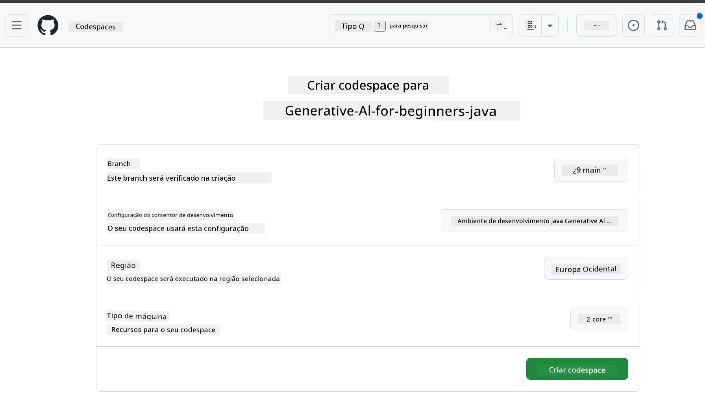

<!--
CO_OP_TRANSLATOR_METADATA:
{
  "original_hash": "96a30d42b9751a3d4e4b20e28d29d459",
  "translation_date": "2026-01-28T04:53:58+00:00",
  "source_file": "02-SetupDevEnvironment/README.md",
  "language_code": "pt"
}
-->
# Configurar o Ambiente de Desenvolvimento para IA Generativa em Java

> **Início Rápido**: Código na Nuvem em 2 minutos - Passe para a secção [Configuração do GitHub Codespaces](../../../02-SetupDevEnvironment) - não é necessária instalação local e usa modelos do github!

> **Interessado no Azure OpenAI?**, veja o nosso [Guia de Configuração Azure OpenAI](getting-started-azure-openai.md) com os passos para criar um novo recurso Azure OpenAI.

## O que Vai Aprender

- Configurar um ambiente de desenvolvimento Java para aplicações de IA
- Escolher e configurar o seu ambiente de desenvolvimento preferido (cloud-first com Codespaces, contentor de desenvolvimento local ou configuração local completa)
- Testar a sua configuração ligando aos Modelos GitHub

## Índice

- [O que Vai Aprender](../../../02-SetupDevEnvironment)
- [Introdução](../../../02-SetupDevEnvironment)
- [Passo 1: Configure o Seu Ambiente de Desenvolvimento](../../../02-SetupDevEnvironment)
  - [Opção A: GitHub Codespaces (Recomendado)](../../../02-SetupDevEnvironment)
  - [Opção B: Contentor Dev Local](../../../02-SetupDevEnvironment)
  - [Opção C: Use a Sua Instalação Local Existente](../../../02-SetupDevEnvironment)
- [Passo 2: Crie um Token de Acesso Pessoal do GitHub](../../../02-SetupDevEnvironment)
- [Passo 3: Teste a Sua Configuração](../../../02-SetupDevEnvironment)
- [Resolução de Problemas](../../../02-SetupDevEnvironment)
- [Sumário](../../../02-SetupDevEnvironment)
- [Próximos Passos](../../../02-SetupDevEnvironment)

## Introdução

Este capítulo irá guiá-lo na configuração de um ambiente de desenvolvimento. Usaremos os **Modelos GitHub** como nosso exemplo principal porque são gratuitos, fáceis de configurar com apenas uma conta GitHub, não requerem cartão de crédito e fornecem acesso a múltiplos modelos para experimentação.

**Não é necessária configuração local!** Pode começar a programar imediatamente usando o GitHub Codespaces, que fornece um ambiente de desenvolvimento completo no seu navegador.


Recomendamos o uso dos [**Modelos GitHub**](https://github.com/marketplace?type=models) para este curso porque são:
- **Grátis** para começar
- **Fáceis** de configurar com apenas uma conta GitHub
- **Não requerem cartão de crédito**
- **Múltiplos modelos** disponíveis para experimentação

> **Nota**: Os Modelos GitHub usados neste treino têm os seguintes limites gratuitos:
> - 15 pedidos por minuto (150 por dia)
> - ~8.000 palavras de entrada, ~4.000 palavras de saída por pedido
> - 5 pedidos simultâneos
> 
> Para utilização em produção, atualize para os Modelos Azure AI Foundry com a sua conta Azure. O seu código não precisa de mudar. Veja a [documentação Azure AI Foundry](https://learn.microsoft.com/azure/ai-foundry/foundry-models/how-to/quickstart-github-models).

## Passo 1: Configure o Seu Ambiente de Desenvolvimento

<a name="quick-start-cloud"></a>

Criámos um contentor de desenvolvimento pré-configurado para minimizar o tempo de configuração e garantir que tem todas as ferramentas necessárias para este curso de IA Generativa para Java. Escolha a sua abordagem de desenvolvimento preferida:

### Opções de Configuração do Ambiente:

#### Opção A: GitHub Codespaces (Recomendado)

**Comece a programar em 2 minutos - não é necessária configuração local!**

1. Faça fork deste repositório para a sua conta GitHub
   > **Nota**: Se desejar editar a configuração básica, veja a [Configuração do Contentor Dev](../../../.devcontainer/devcontainer.json)
2. Clique em **Code** → separador **Codespaces** → **...** → **Novo com opções...**
3. Use os valores por defeito – isto irá selecionar a **Configuração do contentor Dev**: **Ambiente de Desenvolvimento IA Generativa Java** contentor dev personalizado criado para este curso
4. Clique em **Create codespace**
5. Aguarde cerca de 2 minutos para o ambiente ficar pronto
6. Prossiga para [Passo 2: Criar Token GitHub](../../../02-SetupDevEnvironment)




> **Vantagens dos Codespaces**:
> - Não requer instalação local
> - Funciona em qualquer dispositivo com navegador
> - Pré-configurado com todas as ferramentas e dependências
> - 60 horas grátis por mês para contas pessoais
> - Ambiente consistente para todos os formandos

#### Opção B: Contentor Dev Local

**Para programadores que preferem desenvolvimento local com Docker**

1. Faça fork e clone este repositório para a sua máquina local
   > **Nota**: Se desejar editar a configuração básica, veja a [Configuração do Contentor Dev](../../../.devcontainer/devcontainer.json)
2. Instale o [Docker Desktop](https://www.docker.com/products/docker-desktop/) e o [VS Code](https://code.visualstudio.com/)
3. Instale a extensão [Dev Containers](https://marketplace.visualstudio.com/items?itemName=ms-vscode-remote.remote-containers) no VS Code
4. Abra a pasta do repositório no VS Code
5. Quando for indicado, clique em **Reabrir no Contentor** (ou use `Ctrl+Shift+P` → "Dev Containers: Reopen in Container")
6. Aguarde o contentor ser construído e iniciado
7. Prossiga para [Passo 2: Criar Token GitHub](../../../02-SetupDevEnvironment)


#### Opção C: Use a Sua Instalação Local Existente

**Para programadores com ambientes Java existentes**

Pré-requisitos:
- [Java 21+](https://www.oracle.com/java/technologies/javase/jdk21-archive-downloads.html) 
- [Maven 3.9+](https://maven.apache.org/download.cgi)
- [VS Code](https://code.visualstudio.com) ou o seu IDE preferido

Passos:
1. Clone este repositório para a sua máquina local
2. Abra o projeto no seu IDE
3. Prossiga para [Passo 2: Criar Token GitHub](../../../02-SetupDevEnvironment)

> **Dica Profissional**: Se tiver uma máquina com especificações baixas mas quiser usar VS Code localmente, use GitHub Codespaces! Pode ligar o seu VS Code local a um Codespace alojado na nuvem para o melhor dos dois mundos.


## Passo 2: Crie um Token de Acesso Pessoal do GitHub

1. Navegue para as [Definições GitHub](https://github.com/settings/profile) e selecione **Settings** no menu do seu perfil.
2. Na barra lateral esquerda, clique em **Developer settings** (geralmente em baixo).
3. Em **Personal access tokens**, clique em **Fine-grained tokens** (ou siga este [link direto](https://github.com/settings/personal-access-tokens)).
4. Clique em **Generate new token**.
5. Em "Token name", forneça um nome descritivo (ex.: `GenAI-Java-Course-Token`).
6. Defina uma data de expiração (recomendado: 7 dias para melhores práticas de segurança).
7. Em "Resource owner", selecione a sua conta de utilizador.
8. Em "Repository access", selecione os repositórios que quer usar com os Modelos GitHub (ou "All repositories" se necessário).
9. Em "Account permissions", encontre **Models** e defina para **Read-only**.
10. Clique em **Generate token**.
11. **Copie e guarde o seu token agora** – não o verá novamente!

> **Dica de Segurança**: Use o escopo mínimo requerido e o menor tempo prático de expiração para os seus tokens de acesso.

## Passo 3: Teste a Sua Configuração com o Exemplo dos Modelos GitHub

Uma vez que o seu ambiente de desenvolvimento esteja pronto, vamos testar a integração dos Modelos GitHub com o nosso exemplo de aplicação em [`02-SetupDevEnvironment/examples/github-models`](../../../02-SetupDevEnvironment/examples/github-models).

1. Abra o terminal no seu ambiente de desenvolvimento.
2. Navegue até ao exemplo dos Modelos GitHub:
   ```bash
   cd 02-SetupDevEnvironment/examples/github-models
   ```
3. Defina o seu token GitHub como variável de ambiente:
   ```bash
   # macOS/Linux
   export GITHUB_TOKEN=your_token_here
   
   # Windows (Prompt de Comando)
   set GITHUB_TOKEN=your_token_here
   
   # Windows (PowerShell)
   $env:GITHUB_TOKEN="your_token_here"
   ```

4. Execute a aplicação:
   ```bash
   mvn compile exec:java -Dexec.mainClass="com.example.githubmodels.App"
   ```

Deve ver uma saída semelhante a:
```text
Using model: gpt-4.1-nano
Sending request to GitHub Models...
Response: Hello World!
```

### Compreender o Código de Exemplo

Primeiro, vamos compreender o que acabámos de executar. O exemplo em `examples/github-models` usa o OpenAI Java SDK para se ligar aos Modelos GitHub:

**O que este código faz:**
- **Liga-se** aos Modelos GitHub usando o seu token de acesso pessoal
- **Envia** uma mensagem simples "Say Hello World!" para o modelo de IA
- **Recebe** e mostra a resposta da IA
- **Valida** que a sua configuração está a funcionar corretamente

**Dependência Principal** (em `pom.xml`):
```xml
<dependency>
    <groupId>com.openai</groupId>
    <artifactId>openai-java</artifactId>
    <version>2.12.0</version>
</dependency>
```

**Código Principal** (`App.java`):
```java
// Ligar aos Modelos do GitHub usando o SDK Java da OpenAI
OpenAIClient client = OpenAIOkHttpClient.builder()
    .apiKey(pat)
    .baseUrl("https://models.inference.ai.azure.com")
    .build();

// Criar pedido de completamento de chat
ChatCompletionCreateParams params = ChatCompletionCreateParams.builder()
    .model(modelId)
    .addSystemMessage("You are a concise assistant.")
    .addUserMessage("Say Hello World!")
    .build();

// Obter resposta da IA
ChatCompletion response = client.chat().completions().create(params);
System.out.println("Response: " + response.choices().get(0).message().content().orElse("No response content"));
```

## Sumário

Ótimo! Agora tem tudo configurado:

- Criou um Token de Acesso Pessoal do GitHub com as permissões certas para acesso ao modelo de IA
- Tem o seu ambiente de desenvolvimento Java a funcionar (seja Codespaces, contentores dev ou local)
- Ligou-se aos Modelos GitHub usando o OpenAI Java SDK para desenvolvimento IA grátis
- Testou que tudo funciona com um exemplo simples que comunica com modelos de IA

## Próximos Passos

[Capítulo 3: Técnicas Básicas de IA Generativa](../03-CoreGenerativeAITechniques/README.md)

## Resolução de Problemas

Está a ter problemas? Aqui estão problemas comuns e soluções:

- **Token não funciona?** 
  - Certifique-se que copiou o token completo sem espaços extras
  - Verifique que o token está configurado corretamente como variável de ambiente
  - Confirme que o token tem as permissões corretas (Models: Read-only)

- **Maven não encontrado?** 
  - Se usar contentores dev/Codespaces, o Maven deve estar pré-instalado
  - Para configuração local, assegure que o Java 21+ e Maven 3.9+ estão instalados
  - Tente `mvn --version` para verificar a instalação

- **Problemas de ligação?** 
  - Verifique a sua ligação à internet
  - Confirme que o GitHub é acessível a partir da sua rede
  - Assegure que não está atrás de um firewall que bloqueie o endpoint dos Modelos GitHub

- **O contentor dev não inicia?** 
  - Certifique-se que o Docker Desktop está a funcionar (para desenvolvimento local)
  - Tente reconstruir o contentor: `Ctrl+Shift+P` → "Dev Containers: Rebuild Container"

- **Erros na compilação da aplicação?**
  - Assegure-se que está na diretoria correta: `02-SetupDevEnvironment/examples/github-models`
  - Tente limpar e reconstruir: `mvn clean compile`

> **Precisa de ajuda?**: Continua com problemas? Abra uma issue no repositório e ajudaremos.

---

<!-- CO-OP TRANSLATOR DISCLAIMER START -->
**Aviso Legal**:
Este documento foi traduzido utilizando o serviço de tradução automática [Co-op Translator](https://github.com/Azure/co-op-translator). Embora nos esforcemos pela precisão, por favor tenha em conta que traduções automatizadas podem conter erros ou imprecisões. O documento original na sua língua nativa deve ser considerado a fonte autorizada. Para informações críticas, recomenda-se a tradução profissional humana. Não nos responsabilizamos por quaisquer mal-entendidos ou interpretações incorretas decorrentes do uso desta tradução.
<!-- CO-OP TRANSLATOR DISCLAIMER END -->