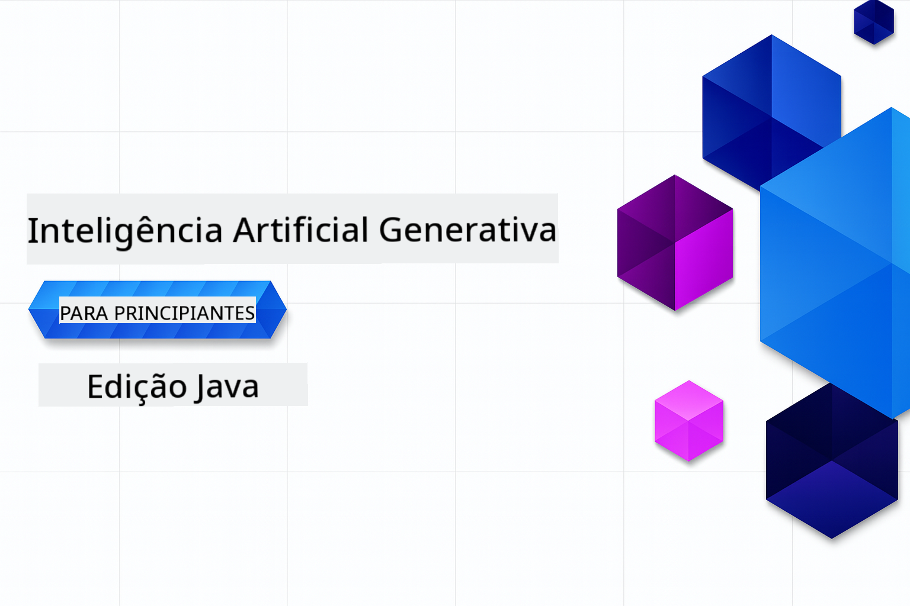

<!--
CO_OP_TRANSLATOR_METADATA:
{
  "original_hash": "b4c05c53b67571aee42e9532404f2fb8",
  "translation_date": "2025-07-28T10:40:19+00:00",
  "source_file": "README.md",
  "language_code": "pt"
}
-->
# IA Generativa para Iniciantes - Edição Java

**Compromisso de Tempo**: O workshop completo pode ser realizado online sem necessidade de configuração local. A configuração do ambiente leva 2 minutos, e a exploração dos exemplos pode levar de 1 a 3 horas, dependendo da profundidade de exploração.

> **Início Rápido**

1. Faça um fork deste repositório na sua conta do GitHub  
2. Clique em **Code** → aba **Codespaces** → **...** → **New with options...**  
3. Use as configurações padrão – isso selecionará o container de desenvolvimento criado para este curso  
4. Clique em **Create codespace**  
5. Aguarde ~2 minutos para o ambiente estar pronto  
6. Vá diretamente para [O primeiro exemplo](./02-SetupDevEnvironment/README.md#step-2-create-a-github-personal-access-token)  

## Suporte Multilíngue

### Suportado via GitHub Action (Automatizado e Sempre Atualizado)

[Francês](../fr/README.md) | [Espanhol](../es/README.md) | [Alemão](../de/README.md) | [Russo](../ru/README.md) | [Árabe](../ar/README.md) | [Persa (Farsi)](../fa/README.md) | [Urdu](../ur/README.md) | [Chinês (Simplificado)](../zh/README.md) | [Chinês (Tradicional, Macau)](../mo/README.md) | [Chinês (Tradicional, Hong Kong)](../hk/README.md) | [Chinês (Tradicional, Taiwan)](../tw/README.md) | [Japonês](../ja/README.md) | [Coreano](../ko/README.md) | [Hindi](../hi/README.md) | [Bengali](../bn/README.md) | [Marathi](../mr/README.md) | [Nepali](../ne/README.md) | [Punjabi (Gurmukhi)](../pa/README.md) | [Português (Portugal)](./README.md) | [Português (Brasil)](../br/README.md) | [Italiano](../it/README.md) | [Polaco](../pl/README.md) | [Turco](../tr/README.md) | [Grego](../el/README.md) | [Tailandês](../th/README.md) | [Sueco](../sv/README.md) | [Dinamarquês](../da/README.md) | [Norueguês](../no/README.md) | [Finlandês](../fi/README.md) | [Holandês](../nl/README.md) | [Hebraico](../he/README.md) | [Vietnamita](../vi/README.md) | [Indonésio](../id/README.md) | [Malaio](../ms/README.md) | [Tagalog (Filipino)](../tl/README.md) | [Swahili](../sw/README.md) | [Húngaro](../hu/README.md) | [Checo](../cs/README.md) | [Eslovaco](../sk/README.md) | [Romeno](../ro/README.md) | [Búlgaro](../bg/README.md) | [Sérvio (Cirílico)](../sr/README.md) | [Croata](../hr/README.md) | [Esloveno](../sl/README.md) | [Ucraniano](../uk/README.md) | [Birmanês (Myanmar)](../my/README.md)

## Estrutura do Curso e Caminho de Aprendizagem

### **Capítulo 1: Introdução à IA Generativa**
- **Conceitos Fundamentais**: Compreender Modelos de Linguagem de Grande Escala, tokens, embeddings e capacidades de IA  
- **Ecossistema de IA em Java**: Visão geral do Spring AI e SDKs OpenAI  
- **Protocolo de Contexto de Modelo**: Introdução ao MCP e seu papel na comunicação de agentes de IA  
- **Aplicações Práticas**: Cenários reais, incluindo chatbots e geração de conteúdo  
- **[→ Começar o Capítulo 1](./01-IntroToGenAI/README.md)**  

### **Capítulo 2: Configuração do Ambiente de Desenvolvimento**
- **Configuração Multi-Fornecedor**: Configurar modelos do GitHub, Azure OpenAI e integrações do SDK OpenAI Java  
- **Spring Boot + Spring AI**: Melhores práticas para desenvolvimento de aplicações empresariais de IA  
- **Modelos do GitHub**: Acesso gratuito a modelos de IA para prototipagem e aprendizado (sem necessidade de cartão de crédito)  
- **Ferramentas de Desenvolvimento**: Configuração de containers Docker, VS Code e GitHub Codespaces  
- **[→ Começar o Capítulo 2](./02-SetupDevEnvironment/README.md)**  

### **Capítulo 3: Técnicas Fundamentais de IA Generativa**
- **Engenharia de Prompts**: Técnicas para respostas ideais de modelos de IA  
- **Embeddings e Operações com Vetores**: Implementar busca semântica e correspondência de similaridade  
- **Geração Aumentada por Recuperação (RAG)**: Combinar IA com suas próprias fontes de dados  
- **Chamadas de Função**: Expandir as capacidades da IA com ferramentas e plugins personalizados  
- **[→ Começar o Capítulo 3](./03-CoreGenerativeAITechniques/README.md)**  

### **Capítulo 4: Aplicações Práticas e Projetos**
- **Gerador de Histórias de Animais de Estimação** (`petstory/`): Geração criativa de conteúdo com Modelos do GitHub  
- **Demo Local Foundry** (`foundrylocal/`): Integração local de modelos de IA com o SDK OpenAI Java  
- **Serviço de Calculadora MCP** (`calculator/`): Implementação básica do Protocolo de Contexto de Modelo com Spring AI  
- **[→ Começar o Capítulo 4](./04-PracticalSamples/README.md)**  

### **Capítulo 5: Desenvolvimento Responsável de IA**
- **Segurança dos Modelos do GitHub**: Testar mecanismos de filtragem de conteúdo e segurança integrados  
- **Demo de IA Responsável**: Exemplo prático mostrando como os filtros de segurança de IA funcionam na prática  
- **Melhores Práticas**: Diretrizes essenciais para desenvolvimento e implementação ética de IA  
- **[→ Começar o Capítulo 5](./05-ResponsibleGenAI/README.md)**  

## Recursos Adicionais

- [Agentes de IA para Iniciantes](https://github.com/microsoft/ai-agents-for-beginners)  
- [IA Generativa para Iniciantes usando .NET](https://github.com/microsoft/Generative-AI-for-beginners-dotnet)  
- [IA Generativa para Iniciantes usando JavaScript](https://github.com/microsoft/generative-ai-with-javascript)  
- [IA Generativa para Iniciantes](https://github.com/microsoft/generative-ai-for-beginners)  
- [ML para Iniciantes](https://aka.ms/ml-beginners)  
- [Ciência de Dados para Iniciantes](https://aka.ms/datascience-beginners)  
- [IA para Iniciantes](https://aka.ms/ai-beginners)  
- [Cibersegurança para Iniciantes](https://github.com/microsoft/Security-101)  
- [Desenvolvimento Web para Iniciantes](https://aka.ms/webdev-beginners)  
- [IoT para Iniciantes](https://aka.ms/iot-beginners)  
- [Desenvolvimento XR para Iniciantes](https://github.com/microsoft/xr-development-for-beginners)  
- [Dominando o GitHub Copilot para Programação em Parceria com IA](https://aka.ms/GitHubCopilotAI)  
- [Dominando o GitHub Copilot para Desenvolvedores C#/.NET](https://github.com/microsoft/mastering-github-copilot-for-dotnet-csharp-developers)  
- [Escolha Sua Própria Aventura com Copilot](https://github.com/microsoft/CopilotAdventures)  
- [App de Chat RAG com Serviços de IA do Azure](https://github.com/Azure-Samples/azure-search-openai-demo-java)  

**Aviso Legal**:  
Este documento foi traduzido utilizando o serviço de tradução por IA [Co-op Translator](https://github.com/Azure/co-op-translator). Embora nos esforcemos pela precisão, esteja ciente de que traduções automáticas podem conter erros ou imprecisões. O documento original na sua língua nativa deve ser considerado a fonte autoritária. Para informações críticas, recomenda-se a tradução profissional realizada por humanos. Não nos responsabilizamos por quaisquer mal-entendidos ou interpretações incorretas decorrentes do uso desta tradução.