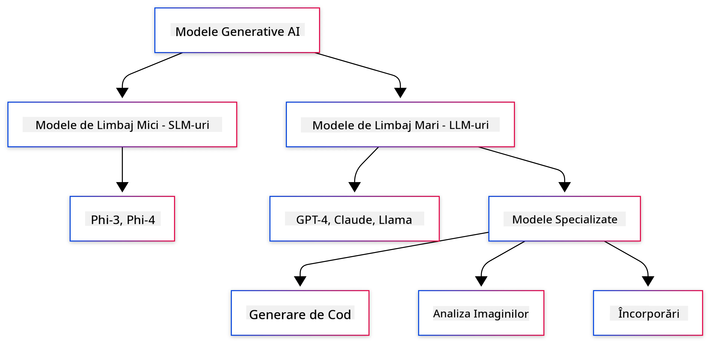
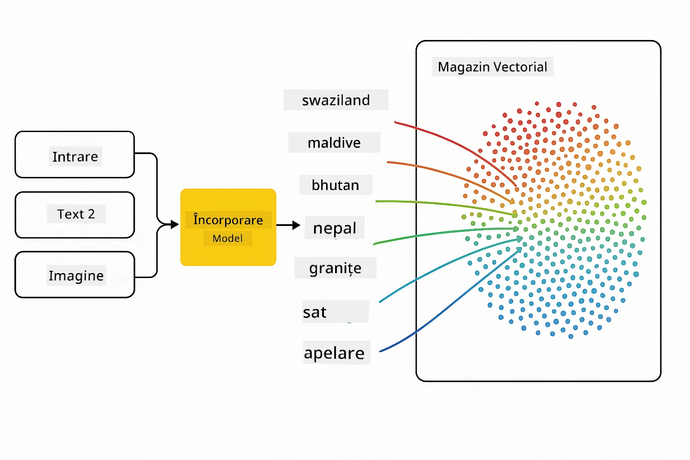
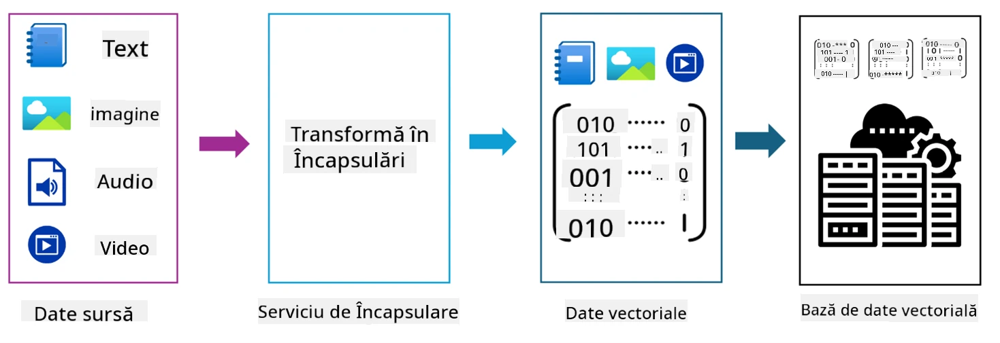
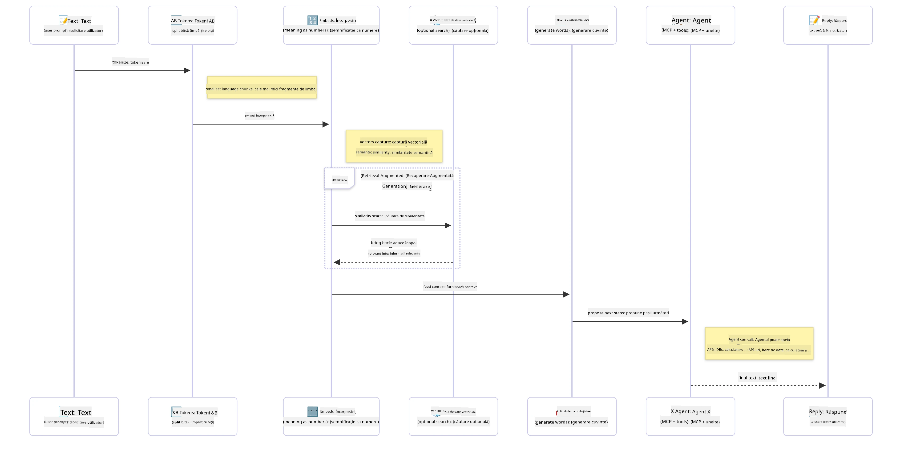

# Introducere în Generative AI - Ediția Java

> **Video**: [Vizionați prezentarea video pentru această lecție pe YouTube.](https://www.youtube.com/watch?v=XH46tGp_eSw) De asemenea, puteți face clic pe imaginea miniatură de mai sus.

## Ce veți învăța

- **Fundamentele Generative AI** incluzând LLM-uri, ingineria prompturilor, tokens, embeddings și bazele de date vectoriale
- **Compararea uneltelor de dezvoltare AI în Java** incluzând Azure OpenAI SDK, Spring AI și OpenAI Java SDK
- **Descoperirea Protocolului Model Context** și rolul său în comunicarea agenților AI

## Cuprins

- [Introducere](#introducere)
- [O recapitulare rapidă a conceptelor Generative AI](#o-recapitulare-rapidă-a-conceptelor-generative-ai)
- [Revizuirea ingineriei prompturilor](#revizuirea-ingineriei-prompturilor)
- [Tokens, embeddings și agenți](#tokens-embeddings-și-agenți)
- [Unelte și biblioteci de dezvoltare AI pentru Java](#unelte-și-biblioteci-de-dezvoltare-ai-pentru-java)
  - [OpenAI Java SDK](#openai-java-sdk)
  - [Spring AI](#spring-ai)
  - [Azure OpenAI Java SDK](#azure-openai-java-sdk)
- [Rezumat](#rezumat)
- [Pașii următori](#pașii-următori)

## Introducere

Bine ați venit la primul capitol din Generative AI pentru Începători - Ediția Java! Această lecție fundamentală vă introduce în conceptele de bază ale AI generativ și cum să lucrați cu ele folosind Java. Veți învăța despre elementele esențiale ale aplicațiilor AI, inclusiv Modelele Mari de Limbaj (LLM-uri), tokens, embeddings și agenții AI. Vom explora de asemenea tool-urile principale Java pe care le veți folosi pe parcursul acestui curs.

### O recapitulare rapidă a conceptelor Generative AI

Generative AI este un tip de inteligență artificială care creează conținut nou, cum ar fi text, imagini sau cod, bazat pe modele și relații învățate din date. Modelele AI generative pot genera răspunsuri asemănătoare celor umane, pot înțelege contextul și uneori chiar pot crea conținut ce pare generat de oameni.

Pe măsură ce dezvoltați aplicații AI în Java, veți lucra cu **modele AI generative** pentru a crea conținut. Unele capacități ale modelelor AI generative includ:

- **Generare de text**: Crearea de texte asemănătoare celor umane pentru chatbot-uri, conținut și completare de text.
- **Generare și analiză de imagini**: Producerea de imagini realiste, îmbunătățirea fotografiilor și detectarea obiectelor.
- **Generare de cod**: Scrierea de fragmente de cod sau scripturi.

Există tipuri specifice de modele optimizate pentru diferite sarcini. De exemplu, atât **Modelele Mici de Limbaj (SLM-uri)** cât și **Modelele Mari de Limbaj (LLM-uri)** pot gestiona generarea de text, LLM-urile oferind de obicei performanțe mai bune pentru sarcini complexe. Pentru sarcini legate de imagini, ați folosi modele vizuale specializate sau modele multi-modale.

Desigur, răspunsurile acestor modele nu sunt întotdeauna perfecte. Probabil ați auzit de modele care „halucinează” sau generează informații incorecte într-un mod autoritar. Dar puteți ghida modelul să genereze răspunsuri mai bune oferindu-i instrucțiuni clare și context. Aici intervine **ingineria prompturilor**.

#### Revizuirea ingineriei prompturilor

Ingineria prompturilor este practica de a concepe inputuri eficiente pentru a ghida modelele AI către rezultatele dorite. Aceasta implică:

- **Claritate**: Formularea instrucțiunilor clar și fără ambiguități.
- **Context**: Furnizarea informațiilor de fundal necesare.
- **Constrângeri**: Specificarea oricăror limitări sau formate.

Unele bune practici pentru ingineria prompturilor includ proiectarea prompturilor, instrucțiuni clare, împărțirea sarcinilor, învățarea one-shot și few-shot, și ajustarea prompturilor. Testarea diferitelor prompturi este esențială pentru a găsi ce funcționează cel mai bine în cazul dvs.

Când dezvoltați aplicații, veți lucra cu diferite tipuri de prompturi:
- **Prompturi de sistem**: Stabilește regulile de bază și contextul comportamentului modelului
- **Prompturi de utilizator**: Datele input de la utilizatorii aplicației
- **Prompturi de asistent**: Răspunsurile modelului bazate pe prompturile de sistem și utilizator

> **Aflați mai multe**: Aflați mai multe despre ingineria prompturilor în [capitolul Ingineria Prompturilor din cursul GenAI pentru Începători](https://github.com/microsoft/generative-ai-for-beginners/tree/main/04-prompt-engineering-fundamentals)

#### Tokens, embeddings și agenți

Când lucrați cu modele AI generative, veți întâlni termeni precum **tokens**, **embeddings**, **agenți**, și **Protocolul Model Context (MCP)**. Iată o prezentare detaliată a acestor concepte:

- **Tokens**: Tokens sunt cea mai mică unitate de text într-un model. Pot fi cuvinte, caractere sau subcuvinte. Tokens sunt folosite pentru a reprezenta datele textuale într-un format pe care modelul îl poate înțelege. De exemplu, propoziția „The quick brown fox jumped over the lazy dog” ar putea fi tokenizată ca ["The", " quick", " brown", " fox", " jumped", " over", " the", " lazy", " dog"] sau ["The", " qu", "ick", " br", "own", " fox", " jump", "ed", " over", " the", " la", "zy", " dog"] în funcție de strategia de tokenizare.

Tokenizarea este procesul de divizare a textului în aceste unități mai mici. Acest proces este crucial deoarece modelele operează pe tokens, nu pe text brut. Numărul de tokens dintr-un prompt afectează lungimea și calitatea răspunsului modelului, deoarece modelele au limite de tokens pentru fereastra de context (ex. 128K tokens pentru contextul total al GPT-4o, inclusiv input și output).

  În Java, puteți folosi librării precum OpenAI SDK pentru a gestiona automat tokenizarea la trimiterea cererilor către modelele AI.

- **Embeddings**: Embeddings sunt reprezentări vectoriale ale tokens care capturează sensul semantic. Sunt reprezentări numerice (de obicei matrice de numere în virgulă mobilă) care permit modelelor să înțeleagă relațiile dintre cuvinte și să genereze răspunsuri relevante contextual. Cuvintele similare au embeddings similare, permițând modelului să înțeleagă concepte precum sinonimele și relațiile semantice.

  În Java, puteți genera embeddings folosind OpenAI SDK sau alte librării ce suportă generarea de embeddings. Aceste embeddings sunt esențiale pentru sarcini precum căutarea semantică, unde doriți să găsiți conținut asemănător bazat pe sens, nu pe potriviri textuale exacte.

- **Bazele de date vectoriale**: Bazele de date vectoriale sunt sisteme specializate de stocare optimizate pentru embeddings. Ele permit o căutare eficientă după similaritate și sunt cruciale pentru modelele Retrieval-Augmented Generation (RAG) unde trebuie să găsiți informații relevante din seturi mari de date pe baza similitudinii semantice în loc de potriviri exacte.

> **Notă**: În acest curs nu vom acoperi bazele de date vectoriale, dar le menționăm deoarece sunt folosite frecvent în aplicații reale.

- **Agenți și MCP**: Componente AI care interacționează autonom cu modele, unelte și sisteme externe. Protocolul Model Context (MCP) oferă o metodă standardizată pentru agenți de a accesa în siguranță surse externe de date și instrumente. Aflați mai multe în cursul nostru [MCP pentru Începători](https://github.com/microsoft/mcp-for-beginners).

În aplicațiile AI Java, veți folosi tokens pentru procesarea textului, embeddings pentru căutare semantică și RAG, baze de date vectoriale pentru recuperarea datelor și agenți cu MCP pentru a crea sisteme inteligente ce folosesc unelte. 

### Unelte și biblioteci de dezvoltare AI pentru Java

Java oferă unelte excelente pentru dezvoltarea AI. Există trei biblioteci principale pe care le vom explora pe parcursul acestui curs - OpenAI Java SDK, Azure OpenAI SDK și Spring AI.

Iată un tabel de referință rapidă care arată ce SDK este folosit în exemplele fiecărui capitol:

| Capitol | Exemplu | SDK |
|---------|---------|-----|
| 02-SetupDevEnvironment | github-models | OpenAI Java SDK |
| 02-SetupDevEnvironment | basic-chat-azure | Spring AI Azure OpenAI |
| 03-CoreGenerativeAITechniques | examples | Azure OpenAI SDK |
| 04-PracticalSamples | petstory | OpenAI Java SDK |
| 04-PracticalSamples | foundrylocal | OpenAI Java SDK |
| 04-PracticalSamples | calculator | Spring AI MCP SDK + LangChain4j |

**Linkuri către documentația SDK:**
- [Azure OpenAI Java SDK](https://github.com/Azure/azure-sdk-for-java/tree/azure-ai-openai_1.0.0-beta.16/sdk/openai/azure-ai-openai)
- [Spring AI](https://docs.spring.io/spring-ai/reference/)
- [OpenAI Java SDK](https://github.com/openai/openai-java)
- [LangChain4j](https://docs.langchain4j.dev/)

#### OpenAI Java SDK

OpenAI SDK este librăria oficială Java pentru API-ul OpenAI. Oferă o interfață simplă și consistentă pentru interacțiunea cu modelele OpenAI, făcând ușoară integrarea capacităților AI în aplicații Java. Exemplul GitHub Models din Capitolul 2, aplicația Pet Story și exemplul Foundry Local din Capitolul 4 demonstrează abordarea OpenAI SDK.

#### Spring AI

Spring AI este un cadru cuprinzător care aduce capacități AI aplicațiilor Spring, oferind un strat de abstracție consistentă peste diferiți furnizori de AI. Se integrează perfect cu ecosistemul Spring, fiind alegerea ideală pentru aplicații Java enterprise care necesită capacități AI.

Punctul forte al Spring AI este integrarea sa fără cusur cu ecosistemul Spring, facilitând dezvoltarea aplicațiilor AI pregătite pentru producție cu tiparele familiare Spring precum injecția de dependență, gestionarea configurației și framework-uri de testare. Veți folosi Spring AI în capitolele 2 și 4 pentru a construi aplicații care folosesc atât OpenAI, cât și Model Context Protocol (MCP) prin bibliotecile Spring AI.

##### Protocolul Model Context (MCP)

[Protocolul Model Context (MCP)](https://modelcontextprotocol.io/) este un standard emergent care permite aplicațiilor AI să interacționeze în mod securizat cu surse externe de date și unelte. MCP oferă o metodă standardizată pentru modelele AI de a accesa informații contextuale și de a executa acțiuni în aplicațiile dvs.

În Capitolul 4, veți construi un serviciu simplu MCP calculator care demonstrează bazele Protocolului Model Context cu Spring AI, arătând cum să creați integrări simple de unelte și arhitecturi de servicii.

#### Azure OpenAI Java SDK

Librăria client Azure OpenAI pentru Java este o adaptare a API-urilor REST OpenAI care oferă o interfață idiomatică și integrare cu restul ecosistemului Azure SDK. În Capitolul 3, veți construi aplicații folosind Azure OpenAI SDK, inclusiv aplicații de chat, apelare de funcții și modele RAG (Retrieval-Augmented Generation).

> Notă: Azure OpenAI SDK rămâne în urma OpenAI Java SDK în ceea ce privește funcționalitățile, așa că pentru proiectele viitoare luați în considerare folosirea OpenAI Java SDK.

## Rezumat

Am încheiat bazele! Acum înțelegeți:

- Conceputele de bază din spatele AI generativ - de la LLM-uri și ingineria prompturilor până la tokens, embeddings și bazele de date vectoriale
- Opțiunile din trusa dvs. de unelte pentru dezvoltarea AI în Java: Azure OpenAI SDK, Spring AI și OpenAI Java SDK
- Ce este Protocolul Model Context și cum permite agenților AI să lucreze cu unelte externe

## Pașii următori

[Capitolul 2: Configurarea Mediului de Dezvoltare](../02-SetupDevEnvironment/README.md)

---

<!-- CO-OP TRANSLATOR DISCLAIMER START -->
**Declinare a responsabilității**:  
Acest document a fost tradus folosind serviciul de traducere AI [Co-op Translator](https://github.com/Azure/co-op-translator). Deși ne străduim să asigurăm acuratețea, vă rugăm să rețineți că traducerile automate pot conține erori sau inexactități. Documentul original, în limba sa nativă, trebuie considerat sursa autorizată. Pentru informații critice, se recomandă traducerea profesională realizată de un specialist uman. Nu ne asumăm răspunderea pentru orice neînțelegeri sau interpretări greșite apărute în urma utilizării acestei traduceri.
<!-- CO-OP TRANSLATOR DISCLAIMER END -->