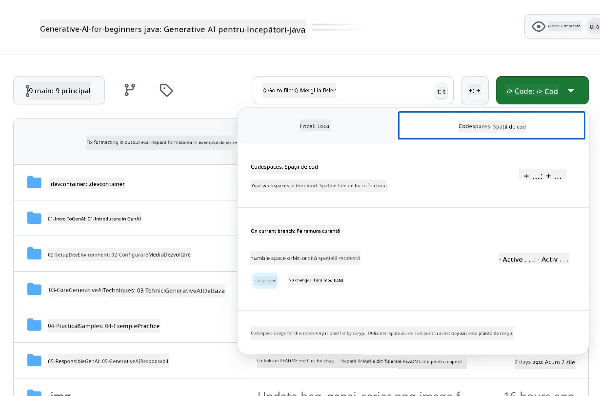
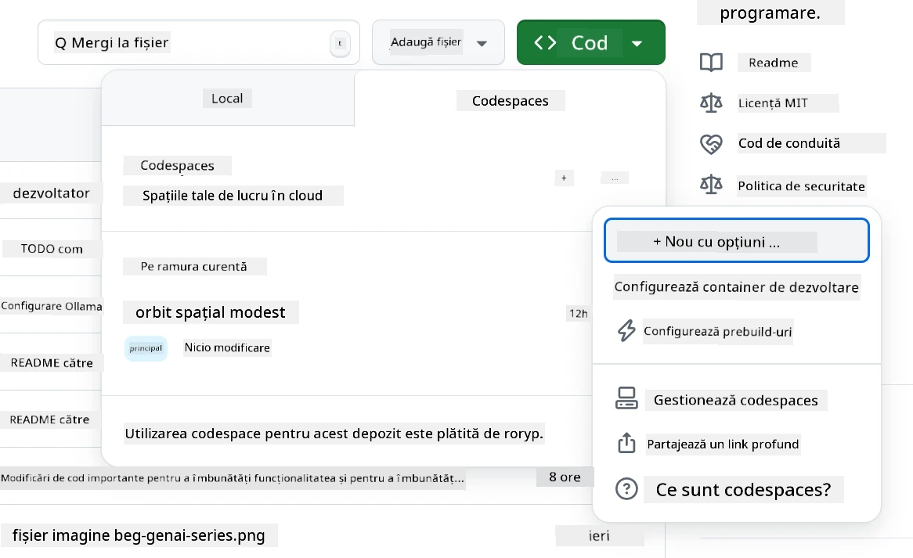
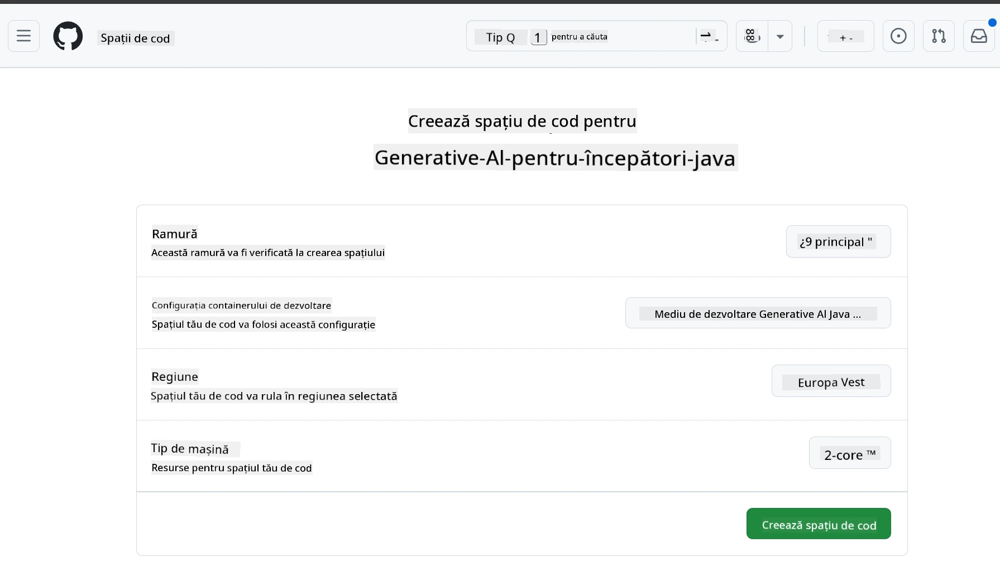
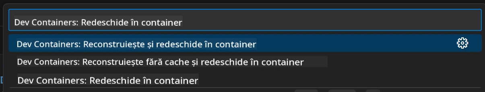
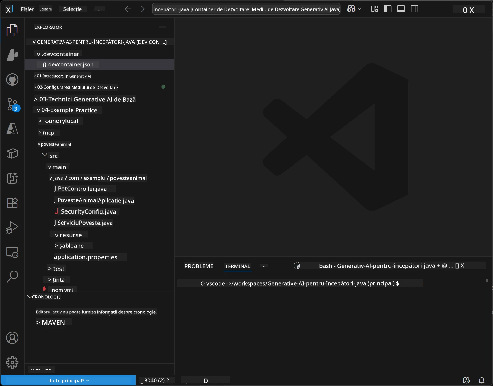
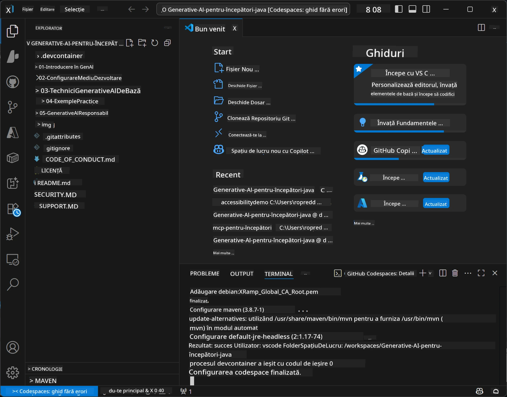

<!--
CO_OP_TRANSLATOR_METADATA:
{
  "original_hash": "96a30d42b9751a3d4e4b20e28d29d459",
  "translation_date": "2026-01-28T05:22:13+00:00",
  "source_file": "02-SetupDevEnvironment/README.md",
  "language_code": "ro"
}
-->
# Configurarea mediului de dezvoltare pentru Generative AI pentru Java

> **Început rapid**: Codifică în cloud în 2 minute - Sari la [Configurarea GitHub Codespaces](../../../02-SetupDevEnvironment) - nu este necesară nicio instalare locală și folosește modelele GitHub!

> **Interesat de Azure OpenAI?**, vezi [Ghidul nostru de configurare Azure OpenAI](getting-started-azure-openai.md) cu pașii pentru a crea o nouă resursă Azure OpenAI.

## Ce vei învăța

- Configurarea unui mediu de dezvoltare Java pentru aplicații AI
- Alegerea și configurarea mediului de dezvoltare preferat (cloud-first cu Codespaces, container de dezvoltare local sau configurare locală completă)
- Testarea configurației conectându-te la GitHub Models

## Cuprins

- [Ce vei învăța](../../../02-SetupDevEnvironment)
- [Introducere](../../../02-SetupDevEnvironment)
- [Pasul 1: Configurarea mediului de dezvoltare](../../../02-SetupDevEnvironment)
  - [Opțiunea A: GitHub Codespaces (Recomandat)](../../../02-SetupDevEnvironment)
  - [Opțiunea B: Container de dezvoltare local](../../../02-SetupDevEnvironment)
  - [Opțiunea C: Folosește-ți instalarea locală existentă](../../../02-SetupDevEnvironment)
- [Pasul 2: Creează un token personal de acces GitHub](../../../02-SetupDevEnvironment)
- [Pasul 3: Testează configurația ta](../../../02-SetupDevEnvironment)
- [Depanare](../../../02-SetupDevEnvironment)
- [Rezumat](../../../02-SetupDevEnvironment)
- [Pașii următori](../../../02-SetupDevEnvironment)

## Introducere

Acest capitol te va ghida prin configurarea unui mediu de dezvoltare. Vom folosi **GitHub Models** ca exemplu principal deoarece este gratuit, ușor de configurat cu un cont GitHub, nu necesită card de credit și oferă acces la mai multe modele pentru experimentare.

**Nu este necesară configurarea locală!** Poți începe codarea imediat folosind GitHub Codespaces, care oferă un mediu complet de dezvoltare în browserul tău.


Recomandăm folosirea [**GitHub Models**](https://github.com/marketplace?type=models) pentru acest curs pentru că este:
- **Gratuit** pentru a începe
- **Ușor** de configurat doar cu un cont GitHub
- **Fără card de credit** necesar
- **Mai multe modele** disponibile pentru experimentare

> **Notă**: Modelele GitHub folosite în acest training au aceste limite gratuite:
> - 15 cereri pe minut (150 pe zi)
> - ~8.000 de cuvinte intrare, ~4.000 cuvinte ieșire per cerere
> - 5 cereri concurente
> 
> Pentru utilizare în producție, treceți la Azure AI Foundry Models cu contul Azure. Codul tău nu trebuie să se schimbe. Vezi [documentația Azure AI Foundry](https://learn.microsoft.com/azure/ai-foundry/foundry-models/how-to/quickstart-github-models).

## Pasul 1: Configurarea mediului de dezvoltare

<a name="quick-start-cloud"></a>

Am creat un container de dezvoltare preconfigurat pentru a minimiza timpul de configurare și pentru a asigura că ai toate uneltele necesare pentru acest curs Generative AI pentru Java. Alege abordarea de dezvoltare preferată:

### Opțiuni pentru configurarea mediului:

#### Opțiunea A: GitHub Codespaces (Recomandat)

**Începe să codezi în 2 minute - fără configurare locală!**

1. Fă fork la acest depozit în contul tău GitHub
   > **Notă**: Dacă vrei să modifici configurația de bază, vezi [Configurația containerului de dezvoltare](../../../.devcontainer/devcontainer.json)
2. Click pe **Code** → fila **Codespaces** → **...** → **New with options...**
3. Lasă setările implicite – va selecta **Configurarea containerului de dezvoltare**: **Generative AI Java Development Environment**, un devcontainer personalizat creat pentru acest curs
4. Click pe **Create codespace**
5. Așteaptă ~2 minute până când mediul este pregătit
6. Continuă la [Pasul 2: Creează token-ul GitHub](../../../02-SetupDevEnvironment)







> **Beneficiile Codespaces**:
> - Nu necesită instalare locală
> - Funcționează pe orice dispozitiv cu browser
> - Preconfigurat cu toate uneltele și dependențele
> - Gratuit 60 de ore pe lună pentru conturi personale
> - Mediu consistent pentru toți cursanții

#### Opțiunea B: Container de dezvoltare local

**Pentru dezvoltatori care preferă dezvoltarea locală cu Docker**

1. Fă fork și clonează acest depozit pe mașina ta locală
   > **Notă**: Dacă vrei să modifici configurația de bază, vezi [Configurația containerului de dezvoltare](../../../.devcontainer/devcontainer.json)
2. Instalează [Docker Desktop](https://www.docker.com/products/docker-desktop/) și [VS Code](https://code.visualstudio.com/)
3. Instalează extensia [Dev Containers](https://marketplace.visualstudio.com/items?itemName=ms-vscode-remote.remote-containers) în VS Code
4. Deschide folderul depozitului în VS Code
5. Când ți se cere, click pe **Reopen in Container** (sau folosește `Ctrl+Shift+P` → "Dev Containers: Reopen in Container")
6. Așteaptă să se construiască și să pornească containerul
7. Continuă la [Pasul 2: Creează token-ul GitHub](../../../02-SetupDevEnvironment)





#### Opțiunea C: Folosește-ți instalarea locală existentă

**Pentru dezvoltatori cu medii Java existente**

Precondiții:
- [Java 21+](https://www.oracle.com/java/technologies/javase/jdk21-archive-downloads.html) 
- [Maven 3.9+](https://maven.apache.org/download.cgi)
- [VS Code](https://code.visualstudio.com) sau IDE-ul preferat

Pași:
1. Clonează acest depozit pe mașina ta locală
2. Deschide proiectul în IDE-ul tău
3. Continuă la [Pasul 2: Creează token-ul GitHub](../../../02-SetupDevEnvironment)

> **Sfat Pro**: Dacă ai o mașină cu specificații reduse dar vrei VS Code local, folosește GitHub Codespaces! Poți conecta VS Code local la un Codespace găzduit în cloud pentru a avea ce e mai bun din ambele lumi.



## Pasul 2: Creează un token personal de acces GitHub

1. Accesează [Setările GitHub](https://github.com/settings/profile) și selectează **Settings** din meniul profilului tău.
2. În bara laterală stângă, click pe **Developer settings** (de regulă în partea de jos).
3. Sub **Personal access tokens**, click pe **Fine-grained tokens** (sau urmează acest [link direct](https://github.com/settings/personal-access-tokens)).
4. Click pe **Generate new token**.
5. Sub "Token name", oferă un nume descriptiv (de ex., `GenAI-Java-Course-Token`).
6. Setează o dată de expirare (recomandat: 7 zile pentru bune practici de securitate).
7. Sub "Resource owner", selectează contul tău de utilizator.
8. Sub "Repository access", selectează depozitele pe care vrei să le folosești cu GitHub Models (sau "All repositories" dacă este necesar).
9. Sub "Account permissions", găsește **Models** și setează pe **Read-only**.
10. Click pe **Generate token**.
11. **Copiază și salvează token-ul acum** – nu îl vei mai vedea din nou!

> **Sfaturi de securitate**: Folosește cel mai mic nivel necesar de permisiuni și cea mai scurtă expirare practică pentru token-urile tale de acces.

## Pasul 3: Testează configurația ta cu exemplul GitHub Models

Odată ce mediul tău de dezvoltare este pregătit, hai să testăm integrarea GitHub Models cu aplicația noastră exemplu din [`02-SetupDevEnvironment/examples/github-models`](../../../02-SetupDevEnvironment/examples/github-models).

1. Deschide terminalul în mediul tău de dezvoltare.
2. Navighează către exemplul GitHub Models:
   ```bash
   cd 02-SetupDevEnvironment/examples/github-models
   ```
3. Setează token-ul GitHub ca variabilă de mediu:
   ```bash
   # macOS/Linux
   export GITHUB_TOKEN=your_token_here
   
   # Windows (Prompt de comandă)
   set GITHUB_TOKEN=your_token_here
   
   # Windows (PowerShell)
   $env:GITHUB_TOKEN="your_token_here"
   ```

4. Rulează aplicația:
   ```bash
   mvn compile exec:java -Dexec.mainClass="com.example.githubmodels.App"
   ```

Ar trebui să vezi o ieșire similară cu:
```text
Using model: gpt-4.1-nano
Sending request to GitHub Models...
Response: Hello World!
```

### Înțelegerea codului exemplu

Mai întâi, hai să înțelegem ce am rulat. Exemplul din `examples/github-models` folosește OpenAI Java SDK pentru a se conecta la GitHub Models:

**Ce face acest cod:**
- **Se conectează** la GitHub Models folosind token-ul tău personal de acces
- **Trimite** un mesaj simplu "Say Hello World!" către modelul AI
- **Primește** și afișează răspunsul AI
- **Verifică** că setup-ul tău funcționează corect

**Dependența principală** (în `pom.xml`):
```xml
<dependency>
    <groupId>com.openai</groupId>
    <artifactId>openai-java</artifactId>
    <version>2.12.0</version>
</dependency>
```

**Codul principal** (`App.java`):
```java
// Conectează-te la modelele GitHub folosind OpenAI Java SDK
OpenAIClient client = OpenAIOkHttpClient.builder()
    .apiKey(pat)
    .baseUrl("https://models.inference.ai.azure.com")
    .build();

// Creează cererea de completare chat
ChatCompletionCreateParams params = ChatCompletionCreateParams.builder()
    .model(modelId)
    .addSystemMessage("You are a concise assistant.")
    .addUserMessage("Say Hello World!")
    .build();

// Obține răspunsul AI
ChatCompletion response = client.chat().completions().create(params);
System.out.println("Response: " + response.choices().get(0).message().content().orElse("No response content"));
```

## Rezumat

Excelent! Ai totul acum configurat:

- Ai creat un token personal de acces GitHub cu permisiunile corecte pentru acces AI
- Mediul tău de dezvoltare Java funcționează (fie că este Codespaces, container de dezvoltare sau local)
- Te-ai conectat la GitHub Models folosind OpenAI Java SDK pentru dezvoltare AI gratuită
- Ai testat că totul funcționează cu un exemplu simplu care comunică cu modelele AI

## Pașii următori

[Capitolul 3: Tehnici de bază Generative AI](../03-CoreGenerativeAITechniques/README.md)

## Depanare

Ai probleme? Iată probleme comune și soluții:

- **Tokenul nu funcționează?** 
  - Asigură-te că ai copiat token-ul complet fără spații în plus
  - Verifică dacă token-ul este setat corect ca variabilă de mediu
  - Verifică dacă token-ul are permisiunile corecte (Models: Read-only)

- **Maven nu este găsit?** 
  - Dacă folosești containere dev/Codespaces, Maven ar trebui să fie preinstalat
  - Pentru configurare locală, asigură-te că Java 21+ și Maven 3.9+ sunt instalate
  - Încearcă `mvn --version` pentru a verifica instalarea

- **Probleme de conexiune?** 
  - Verifică conexiunea la internet
  - Asigură-te că GitHub este accesibil din rețeaua ta
  - Verifică dacă nu ești în spatele unui firewall care blochează endpoint-ul GitHub Models

- **Containerul dev nu pornește?** 
  - Asigură-te că Docker Desktop rulează (pentru dezvoltare locală)
  - Încearcă să refaci containerul: `Ctrl+Shift+P` → "Dev Containers: Rebuild Container"

- **Eroare la compilarea aplicației?**
  - Asigură-te că ești în directorul corect: `02-SetupDevEnvironment/examples/github-models`
  - Încearcă să cureți și să reconstruiești: `mvn clean compile`

> **Ai nevoie de ajutor?**: Dacă încă întâmpini probleme, deschide un issue în depozit și te vom ajuta.

---

<!-- CO-OP TRANSLATOR DISCLAIMER START -->
**Declinare de responsabilitate**:
Acest document a fost tradus folosind serviciul de traducere automată AI [Co-op Translator](https://github.com/Azure/co-op-translator). Deși ne străduim pentru acuratețe, vă rugăm să țineți cont că traducerile automatizate pot conține erori sau inexactități. Documentul original, în limba sa nativă, ar trebui considerat sursa de autoritate. Pentru informații critice, se recomandă traducerea profesională realizată de un specialist uman. Nu ne asumăm răspunderea pentru eventualele neînțelegeri sau interpretări eronate rezultate din utilizarea acestei traduceri.
<!-- CO-OP TRANSLATOR DISCLAIMER END -->