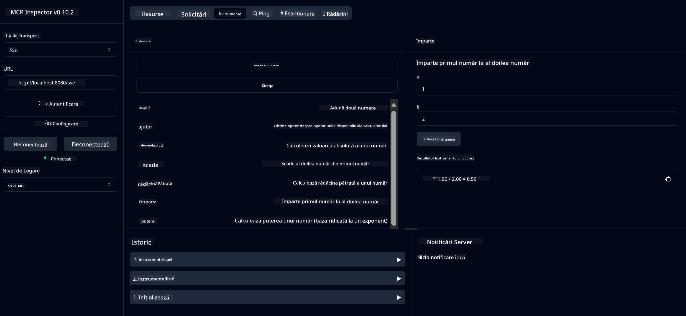

<!--
CO_OP_TRANSLATOR_METADATA:
{
  "original_hash": "7bf9a4a832911269a8bd0decb97ff36c",
  "translation_date": "2025-07-21T21:28:05+00:00",
  "source_file": "04-PracticalSamples/mcp/calculator/README.md",
  "language_code": "ro"
}
-->
# Serviciul de Calculator de Bază MCP

>**Notă**: Acest capitol include un [**Tutorial**](./TUTORIAL.md) care te ghidează prin rularea exemplelor finalizate.

Bine ai venit la prima ta experiență practică cu **Model Context Protocol (MCP)**! În capitolele anterioare, ai învățat despre fundamentele AI generativ și ai configurat mediul de dezvoltare. Acum este momentul să construim ceva practic.

Acest serviciu de calculator demonstrează cum modelele AI pot interacționa în siguranță cu instrumente externe folosind MCP. În loc să ne bazăm pe capacitățile uneori nesigure ale modelului AI de a face calcule matematice, îți vom arăta cum să construiești un sistem robust în care AI poate apela servicii specializate pentru calcule precise.

## Cuprins

- [Ce Vei Învăța](../../../../../04-PracticalSamples/mcp/calculator)
- [Cerințe Prealabile](../../../../../04-PracticalSamples/mcp/calculator)
- [Concepte Cheie](../../../../../04-PracticalSamples/mcp/calculator)
- [Start Rapid](../../../../../04-PracticalSamples/mcp/calculator)
- [Operațiuni Disponibile ale Calculatorului](../../../../../04-PracticalSamples/mcp/calculator)
- [Clienți de Testare](../../../../../04-PracticalSamples/mcp/calculator)
  - [1. Client MCP Direct (SDKClient)](../../../../../04-PracticalSamples/mcp/calculator)
  - [2. Client Alimentat de AI (LangChain4jClient)](../../../../../04-PracticalSamples/mcp/calculator)
- [Inspector MCP (Interfață Web)](../../../../../04-PracticalSamples/mcp/calculator)
  - [Instrucțiuni Pas cu Pas](../../../../../04-PracticalSamples/mcp/calculator)

## Ce Vei Învăța

Lucrând prin acest exemplu, vei înțelege:
- Cum să creezi servicii compatibile MCP folosind Spring Boot
- Diferența dintre comunicarea directă prin protocol și interacțiunea alimentată de AI
- Cum modelele AI decid când și cum să utilizeze instrumente externe
- Cele mai bune practici pentru construirea aplicațiilor AI cu instrumente integrate

Perfect pentru începători care învață conceptele MCP și sunt gata să construiască prima lor integrare AI cu un instrument!

## Cerințe Prealabile

- Java 21+
- Maven 3.6+
- **Token GitHub**: Necesită pentru clientul alimentat de AI. Dacă nu l-ai configurat încă, vezi [Capitolul 2: Configurarea mediului de dezvoltare](../../../02-SetupDevEnvironment/README.md) pentru instrucțiuni.

## Concepte Cheie

**Model Context Protocol (MCP)** este o metodă standardizată prin care aplicațiile AI se conectează în siguranță la instrumente externe. Gândește-te la el ca la un "pod" care permite modelelor AI să utilizeze servicii externe, cum ar fi calculatorul nostru. În loc ca modelul AI să încerce să facă calcule (ceea ce poate fi nesigur), acesta poate apela serviciul nostru de calculator pentru a obține rezultate precise. MCP asigură că această comunicare are loc în siguranță și în mod constant.

**Server-Sent Events (SSE)** permite comunicarea în timp real între server și clienți. Spre deosebire de cererile HTTP tradiționale, unde întrebi și aștepți un răspuns, SSE permite serverului să trimită actualizări continue către client. Acest lucru este perfect pentru aplicațiile AI unde răspunsurile pot fi transmise în flux sau pot necesita timp pentru procesare.

**Instrumente AI & Apelarea Funcțiilor** permit modelelor AI să aleagă și să utilizeze automat funcții externe (cum ar fi operațiunile calculatorului) pe baza cererilor utilizatorului. Când întrebi "Cât face 15 + 27?", modelul AI înțelege că vrei o adunare, apelează automat funcția `add` cu parametrii corecți (15, 27) și returnează rezultatul în limbaj natural. AI-ul acționează ca un coordonator inteligent care știe când și cum să folosească fiecare instrument.

## Start Rapid

### 1. Navighează la directorul aplicației calculatorului
```bash
cd Generative-AI-for-beginners-java/04-PracticalSamples/mcp/calculator
```

### 2. Construiește și Rulează
```bash
mvn clean install -DskipTests
java -jar target/calculator-server-0.0.1-SNAPSHOT.jar
```

### 3. Testează cu Clienți
- **SDKClient**: Interacțiune directă prin protocol MCP
- **LangChain4jClient**: Interacțiune naturală alimentată de AI (necesită token GitHub)

## Operațiuni Disponibile ale Calculatorului

- `add(a, b)`, `subtract(a, b)`, `multiply(a, b)`, `divide(a, b)`
- `power(base, exponent)`, `squareRoot(number)`, `absolute(number)`
- `modulus(a, b)`, `help()`

## Clienți de Testare

### 1. Client MCP Direct (SDKClient)
Testează comunicarea brută prin protocol MCP. Rulează cu:
```bash
mvn test-compile exec:java -Dexec.mainClass="com.microsoft.mcp.sample.client.SDKClient" -Dexec.classpathScope=test
```

### 2. Client Alimentat de AI (LangChain4jClient)
Demonstrează interacțiunea naturală cu modelele GitHub. Necesită token GitHub (vezi [Cerințe Prealabile](../../../../../04-PracticalSamples/mcp/calculator)).

**Rulează:**
```bash
mvn test-compile exec:java -Dexec.mainClass="com.microsoft.mcp.sample.client.LangChain4jClient" -Dexec.classpathScope=test
```

## Inspector MCP (Interfață Web)

Inspectorul MCP oferă o interfață web vizuală pentru a testa serviciul MCP fără a scrie cod. Perfect pentru începători care vor să înțeleagă cum funcționează MCP!

### Instrucțiuni Pas cu Pas:

1. **Pornește serverul calculatorului** (dacă nu este deja pornit):
   ```bash
   java -jar target/calculator-server-0.0.1-SNAPSHOT.jar
   ```

2. **Instalează și rulează Inspector MCP** într-un terminal nou:
   ```bash
   npx @modelcontextprotocol/inspector
   ```

3. **Deschide interfața web**:
   - Caută un mesaj de tipul "Inspector running at http://localhost:6274"
   - Deschide acel URL în browserul tău

4. **Conectează-te la serviciul calculatorului**:
   - În interfața web, setează tipul de transport la "SSE"
   - Setează URL-ul la: `http://localhost:8080/sse`
   - Apasă butonul "Connect"

5. **Explorează instrumentele disponibile**:
   - Apasă "List Tools" pentru a vedea toate operațiunile calculatorului
   - Vei vedea funcții precum `add`, `subtract`, `multiply`, etc.

6. **Testează o operațiune a calculatorului**:
   - Selectează un instrument (de exemplu, "add")
   - Introdu parametrii (de exemplu, `a: 15`, `b: 27`)
   - Apasă "Run Tool"
   - Vezi rezultatul returnat de serviciul MCP!

Această abordare vizuală te ajută să înțelegi exact cum funcționează comunicarea MCP înainte de a-ți construi propriii clienți.



---
**Referință:** [Documentația MCP Server Boot Starter](https://docs.spring.io/spring-ai/reference/api/mcp/mcp-server-boot-starter-docs.html)

**Declinare de responsabilitate**:  
Acest document a fost tradus folosind serviciul de traducere AI [Co-op Translator](https://github.com/Azure/co-op-translator). Deși ne străduim să asigurăm acuratețea, vă rugăm să fiți conștienți că traducerile automate pot conține erori sau inexactități. Documentul original în limba sa natală ar trebui considerat sursa autoritară. Pentru informații critice, se recomandă traducerea profesională realizată de un specialist uman. Nu ne asumăm responsabilitatea pentru eventualele neînțelegeri sau interpretări greșite care pot apărea din utilizarea acestei traduceri.