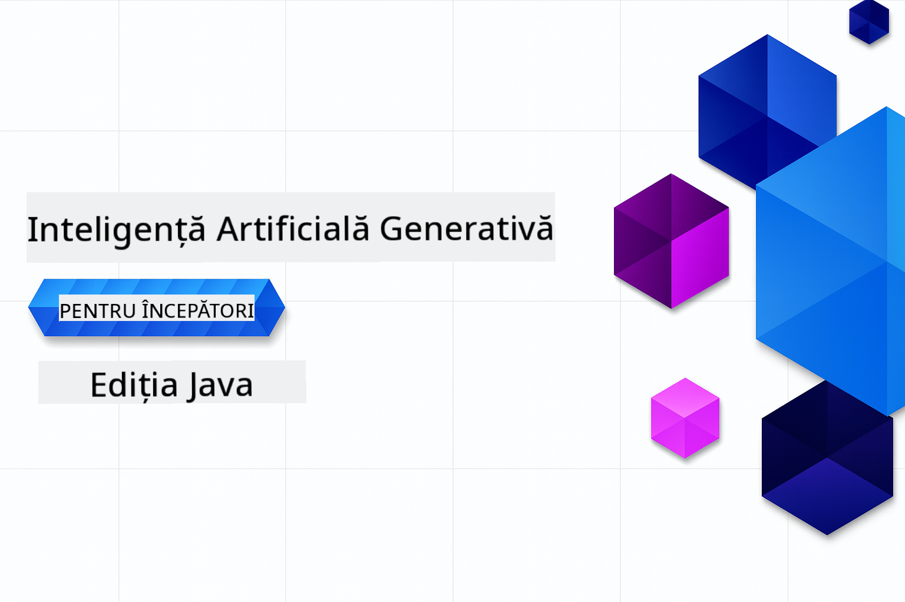

<!--
CO_OP_TRANSLATOR_METADATA:
{
  "original_hash": "a49b35508745c032a0033d914df7901b",
  "translation_date": "2025-07-25T10:04:51+00:00",
  "source_file": "README.md",
  "language_code": "ro"
}
-->
# Generative AI pentru Începători - Ediția Java

**Timp necesar**: Atelierul poate fi finalizat online fără configurare locală. Dacă dorești să rulezi exemplele, configurarea mediului durează 2 minute, iar explorarea exemplelor necesită între 1-3 ore, în funcție de profunzimea explorării.

> **Start Rapid**

1. Clonează acest depozit în contul tău de GitHub
2. Click pe **Code** → fila **Codespaces** → **...** → **New with options...**
3. Folosește setările implicite – acestea vor selecta containerul de dezvoltare creat pentru acest curs
4. Click pe **Create codespace**
5. Așteaptă ~2 minute pentru ca mediul să fie gata
6. Treci direct la [Crearea Token-ului pentru Modelele GitHub](./02-SetupDevEnvironment/README.md#step-2-create-a-github-personal-access-token)

## Suport Multi-Limbă

### Suportat prin GitHub Action (Automat & Mereu Actualizat)

[French](../fr/README.md) | [Spanish](../es/README.md) | [German](../de/README.md) | [Russian](../ru/README.md) | [Arabic](../ar/README.md) | [Persian (Farsi)](../fa/README.md) | [Urdu](../ur/README.md) | [Chinese (Simplified)](../zh/README.md) | [Chinese (Traditional, Macau)](../mo/README.md) | [Chinese (Traditional, Hong Kong)](../hk/README.md) | [Chinese (Traditional, Taiwan)](../tw/README.md) | [Japanese](../ja/README.md) | [Korean](../ko/README.md) | [Hindi](../hi/README.md) | [Bengali](../bn/README.md) | [Marathi](../mr/README.md) | [Nepali](../ne/README.md) | [Punjabi (Gurmukhi)](../pa/README.md) | [Portuguese (Portugal)](../pt/README.md) | [Portuguese (Brazil)](../br/README.md) | [Italian](../it/README.md) | [Polish](../pl/README.md) | [Turkish](../tr/README.md) | [Greek](../el/README.md) | [Thai](../th/README.md) | [Swedish](../sv/README.md) | [Danish](../da/README.md) | [Norwegian](../no/README.md) | [Finnish](../fi/README.md) | [Dutch](../nl/README.md) | [Hebrew](../he/README.md) | [Vietnamese](../vi/README.md) | [Indonesian](../id/README.md) | [Malay](../ms/README.md) | [Tagalog (Filipino)](../tl/README.md) | [Swahili](../sw/README.md) | [Hungarian](../hu/README.md) | [Czech](../cs/README.md) | [Slovak](../sk/README.md) | [Romanian](./README.md) | [Bulgarian](../bg/README.md) | [Serbian (Cyrillic)](../sr/README.md) | [Croatian](../hr/README.md) | [Slovenian](../sl/README.md) | [Ukrainian](../uk/README.md) | [Burmese (Myanmar)](../my/README.md)

## Structura Cursului & Parcursul de Învățare

### **Capitolul 1: Introducere în Generative AI**
- **Concepte de bază**: Înțelegerea modelelor lingvistice mari, token-urilor, embedding-urilor și capacităților AI
- **Ecosistemul AI în Java**: Prezentare generală a Spring AI și SDK-urilor OpenAI
- **Protocolul Contextului Modelului**: Introducere în MCP și rolul său în comunicarea agenților AI
- **Aplicații practice**: Scenarii reale, inclusiv chatbot-uri și generarea de conținut
- **[→ Începe Capitolul 1](./01-IntroToGenAI/README.md)**

### **Capitolul 2: Configurarea Mediului de Dezvoltare**
- **Configurare Multi-Furnizor**: Configurarea integrărilor GitHub Models, Azure OpenAI și OpenAI Java SDK
- **Spring Boot + Spring AI**: Cele mai bune practici pentru dezvoltarea aplicațiilor AI în mediul enterprise
- **Modelele GitHub**: Acces gratuit la modele AI pentru prototipare și învățare (fără card de credit necesar)
- **Instrumente de Dezvoltare**: Configurarea containerelor Docker, VS Code și GitHub Codespaces
- **[→ Începe Capitolul 2](./02-SetupDevEnvironment/README.md)**

### **Capitolul 3: Tehnici de Bază în Generative AI**
- **Ingineria Prompt-urilor**: Tehnici pentru răspunsuri optime ale modelelor AI
- **Embedding-uri & Operații Vectoriale**: Implementarea căutării semantice și potrivirii similitudinii
- **Generare Augmentată prin Recuperare (RAG)**: Combinarea AI cu sursele proprii de date
- **Apelarea Funcțiilor**: Extinderea capacităților AI cu instrumente și plugin-uri personalizate
- **[→ Începe Capitolul 3](./03-CoreGenerativeAITechniques/README.md)**

### **Capitolul 4: Aplicații Practice & Proiecte**
- **Generator de Povești pentru Animale de Companie** (`petstory/`): Generarea creativă de conținut cu Modelele GitHub
- **Demo Local Foundry** (`foundrylocal/`): Integrarea locală a modelelor AI cu OpenAI Java SDK
- **Serviciu Calculator MCP** (`mcp/calculator/`): Implementare de bază a Protocolului Contextului Modelului cu Spring AI
- **[→ Începe Capitolul 4](./04-PracticalSamples/README.md)**

### **Capitolul 5: Dezvoltarea Responsabilă a AI**
- **Siguranța Modelelor GitHub**: Testarea mecanismelor de filtrare a conținutului și siguranță integrate
- **Demo AI Responsabil**: Exemplu practic care arată cum funcționează filtrele de siguranță AI
- **Cele mai bune practici**: Ghiduri esențiale pentru dezvoltarea și implementarea etică a AI
- **[→ Începe Capitolul 5](./05-ResponsibleGenAI/README.md)**

## Resurse Adiționale 

- [AI Agents For Beginners](https://github.com/microsoft/ai-agents-for-beginners)
- [Generative AI pentru Începători folosind .NET](https://github.com/microsoft/Generative-AI-for-beginners-dotnet)
- [Generative AI pentru Începători folosind JavaScript](https://github.com/microsoft/generative-ai-with-javascript)
- [Generative AI pentru Începători](https://github.com/microsoft/generative-ai-for-beginners)
- [ML pentru Începători](https://aka.ms/ml-beginners)
- [Data Science pentru Începători](https://aka.ms/datascience-beginners)
- [AI pentru Începători](https://aka.ms/ai-beginners)
- [Cybersecurity pentru Începători](https://github.com/microsoft/Security-101)
- [Web Dev pentru Începători](https://aka.ms/webdev-beginners)
- [IoT pentru Începători](https://aka.ms/iot-beginners)
- [XR Development pentru Începători](https://github.com/microsoft/xr-development-for-beginners)
- [Stăpânirea GitHub Copilot pentru Programare în Pereche AI](https://aka.ms/GitHubCopilotAI)
- [Stăpânirea GitHub Copilot pentru Dezvoltatori C#/.NET](https://github.com/microsoft/mastering-github-copilot-for-dotnet-csharp-developers)
- [Alege-ți Propria Aventură Copilot](https://github.com/microsoft/CopilotAdventures)
- [Aplicație Chat RAG cu Servicii Azure AI](https://github.com/Azure-Samples/azure-search-openai-demo-java)

**Declinare de responsabilitate**:  
Acest document a fost tradus folosind serviciul de traducere AI [Co-op Translator](https://github.com/Azure/co-op-translator). Deși ne străduim să asigurăm acuratețea, vă rugăm să fiți conștienți că traducerile automate pot conține erori sau inexactități. Documentul original în limba sa natală ar trebui considerat sursa autoritară. Pentru informații critice, se recomandă traducerea profesională realizată de un specialist uman. Nu ne asumăm responsabilitatea pentru eventualele neînțelegeri sau interpretări greșite care pot apărea din utilizarea acestei traduceri.