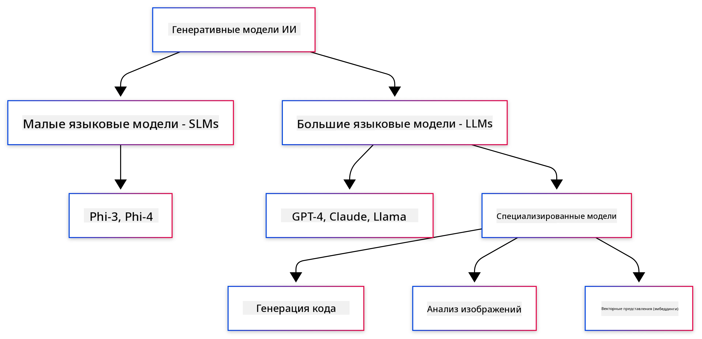
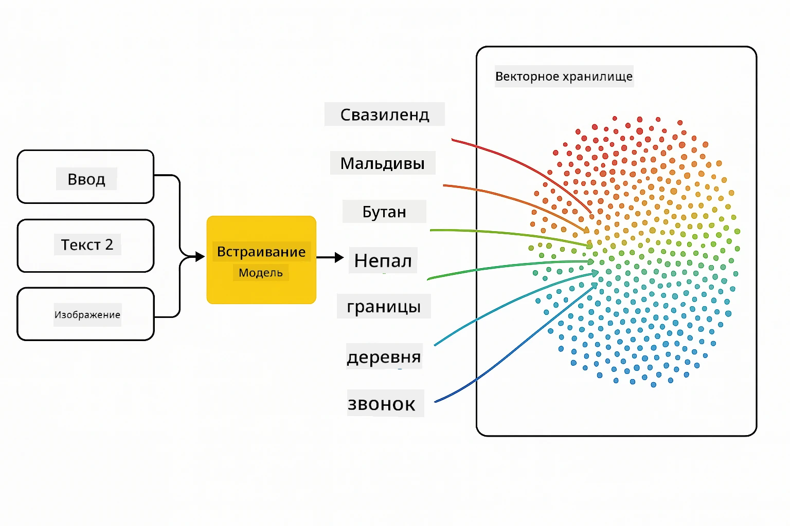
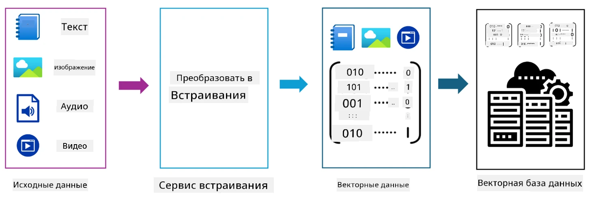
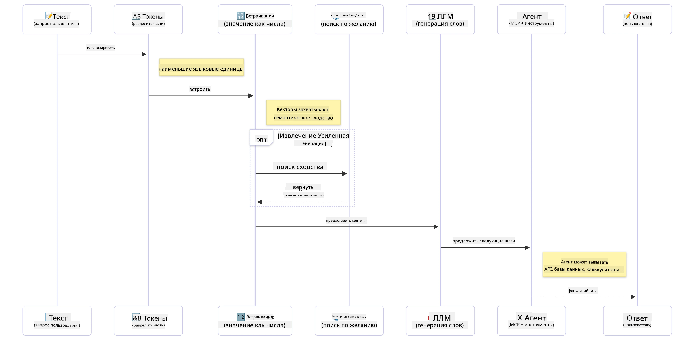

# Введение в генеративный ИИ - версия для Java

> **Видео**: [Посмотрите обзорное видео к этому уроку на YouTube.](https://www.youtube.com/watch?v=XH46tGp_eSw) Также можно кликнуть на изображение выше.

## Чему вы научитесь

- **Основы генеративного ИИ**, включая большие языковые модели (LLM), создание подсказок, токены, эмбеддинги и векторные базы данных
- **Сравнение инструментов для разработки ИИ на Java**, включая Azure OpenAI SDK, Spring AI и OpenAI Java SDK
- **Изучение протокола контекста модели** и его роли в коммуникации ИИ-агентов

## Содержание

- [Введение](#введение)
- [Краткое обновление по концепциям генеративного ИИ](#краткое-обновление-по-концепциям-генеративного-и-и)
- [Обзор создания подсказок](#обзор-создания-подсказок)
- [Токены, эмбеддинги и агенты](#токены-эмбеддинги-и-агенты)
- [Инструменты и библиотеки для разработки ИИ на Java](#инструменты-и-библиотеки-для-разработки-и-и-на-java)
  - [OpenAI Java SDK](#openai-java-sdk)
  - [Spring AI](#spring-ai)
  - [Azure OpenAI Java SDK](#azure-openai-java-sdk)
- [Резюме](#резюме)
- [Следующие шаги](#следующие-шаги)

## Введение

Добро пожаловать в первую главу курса «Генеративный ИИ для начинающих - версия для Java»! Этот базовый урок познакомит вас с ключевыми концепциями генеративного ИИ и тем, как работать с ними на Java. Вы узнаете об основных строительных блоках приложений ИИ, таких как большие языковые модели (LLM), токены, эмбеддинги и агенты ИИ. Мы также рассмотрим основные инструменты для Java, которые вы будете использовать в ходе курса.

### Краткое обновление по концепциям генеративного ИИ

Генеративный ИИ — это тип искусственного интеллекта, который создает новый контент, такой как текст, изображения или код, на основе закономерностей и связей, извлеченных из данных. Модели генеративного ИИ могут генерировать ответы, похожие на человеческие, понимать контекст и иногда создавать контент, который кажется человеком написанным.

При разработке ваших Java-приложений ИИ вы будете работать с **генеративными ИИ-моделями** для создания контента. Некоторые возможности генеративных моделей включают:

- **Генерация текста**: создание текста, похожего на человеческий, для чат-ботов, контента и автозавершения текста.
- **Генерация и анализ изображений**: создание реалистичных изображений, улучшение фото и обнаружение объектов.
- **Генерация кода**: написание фрагментов кода или скриптов.

Существуют специализированные типы моделей, оптимизированных для разных задач. Например, и **малые языковые модели (SLM)**, и **большие языковые модели (LLM)** могут выполнять генерацию текста, при этом LLM обычно демонстрируют лучшую производительность для сложных задач. Для задач, связанных с изображениями, используют специализированные модели для компьютерного зрения или мультимодальные модели.

Конечно, ответы этих моделей не всегда идеальны. Вы, наверное, слышали, как говорят, что модели "галлюцинируют" или генерируют неверную информацию, выдавая её за авторитетную. Однако вы можете помочь модели создавать более качественные ответы, предоставляя ей четкие инструкции и контекст. Именно здесь на помощь приходит **создание подсказок**.

#### Обзор создания подсказок

Создание подсказок — это практика разработки эффективных входных данных, чтобы направлять AI-модели к желаемым выводам. Она включает в себя:

- **Ясность**: четкие и недвусмысленные инструкции.
- **Контекст**: предоставление необходимой фоновой информации.
- **Ограничения**: указание любых ограничений или форматов.

Некоторые лучшие практики включают в себя дизайн подсказок, четкие инструкции, разбиение задачи, обучение на одном или нескольких примерах и настройку подсказок. Тестирование разных подсказок важно для выявления наиболее эффективных для вашей конкретной задачи.

При разработке приложений вы будете работать с разными типами подсказок:
- **Системные подсказки**: задают базовые правила и контекст поведения модели
- **Пользовательские подсказки**: входные данные от пользователей вашего приложения
- **Подсказки ассистента**: ответы модели на основе системных и пользовательских подсказок

> **Узнайте больше**: Подробнее о создании подсказок в [главе «Создание подсказок» курса GenAI для начинающих](https://github.com/microsoft/generative-ai-for-beginners/tree/main/04-prompt-engineering-fundamentals)

#### Токены, эмбеддинги и агенты

При работе с генеративными AI-моделями вы столкнетесь с такими терминами, как **токены**, **эмбеддинги**, **агенты** и **протокол контекста модели (MCP)**. Вот подробный обзор этих понятий:

- **Токены**: Токены — это минимальные единицы текста в модели. Это могут быть слова, символы или части слов. Токены используются для представления текстовых данных в формате, понятном модели. Например, предложение "The quick brown fox jumped over the lazy dog" может быть разбито на токены как ["The", " quick", " brown", " fox", " jumped", " over", " the", " lazy", " dog"] или ["The", " qu", "ick", " br", "own", " fox", " jump", "ed", " over", " the", " la", "zy", " dog"], в зависимости от стратегии токенизации.

Токенизация — это процесс разбиения текста на эти меньшие единицы. Это важно, так как модели работают с токенами, а не с необработанным текстом. Количество токенов в подсказке влияет на длину и качество ответа модели, так как у моделей есть лимиты на количество токенов в контекстном окне (например, 128 тыс. токенов у GPT-4o на полный контекст, включая и ввод, и вывод).

  В Java вы можете использовать библиотеки, такие как OpenAI SDK, для автоматической токенизации при отправке запросов к ИИ-моделям.

- **Эмбеддинги**: Эмбеддинги — это векторные представления токенов, которые захватывают семантический смысл. Это числовые представления (обычно массивы чисел с плавающей точкой), позволяющие моделям понимать отношения между словами и создавать контекстно релевантные ответы. Похожие слова имеют похожие эмбеддинги, что позволяет модели понимать концепции вроде синонимов и семантических связей.

  В Java вы можете создавать эмбеддинги с помощью OpenAI SDK или других библиотек, поддерживающих генерацию эмбеддингов. Они крайне важны для задач, таких как семантический поиск, где нужно находить похожий контент по смыслу, а не по точному совпадению текста.

- **Векторные базы данных**: Векторные базы данных — это специализированные системы хранения, оптимизированные для эмбеддингов. Они обеспечивают эффективный поиск по сходству и критически важны для паттернов Retrieval-Augmented Generation (RAG), когда нужно находить релевантную информацию из больших наборов данных на основе семантической близости, а не точного совпадения.

> **Примечание**: В этом курсе мы не рассматриваем векторные базы данных подробно, но считаем их важными, так как они широко используются в реальных приложениях.

- **Агенты и MCP**: Компоненты ИИ, которые автономно взаимодействуют с моделями, инструментами и внешними системами. Протокол контекста модели (MCP) обеспечивает стандартизированный способ для агентов безопасно получать доступ к внешним источникам данных и инструментам. Подробнее об этом в нашем курсе [MCP для начинающих](https://github.com/microsoft/mcp-for-beginners).

В Java-приложениях ИИ вы будете использовать токены для обработки текста, эмбеддинги для семантического поиска и RAG, векторные базы данных для поиска данных и агентов с MCP для создания интеллектуальных систем с использованием инструментов.

### Инструменты и библиотеки для разработки ИИ на Java

Java предлагает отличные инструменты для разработки ИИ. В курсе мы рассмотрим три основные библиотеки — OpenAI Java SDK, Azure OpenAI SDK и Spring AI.

Вот таблица с быстрым обзором, какие SDK используются в примерах каждой главы:

| Глава | Пример | SDK |
|-------|--------|-----|
| 02-SetupDevEnvironment | github-models | OpenAI Java SDK |
| 02-SetupDevEnvironment | basic-chat-azure | Spring AI Azure OpenAI |
| 03-CoreGenerativeAITechniques | examples | Azure OpenAI SDK |
| 04-PracticalSamples | petstory | OpenAI Java SDK |
| 04-PracticalSamples | foundrylocal | OpenAI Java SDK |
| 04-PracticalSamples | calculator | Spring AI MCP SDK + LangChain4j |

**Ссылки на документацию SDK:**
- [Azure OpenAI Java SDK](https://github.com/Azure/azure-sdk-for-java/tree/azure-ai-openai_1.0.0-beta.16/sdk/openai/azure-ai-openai)
- [Spring AI](https://docs.spring.io/spring-ai/reference/)
- [OpenAI Java SDK](https://github.com/openai/openai-java)
- [LangChain4j](https://docs.langchain4j.dev/)

#### OpenAI Java SDK

OpenAI SDK — это официальная Java-библиотека для OpenAI API. Она предоставляет простой и последовательный интерфейс для взаимодействия с моделями OpenAI, облегчая интеграцию возможностей ИИ в Java-приложения. Примеры из главы 2 «GitHub Models», а также приложения Pet Story и Foundry Local из главы 4 демонстрируют использование OpenAI SDK.

#### Spring AI

Spring AI — это комплексный фреймворк, который приносит возможности ИИ в приложения Spring, предоставляя единообразный уровень абстракции для разных провайдеров ИИ. Он бесшовно интегрируется в экосистему Spring, что делает его идеальным выбором для корпоративных Java-приложений с потребностью в ИИ.

Сила Spring AI в его интеграции с экосистемой Spring, что упрощает построение готовых к производству приложений ИИ с использованием знакомых паттернов Spring, таких как внедрение зависимостей, управление конфигурацией и фреймворки тестирования. Вы будете использовать Spring AI в главах 2 и 4 для создания приложений, использующих как OpenAI, так и библиотеки Spring AI для Model Context Protocol (MCP).

##### Протокол контекста модели (MCP)

[Протокол контекста модели (MCP)](https://modelcontextprotocol.io/) — это развивающийся стандарт, который позволяет приложениям ИИ безопасно взаимодействовать с внешними источниками данных и инструментами. MCP обеспечивает стандартизированный способ для моделей ИИ получать контекстную информацию и выполнять действия в ваших приложениях.

В главе 4 вы создадите простой сервис калькулятора на MCP, который демонстрирует основы протокола Model Context Protocol с помощью Spring AI, показывая, как создавать базовые интеграции инструментов и архитектуры сервисов.

#### Azure OpenAI Java SDK

Библиотека клиента Azure OpenAI для Java — это адаптация REST API OpenAI, которая предоставляет идиоматичный интерфейс и интеграцию с экосистемой Azure SDK. В главе 3 вы построите приложения с использованием Azure OpenAI SDK, включая чат-приложения, вызов функций и паттерны RAG (Retrieval-Augmented Generation).

> Примечание: Azure OpenAI SDK отстает по функциональности от OpenAI Java SDK, поэтому для будущих проектов рекомендуется использовать OpenAI Java SDK.

## Резюме

На этом мы завершаем основы! Теперь вы понимаете:

- Ключевые концепции генеративного ИИ — от LLM и создания подсказок до токенов, эмбеддингов и векторных баз данных
- Варианты инструментов для разработки ИИ на Java: Azure OpenAI SDK, Spring AI и OpenAI Java SDK
- Что такое протокол контекста модели и как он позволяет ИИ-агентам работать с внешними инструментами

## Следующие шаги

[Глава 2: Настройка среды разработки](../02-SetupDevEnvironment/README.md)

---

<!-- CO-OP TRANSLATOR DISCLAIMER START -->
**Отказ от ответственности**:  
Данный документ был переведен с помощью автоматического сервиса перевода [Co-op Translator](https://github.com/Azure/co-op-translator). Несмотря на наши усилия по обеспечению точности, имейте в виду, что автоматические переводы могут содержать ошибки или неточности. Оригинальный документ на исходном языке следует считать официальным и авторитетным источником. Для получения критически важной информации рекомендуется пользоваться профессиональным переводом, выполненным человеком. Мы не несем ответственности за любые недоразумения или неправильные толкования, возникшие в результате использования данного перевода.
<!-- CO-OP TRANSLATOR DISCLAIMER END -->