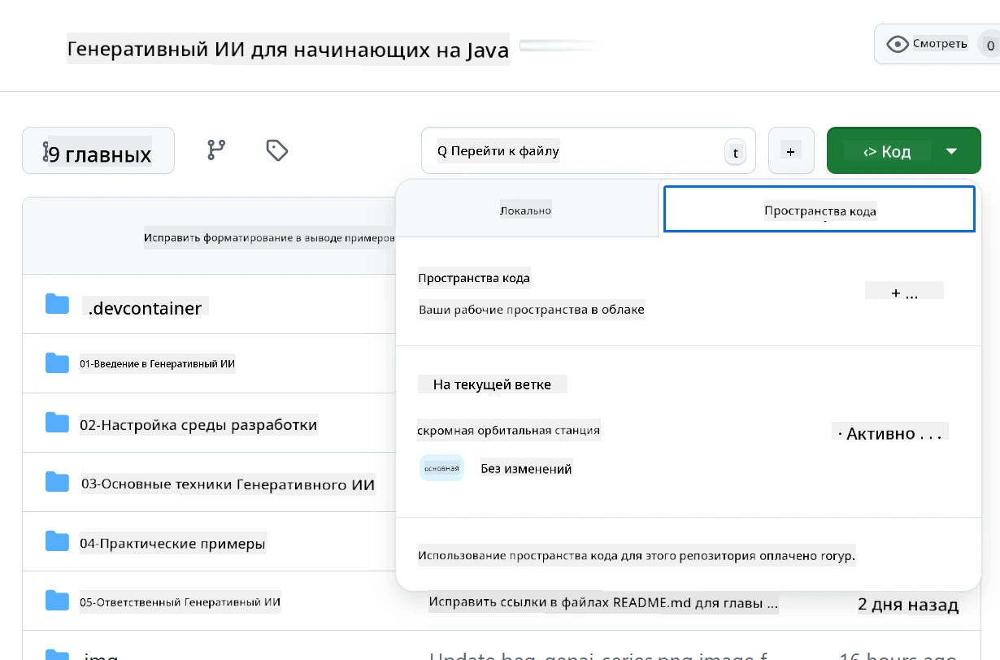
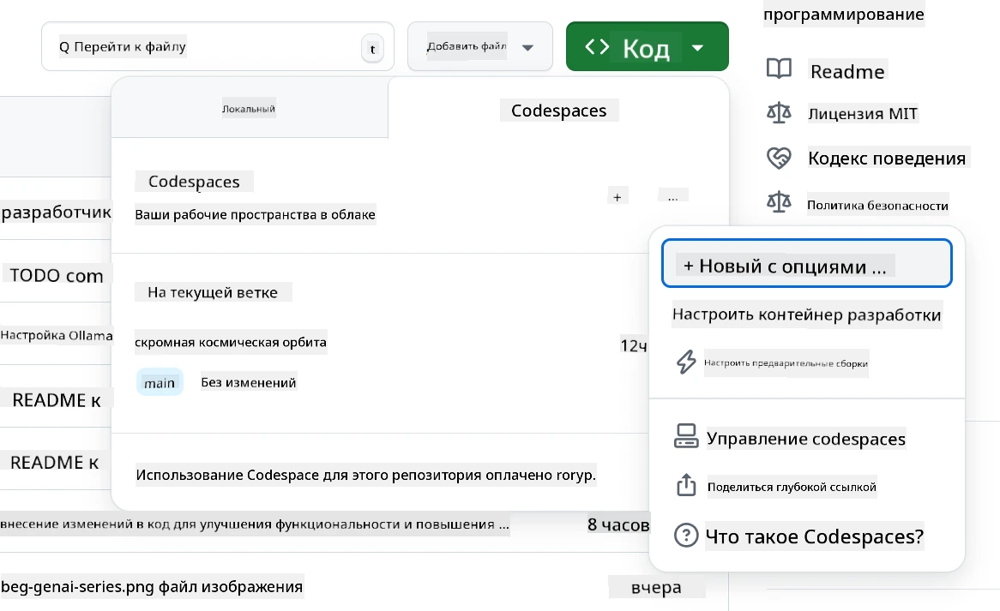
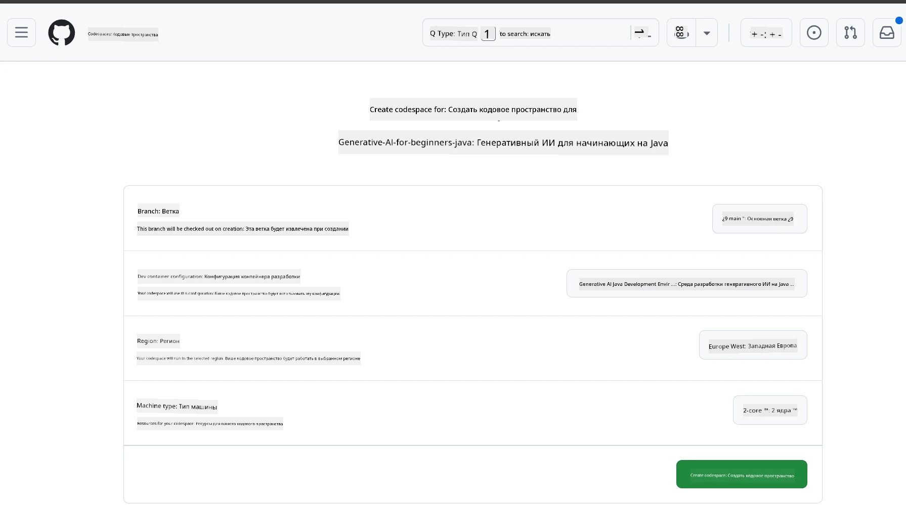
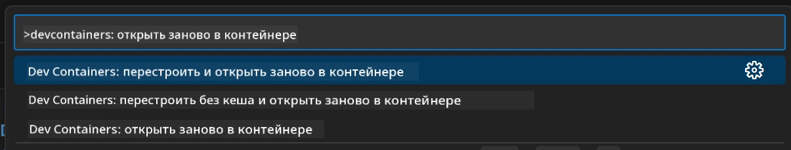
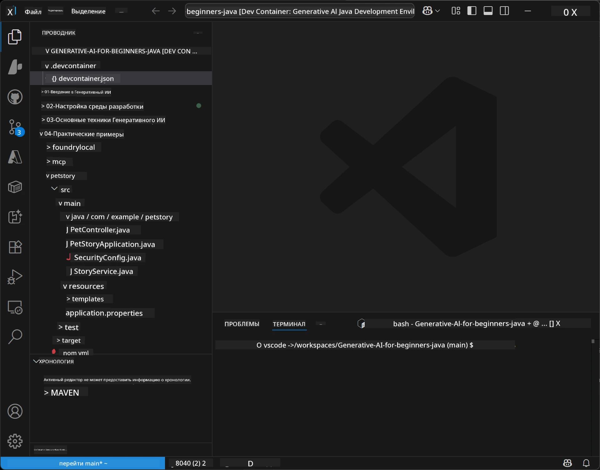
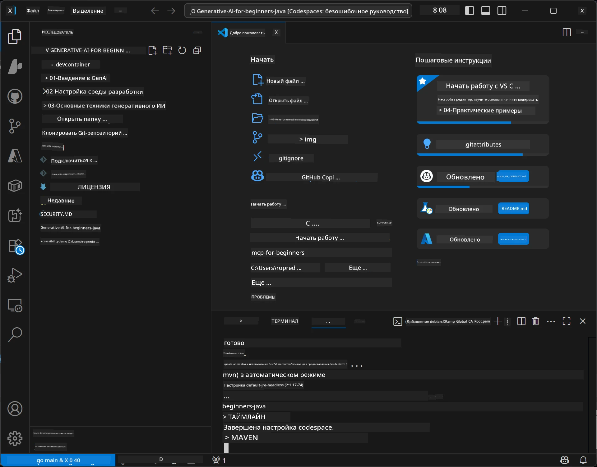

# Настройка среды разработки для Generative AI на Java

> **Быстрый старт**: кодируйте в облаке за 2 минуты — перейдите к [настройке GitHub Codespaces](../../../02-SetupDevEnvironment) — установка на локальный компьютер не требуется, используются модели GitHub!

> **Интересует Azure OpenAI?** Смотрите наше [руководство по настройке Azure OpenAI](getting-started-azure-openai.md) с шагами для создания нового ресурса Azure OpenAI.

## Что вы узнаете

- Настроите среду разработки Java для AI-приложений
- Выберете и сконфигурируете предпочитаемую среду разработки (преимущественно облачную с Codespaces, локальный dev-контейнер или полную локальную установку)
- Протестируете настройку, подключившись к моделям GitHub

## Оглавление

- [Что вы узнаете](../../../02-SetupDevEnvironment)
- [Введение](../../../02-SetupDevEnvironment)
- [Шаг 1: Настройте среду разработки](../../../02-SetupDevEnvironment)
  - [Вариант A: GitHub Codespaces (рекомендуется)](../../../02-SetupDevEnvironment)
  - [Вариант B: Локальный dev-контейнер](../../../02-SetupDevEnvironment)
  - [Вариант C: Используйте существующую локальную установку](../../../02-SetupDevEnvironment)
- [Шаг 2: Создайте персональный токен доступа GitHub](../../../02-SetupDevEnvironment)
- [Шаг 3: Проверьте настройку](../../../02-SetupDevEnvironment)
- [Устранение неполадок](../../../02-SetupDevEnvironment)
- [Итог](../../../02-SetupDevEnvironment)
- [Следующие шаги](../../../02-SetupDevEnvironment)

## Введение

В этой главе вы узнаете, как настроить среду разработки. В качестве основного примера мы используем **GitHub Models**, поскольку это бесплатно, просто настроить с учетной записью GitHub, не требуется кредитная карта, и предоставляется доступ к множеству моделей для экспериментов.

**Локальная установка не нужна!** Вы можете сразу же начать кодировать, используя GitHub Codespaces — полноценную среду разработки прямо в браузере.


Мы рекомендуем использовать [**GitHub Models**](https://github.com/marketplace?type=models) для этого курса, потому что это:
- **Бесплатно** для начала работы
- **Просто** настроить, достаточно учетной записи GitHub
- **Без кредитной карты**
- **Множество моделей** для экспериментов

> **Примечание**: GitHub Models, используемые в этом обучении, имеют следующие бесплатные лимиты:
> - 15 запросов в минуту (150 в день)
> - ~8,000 слов на вход и ~4,000 слов на выход в одном запросе
> - 5 одновременных запросов
> 
> Для производственного использования перейдите на модели Azure AI Foundry с вашей учетной записью Azure. Ваш код менять не нужно. См. [документацию Azure AI Foundry](https://learn.microsoft.com/azure/ai-foundry/foundry-models/how-to/quickstart-github-models).

## Шаг 1: Настройте среду разработки

<a name="quick-start-cloud"></a>

Мы подготовили преднастроенный контейнер разработки, чтобы минимизировать время настройки и обеспечить наличие всех необходимых инструментов для этого курса по Generative AI на Java. Выберите предпочитаемый способ разработки:

### Варианты настройки среды:

#### Вариант A: GitHub Codespaces (рекомендуется)

**Начните кодировать за 2 минуты — установка на локальный компьютер не требуется!**

1. Форкните этот репозиторий в свой аккаунт GitHub
   > **Примечание**: если хотите изменить базовую конфигурацию, ознакомьтесь с [настройками Dev контейнера](../../../.devcontainer/devcontainer.json)
2. Нажмите **Code** → вкладка **Codespaces** → **...** → **New with options...**
3. Используйте настройки по умолчанию – будет выбран **Dev container configuration**: **Generative AI Java Development Environment** — кастомный devcontainer, созданный для этого курса
4. Нажмите **Create codespace**
5. Подождите около 2 минут, пока среда не будет готова
6. Перейдите к [Шагу 2: Создайте GitHub Token](../../../02-SetupDevEnvironment)







> **Преимущества Codespaces**:
> - Нет необходимости в локальной установке
> - Работает на любом устройстве с браузером
> - Преднастроено со всеми инструментами и зависимостями
> - Бесплатно 60 часов в месяц для личных аккаунтов
> - Единая среда для всех обучающихся

#### Вариант B: Локальный dev-контейнер

**Для разработчиков, предпочитающих локальную разработку с Docker**

1. Форкните и клонируйте этот репозиторий на локальный компьютер
   > **Примечание**: если хотите изменить базовую конфигурацию, ознакомьтесь с [настройками Dev контейнера](../../../.devcontainer/devcontainer.json)
2. Установите [Docker Desktop](https://www.docker.com/products/docker-desktop/) и [VS Code](https://code.visualstudio.com/)
3. Установите расширение [Dev Containers](https://marketplace.visualstudio.com/items?itemName=ms-vscode-remote.remote-containers) в VS Code
4. Откройте папку репозитория в VS Code
5. При появлении запроса нажмите **Reopen in Container** (или используйте `Ctrl+Shift+P` → "Dev Containers: Reopen in Container")
6. Дождитесь сборки и запуска контейнера
7. Перейдите к [Шагу 2: Создайте GitHub Token](../../../02-SetupDevEnvironment)





#### Вариант C: Используйте существующую локальную установку

**Для разработчиков с уже настроенной средой Java**

Требования:
- [Java 21+](https://www.oracle.com/java/technologies/javase/jdk21-archive-downloads.html)
- [Maven 3.9+](https://maven.apache.org/download.cgi)
- [VS Code](https://code.visualstudio.com) или предпочитаемая IDE

Шаги:
1. Клонируйте этот репозиторий на локальный компьютер
2. Откройте проект в вашей IDE
3. Перейдите к [Шагу 2: Создайте GitHub Token](../../../02-SetupDevEnvironment)

> **Полезный совет**: Если у вас слабый компьютер, но хочется использовать VS Code локально, используйте GitHub Codespaces! Вы можете подключить локальный VS Code к облачному Codespace и объединить преимущества обоих вариантов.



## Шаг 2: Создайте персональный токен доступа GitHub

1. Перейдите в [Настройки GitHub](https://github.com/settings/profile) и в меню профиля выберите **Settings**.
2. В левой панели выберите **Developer settings** (обычно внизу).
3. В разделе **Personal access tokens** нажмите **Fine-grained tokens** (или перейдите по прямой [ссылке](https://github.com/settings/personal-access-tokens)).
4. Нажмите **Generate new token**.
5. В поле «Token name» укажите описательное имя (например, `GenAI-Java-Course-Token`).
6. Установите срок действия токена (рекомендуется 7 дней для безопасности).
7. В разделе «Resource owner» выберите свою учетную запись.
8. В разделе «Repository access» выберите репозитории, которые планируете использовать с GitHub Models (или «All repositories», если нужно).
9. В разделе «Account permissions» найдите **Models** и установите значение **Read-only**.
10. Нажмите **Generate token**.
11. **Скопируйте и сохраните токен сейчас** – после этого он больше не будет отображаться!

> **Совет по безопасности**: используйте минимально необходимый диапазон доступа и кратчайший практический срок действия для токенов.

## Шаг 3: Проверьте настройку на примере GitHub Models

После того, как среда разработки готова, протестируем интеграцию с GitHub Models с помощью примерного приложения в [`02-SetupDevEnvironment/examples/github-models`](../../../02-SetupDevEnvironment/examples/github-models).

1. Откройте терминал в вашей среде разработки.
2. Перейдите в каталог примера GitHub Models:
   ```bash
   cd 02-SetupDevEnvironment/examples/github-models
   ```
3. Установите ваш GitHub токен в качестве переменной окружения:
   ```bash
   # macOS/Linux
   export GITHUB_TOKEN=your_token_here
   
   # Windows (Командная строка)
   set GITHUB_TOKEN=your_token_here
   
   # Windows (PowerShell)
   $env:GITHUB_TOKEN="your_token_here"
   ```

4. Запустите приложение:
   ```bash
   mvn compile exec:java -Dexec.mainClass="com.example.githubmodels.App"
   ```

Вы должны увидеть примерно следующий вывод:
```text
Using model: gpt-4.1-nano
Sending request to GitHub Models...
Response: Hello World!
```

### Понимание примерного кода

Сначала разберёмся, что мы запустили. Пример в `examples/github-models` использует OpenAI Java SDK для подключения к GitHub Models:

**Что делает этот код:**
- **Подключается** к GitHub Models, используя ваш персональный токен доступа
- **Отправляет** простое сообщение «Say Hello World!» модели AI
- **Получает** и отображает ответ AI
- **Проверяет**, что настройка работает корректно

**Ключевая зависимость** (в `pom.xml`):
```xml
<dependency>
    <groupId>com.openai</groupId>
    <artifactId>openai-java</artifactId>
    <version>2.12.0</version>
</dependency>
```

**Основной код** (`App.java`):
```java
// Подключение к моделям GitHub с использованием OpenAI Java SDK
OpenAIClient client = OpenAIOkHttpClient.builder()
    .apiKey(pat)
    .baseUrl("https://models.inference.ai.azure.com")
    .build();

// Создать запрос на завершение чата
ChatCompletionCreateParams params = ChatCompletionCreateParams.builder()
    .model(modelId)
    .addSystemMessage("You are a concise assistant.")
    .addUserMessage("Say Hello World!")
    .build();

// Получить ответ ИИ
ChatCompletion response = client.chat().completions().create(params);
System.out.println("Response: " + response.choices().get(0).message().content().orElse("No response content"));
```

## Итог

Отлично! Теперь у вас есть всё, что нужно:

- Создан персональный токен доступа GitHub с нужными правами для доступа к AI-моделям
- Запущена среда разработки Java (будь то Codespaces, dev-контейнер или локальная установка)
- Установлено подключение к GitHub Models с помощью OpenAI Java SDK для бесплатной разработки AI
- Протестировано на простом примере, который общается с AI-моделями

## Следующие шаги

[Глава 3: Основные техники Generative AI](../03-CoreGenerativeAITechniques/README.md)

## Устранение неполадок

Проблемы? Вот распространённые ошибки и способы их решения:

- **Токен не работает?** 
  - Убедитесь, что скопировали весь токен без лишних пробелов
  - Проверьте, что токен корректно установлен как переменная окружения
  - Убедитесь, что у токена правильные права (Models: Read-only)

- **Maven не найден?** 
  - При использовании dev-контейнеров или Codespaces Maven должен быть предустановлен
  - Для локальной установки убедитесь, что установлены Java 21+ и Maven 3.9+
  - Проверьте установку командой `mvn --version`

- **Проблемы с подключением?**
  - Проверьте интернет-соединение
  - Убедитесь, что GitHub доступен из вашей сети
  - Проверьте, не блокирует ли брандмауэр доступ к endpoint GitHub Models

- **Dev-контейнер не запускается?**
  - Убедитесь, что Docker Desktop запущен (для локальной разработки)
  - Попробуйте перестроить контейнер: `Ctrl+Shift+P` → "Dev Containers: Rebuild Container"

- **Ошибки компиляции приложения?**
  - Проверьте, что вы находитесь в нужной директории: `02-SetupDevEnvironment/examples/github-models`
  - Попробуйте очистить и пересобрать: `mvn clean compile`

> **Нужна помощь?** Если проблемы сохраняются, создайте issue в репозитории — мы поможем.

---

<!-- CO-OP TRANSLATOR DISCLAIMER START -->
**Отказ от ответственности**:  
Этот документ был переведен с использованием сервиса автоматического перевода [Co-op Translator](https://github.com/Azure/co-op-translator). Несмотря на наши усилия обеспечить точность, просим учитывать, что машинные переводы могут содержать ошибки или неточности. Оригинальный документ на его исходном языке следует считать официальным и авторитетным источником. Для получения критически важной информации рекомендуется использовать профессиональный человеческий перевод. Мы не несем ответственности за любые недоразумения или неправильные толкования, возникшие в результате использования данного перевода.
<!-- CO-OP TRANSLATOR DISCLAIMER END -->