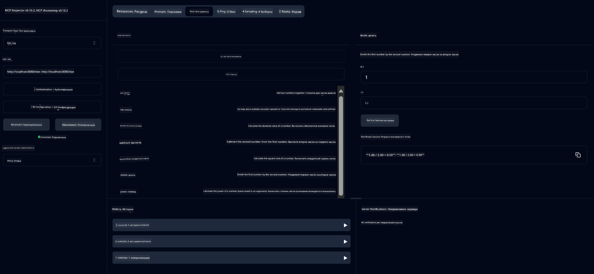

<!--
CO_OP_TRANSLATOR_METADATA:
{
  "original_hash": "7bf9a4a832911269a8bd0decb97ff36c",
  "translation_date": "2025-07-21T18:21:30+00:00",
  "source_file": "04-PracticalSamples/mcp/calculator/README.md",
  "language_code": "ru"
}
-->
# Базовый сервис калькулятора MCP

>**Примечание**: В этой главе есть [**Руководство**](./TUTORIAL.md), которое поможет вам запустить готовые примеры.

Добро пожаловать в ваше первое практическое знакомство с **Model Context Protocol (MCP)**! В предыдущих главах вы узнали основы генеративного ИИ и настроили свою среду разработки. Теперь пришло время создать что-то практическое.

Этот сервис калькулятора демонстрирует, как модели ИИ могут безопасно взаимодействовать с внешними инструментами с помощью MCP. Вместо того чтобы полагаться на иногда ненадежные математические способности модели ИИ, мы покажем, как построить надежную систему, где ИИ может вызывать специализированные сервисы для точных вычислений.

## Содержание

- [Чему вы научитесь](../../../../../04-PracticalSamples/mcp/calculator)
- [Предварительные требования](../../../../../04-PracticalSamples/mcp/calculator)
- [Ключевые концепции](../../../../../04-PracticalSamples/mcp/calculator)
- [Быстрый старт](../../../../../04-PracticalSamples/mcp/calculator)
- [Доступные операции калькулятора](../../../../../04-PracticalSamples/mcp/calculator)
- [Тестовые клиенты](../../../../../04-PracticalSamples/mcp/calculator)
  - [1. Прямой MCP-клиент (SDKClient)](../../../../../04-PracticalSamples/mcp/calculator)
  - [2. Клиент с ИИ (LangChain4jClient)](../../../../../04-PracticalSamples/mcp/calculator)
- [MCP Inspector (веб-интерфейс)](../../../../../04-PracticalSamples/mcp/calculator)
  - [Пошаговая инструкция](../../../../../04-PracticalSamples/mcp/calculator)

## Чему вы научитесь

Работая с этим примером, вы поймете:
- Как создавать сервисы, совместимые с MCP, с использованием Spring Boot
- Разницу между прямым протокольным взаимодействием и взаимодействием с использованием ИИ
- Как модели ИИ решают, когда и как использовать внешние инструменты
- Лучшие практики для создания приложений с поддержкой инструментов ИИ

Идеально подходит для начинающих, изучающих концепции MCP и готовых создать свою первую интеграцию инструментов ИИ!

## Предварительные требования

- Java 21+
- Maven 3.6+
- **GitHub Token**: Требуется для клиента с ИИ. Если вы еще не настроили его, см. [Глава 2: Настройка среды разработки](../../../02-SetupDevEnvironment/README.md) для получения инструкций.

## Ключевые концепции

**Model Context Protocol (MCP)** — это стандартизированный способ для приложений ИИ безопасно подключаться к внешним инструментам. Представьте это как "мост", который позволяет моделям ИИ использовать внешние сервисы, такие как наш калькулятор. Вместо того чтобы модель ИИ пыталась выполнять вычисления самостоятельно (что может быть ненадежно), она может вызывать наш сервис калькулятора для получения точных результатов. MCP гарантирует, что это взаимодействие происходит безопасно и последовательно.

**События, отправляемые сервером (SSE)** обеспечивают связь в реальном времени между сервером и клиентами. В отличие от традиционных HTTP-запросов, где вы отправляете запрос и ждете ответа, SSE позволяет серверу непрерывно отправлять обновления клиенту. Это идеально подходит для приложений ИИ, где ответы могут быть потоковыми или занимать время для обработки.

**Инструменты ИИ и вызов функций** позволяют моделям ИИ автоматически выбирать и использовать внешние функции (например, операции калькулятора) на основе запросов пользователя. Когда вы спрашиваете "Сколько будет 15 + 27?", модель ИИ понимает, что вы хотите сложение, автоматически вызывает наш инструмент `add` с правильными параметрами (15, 27) и возвращает результат на естественном языке. ИИ действует как интеллектуальный координатор, который знает, когда и как использовать каждый инструмент.

## Быстрый старт

### 1. Перейдите в директорию приложения калькулятора
```bash
cd Generative-AI-for-beginners-java/04-PracticalSamples/mcp/calculator
```

### 2. Сборка и запуск
```bash
mvn clean install -DskipTests
java -jar target/calculator-server-0.0.1-SNAPSHOT.jar
```

### 3. Тестирование с клиентами
- **SDKClient**: Прямое взаимодействие с протоколом MCP
- **LangChain4jClient**: Взаимодействие на естественном языке с использованием ИИ (требуется GitHub Token)

## Доступные операции калькулятора

- `add(a, b)`, `subtract(a, b)`, `multiply(a, b)`, `divide(a, b)`
- `power(base, exponent)`, `squareRoot(number)`, `absolute(number)`
- `modulus(a, b)`, `help()`

## Тестовые клиенты

### 1. Прямой MCP-клиент (SDKClient)
Тестирует прямое взаимодействие с протоколом MCP. Запустите с:
```bash
mvn test-compile exec:java -Dexec.mainClass="com.microsoft.mcp.sample.client.SDKClient" -Dexec.classpathScope=test
```

### 2. Клиент с ИИ (LangChain4jClient)
Демонстрирует взаимодействие на естественном языке с моделями GitHub. Требуется GitHub Token (см. [Предварительные требования](../../../../../04-PracticalSamples/mcp/calculator)).

**Запуск:**
```bash
mvn test-compile exec:java -Dexec.mainClass="com.microsoft.mcp.sample.client.LangChain4jClient" -Dexec.classpathScope=test
```

## MCP Inspector (веб-интерфейс)

MCP Inspector предоставляет визуальный веб-интерфейс для тестирования вашего MCP-сервиса без написания кода. Идеально подходит для начинающих, чтобы понять, как работает MCP!

### Пошаговая инструкция:

1. **Запустите сервер калькулятора** (если он еще не запущен):
   ```bash
   java -jar target/calculator-server-0.0.1-SNAPSHOT.jar
   ```

2. **Установите и запустите MCP Inspector** в новом терминале:
   ```bash
   npx @modelcontextprotocol/inspector
   ```

3. **Откройте веб-интерфейс**:
   - Найдите сообщение вроде "Inspector running at http://localhost:6274"
   - Откройте этот URL в вашем веб-браузере

4. **Подключитесь к вашему сервису калькулятора**:
   - В веб-интерфейсе выберите тип транспорта "SSE"
   - Укажите URL: `http://localhost:8080/sse`
   - Нажмите кнопку "Connect"

5. **Изучите доступные инструменты**:
   - Нажмите "List Tools", чтобы увидеть все операции калькулятора
   - Вы увидите функции, такие как `add`, `subtract`, `multiply` и т.д.

6. **Протестируйте операцию калькулятора**:
   - Выберите инструмент (например, "add")
   - Введите параметры (например, `a: 15`, `b: 27`)
   - Нажмите "Run Tool"
   - Посмотрите результат, возвращенный вашим MCP-сервисом!

Этот визуальный подход поможет вам понять, как именно работает взаимодействие через MCP, прежде чем вы начнете создавать собственных клиентов.



---
**Справка:** [Документация MCP Server Boot Starter](https://docs.spring.io/spring-ai/reference/api/mcp/mcp-server-boot-starter-docs.html)

**Отказ от ответственности**:  
Этот документ был переведен с использованием сервиса автоматического перевода [Co-op Translator](https://github.com/Azure/co-op-translator). Несмотря на наши усилия обеспечить точность, автоматические переводы могут содержать ошибки или неточности. Оригинальный документ на его родном языке следует считать авторитетным источником. Для получения критически важной информации рекомендуется профессиональный перевод человеком. Мы не несем ответственности за любые недоразумения или неправильные интерпретации, возникающие в результате использования данного перевода.