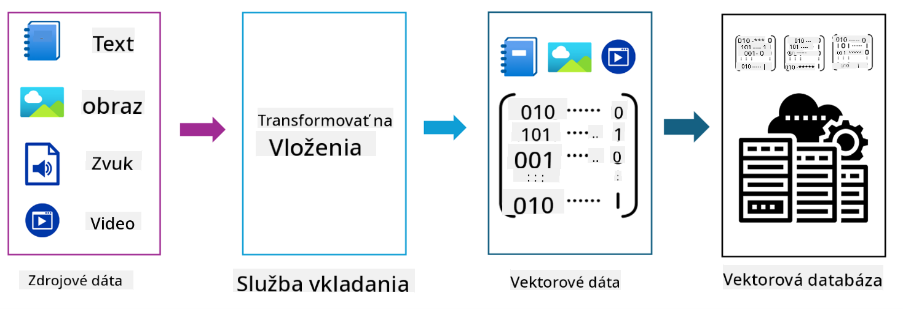
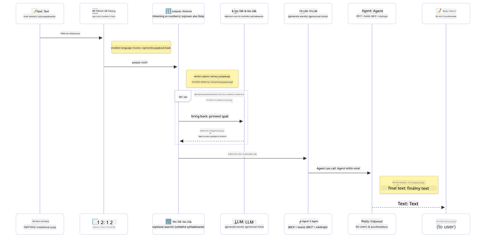

<!--
CO_OP_TRANSLATOR_METADATA:
{
  "original_hash": "75bfb080ca725e8a9aa9c80cae25fba1",
  "translation_date": "2025-07-29T10:06:21+00:00",
  "source_file": "01-IntroToGenAI/README.md",
  "language_code": "sk"
}
-->
# Úvod do Generatívnej AI - Java Edition

## Čo sa naučíte

- **Základy generatívnej AI**, vrátane LLMs, návrhu promptov, tokenov, embeddingov a vektorových databáz
- **Porovnanie nástrojov na vývoj AI v Jave**, vrátane Azure OpenAI SDK, Spring AI a OpenAI Java SDK
- **Objavte Model Context Protocol** a jeho úlohu v komunikácii AI agentov

## Obsah

- [Úvod](../../../01-IntroToGenAI)
- [Rýchle zopakovanie konceptov generatívnej AI](../../../01-IntroToGenAI)
- [Prehľad návrhu promptov](../../../01-IntroToGenAI)
- [Tokeny, embeddingy a agenti](../../../01-IntroToGenAI)
- [Nástroje a knižnice na vývoj AI v Jave](../../../01-IntroToGenAI)
  - [OpenAI Java SDK](../../../01-IntroToGenAI)
  - [Spring AI](../../../01-IntroToGenAI)
  - [Azure OpenAI Java SDK](../../../01-IntroToGenAI)
- [Zhrnutie](../../../01-IntroToGenAI)
- [Ďalšie kroky](../../../01-IntroToGenAI)

## Úvod

Vitajte v prvej kapitole Generatívnej AI pre začiatočníkov - Java Edition! Táto úvodná lekcia vás zoznámi so základnými konceptmi generatívnej AI a s tým, ako s nimi pracovať pomocou Javy. Naučíte sa o základných stavebných blokoch AI aplikácií, vrátane veľkých jazykových modelov (LLMs), tokenov, embeddingov a AI agentov. Preskúmame tiež hlavné nástroje pre Javu, ktoré budete používať počas tohto kurzu.

### Rýchle zopakovanie konceptov generatívnej AI

Generatívna AI je typ umelej inteligencie, ktorá vytvára nový obsah, ako je text, obrázky alebo kód, na základe vzorov a vzťahov naučených z dát. Modely generatívnej AI dokážu generovať odpovede podobné ľudským, rozumieť kontextu a niekedy dokonca vytvárať obsah, ktorý pôsobí ako ľudský.

Pri vývoji vašich Java AI aplikácií budete pracovať s **generatívnymi AI modelmi** na tvorbu obsahu. Niektoré schopnosti generatívnych AI modelov zahŕňajú:

- **Generovanie textu**: Tvorba textu podobného ľudskému pre chatboty, obsah a dopĺňanie textu.
- **Generovanie a analýza obrázkov**: Vytváranie realistických obrázkov, vylepšovanie fotografií a detekcia objektov.
- **Generovanie kódu**: Písanie útržkov kódu alebo skriptov.

Existujú špecifické typy modelov optimalizované pre rôzne úlohy. Napríklad, **malé jazykové modely (SLMs)** a **veľké jazykové modely (LLMs)** dokážu pracovať s generovaním textu, pričom LLMs zvyčajne poskytujú lepší výkon pri zložitejších úlohách. Pre úlohy súvisiace s obrázkami by ste použili špecializované vizuálne modely alebo multimodálne modely.

Samozrejme, odpovede od týchto modelov nie sú vždy dokonalé. Pravdepodobne ste už počuli o tom, že modely "halucinujú" alebo generujú nesprávne informácie autoritatívnym spôsobom. Môžete však modelu pomôcť generovať lepšie odpovede tým, že mu poskytnete jasné inštrukcie a kontext. Tu prichádza na rad **návrh promptov**.

#### Prehľad návrhu promptov

Návrh promptov je prax navrhovania efektívnych vstupov na usmernenie AI modelov k požadovaným výstupom. Zahŕňa:

- **Jasnosť**: Zabezpečenie, že inštrukcie sú jasné a jednoznačné.
- **Kontext**: Poskytnutie potrebných informácií na pozadí.
- **Obmedzenia**: Špecifikovanie akýchkoľvek limitov alebo formátov.

Niektoré osvedčené postupy pri návrhu promptov zahŕňajú návrh promptov, jasné inštrukcie, rozdelenie úloh, učenie na jednom alebo niekoľkých príkladoch a ladenie promptov. Testovanie rôznych promptov je nevyhnutné na zistenie, čo najlepšie funguje pre váš konkrétny prípad použitia.

Pri vývoji aplikácií budete pracovať s rôznymi typmi promptov:
- **Systémové prompty**: Nastavujú základné pravidlá a kontext pre správanie modelu.
- **Užívateľské prompty**: Vstupné dáta od používateľov vašej aplikácie.
- **Asistentské prompty**: Odpovede modelu na základe systémových a užívateľských promptov.

> **Viac informácií**: Viac o návrhu promptov sa dozviete v [kapitole o návrhu promptov kurzu GenAI pre začiatočníkov](https://github.com/microsoft/generative-ai-for-beginners/tree/main/04-prompt-engineering-fundamentals)

#### Tokeny, embeddingy a agenti

Pri práci s generatívnymi AI modelmi sa stretnete s pojmami ako **tokeny**, **embeddingy**, **agenti** a **Model Context Protocol (MCP)**. Tu je podrobný prehľad týchto konceptov:

- **Tokeny**: Tokeny sú najmenšou jednotkou textu v modeli. Môžu byť slová, znaky alebo podslová. Tokeny sa používajú na reprezentáciu textových dát vo formáte, ktorému model rozumie. Napríklad veta "Rýchly hnedý líška preskočil lenivého psa" môže byť tokenizovaná ako ["Rýchly", " hnedý", " líška", " preskočil", " lenivého", " psa"] alebo ["Rý", "ch", "lý", " hn", "ed", "ný", " lí", "ška", " pr", "esk", "oč", "il", " le", "niv", "ého", " ps", "a"] v závislosti od stratégie tokenizácie.

Tokenizácia je proces rozdelenia textu na tieto menšie jednotky. Je to kľúčové, pretože modely pracujú s tokenmi namiesto surového textu. Počet tokenov v promptu ovplyvňuje dĺžku a kvalitu odpovede modelu, pretože modely majú limity na počet tokenov vo svojom kontextovom okne (napr. 128K tokenov pre celkový kontext GPT-4o, vrátane vstupu a výstupu).

  V Jave môžete použiť knižnice ako OpenAI SDK na automatické spracovanie tokenizácie pri odosielaní požiadaviek na AI modely.

- **Embeddingy**: Embeddingy sú vektorové reprezentácie tokenov, ktoré zachytávajú sémantický význam. Sú to číselné reprezentácie (zvyčajne polia čísel s plávajúcou desatinnou čiarkou), ktoré umožňujú modelom pochopiť vzťahy medzi slovami a generovať kontextovo relevantné odpovede. Podobné slová majú podobné embeddingy, čo umožňuje modelu pochopiť koncepty ako synonymá a sémantické vzťahy.

  V Jave môžete generovať embeddingy pomocou OpenAI SDK alebo iných knižníc, ktoré podporujú generovanie embeddingov. Tieto embeddingy sú nevyhnutné pre úlohy ako sémantické vyhľadávanie, kde chcete nájsť podobný obsah na základe významu, nie presných textových zhôd.

- **Vektorové databázy**: Vektorové databázy sú špecializované úložné systémy optimalizované pre embeddingy. Umožňujú efektívne vyhľadávanie podobností a sú kľúčové pre vzory Retrieval-Augmented Generation (RAG), kde potrebujete nájsť relevantné informácie z veľkých datasetov na základe sémantickej podobnosti, nie presných zhôd.

> **Poznámka**: V tomto kurze nebudeme pokrývať vektorové databázy, ale považujeme ich za hodné zmienky, pretože sa bežne používajú v reálnych aplikáciách.

- **Agenti & MCP**: AI komponenty, ktoré autonómne interagujú s modelmi, nástrojmi a externými systémami. Model Context Protocol (MCP) poskytuje štandardizovaný spôsob, ako agenti bezpečne pristupujú k externým zdrojom dát a nástrojom. Viac sa dozviete v našom kurze [MCP pre začiatočníkov](https://github.com/microsoft/mcp-for-beginners).

V Java AI aplikáciách budete používať tokeny na spracovanie textu, embeddingy na sémantické vyhľadávanie a RAG, vektorové databázy na vyhľadávanie dát a agentov s MCP na budovanie inteligentných systémov využívajúcich nástroje.

### Nástroje a knižnice na vývoj AI v Jave

Java ponúka vynikajúce nástroje na vývoj AI. Existujú tri hlavné knižnice, ktoré preskúmame počas tohto kurzu - OpenAI Java SDK, Azure OpenAI SDK a Spring AI.

Tu je rýchla referenčná tabuľka ukazujúca, ktorý SDK sa používa v príkladoch jednotlivých kapitol:

| Kapitola | Príklad | SDK |
|----------|---------|-----|
| 02-SetupDevEnvironment | github-models | OpenAI Java SDK |
| 02-SetupDevEnvironment | basic-chat-azure | Spring AI Azure OpenAI |
| 03-CoreGenerativeAITechniques | examples | Azure OpenAI SDK |
| 04-PracticalSamples | petstory | OpenAI Java SDK |
| 04-PracticalSamples | foundrylocal | OpenAI Java SDK |
| 04-PracticalSamples | calculator | Spring AI MCP SDK + LangChain4j |

**Odkazy na dokumentáciu SDK:**
- [Azure OpenAI Java SDK](https://github.com/Azure/azure-sdk-for-java/tree/azure-ai-openai_1.0.0-beta.16/sdk/openai/azure-ai-openai)
- [Spring AI](https://docs.spring.io/spring-ai/reference/)
- [OpenAI Java SDK](https://github.com/openai/openai-java)
- [LangChain4j](https://docs.langchain4j.dev/)

#### OpenAI Java SDK

OpenAI SDK je oficiálna Java knižnica pre OpenAI API. Poskytuje jednoduché a konzistentné rozhranie na interakciu s modelmi OpenAI, čo uľahčuje integráciu AI schopností do Java aplikácií. Príklady GitHub Models z kapitoly 2, aplikácia Pet Story z kapitoly 4 a príklad Foundry Local demonštrujú prístup OpenAI SDK.

#### Spring AI

Spring AI je komplexný rámec, ktorý prináša AI schopnosti do Spring aplikácií, poskytujúc konzistentnú vrstvu abstrakcie naprieč rôznymi AI poskytovateľmi. Integruje sa bezproblémovo s ekosystémom Spring, čo ho robí ideálnou voľbou pre podnikové Java aplikácie, ktoré potrebujú AI schopnosti.

Silnou stránkou Spring AI je jeho bezproblémová integrácia s ekosystémom Spring, čo uľahčuje budovanie produkčne pripravených AI aplikácií s oboznámenými Spring vzormi, ako je injekcia závislostí, správa konfigurácie a testovacie rámce. Spring AI budete používať v kapitolách 2 a 4 na budovanie aplikácií, ktoré využívajú OpenAI aj Model Context Protocol (MCP) Spring AI knižnice.

##### Model Context Protocol (MCP)

[Model Context Protocol (MCP)](https://modelcontextprotocol.io/) je vznikajúci štandard, ktorý umožňuje AI aplikáciám bezpečne interagovať s externými zdrojmi dát a nástrojmi. MCP poskytuje štandardizovaný spôsob, ako AI modely pristupujú k kontextovým informáciám a vykonávajú akcie vo vašich aplikáciách.

V kapitole 4 vytvoríte jednoduchú MCP kalkulačkovú službu, ktorá demonštruje základy Model Context Protocol so Spring AI, ukazujúc, ako vytvoriť základné integrácie nástrojov a architektúry služieb.

#### Azure OpenAI Java SDK

Klientská knižnica Azure OpenAI pre Javu je adaptáciou REST API OpenAI, ktorá poskytuje idiomatické rozhranie a integráciu so zvyškom ekosystému Azure SDK. V kapitole 3 budete budovať aplikácie pomocou Azure OpenAI SDK, vrátane chat aplikácií, volania funkcií a vzorov RAG (Retrieval-Augmented Generation).

> Poznámka: Azure OpenAI SDK zaostáva za OpenAI Java SDK z hľadiska funkcií, takže pre budúce projekty zvážte použitie OpenAI Java SDK.

## Zhrnutie

Týmto sme pokryli základy! Teraz rozumiete:

- Základným konceptom generatívnej AI - od LLMs a návrhu promptov po tokeny, embeddingy a vektorové databázy
- Možnostiam nástrojov na vývoj AI v Jave: Azure OpenAI SDK, Spring AI a OpenAI Java SDK
- Čo je Model Context Protocol a ako umožňuje AI agentom pracovať s externými nástrojmi

## Ďalšie kroky

[2. kapitola: Nastavenie vývojového prostredia](../02-SetupDevEnvironment/README.md)

**Zrieknutie sa zodpovednosti**:  
Tento dokument bol preložený pomocou služby AI prekladu [Co-op Translator](https://github.com/Azure/co-op-translator). Aj keď sa snažíme o presnosť, prosím, berte na vedomie, že automatizované preklady môžu obsahovať chyby alebo nepresnosti. Pôvodný dokument v jeho rodnom jazyku by mal byť považovaný za autoritatívny zdroj. Pre kritické informácie sa odporúča profesionálny ľudský preklad. Nenesieme zodpovednosť za akékoľvek nedorozumenia alebo nesprávne interpretácie vyplývajúce z použitia tohto prekladu.