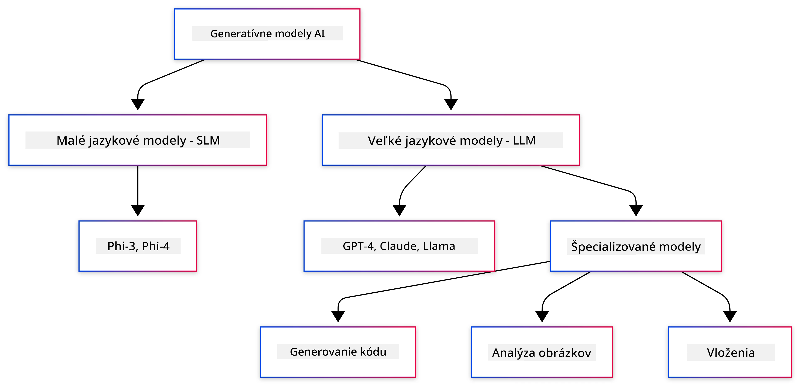
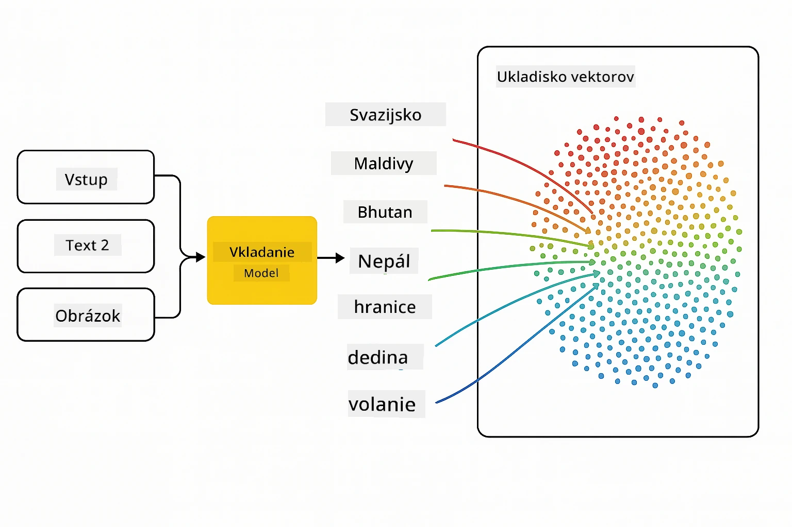
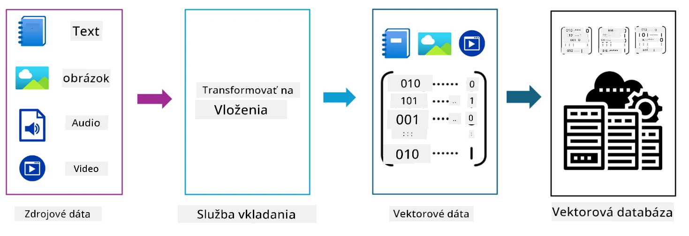
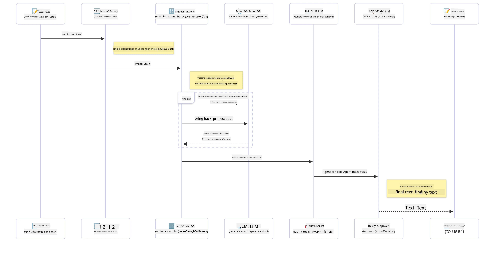

# Úvod do Generatívnej AI - Java Edícia

> **Video**: [Pozrite si video prehľad tejto lekcie na YouTube.](https://www.youtube.com/watch?v=XH46tGp_eSw) Môžete tiež kliknúť na obrázok miniatury vyššie.

## Čo sa naučíte

- **Základy generatívnej AI** vrátane LLM, prompt engineeringu, tokenov, embeddings a vektorových databáz
- **Porovnanie nástrojov pre vývoj AI v Jave** vrátane Azure OpenAI SDK, Spring AI a OpenAI Java SDK
- **Objavíte Model Context Protocol** a jeho úlohu v komunikácii AI agentov

## Obsah

- [Úvod](#úvod)
- [Rýchle zhrnutie konceptov generatívnej AI](#rýchle-zhrnutie-konceptov-generatívnej-ai)
- [Revízia prompt engineeringu](#revízia-prompt-engineeringu)
- [Tokeny, embeddings a agenti](#tokeny-embeddings-a-agenti)
- [Nástroje a knižnice pre vývoj AI v Jave](#nástroje-a-knižnice-pre-vývoj-ai-v-jave)
  - [OpenAI Java SDK](#openai-java-sdk)
  - [Spring AI](#spring-ai)
  - [Azure OpenAI Java SDK](#azure-openai-java-sdk)
- [Zhrnutie](#zhrnutie)
- [Ďalšie kroky](#ďalšie-kroky)

## Úvod

Vitajte v prvej kapitole Generatívnej AI pre začiatočníkov - Java edícia! Táto základná lekcia vás oboznámi so základnými konceptmi generatívnej AI a tým, ako s nimi pracovať pomocou Javy. Naučíte sa o nevyhnutných stavebných blokoch AI aplikácií, vrátane veľkých jazykových modelov (LLM), tokenov, embeddings a AI agentov. Tiež preskúmame hlavné nástroje pre Javu, ktoré budete používať počas celého kurzu.

### Rýchle zhrnutie konceptov generatívnej AI

Generatívna AI je typ umelej inteligencie, ktorá vytvára nový obsah, ako sú text, obrázky alebo kód, na základe vzorov a vzťahov naučených z dát. Modely generatívnej AI môžu generovať odpovede podobné ľudským, rozumieť kontextu a niekedy dokonca vytvoriť obsah, ktorý pôsobí ľudsky.

Pri vývoji vašich AI aplikácií v Jave budete pracovať s **generatívnymi AI modelmi** na vytváranie obsahu. Niektoré schopnosti generatívnych modelov zahŕňajú:

- **Generovanie textu**: Vytváranie textu podobného ľudskému pre chatboty, obsah a dokončovanie textu.
- **Generovanie a analýza obrázkov**: Produkcia realistických obrázkov, vylepšovanie fotografií a detekcia objektov.
- **Generovanie kódu**: Písanie útržkov kódu alebo skriptov.

Existujú špecifické typy modelov optimalizované pre rôzne úlohy. Napríklad, **Small Language Models (SLM)** aj **Large Language Models (LLM)** môžu zvládať generovanie textu, pričom LLM zvyčajne poskytujú lepší výkon pre zložité úlohy. Pri úlohách súvisiacich s obrázkami by ste používali špecializované vizuálne modely alebo multimodálne modely.

Samozrejme, odpovede týchto modelov nie sú vždy dokonalé. Pravdepodobne ste počuli o modeloch, ktoré "halucinujú" alebo generujú nesprávne informácie dôrazným spôsobom. Ale môžete pomôcť modelu generovať lepšie odpovede tým, že mu poskytnete jasné inštrukcie a kontext. Tu prichádza na scénu **prompt engineering**.

#### Revízia prompt engineeringu

Prompt engineering je prax navrhovania efektívnych vstupov na nasmerovanie AI modelov k želaným výstupom. Zahrňuje:

- **Jasnosť**: Urobiť inštrukcie jasnými a jednoznačnými.
- **Kontext**: Poskytnúť potrebné doplnkové informácie.
- **Obmedzenia**: Špecifikovať akékoľvek limity alebo formáty.

Medzi osvedčené postupy prompt engineeringu patrí dizajn promptov, jasné inštrukcie, rozdelenie úloh, one-shot a few-shot učenie a ladenie promptov. Testovanie rôznych promptov je nevyhnutné na zistenie, čo najlepšie funguje pre váš konkrétny prípad použitia.

Pri vývoji aplikácií budete pracovať s rôznymi typmi promptov:
- **Systémové prompty**: Nastavujú základné pravidlá a kontext správania modelu
- **Používateľské prompty**: Vstupné dáta od používateľov vašich aplikácií
- **Asistentské prompty**: Modelové odpovede založené na systémových a užívateľských promptoch

> **Viac informácií**: Viac o prompt engineeringu sa dozviete v [kapitole Prompt Engineering kurzu GenAI pre začiatočníkov](https://github.com/microsoft/generative-ai-for-beginners/tree/main/04-prompt-engineering-fundamentals)

#### Tokeny, embeddings a agenti

Pri práci s generatívnymi AI modelmi narazíte na pojmy ako **tokeny**, **embeddings**, **agenti** a **Model Context Protocol (MCP)**. Tu je podrobný prehľad týchto pojmov:

- **Tokeny**: Tokeny sú najmenej jednotky textu v modeli. Môžu byť slovami, znakmi alebo podslovami. Tokeny sa používajú na reprezentáciu textových údajov vo formáte, ktorý model rozumie. Napríklad veta "The quick brown fox jumped over the lazy dog" môže byť tokenizovaná ako ["The", " quick", " brown", " fox", " jumped", " over", " the", " lazy", " dog"] alebo ["The", " qu", "ick", " br", "own", " fox", " jump", "ed", " over", " the", " la", "zy", " dog"] podľa stratégie tokenizácie.

Tokenizácia je proces rozdelenia textu na tieto menšie jednotky. Je to kľúčové, pretože modely pracujú na tokenoch, nie na surovom texte. Počet tokenov v prmopt-e ovplyvňuje dĺžku a kvalitu odpovede modelu, keďže modely majú limit na počet tokenov v rámci svojho kontextového okna (napr. 128K tokenov pre celkový kontext GPT-4o, vrátane vstupu aj výstupu).

  V Jave môžete použivať knižnice ako OpenAI SDK, ktoré automaticky spracujú tokenizáciu pri posielaní požiadaviek na AI modely.

- **Embeddings**: Embeddings sú vektorové reprezentácie tokenov, ktoré zachytávajú sémantický význam. Sú to číselné reprezentácie (zvyčajne polia desatinných čísel), ktoré umožňujú modelom rozumieť vzťahom medzi slovami a generovať kontextovo relevantné odpovede. Podobné slová majú podobné embeddings, čo umožňuje modelu porozumieť pojmom ako synonymá a sémantické vzťahy.

  V Jave môžete generovať embeddings pomocou OpenAI SDK alebo iných knižníc podporujúcich tvorbu embeddings. Tieto embeddings sú nevyhnutné pre úlohy ako sémantické vyhľadávanie, kde chcete nájsť podobný obsah na základe významu a nie presnej textovej zhody.

- **Vektorové databázy**: Vektorové databázy sú špecializované úložiská optimalizované pre embeddings. Umožňujú efektívne vyhľadávanie podobnosti a sú nevyhnutné pre vzory Retrieval-Augmented Generation (RAG), kde potrebujete nájsť relevantné informácie z veľkých dátových súborov na základe sémantickej podobnosti, nie presných zhôd.

> **Poznámka**: V tomto kurze nebudeme pokrývať vektorové databázy, ale je dobré ich spomenúť, pretože sa bežne používajú v reálnych aplikáciách.

- **Agenti a MCP**: AI komponenty, ktoré autonómne komunikujú s modelmi, nástrojmi a externými systémami. Model Context Protocol (MCP) poskytuje štandardizovaný spôsob, ako môžu agenti bezpečne pristupovať k externým zdrojom dát a nástrojom. Viac sa dozviete v našom kurze [MCP pre začiatočníkov](https://github.com/microsoft/mcp-for-beginners).

V AI aplikáciách v Jave použijete tokeny na spracovanie textu, embeddings pre sémantické vyhľadávanie a RAG, vektorové databázy na získavanie dát a agentov s MCP na budovanie inteligentných systémov používajúcich nástroje.

### Nástroje a knižnice pre vývoj AI v Jave

Java ponúka vynikajúce nástroje pre vývoj AI. Existujú tri hlavné knižnice, ktoré budeme skúmať počas tohto kurzu - OpenAI Java SDK, Azure OpenAI SDK a Spring AI.

Tu je rýchla referenčná tabuľka ukazujúca, ktorá SDK sa používa v príkladoch jednotlivých kapitol:

| Kapitola | Príklad | SDK |
|---------|---------|-----|
| 02-SetupDevEnvironment | github-models | OpenAI Java SDK |
| 02-SetupDevEnvironment | basic-chat-azure | Spring AI Azure OpenAI |
| 03-CoreGenerativeAITechniques | examples | Azure OpenAI SDK |
| 04-PracticalSamples | petstory | OpenAI Java SDK |
| 04-PracticalSamples | foundrylocal | OpenAI Java SDK |
| 04-PracticalSamples | calculator | Spring AI MCP SDK + LangChain4j |

**Odkazy na dokumentáciu SDK:**
- [Azure OpenAI Java SDK](https://github.com/Azure/azure-sdk-for-java/tree/azure-ai-openai_1.0.0-beta.16/sdk/openai/azure-ai-openai)
- [Spring AI](https://docs.spring.io/spring-ai/reference/)
- [OpenAI Java SDK](https://github.com/openai/openai-java)
- [LangChain4j](https://docs.langchain4j.dev/)

#### OpenAI Java SDK

OpenAI SDK je oficiálna Java knižnica pre OpenAI API. Poskytuje jednoduché a konzistentné rozhranie pre interakciu s modelmi OpenAI, čo uľahčuje integráciu AI schopností do Java aplikácií. Príklad GitHub Models z kapitoly 2, aplikácia Pet Story a príklad Foundry Local z kapitoly 4 demonštrujú prístup OpenAI SDK.

#### Spring AI

Spring AI je komplexný rámec, ktorý prináša AI schopnosti do Spring aplikácií, poskytujúc konzistentnú abstraktnú vrstvu naprieč rôznymi AI poskytovateľmi. Integruje sa hladko so Spring ekosystémom a je ideálnou voľbou pre enterprise Java aplikácie, ktoré potrebujú AI funkcie.

Sila Spring AI spočíva v jeho hladkej integrácii do Spring ekosystému, čo uľahčuje budovanie produkčne pripravených AI aplikácií za použitia známych Spring vzorov ako dependency injection, správa konfigurácie a testovacie rámce. Spring AI použijete v kapitolách 2 a 4 na tvorbu aplikácií, ktoré využívajú OpenAI aj Model Context Protocol (MCP) Spring AI knižnice.

##### Model Context Protocol (MCP)

[Model Context Protocol (MCP)](https://modelcontextprotocol.io/) je vznikajúci štandard, ktorý umožňuje AI aplikáciám bezpečne komunikovať s externými zdrojmi dát a nástrojmi. MCP poskytuje štandardizovaný spôsob prístupu AI modelov ku kontextovým informáciám a vykonávanie akcií vo vašich aplikáciách.

V kapitole 4 si vytvoríte jednoduchú MCP kalkulačkovú službu, ktorá demonštruje základy Model Context Protocol s Spring AI, ukazujúc, ako vytvoriť základnú integráciu nástrojov a architektúry služieb.

#### Azure OpenAI Java SDK

Knižnica Azure OpenAI klienta pre Javu je adaptáciou REST API OpenAI, ktorá poskytuje idiomatické rozhranie a integráciu so zvyškom Azure SDK ekosystému. V kapitole 3 budete vytvárať aplikácie pomocou Azure OpenAI SDK, vrátane chatových aplikácií, volania funkcií a vzorov RAG (Retrieval-Augmented Generation).

> Poznámka: Azure OpenAI SDK v oblasti funkcií zaostáva za OpenAI Java SDK, preto pre budúce projekty zvážte používanie OpenAI Java SDK.

## Zhrnutie

Týmto sme uzavreli základy! Teraz rozumiete:

- Hlavným konceptom generatívnej AI - od LLM a prompt engineeringu po tokeny, embeddings a vektorové databázy
- Možnostiam nástrojov pre vývoj AI v Jave: Azure OpenAI SDK, Spring AI a OpenAI Java SDK
- Čomu je Model Context Protocol a ako umožňuje AI agentom pracovať s externými nástrojmi

## Ďalšie kroky

[Kapitola 2: Nastavenie vývojového prostredia](../02-SetupDevEnvironment/README.md)

---

<!-- CO-OP TRANSLATOR DISCLAIMER START -->
**Zrieknutie sa zodpovednosti**:  
Tento dokument bol preložený pomocou AI prekladateľskej služby [Co-op Translator](https://github.com/Azure/co-op-translator). Aj keď sa snažíme o presnosť, upozorňujeme, že automatické preklady môžu obsahovať chyby alebo nepresnosti. Pôvodný dokument v jeho rodnom jazyku by mal byť považovaný za záväzný zdroj. Pre kritické informácie sa odporúča profesionálny ľudský preklad. Nie sme zodpovední za žiadne nedorozumenia alebo nesprávne interpretácie vzniknuté z používania tohto prekladu.
<!-- CO-OP TRANSLATOR DISCLAIMER END -->