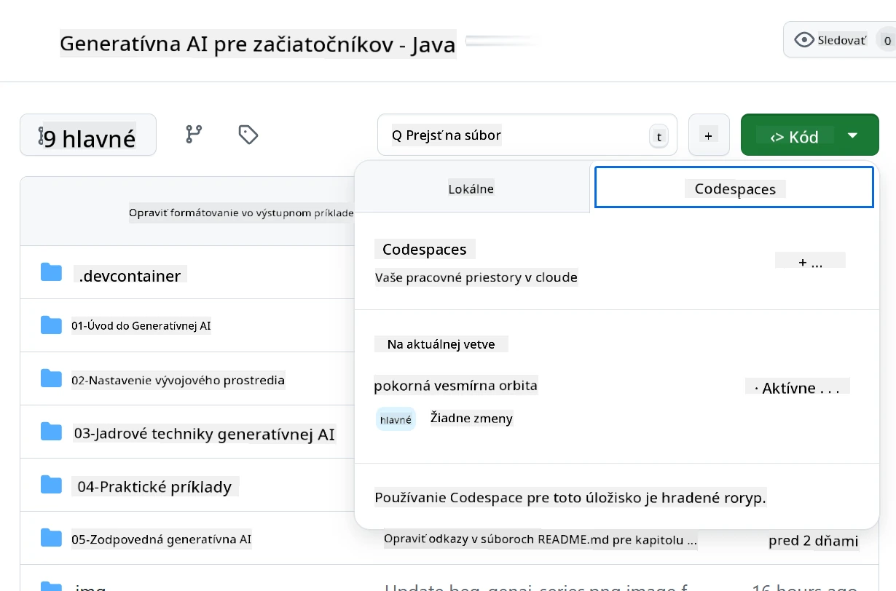
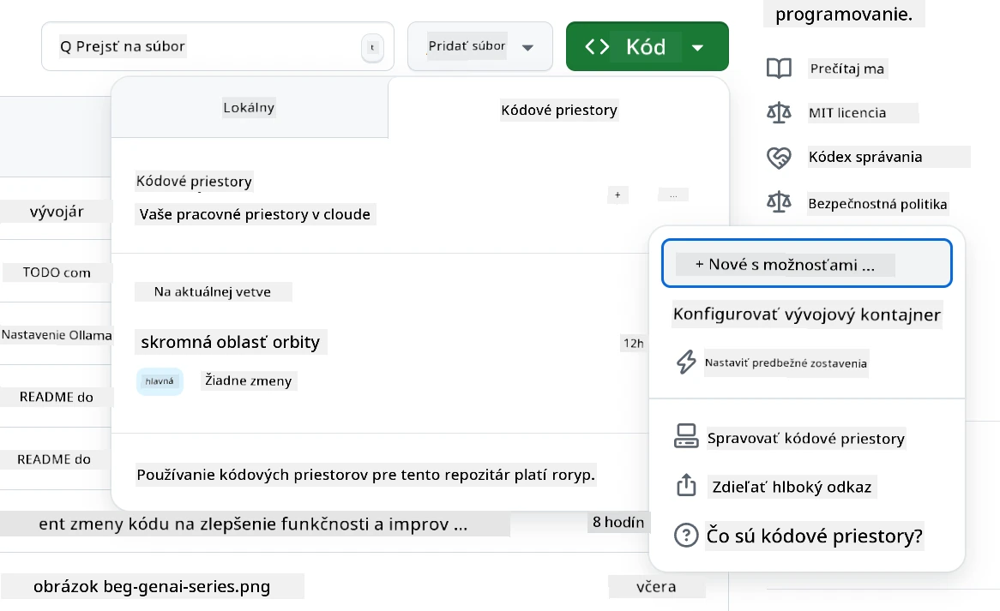
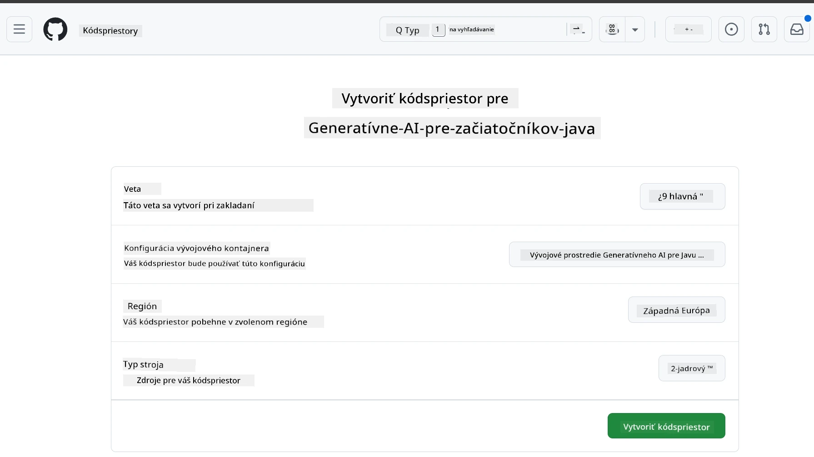
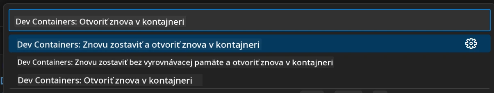
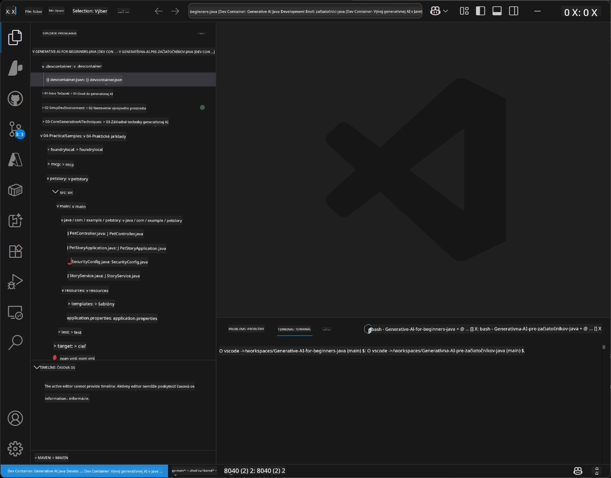
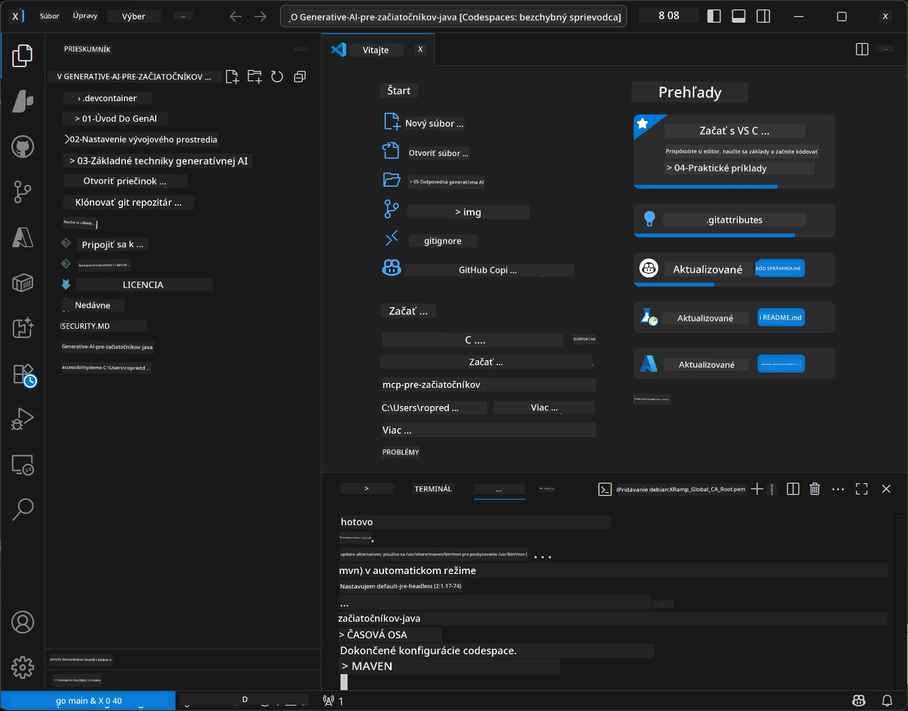

<!--
CO_OP_TRANSLATOR_METADATA:
{
  "original_hash": "96a30d42b9751a3d4e4b20e28d29d459",
  "translation_date": "2026-01-28T05:20:41+00:00",
  "source_file": "02-SetupDevEnvironment/README.md",
  "language_code": "sk"
}
-->
# Nastavenie vývojového prostredia pre Generatívnu AI pre Java

> **Rýchly začiatok**: Kódovanie v cloude za 2 minúty – prejdite na [GitHub Codespaces Setup](../../../02-SetupDevEnvironment) – nie je potrebná lokálna inštalácia a využíva github modely!

> **Zaujíma vás Azure OpenAI?**, pozrite si náš [Sprievodca nastavením Azure OpenAI](getting-started-azure-openai.md) s krokmi na vytvorenie nového Azure OpenAI zdroja.

## Čo sa naučíte

- Nastaviť vývojové prostredie Java pre AI aplikácie
- Vybrať a nakonfigurovať preferované vývojové prostredie (cloud-first s Codespaces, lokálny dev kontajner alebo plné lokálne nastavenie)
- Otestovať nastavenie pripojením na GitHub Modely

## Obsah

- [Čo sa naučíte](../../../02-SetupDevEnvironment)
- [Úvod](../../../02-SetupDevEnvironment)
- [Krok 1: Nastavte si vývojové prostredie](../../../02-SetupDevEnvironment)
  - [Možnosť A: GitHub Codespaces (Odporúčané)](../../../02-SetupDevEnvironment)
  - [Možnosť B: Lokálny Dev Kontajner](../../../02-SetupDevEnvironment)
  - [Možnosť C: Použite existujúcu lokálnu inštaláciu](../../../02-SetupDevEnvironment)
- [Krok 2: Vytvorte si GitHub osobný prístupový token](../../../02-SetupDevEnvironment)
- [Krok 3: Otestujte nastavenie](../../../02-SetupDevEnvironment)
- [Riešenie problémov](../../../02-SetupDevEnvironment)
- [Zhrnutie](../../../02-SetupDevEnvironment)
- [Ďalšie kroky](../../../02-SetupDevEnvironment)

## Úvod

Táto kapitola vás prevedie nastavením vývojového prostredia. Ako primárny príklad použijeme **GitHub Modely**, pretože sú bezplatné, ľahko sa nastavia iba s GitHub účtom, nepotrebujete kreditnú kartu a poskytujú prístup k viacerým modelom na experimentovanie.

**Nie je potrebné lokálne nastavenie!** Môžete začať kódovať okamžite pomocou GitHub Codespaces, ktoré poskytuje plné vývojové prostredie vo vašom prehliadači.


Odporúčame používať [**GitHub Modely**](https://github.com/marketplace?type=models) pre tento kurz, pretože sú:
- **Bezplatné** na začiatok
- **Jednoduché** na nastavenie iba s GitHub účtom
- **Bez potreby kreditnej karty**
- **Viacero modelov** na experimentovanie

> **Poznámka**: GitHub Modely použité v tomto školení majú tieto bezplatné limity:
> - 15 požiadaviek za minútu (150 za deň)
> - ~8 000 slov vstup, ~4 000 slov výstup na požiadavku
> - 5 súbežných požiadaviek
> 
> Pre produkčné použitie si upgradujte na Azure AI Foundry Modely so svojím Azure účtom. Váš kód nie je potrebné meniť. Pozrite si [dokumentáciu Azure AI Foundry](https://learn.microsoft.com/azure/ai-foundry/foundry-models/how-to/quickstart-github-models).


## Krok 1: Nastavte si vývojové prostredie

<a name="quick-start-cloud"></a>

Vytvorili sme predkonfigurovaný vývojový kontajner, aby sme minimalizovali čas nastavenia a zabezpečili, že máte všetky potrebné nástroje pre tento kurz Generatívnej AI pre Java. Vyberte si preferovaný spôsob vývoja:

### Možnosti nastavenia prostredia:

#### Možnosť A: GitHub Codespaces (Odporúčané)

**Začnite kódovať za 2 minúty – nie je potrebná lokálna inštalácia!**

1. Vytvorte fork tohto repozitára do svojho GitHub účtu
   > **Poznámka**: Ak chcete upraviť základnú konfiguráciu, pozrite si prosím [Konfiguráciu Dev Kontajnera](../../../.devcontainer/devcontainer.json)
2. Kliknite na **Code** → kartu **Codespaces** → **...** → **New with options...**
3. Použite predvolené nastavenia – vyberie sa **Konfigurácia Dev kontajnera**: **Generatívne AI Java vývojové prostredie** predpripravený devcontainer pre tento kurz
4. Kliknite na **Create codespace**
5. Počkajte približne 2 minúty, kým bude prostredie pripravené
6. Pokračujte na [Krok 2: Vytvorte GitHub token](../../../02-SetupDevEnvironment)








> **Výhody Codespaces**:
> - Nie je potrebná lokálna inštalácia
> - Funguje na akomkoľvek zariadení s prehliadačom
> - Predkonfigurované so všetkými nástrojmi a závislosťami
> - Bezplatných 60 hodín mesačne pre osobné účty
> - Konzistentné prostredie pre všetkých študentov

#### Možnosť B: Lokálny Dev Kontajner

**Pre vývojárov, ktorí preferujú lokálny vývoj pomocou Dockeru**

1. Vytvorte fork a naklonujte tento repozitár do svojho lokálneho počítača
   > **Poznámka**: Ak chcete upraviť základnú konfiguráciu, pozrite si prosím [Konfiguráciu Dev Kontajnera](../../../.devcontainer/devcontainer.json)
2. Nainštalujte [Docker Desktop](https://www.docker.com/products/docker-desktop/) a [VS Code](https://code.visualstudio.com/)
3. Nainštalujte rozšírenie [Dev Containers](https://marketplace.visualstudio.com/items?itemName=ms-vscode-remote.remote-containers) do VS Code
4. Otvorte priečinok repozitára vo VS Code
5. Keď sa zobrazí výzva, kliknite na **Reopen in Container** (alebo použite `Ctrl+Shift+P` → "Dev Containers: Reopen in Container")
6. Počkajte, kým sa kontajner zostaví a spustí
7. Pokračujte na [Krok 2: Vytvorte GitHub token](../../../02-SetupDevEnvironment)





#### Možnosť C: Použite existujúcu lokálnu inštaláciu

**Pre vývojárov s existujúcimi Java prostrediami**

Predpoklady:
- [Java 21+](https://www.oracle.com/java/technologies/javase/jdk21-archive-downloads.html) 
- [Maven 3.9+](https://maven.apache.org/download.cgi)
- [VS Code](https://code.visualstudio.com) alebo preferované IDE

Kroky:
1. Naklonujte tento repozitár do svojho lokálneho počítača
2. Otvorte projekt vo svojom IDE
3. Pokračujte na [Krok 2: Vytvorte GitHub token](../../../02-SetupDevEnvironment)

> **Tip**: Ak máte slabý počítač, ale chcete VS Code lokálne, použite GitHub Codespaces! Môžete pripojiť svoj lokálny VS Code ku cloud-hostovanému Codespace pre to najlepšie z oboch svetov.




## Krok 2: Vytvorte si GitHub osobný prístupový token

1. Prejdite do [GitHub Nastavení](https://github.com/settings/profile) a vyberte **Settings** z ponuky svojho profilu.
2. V ľavom bočnom paneli kliknite na **Developer settings** (zvyčajne na spodku).
3. Pod **Personal access tokens** kliknite na **Fine-grained tokens** (alebo použite tento priamy [odkaz](https://github.com/settings/personal-access-tokens)).
4. Kliknite na **Generate new token**.
5. Pod „Token name“ zadajte popisný názov (napr. `GenAI-Java-Course-Token`).
6. Nastavte dátum vypršania platnosti (odporúčané: 7 dní pre bezpečnostné postupy).
7. Pod „Resource owner“ vyberte svoj používateľský účet.
8. Pod „Repository access“ vyberte repozitáre, ktoré chcete používať s GitHub Modelmi (alebo „All repositories“, ak treba).
9. Pod „Account permissions“ nájdite **Models** a nastavte na **Read-only**.
10. Kliknite na **Generate token**.
11. **Skopírujte a uložte svoj token hneď teraz** – už ho neuvidíte!

> **Bezpečnostný tip**: Používajte minimálne potrebný rozsah a najkratšiu praktickú dobu platnosti pre svoje prístupové tokeny.

## Krok 3: Otestujte nastavenie s príkladom GitHub Modely

Akonáhle je vaše vývojové prostredie pripravené, otestujme integráciu GitHub Modelov s našou príkladovou aplikáciou v [`02-SetupDevEnvironment/examples/github-models`](../../../02-SetupDevEnvironment/examples/github-models).

1. Otvorte terminál vo svojom vývojovom prostredí.
2. Prejdite do príkladu GitHub Modely:
   ```bash
   cd 02-SetupDevEnvironment/examples/github-models
   ```
3. Nastavte svoj GitHub token ako premennú prostredia:
   ```bash
   # macOS/Linux
   export GITHUB_TOKEN=your_token_here
   
   # Windows (Príkazový riadok)
   set GITHUB_TOKEN=your_token_here
   
   # Windows (PowerShell)
   $env:GITHUB_TOKEN="your_token_here"
   ```

4. Spustite aplikáciu:
   ```bash
   mvn compile exec:java -Dexec.mainClass="com.example.githubmodels.App"
   ```

Mali by ste vidieť výstup podobný tomuto:
```text
Using model: gpt-4.1-nano
Sending request to GitHub Models...
Response: Hello World!
```

### Pochopenie príkladového kódu

Najprv si vysvetlime, čo sme práve spustili. Príklad v `examples/github-models` používa OpenAI Java SDK na pripojenie k GitHub Modelom:

**Čo tento kód robí:**
- **Pripojí sa** k GitHub Modelom pomocou vášho osobného prístupového tokenu
- **Odošle** jednoduchú správu "Say Hello World!" AI modelu
- **Prijme** a zobrazí odpoveď od AI
- **Overí**, že vaše nastavenie funguje správne

**Kľúčová závislosť** (v `pom.xml`):
```xml
<dependency>
    <groupId>com.openai</groupId>
    <artifactId>openai-java</artifactId>
    <version>2.12.0</version>
</dependency>
```

**Hlavný kód** (`App.java`):
```java
// Pripojiť sa k modelom GitHub pomocou OpenAI Java SDK
OpenAIClient client = OpenAIOkHttpClient.builder()
    .apiKey(pat)
    .baseUrl("https://models.inference.ai.azure.com")
    .build();

// Vytvoriť požiadavku na dokončenie chatu
ChatCompletionCreateParams params = ChatCompletionCreateParams.builder()
    .model(modelId)
    .addSystemMessage("You are a concise assistant.")
    .addUserMessage("Say Hello World!")
    .build();

// Získať odpoveď AI
ChatCompletion response = client.chat().completions().create(params);
System.out.println("Response: " + response.choices().get(0).message().content().orElse("No response content"));
```

## Zhrnutie

Výborne! Teraz máte všetko nastavené:

- Vytvorili ste GitHub osobný prístupový token so správnymi právami pre prístup k AI modelu
- Rozbehli ste si prostredie Java vývoja (či už Codespaces, dev kontajnery alebo lokálne)
- Pripojili ste sa ku GitHub Modelom pomocou OpenAI Java SDK pre bezplatný AI vývoj
- Otestovali ste, že všetko funguje na jednoduchom príklade komunikujúcim s AI modelmi

## Ďalšie kroky

[Kapitola 3: Základné techniky Generatívnej AI](../03-CoreGenerativeAITechniques/README.md)

## Riešenie problémov

Máte problémy? Tu sú bežné problémy a ich riešenia:

- **Token nefunguje?** 
  - Uistite sa, že ste skopírovali celý token bez ďalších medzier
  - Skontrolujte, či je token správne nastavený ako premenná prostredia
  - Overte, že token má správne oprávnenia (Models: Read-only)

- **Maven sa nenašiel?** 
  - Ak používate dev kontajnery/Codespaces, Maven by mal byť predinštalovaný
  - Pri lokálnom nastavení sa uistite, že máte nainštalované Java 21+ a Maven 3.9+
  - Skúste `mvn --version` na overenie inštalácie

- **Problémy s pripojením?** 
  - Skontrolujte vaše internetové pripojenie
  - Overte, že môžete pristupovať ku GitHub zo siete
  - Uistite sa, že nie ste za firewallom, ktorý blokuje endpoint GitHub Modelov

- **Dev kontajner sa nespúšťa?** 
  - Uistite sa, že Docker Desktop beží (pre lokálny vývoj)
  - Skúste znovu zostaviť kontajner: `Ctrl+Shift+P` → "Dev Containers: Rebuild Container"

- **Chyby kompilácie aplikácie?**
  - Uistite sa, že ste v správnom adresári: `02-SetupDevEnvironment/examples/github-models`
  - Skúste vyčistiť a znovu zostaviť: `mvn clean compile`

> **Potrebujete pomoc?**: Stále máte problémy? Otvorte issue v repozitári a radi vám pomôžeme.

---

<!-- CO-OP TRANSLATOR DISCLAIMER START -->
**Vyhlásenie o zodpovednosti**:  
Tento dokument bol preložený pomocou služby automatického prekladu [Co-op Translator](https://github.com/Azure/co-op-translator). Aj keď sa snažíme o presnosť, prosím berte na vedomie, že automatické preklady môžu obsahovať chyby alebo nepresnosti. Originálny dokument v jeho pôvodnom jazyku by sa mal považovať za autoritatívny zdroj. Pre kritické informácie odporúčame profesionálny ľudský preklad. Nezodpovedáme za žiadne nedorozumenia alebo nesprávne výklady vyplývajúce z použitia tohto prekladu.
<!-- CO-OP TRANSLATOR DISCLAIMER END -->