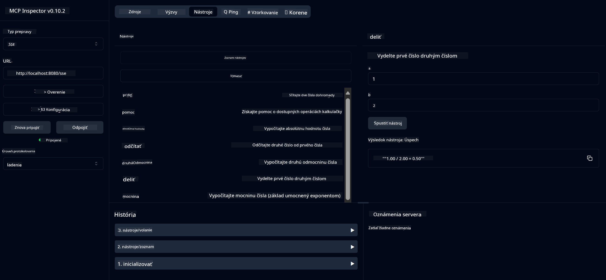

<!--
CO_OP_TRANSLATOR_METADATA:
{
  "original_hash": "7bf9a4a832911269a8bd0decb97ff36c",
  "translation_date": "2025-07-21T21:27:44+00:00",
  "source_file": "04-PracticalSamples/mcp/calculator/README.md",
  "language_code": "sk"
}
-->
# Základná služba kalkulačky MCP

>**Poznámka**: Táto kapitola obsahuje [**Návod**](./TUTORIAL.md), ktorý vás prevedie spustením hotových príkladov.

Vitajte pri vašej prvej praktickej skúsenosti s **Model Context Protocol (MCP)**! V predchádzajúcich kapitolách ste sa naučili základy generatívnej AI a nastavili si vývojové prostredie. Teraz je čas vytvoriť niečo praktické.

Táto služba kalkulačky demonštruje, ako môžu AI modely bezpečne komunikovať s externými nástrojmi pomocou MCP. Namiesto spoliehania sa na občas nespoľahlivé matematické schopnosti AI modelu vám ukážeme, ako vytvoriť robustný systém, kde AI môže volať špecializované služby na presné výpočty.

## Obsah

- [Čo sa naučíte](../../../../../04-PracticalSamples/mcp/calculator)
- [Predpoklady](../../../../../04-PracticalSamples/mcp/calculator)
- [Kľúčové koncepty](../../../../../04-PracticalSamples/mcp/calculator)
- [Rýchly štart](../../../../../04-PracticalSamples/mcp/calculator)
- [Dostupné operácie kalkulačky](../../../../../04-PracticalSamples/mcp/calculator)
- [Testovacie klienty](../../../../../04-PracticalSamples/mcp/calculator)
  - [1. Priamy MCP klient (SDKClient)](../../../../../04-PracticalSamples/mcp/calculator)
  - [2. Klient poháňaný AI (LangChain4jClient)](../../../../../04-PracticalSamples/mcp/calculator)
- [MCP Inspector (Webové rozhranie)](../../../../../04-PracticalSamples/mcp/calculator)
  - [Podrobné pokyny](../../../../../04-PracticalSamples/mcp/calculator)

## Čo sa naučíte

Pri práci na tomto príklade pochopíte:
- Ako vytvoriť služby kompatibilné s MCP pomocou Spring Boot
- Rozdiel medzi priamou komunikáciou cez protokol a interakciou poháňanou AI
- Ako AI modely rozhodujú, kedy a ako používať externé nástroje
- Najlepšie postupy pri budovaní AI aplikácií s podporou nástrojov

Ideálne pre začiatočníkov, ktorí sa učia koncepty MCP a sú pripravení vytvoriť svoju prvú integráciu AI nástrojov!

## Predpoklady

- Java 21+
- Maven 3.6+
- **GitHub Token**: Potrebný pre klienta poháňaného AI. Ak ste ho ešte nenastavili, pozrite si [Kapitolu 2: Nastavenie vývojového prostredia](../../../02-SetupDevEnvironment/README.md) pre pokyny.

## Kľúčové koncepty

**Model Context Protocol (MCP)** je štandardizovaný spôsob, ako môžu AI aplikácie bezpečne komunikovať s externými nástrojmi. Predstavte si ho ako "most", ktorý umožňuje AI modelom používať externé služby, ako je naša kalkulačka. Namiesto toho, aby sa AI model pokúšal robiť matematiku sám (čo môže byť nespoľahlivé), môže zavolať našu službu kalkulačky na získanie presných výsledkov. MCP zabezpečuje, že táto komunikácia prebieha bezpečne a konzistentne.

**Server-Sent Events (SSE)** umožňujú komunikáciu v reálnom čase medzi serverom a klientmi. Na rozdiel od tradičných HTTP požiadaviek, kde čakáte na odpoveď, SSE umožňuje serveru nepretržite posielať aktualizácie klientovi. To je ideálne pre AI aplikácie, kde odpovede môžu byť streamované alebo vyžadovať čas na spracovanie.

**AI nástroje a volanie funkcií** umožňujú AI modelom automaticky vybrať a použiť externé funkcie (ako operácie kalkulačky) na základe požiadaviek používateľa. Keď sa opýtate "Aký je výsledok 15 + 27?", AI model pochopí, že chcete sčítanie, automaticky zavolá našu funkciu `add` s príslušnými parametrami (15, 27) a vráti výsledok v prirodzenom jazyku. AI funguje ako inteligentný koordinátor, ktorý vie, kedy a ako použiť každý nástroj.

## Rýchly štart

### 1. Prejdite do adresára aplikácie kalkulačky
```bash
cd Generative-AI-for-beginners-java/04-PracticalSamples/mcp/calculator
```

### 2. Zostavte a spustite
```bash
mvn clean install -DskipTests
java -jar target/calculator-server-0.0.1-SNAPSHOT.jar
```

### 3. Testujte pomocou klientov
- **SDKClient**: Priama interakcia cez MCP protokol
- **LangChain4jClient**: Interakcia v prirodzenom jazyku poháňaná AI (vyžaduje GitHub token)

## Dostupné operácie kalkulačky

- `add(a, b)`, `subtract(a, b)`, `multiply(a, b)`, `divide(a, b)`
- `power(base, exponent)`, `squareRoot(number)`, `absolute(number)`
- `modulus(a, b)`, `help()`

## Testovacie klienty

### 1. Priamy MCP klient (SDKClient)
Testuje surovú komunikáciu cez MCP protokol. Spustite:
```bash
mvn test-compile exec:java -Dexec.mainClass="com.microsoft.mcp.sample.client.SDKClient" -Dexec.classpathScope=test
```

### 2. Klient poháňaný AI (LangChain4jClient)
Demonštruje interakciu v prirodzenom jazyku s GitHub modelmi. Vyžaduje GitHub token (pozrite [Predpoklady](../../../../../04-PracticalSamples/mcp/calculator)).

**Spustite:**
```bash
mvn test-compile exec:java -Dexec.mainClass="com.microsoft.mcp.sample.client.LangChain4jClient" -Dexec.classpathScope=test
```

## MCP Inspector (Webové rozhranie)

MCP Inspector poskytuje vizuálne webové rozhranie na testovanie vašej MCP služby bez písania kódu. Ideálne pre začiatočníkov na pochopenie fungovania MCP!

### Podrobné pokyny:

1. **Spustite server kalkulačky** (ak ešte nebeží):
   ```bash
   java -jar target/calculator-server-0.0.1-SNAPSHOT.jar
   ```

2. **Nainštalujte a spustite MCP Inspector** v novom termináli:
   ```bash
   npx @modelcontextprotocol/inspector
   ```

3. **Otvorte webové rozhranie**:
   - Vyhľadajte správu ako "Inspector running at http://localhost:6274"
   - Otvorte túto URL vo vašom webovom prehliadači

4. **Pripojte sa k službe kalkulačky**:
   - Vo webovom rozhraní nastavte typ prenosu na "SSE"
   - Nastavte URL na: `http://localhost:8080/sse`
   - Kliknite na tlačidlo "Connect"

5. **Preskúmajte dostupné nástroje**:
   - Kliknite na "List Tools" na zobrazenie všetkých operácií kalkulačky
   - Uvidíte funkcie ako `add`, `subtract`, `multiply`, atď.

6. **Otestujte operáciu kalkulačky**:
   - Vyberte nástroj (napr. "add")
   - Zadajte parametre (napr. `a: 15`, `b: 27`)
   - Kliknite na "Run Tool"
   - Zobrazí sa výsledok vrátený vašou MCP službou!

Tento vizuálny prístup vám pomôže presne pochopiť, ako funguje komunikácia cez MCP predtým, než začnete budovať vlastných klientov.



---
**Referencie:** [MCP Server Boot Starter Docs](https://docs.spring.io/spring-ai/reference/api/mcp/mcp-server-boot-starter-docs.html)

**Upozornenie**:  
Tento dokument bol preložený pomocou služby AI prekladu [Co-op Translator](https://github.com/Azure/co-op-translator). Aj keď sa snažíme o presnosť, prosím, berte na vedomie, že automatizované preklady môžu obsahovať chyby alebo nepresnosti. Pôvodný dokument v jeho rodnom jazyku by mal byť považovaný za autoritatívny zdroj. Pre kritické informácie sa odporúča profesionálny ľudský preklad. Nie sme zodpovední za akékoľvek nedorozumenia alebo nesprávne interpretácie vyplývajúce z použitia tohto prekladu.