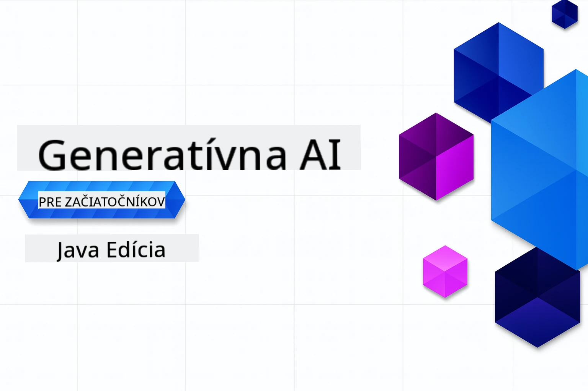

# Generatívna AI pre Začiatočníkov - Java Edícia
[](https://discord.gg/nTYy5BXMWG)



**Časová náročnosť**: Celý workshop je možné dokončiť online bez miestnej inštalácie. Nastavenie prostredia trvá 2 minúty, preskúmanie vzoriek potom 1–3 hodiny v závislosti od hĺbky skúmania.

> **Rýchly štart** 

1. Nafoťte si tento repozitár do svojho GitHub účtu
2. Kliknite na **Code** → záložka **Codespaces** → **...** → **New with options...**
3. Použite predvolené nastavenia – toto vyberie vývojové prostredie vytvorené pre tento kurz
4. Kliknite na **Create codespace**
5. Počkajte ~2 minúty, kým bude prostredie pripravené
6. Prejdite priamo na [Prvý príklad](./02-SetupDevEnvironment/README.md#step-2-create-a-github-personal-access-token)

## Podpora viacerých jazykov

### Podporované cez GitHub Action (automatizované a vždy aktuálne)

<!-- CO-OP TRANSLATOR LANGUAGES TABLE START -->
[Arabčina](../ar/README.md) | [Bengálčina](../bn/README.md) | [Bulharčina](../bg/README.md) | [Barmsky (Mjanmarsko)](../my/README.md) | [Čínština (zjednodušená)](../zh-CN/README.md) | [Čínština (tradičná, Hongkong)](../zh-HK/README.md) | [Čínština (tradičná, Macau)](../zh-MO/README.md) | [Čínština (tradičná, Taiwan)](../zh-TW/README.md) | [Chorvátčina](../hr/README.md) | [Čeština](../cs/README.md) | [Dánčina](../da/README.md) | [Holandčina](../nl/README.md) | [Estónčina](../et/README.md) | [Fínčina](../fi/README.md) | [Francúzština](../fr/README.md) | [Nemčina](../de/README.md) | [Gréčtina](../el/README.md) | [Hebrejčina](../he/README.md) | [Hindi](../hi/README.md) | [Maďarčina](../hu/README.md) | [Indonézština](../id/README.md) | [Taliančina](../it/README.md) | [Japončina](../ja/README.md) | [Kannadčina](../kn/README.md) | [Kórejčina](../ko/README.md) | [Litovčina](../lt/README.md) | [Malajčina](../ms/README.md) | [Malayalam](../ml/README.md) | [Maráthčina](../mr/README.md) | [Nepálčina](../ne/README.md) | [Nigérijská pidgin](../pcm/README.md) | [Nórčina](../no/README.md) | [Perzština (Farsi)](../fa/README.md) | [Poľština](../pl/README.md) | [Portugalčina (Brazília)](../pt-BR/README.md) | [Portugalčina (Portugalsko)](../pt-PT/README.md) | [Pandžábčina (Gurmukhi)](../pa/README.md) | [Rumunčina](../ro/README.md) | [Ruština](../ru/README.md) | [Srbčina (Cyrilika)](../sr/README.md) | [Slovenčina](./README.md) | [Slovinčina](../sl/README.md) | [Španielčina](../es/README.md) | [Swahilčina](../sw/README.md) | [Švédčina](../sv/README.md) | [Tagalog (Filipínska)](../tl/README.md) | [Tamilčina](../ta/README.md) | [Telugčina](../te/README.md) | [Thajčina](../th/README.md) | [Turečtina](../tr/README.md) | [Ukrajinčina](../uk/README.md) | [Urdčina](../ur/README.md) | [Vietnamčina](../vi/README.md)

> **Radšej klonovať lokálne?**
>
> Tento repozitár obsahuje viac ako 50 jazykových prekladov, čo výrazne zvyšuje veľkosť stiahnutia. Ak chcete klonovať bez prekladov, použite sparse checkout:
>
> **Bash / macOS / Linux:**
> ```bash
> git clone --filter=blob:none --sparse https://github.com/microsoft/Generative-AI-for-beginners-java.git
> cd Generative-AI-for-beginners-java
> git sparse-checkout set --no-cone '/*' '!translations' '!translated_images'
> ```
>
> **CMD (Windows):**
> ```cmd
> git clone --filter=blob:none --sparse https://github.com/microsoft/Generative-AI-for-beginners-java.git
> cd Generative-AI-for-beginners-java
> git sparse-checkout set --no-cone "/*" "!translations" "!translated_images"
> ```
>
> Toto vám poskytne všetko potrebné na dokončenie kurzu s výrazne rýchlejším sťahovaním.
<!-- CO-OP TRANSLATOR LANGUAGES TABLE END -->

## Štruktúra kurzu a cesta učenia

### **Kapitola 1: Úvod do generatívnej AI**
- **Základné pojmy**: Pochopenie veľkých jazykových modelov, tokenov, embeddings a schopností AI
- **Java AI ekosystém**: Prehľad Spring AI a OpenAI SDK
- **Protokol kontextu modelu**: Úvod do MCP a jeho úloha v komunikácii AI agentov
- **Praktické aplikácie**: Skutočné scenáre ako chatboty a generovanie obsahu
- **[→ Začať Kapitolu 1](./01-IntroToGenAI/README.md)**

### **Kapitola 2: Nastavenie vývojového prostredia**
- **Nastavenie viacerých poskytovateľov**: Konfigurácia GitHub Models, Azure OpenAI a OpenAI Java SDK integrácií
- **Spring Boot + Spring AI**: Najlepšie postupy pre vývoj podnikových AI aplikácií
- **GitHub Models**: Bezplatný prístup k AI modelom na prototypovanie a učenie (nevyžaduje kartu)
- **Vývojové nástroje**: Docker kontajnery, VS Code a konfigurácia GitHub Codespaces
- **[→ Začať Kapitolu 2](./02-SetupDevEnvironment/README.md)**

### **Kapitola 3: Základné techniky generatívnej AI**
- **Prompt Engineering**: Techniky pre optimálne reakcie AI modelov
- **Embeddings a vektorové operácie**: Implementácia sémantického vyhľadávania a vyhľadávania podobností
- **Retrieval-Augmented Generation (RAG)**: Kombinovanie AI s vašimi vlastnými dátovými zdrojmi
- **Volanie funkcií**: Rozširovanie schopností AI pomocou vlastných nástrojov a pluginov
- **[→ Začať Kapitolu 3](./03-CoreGenerativeAITechniques/README.md)**

### **Kapitola 4: Praktické aplikácie a projekty**
- **Generátor príbehov o zvieratkách** (`petstory/`): Kreatívne generovanie obsahu s GitHub Models
- **Lokálna ukážka Foundry** (`foundrylocal/`): Lokálna integrácia AI modelu s OpenAI Java SDK
- **MCP Kalkulátor služba** (`calculator/`): Základná implementácia Protokolu kontextu modelu so Spring AI
- **[→ Začať Kapitolu 4](./04-PracticalSamples/README.md)**

### **Kapitola 5: Zodpovedný vývoj AI**
- **Bezpečnosť GitHub Models**: Testovanie vstavaného filtrovania obsahu a bezpečnostných mechanizmov (tvrdé bloky a mäkké odmietnutia)
- **Ukážka zodpovednej AI**: Praktický príklad, ako fungujú moderné bezpečnostné systémy AI
- **Najlepšie postupy**: Základné usmernenia pre etický vývoj a nasadenie AI
- **[→ Začať Kapitolu 5](./05-ResponsibleGenAI/README.md)**

## Ďalšie zdroje

<!-- CO-OP TRANSLATOR OTHER COURSES START -->
### LangChain
[](https://aka.ms/langchain4j-for-beginners)
[](https://aka.ms/langchainjs-for-beginners?WT.mc_id=m365-94501-dwahlin)
[](https://github.com/microsoft/langchain-for-beginners?WT.mc_id=m365-94501-dwahlin)
---

### Azure / Edge / MCP / Agenti
[](https://github.com/microsoft/AZD-for-beginners?WT.mc_id=academic-105485-koreyst)
[](https://github.com/microsoft/edgeai-for-beginners?WT.mc_id=academic-105485-koreyst)
[](https://github.com/microsoft/mcp-for-beginners?WT.mc_id=academic-105485-koreyst)
[](https://github.com/microsoft/ai-agents-for-beginners?WT.mc_id=academic-105485-koreyst)

---
 
### Generatívna AI séria
[](https://github.com/microsoft/generative-ai-for-beginners?WT.mc_id=academic-105485-koreyst)
[-9333EA?style=for-the-badge&labelColor=E5E7EB&color=9333EA)](https://github.com/microsoft/Generative-AI-for-beginners-dotnet?WT.mc_id=academic-105485-koreyst)
[-C084FC?style=for-the-badge&labelColor=E5E7EB&color=C084FC)](https://github.com/microsoft/generative-ai-for-beginners-java?WT.mc_id=academic-105485-koreyst)
[-E879F9?style=for-the-badge&labelColor=E5E7EB&color=E879F9)](https://github.com/microsoft/generative-ai-with-javascript?WT.mc_id=academic-105485-koreyst)

---
 
### Základné učenie
[](https://aka.ms/ml-beginners?WT.mc_id=academic-105485-koreyst)
[](https://aka.ms/datascience-beginners?WT.mc_id=academic-105485-koreyst)
[](https://aka.ms/ai-beginners?WT.mc_id=academic-105485-koreyst)
[](https://github.com/microsoft/Security-101?WT.mc_id=academic-96948-sayoung)

[](https://aka.ms/webdev-beginners?WT.mc_id=academic-105485-koreyst)
[](https://aka.ms/iot-beginners?WT.mc_id=academic-105485-koreyst)
[](https://github.com/microsoft/xr-development-for-beginners?WT.mc_id=academic-105485-koreyst)

---
 
### Séria Copilot
[](https://aka.ms/GitHubCopilotAI?WT.mc_id=academic-105485-koreyst)
[](https://github.com/microsoft/mastering-github-copilot-for-dotnet-csharp-developers?WT.mc_id=academic-105485-koreyst)
[](https://github.com/microsoft/CopilotAdventures?WT.mc_id=academic-105485-koreyst)
<!-- CO-OP TRANSLATOR OTHER COURSES END -->

## Získanie pomoci

Ak budete mať problémy alebo otázky týkajúce sa tvorby AI aplikácií, pridajte sa k ďalším študentom a skúseným vývojárom v diskusiách o MCP. Je to podporná komunita, kde sú otázky vítané a zdieľanie vedomostí je slobodné.

[](https://discord.gg/nTYy5BXMWG)

Ak máte spätnú väzbu na produkt alebo narazíte na chyby počas tvorby, navštívte:

[](https://aka.ms/foundry/forum)

---

<!-- CO-OP TRANSLATOR DISCLAIMER START -->
**Vylúčenie zodpovednosti**:
Tento dokument bol preložený pomocou AI prekladateľskej služby [Co-op Translator](https://github.com/Azure/co-op-translator). Hoci sa usilujeme o presnosť, berte prosím na vedomie, že automatické preklady môžu obsahovať chyby alebo nepresnosti. Pôvodný dokument v jeho rodnom jazyku by mal byť považovaný za autoritatívny zdroj. Pre kritické informácie sa odporúča profesionálny ľudský preklad. Za akékoľvek nedorozumenia alebo nesprávne interpretácie vyplývajúce z použitia tohto prekladu nenesieme zodpovednosť.
<!-- CO-OP TRANSLATOR DISCLAIMER END -->