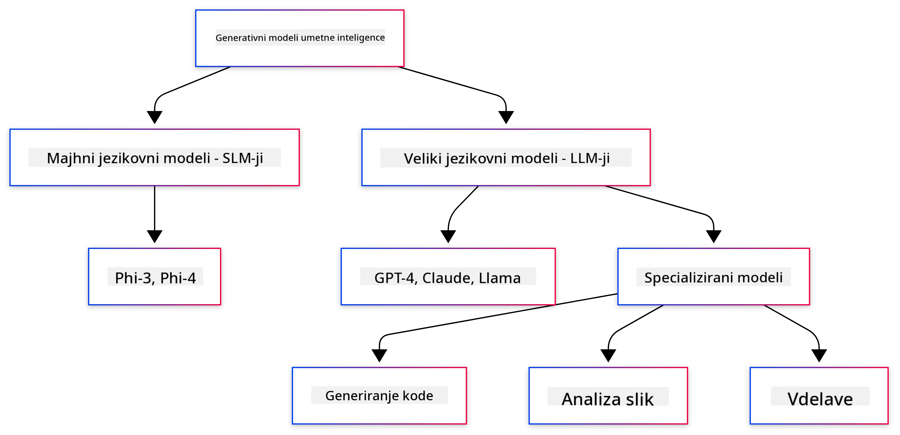

<!--
CO_OP_TRANSLATOR_METADATA:
{
  "original_hash": "006866db93a268a8769bb55f2e324291",
  "translation_date": "2025-07-28T11:17:07+00:00",
  "source_file": "01-IntroToGenAI/README.md",
  "language_code": "sl"
}
-->
# Uvod v generativno umetno inteligenco - Java izdaja

## Kaj se boste naučili

- **Osnove generativne umetne inteligence**, vključno z LLM-ji, oblikovanjem pozivov, tokeni, vektorji in vektorskimi bazami podatkov
- **Primerjava orodij za razvoj umetne inteligence v Javi**, kot so Azure OpenAI SDK, Spring AI in OpenAI Java SDK
- **Odkritje protokola Model Context Protocol** in njegove vloge pri komunikaciji AI agentov

## Kazalo

- [Uvod](../../../01-IntroToGenAI)
- [Hiter pregled konceptov generativne umetne inteligence](../../../01-IntroToGenAI)
- [Pregled oblikovanja pozivov](../../../01-IntroToGenAI)
- [Tokeni, vektorji in agenti](../../../01-IntroToGenAI)
- [Orodja in knjižnice za razvoj umetne inteligence v Javi](../../../01-IntroToGenAI)
  - [OpenAI Java SDK](../../../01-IntroToGenAI)
  - [Spring AI](../../../01-IntroToGenAI)
  - [Azure OpenAI Java SDK](../../../01-IntroToGenAI)
- [Povzetek](../../../01-IntroToGenAI)
- [Naslednji koraki](../../../01-IntroToGenAI)

## Uvod

Dobrodošli v prvem poglavju Generativne umetne inteligence za začetnike - Java izdaja! Ta osnovna lekcija vas bo uvedla v ključne koncepte generativne umetne inteligence in kako z njimi delati v Javi. Spoznali boste osnovne gradnike AI aplikacij, vključno z velikimi jezikovnimi modeli (LLM), tokeni, vektorji in AI agenti. Raziskali bomo tudi glavna orodja za Javo, ki jih boste uporabljali skozi celoten tečaj.

### Hiter pregled konceptov generativne umetne inteligence

Generativna umetna inteligenca je vrsta umetne inteligence, ki ustvarja nove vsebine, kot so besedilo, slike ali koda, na podlagi vzorcev in odnosov, naučenih iz podatkov. Generativni AI modeli lahko ustvarjajo odgovore, podobne človeškim, razumejo kontekst in včasih celo ustvarjajo vsebine, ki delujejo človeško.

Ko razvijate svoje AI aplikacije v Javi, boste uporabljali **generativne AI modele** za ustvarjanje vsebin. Nekatere zmožnosti generativnih AI modelov vključujejo:

- **Generiranje besedila**: Pisanje besedil za klepetalne bote, vsebine in dopolnjevanje besedil.
- **Generiranje in analiza slik**: Ustvarjanje realističnih slik, izboljševanje fotografij in prepoznavanje objektov.
- **Generiranje kode**: Pisanje odsekov kode ali skript.

Obstajajo specifični tipi modelov, optimizirani za različne naloge. Na primer, tako **mali jezikovni modeli (SLM)** kot **veliki jezikovni modeli (LLM)** lahko obdelujejo generiranje besedila, pri čemer LLM-ji običajno ponujajo boljše rezultate za kompleksne naloge. Za naloge, povezane s slikami, bi uporabili specializirane vizualne modele ali multimodalne modele.

Seveda odgovori teh modelov niso vedno popolni. Verjetno ste že slišali za "halucinacije" modelov, ko ti ustvarijo napačne informacije na prepričljiv način. Toda modele lahko usmerite k boljšim odgovorom z jasnimi navodili in kontekstom. Tukaj pride v poštev **oblikovanje pozivov**.

#### Pregled oblikovanja pozivov

Oblikovanje pozivov je praksa oblikovanja učinkovitih vhodov za usmerjanje AI modelov k želenim izhodom. Vključuje:

- **Jasnost**: Navodila naj bodo jasna in nedvoumna.
- **Kontekst**: Zagotovite potrebno ozadje.
- **Omejitve**: Določite morebitne omejitve ali formate.

Nekatere najboljše prakse oblikovanja pozivov vključujejo oblikovanje pozivov, jasna navodila, razčlenitev nalog, učenje z enim ali nekaj primeri ter prilagajanje pozivov. Testiranje različnih pozivov je ključno za ugotavljanje, kaj najbolje deluje za vaš specifični primer uporabe.

Pri razvoju aplikacij boste delali z različnimi vrstami pozivov:
- **Sistemski pozivi**: Določajo osnovna pravila in kontekst za vedenje modela
- **Uporabniški pozivi**: Vhodni podatki vaših uporabnikov aplikacije
- **Pozivi pomočnika**: Odzivi modela na podlagi sistemskih in uporabniških pozivov

> **Več o tem**: Več o oblikovanju pozivov si preberite v [poglavju o oblikovanju pozivov tečaja GenAI za začetnike](https://github.com/microsoft/generative-ai-for-beginners/tree/main/04-prompt-engineering-fundamentals)

#### Tokeni, vektorji in agenti

Pri delu z generativnimi AI modeli boste naleteli na izraze, kot so **tokeni**, **vektorji**, **agenti** in **Model Context Protocol (MCP)**. Tukaj je podrobnejši pregled teh konceptov:

- **Tokeni**: Tokeni so najmanjša enota besedila v modelu. Lahko so besede, znaki ali podbesede. Tokeni se uporabljajo za predstavitev besedilnih podatkov v formatu, ki ga model razume. Na primer, stavek "The quick brown fox jumped over the lazy dog" bi lahko bil razdeljen na tokene kot ["The", " quick", " brown", " fox", " jumped", " over", " the", " lazy", " dog"] ali ["The", " qu", "ick", " br", "own", " fox", " jump", "ed", " over", " the", " la", "zy", " dog"], odvisno od strategije tokenizacije.

Tokenizacija je proces razbijanja besedila na te manjše enote. To je ključno, saj modeli delujejo na tokenih in ne na surovem besedilu. Število tokenov v pozivu vpliva na dolžino in kakovost odgovora modela, saj imajo modeli omejitve glede števila tokenov v kontekstnem oknu (npr. 128K tokenov za GPT-4o, vključno z vhodom in izhodom).

  V Javi lahko uporabite knjižnice, kot je OpenAI SDK, za samodejno obdelavo tokenizacije pri pošiljanju zahtevkov AI modelom.

- **Vektorji**: Vektorji so numerične predstavitve tokenov, ki zajemajo semantični pomen. So številčne predstavitve (običajno matrike s plavajočimi števili), ki modelom omogočajo razumevanje odnosov med besedami in generiranje kontekstualno ustreznih odgovorov. Podobne besede imajo podobne vektorje, kar modelu omogoča razumevanje konceptov, kot so sopomenke in semantični odnosi.

  V Javi lahko vektorje generirate z uporabo OpenAI SDK ali drugih knjižnic, ki podpirajo generiranje vektorjev. Ti vektorji so ključni za naloge, kot je semantično iskanje, kjer želite najti podobne vsebine na podlagi pomena in ne natančnega ujemanja besedila.

- **Vektorske baze podatkov**: Vektorske baze podatkov so specializirani sistemi za shranjevanje, optimizirani za vektorje. Omogočajo učinkovito iskanje podobnosti in so ključne za vzorce Retrieval-Augmented Generation (RAG), kjer morate najti ustrezne informacije iz velikih naborov podatkov na podlagi semantične podobnosti in ne natančnih ujemanj.

> **Opomba**: V tem tečaju ne bomo obravnavali vektorskih baz podatkov, vendar jih je vredno omeniti, saj so pogosto uporabljene v resničnih aplikacijah.

- **Agenti in MCP**: AI komponente, ki avtonomno sodelujejo z modeli, orodji in zunanjimi sistemi. Protokol Model Context Protocol (MCP) zagotavlja standardiziran način, kako agenti varno dostopajo do zunanjih virov podatkov in orodij. Več o tem si preberite v našem tečaju [MCP za začetnike](https://github.com/microsoft/mcp-for-beginners).

V AI aplikacijah za Javo boste uporabljali tokene za obdelavo besedila, vektorje za semantično iskanje in RAG, vektorske baze podatkov za pridobivanje podatkov ter agente z MCP za gradnjo inteligentnih sistemov, ki uporabljajo orodja.

### Orodja in knjižnice za razvoj umetne inteligence v Javi

Java ponuja odlična orodja za razvoj umetne inteligence. V tem tečaju bomo raziskali tri glavne knjižnice - OpenAI Java SDK, Azure OpenAI SDK in Spring AI.

Tukaj je hitra referenčna tabela, ki prikazuje, kateri SDK je uporabljen v primerih posameznih poglavij:

| Poglavje | Primer | SDK |
|----------|--------|-----|
| 02-SetupDevEnvironment | github-models | OpenAI Java SDK |
| 02-SetupDevEnvironment | basic-chat-azure | Spring AI Azure OpenAI |
| 03-CoreGenerativeAITechniques | primeri | Azure OpenAI SDK |
| 04-PracticalSamples | petstory | OpenAI Java SDK |
| 04-PracticalSamples | foundrylocal | OpenAI Java SDK |
| 04-PracticalSamples | calculator | Spring AI MCP SDK + LangChain4j |

**Povezave do dokumentacije SDK-jev:**
- [Azure OpenAI Java SDK](https://github.com/Azure/azure-sdk-for-java/tree/azure-ai-openai_1.0.0-beta.16/sdk/openai/azure-ai-openai)
- [Spring AI](https://docs.spring.io/spring-ai/reference/)
- [OpenAI Java SDK](https://github.com/openai/openai-java)
- [LangChain4j](https://docs.langchain4j.dev/)

#### OpenAI Java SDK

OpenAI SDK je uradna Java knjižnica za OpenAI API. Ponuja preprost in dosleden vmesnik za interakcijo z modeli OpenAI, kar omogoča enostavno vključevanje AI zmogljivosti v Java aplikacije. Primer GitHub Models iz 2. poglavja, aplikacija Pet Story in primer Foundry Local iz 4. poglavja prikazujejo pristop OpenAI SDK.

#### Spring AI

Spring AI je celovit okvir, ki prinaša AI zmogljivosti v Spring aplikacije in zagotavlja dosledno abstrakcijsko plast za različne AI ponudnike. Brezhibno se integrira z ekosistemom Spring, zaradi česar je idealna izbira za podjetniške Java aplikacije, ki potrebujejo AI zmogljivosti.

Moč Spring AI je v njegovi brezhibni integraciji z ekosistemom Spring, kar omogoča enostavno gradnjo produkcijsko pripravljenih AI aplikacij z znanimi Spring vzorci, kot so vbrizgavanje odvisnosti, upravljanje konfiguracije in testni okviri. Spring AI boste uporabljali v 2. in 4. poglavju za gradnjo aplikacij, ki izkoriščajo knjižnice OpenAI in Model Context Protocol (MCP) Spring AI.

##### Model Context Protocol (MCP)

[Model Context Protocol (MCP)](https://modelcontextprotocol.io/) je nastajajoči standard, ki omogoča AI aplikacijam varno interakcijo z zunanjimi viri podatkov in orodji. MCP zagotavlja standardiziran način, kako AI modeli dostopajo do kontekstualnih informacij in izvajajo dejanja v vaših aplikacijah.

V 4. poglavju boste zgradili preprosto MCP kalkulatorsko storitev, ki prikazuje osnove protokola Model Context Protocol s Spring AI, in pokazali, kako ustvariti osnovne integracije orodij in arhitekture storitev.

#### Azure OpenAI Java SDK

Odjemalska knjižnica Azure OpenAI za Javo je prilagoditev REST API-jev OpenAI, ki zagotavlja idiomatičen vmesnik in integracijo z ostalim ekosistemom Azure SDK. V 3. poglavju boste gradili aplikacije z uporabo Azure OpenAI SDK, vključno s klepetalnimi aplikacijami, klicanjem funkcij in vzorci RAG (Retrieval-Augmented Generation).

> Opomba: Azure OpenAI SDK zaostaja za OpenAI Java SDK glede funkcionalnosti, zato za prihodnje projekte razmislite o uporabi OpenAI Java SDK.

## Povzetek

**Čestitamo!** Uspešno ste:

- **Spoznali osnove generativne umetne inteligence**, vključno z LLM-ji, oblikovanjem pozivov, tokeni, vektorji in vektorskimi bazami podatkov
- **Primerjali orodja za razvoj umetne inteligence v Javi**, kot so Azure OpenAI SDK, Spring AI in OpenAI Java SDK
- **Odkritje protokola Model Context Protocol** in njegove vloge pri komunikaciji AI agentov

## Naslednji koraki

[2. poglavje: Nastavitev razvojnega okolja](../02-SetupDevEnvironment/README.md)

**Omejitev odgovornosti**:  
Ta dokument je bil preveden z uporabo storitve AI za prevajanje [Co-op Translator](https://github.com/Azure/co-op-translator). Čeprav si prizadevamo za natančnost, vas prosimo, da upoštevate, da lahko avtomatizirani prevodi vsebujejo napake ali netočnosti. Izvirni dokument v njegovem maternem jeziku naj se šteje za avtoritativni vir. Za ključne informacije priporočamo profesionalni človeški prevod. Ne prevzemamo odgovornosti za morebitna nesporazume ali napačne razlage, ki izhajajo iz uporabe tega prevoda.