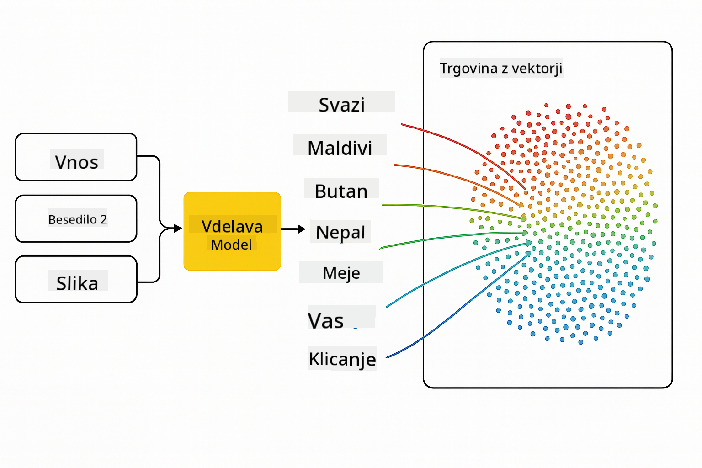
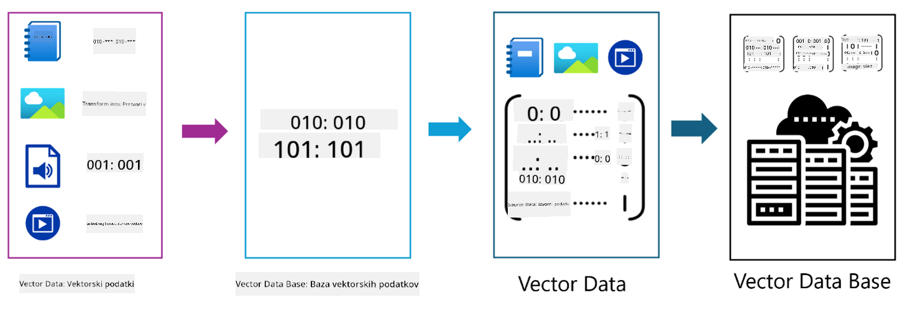
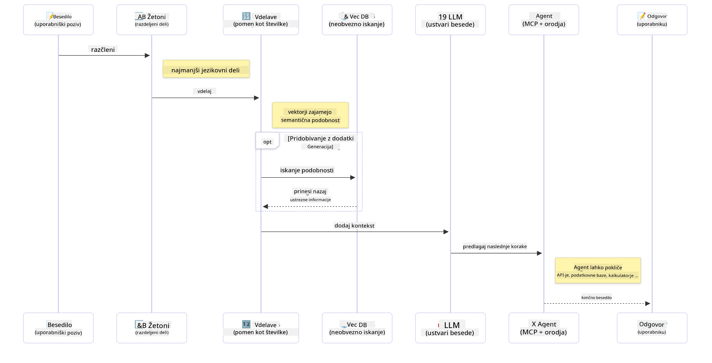

<!--
CO_OP_TRANSLATOR_METADATA:
{
  "original_hash": "75bfb080ca725e8a9aa9c80cae25fba1",
  "translation_date": "2025-07-29T10:24:20+00:00",
  "source_file": "01-IntroToGenAI/README.md",
  "language_code": "sl"
}
-->
# Uvod v generativno umetno inteligenco - Java izdaja

## Kaj boste spoznali

- **Osnove generativne umetne inteligence**, vključno z LLM-ji, oblikovanjem pozivov, tokeni, vdelavami in vektorskimi bazami podatkov
- **Primerjava orodij za razvoj umetne inteligence v Javi**, vključno z Azure OpenAI SDK, Spring AI in OpenAI Java SDK
- **Odkrijte protokol Model Context Protocol** in njegovo vlogo pri komunikaciji AI agentov

## Kazalo vsebine

- [Uvod](../../../01-IntroToGenAI)
- [Hiter pregled konceptov generativne umetne inteligence](../../../01-IntroToGenAI)
- [Pregled oblikovanja pozivov](../../../01-IntroToGenAI)
- [Tokeni, vdelave in agenti](../../../01-IntroToGenAI)
- [Orodja in knjižnice za razvoj umetne inteligence v Javi](../../../01-IntroToGenAI)
  - [OpenAI Java SDK](../../../01-IntroToGenAI)
  - [Spring AI](../../../01-IntroToGenAI)
  - [Azure OpenAI Java SDK](../../../01-IntroToGenAI)
- [Povzetek](../../../01-IntroToGenAI)
- [Naslednji koraki](../../../01-IntroToGenAI)

## Uvod

Dobrodošli v prvem poglavju Generativne umetne inteligence za začetnike - Java izdaja! Ta osnovna lekcija vas bo uvedla v ključne koncepte generativne umetne inteligence in kako z njimi delati v Javi. Spoznali boste osnovne gradnike aplikacij umetne inteligence, vključno z velikimi jezikovnimi modeli (LLM-ji), tokeni, vdelavami in AI agenti. Prav tako bomo raziskali osnovna orodja za Javo, ki jih boste uporabljali skozi celoten tečaj.

### Hiter pregled konceptov generativne umetne inteligence

Generativna umetna inteligenca je vrsta umetne inteligence, ki ustvarja novo vsebino, kot so besedilo, slike ali koda, na podlagi vzorcev in odnosov, ki jih je pridobila iz podatkov. Generativni modeli umetne inteligence lahko ustvarjajo odzive, ki so podobni človeškim, razumejo kontekst in včasih celo ustvarjajo vsebino, ki se zdi človeška.

Med razvojem svojih aplikacij umetne inteligence v Javi boste delali z **generativnimi modeli umetne inteligence** za ustvarjanje vsebine. Nekatere zmožnosti generativnih modelov vključujejo:

- **Generiranje besedila**: Oblikovanje besedila, podobnega človeškemu, za klepetalnike, vsebino in dopolnjevanje besedila.
- **Generiranje in analiza slik**: Ustvarjanje realističnih slik, izboljševanje fotografij in zaznavanje objektov.
- **Generiranje kode**: Pisanje delčkov kode ali skript.

Obstajajo specifični tipi modelov, ki so optimizirani za različne naloge. Na primer, tako **majhni jezikovni modeli (SLM-ji)** kot **veliki jezikovni modeli (LLM-ji)** lahko obdelujejo generiranje besedila, pri čemer LLM-ji običajno ponujajo boljšo zmogljivost za kompleksne naloge. Za naloge, povezane s slikami, bi uporabili specializirane vizualne modele ali multimodalne modele.

Seveda odzivi teh modelov niso vedno popolni. Verjetno ste že slišali, da modeli "halucinirajo" ali ustvarjajo napačne informacije na avtoritativen način. Toda lahko pomagate modelu pri ustvarjanju boljših odzivov tako, da mu zagotovite jasna navodila in kontekst. Tukaj pride v poštev **oblikovanje pozivov**.

#### Pregled oblikovanja pozivov

Oblikovanje pozivov je praksa oblikovanja učinkovitih vhodnih podatkov za usmerjanje modelov umetne inteligence k želenim izhodom. Vključuje:

- **Jasnost**: Zagotavljanje jasnih in nedvoumnih navodil.
- **Kontekst**: Zagotavljanje potrebnih ozadnih informacij.
- **Omejitve**: Določanje omejitev ali formatov.

Nekatere najboljše prakse pri oblikovanju pozivov vključujejo oblikovanje pozivov, jasna navodila, razčlenitev nalog, učenje z enim ali nekaj primeri ter prilagajanje pozivov. Testiranje različnih pozivov je ključno za ugotavljanje, kaj najbolje deluje za vaš specifični primer uporabe.

Pri razvoju aplikacij boste delali z različnimi vrstami pozivov:
- **Sistemski pozivi**: Določajo osnovna pravila in kontekst za vedenje modela
- **Uporabniški pozivi**: Vhodni podatki od uporabnikov vaše aplikacije
- **Pozivi pomočnika**: Odzivi modela na podlagi sistemskih in uporabniških pozivov

> **Več o tem**: Več o oblikovanju pozivov si lahko preberete v [poglavju o oblikovanju pozivov tečaja GenAI za začetnike](https://github.com/microsoft/generative-ai-for-beginners/tree/main/04-prompt-engineering-fundamentals)

#### Tokeni, vdelave in agenti

Pri delu z generativnimi modeli umetne inteligence boste naleteli na izraze, kot so **tokeni**, **vdelave**, **agenti** in **Model Context Protocol (MCP)**. Tukaj je podroben pregled teh konceptov:

- **Tokeni**: Tokeni so najmanjša enota besedila v modelu. Lahko so besede, znaki ali podbesede. Tokeni se uporabljajo za predstavitev besedilnih podatkov v formatu, ki ga model lahko razume. Na primer, stavek "The quick brown fox jumped over the lazy dog" bi lahko bil razčlenjen kot ["The", " quick", " brown", " fox", " jumped", " over", " the", " lazy", " dog"] ali ["The", " qu", "ick", " br", "own", " fox", " jump", "ed", " over", " the", " la", "zy", " dog"] glede na strategijo razčlenjevanja.

Razčlenjevanje je proces razbijanja besedila na te manjše enote. To je ključno, ker modeli delujejo na tokenih in ne na surovem besedilu. Število tokenov v pozivu vpliva na dolžino in kakovost odziva modela, saj imajo modeli omejitve glede števila tokenov v kontekstnem oknu (npr. 128K tokenov za celoten kontekst GPT-4o, vključno z vhodom in izhodom).

  V Javi lahko uporabite knjižnice, kot je OpenAI SDK, za samodejno obdelavo tokenov pri pošiljanju zahtevkov modelom umetne inteligence.

- **Vdelave**: Vdelave so vektorske predstavitve tokenov, ki zajemajo semantični pomen. So numerične predstavitve (običajno matrike s plavajočimi števili), ki omogočajo modelom razumevanje odnosov med besedami in generiranje kontekstualno ustreznih odzivov. Podobne besede imajo podobne vdelave, kar omogoča modelu razumevanje konceptov, kot so sopomenke in semantični odnosi.

  V Javi lahko ustvarite vdelave z uporabo OpenAI SDK ali drugih knjižnic, ki podpirajo generiranje vdelav. Te vdelave so ključne za naloge, kot je semantično iskanje, kjer želite najti podobno vsebino na podlagi pomena in ne natančnih ujemanj besedila.

- **Vektorske baze podatkov**: Vektorske baze podatkov so specializirani sistemi za shranjevanje, optimizirani za vdelave. Omogočajo učinkovito iskanje podobnosti in so ključne za vzorce generiranja, ki temeljijo na pridobivanju (RAG), kjer morate najti ustrezne informacije iz velikih podatkovnih zbirk na podlagi semantične podobnosti in ne natančnih ujemanj.

> **Opomba**: V tem tečaju ne bomo pokrivali vektorskih baz podatkov, vendar menimo, da jih je vredno omeniti, saj se pogosto uporabljajo v resničnih aplikacijah.

- **Agenti in MCP**: Komponente umetne inteligence, ki avtonomno komunicirajo z modeli, orodji in zunanjimi sistemi. Protokol Model Context Protocol (MCP) zagotavlja standardiziran način, kako agenti varno dostopajo do zunanjih virov podatkov in orodij. Več o tem si lahko preberete v našem tečaju [MCP za začetnike](https://github.com/microsoft/mcp-for-beginners).

V aplikacijah umetne inteligence v Javi boste uporabljali tokene za obdelavo besedila, vdelave za semantično iskanje in RAG, vektorske baze podatkov za pridobivanje podatkov ter agente z MCP za gradnjo inteligentnih sistemov, ki uporabljajo orodja.

### Orodja in knjižnice za razvoj umetne inteligence v Javi

Java ponuja odlična orodja za razvoj umetne inteligence. Obstajajo tri glavne knjižnice, ki jih bomo raziskali skozi ta tečaj - OpenAI Java SDK, Azure OpenAI SDK in Spring AI.

Tukaj je hitra referenčna tabela, ki prikazuje, katera SDK se uporablja v primerih vsakega poglavja:

| Poglavje | Primer | SDK |
|----------|--------|-----|
| 02-SetupDevEnvironment | github-models | OpenAI Java SDK |
| 02-SetupDevEnvironment | basic-chat-azure | Spring AI Azure OpenAI |
| 03-CoreGenerativeAITechniques | primeri | Azure OpenAI SDK |
| 04-PracticalSamples | petstory | OpenAI Java SDK |
| 04-PracticalSamples | foundrylocal | OpenAI Java SDK |
| 04-PracticalSamples | calculator | Spring AI MCP SDK + LangChain4j |

**Povezave do dokumentacije SDK:**
- [Azure OpenAI Java SDK](https://github.com/Azure/azure-sdk-for-java/tree/azure-ai-openai_1.0.0-beta.16/sdk/openai/azure-ai-openai)
- [Spring AI](https://docs.spring.io/spring-ai/reference/)
- [OpenAI Java SDK](https://github.com/openai/openai-java)
- [LangChain4j](https://docs.langchain4j.dev/)

#### OpenAI Java SDK

OpenAI SDK je uradna Java knjižnica za OpenAI API. Ponuja preprost in dosleden vmesnik za interakcijo z modeli OpenAI, kar omogoča enostavno integracijo zmogljivosti umetne inteligence v Java aplikacije. Primer GitHub Models iz poglavja 2, aplikacija Pet Story iz poglavja 4 in primer Foundry Local prikazujejo pristop OpenAI SDK.

#### Spring AI

Spring AI je celovit okvir, ki prinaša zmogljivosti umetne inteligence v Spring aplikacije, zagotavlja dosledno abstrakcijsko plast med različnimi ponudniki umetne inteligence. Brezhibno se integrira z ekosistemom Spring, kar ga naredi idealno izbiro za podjetniške Java aplikacije, ki potrebujejo zmogljivosti umetne inteligence.

Moč Spring AI je v njegovi brezhibni integraciji z ekosistemom Spring, kar omogoča enostavno gradnjo produkcijsko pripravljenih aplikacij umetne inteligence z znanimi Spring vzorci, kot so vbrizgavanje odvisnosti, upravljanje konfiguracije in testni okviri. Spring AI boste uporabljali v poglavju 2 in 4 za gradnjo aplikacij, ki izkoriščajo knjižnice OpenAI in Model Context Protocol (MCP) Spring AI.

##### Model Context Protocol (MCP)

[Model Context Protocol (MCP)](https://modelcontextprotocol.io/) je nastajajoči standard, ki omogoča aplikacijam umetne inteligence varno interakcijo z zunanjimi viri podatkov in orodji. MCP zagotavlja standardiziran način, kako modeli umetne inteligence dostopajo do kontekstualnih informacij in izvajajo dejanja v vaših aplikacijah.

V poglavju 4 boste zgradili preprosto storitev kalkulatorja MCP, ki prikazuje osnove Model Context Protocol s Spring AI, kar prikazuje, kako ustvariti osnovne integracije orodij in arhitekture storitev.

#### Azure OpenAI Java SDK

Odjemalska knjižnica Azure OpenAI za Javo je prilagoditev REST API-jev OpenAI, ki zagotavlja idiomatičen vmesnik in integracijo z ostalim ekosistemom Azure SDK. V poglavju 3 boste gradili aplikacije z uporabo Azure OpenAI SDK, vključno s klepetalnimi aplikacijami, klicanjem funkcij in vzorci generiranja, ki temeljijo na pridobivanju (RAG).

> Opomba: Azure OpenAI SDK zaostaja za OpenAI Java SDK glede funkcionalnosti, zato za prihodnje projekte razmislite o uporabi OpenAI Java SDK.

## Povzetek

To zaključuje osnove! Zdaj razumete:

- Ključne koncepte generativne umetne inteligence - od LLM-jev in oblikovanja pozivov do tokenov, vdelav in vektorskih baz podatkov
- Možnosti vašega orodja za razvoj umetne inteligence v Javi: Azure OpenAI SDK, Spring AI in OpenAI Java SDK
- Kaj je Model Context Protocol in kako omogoča AI agentom delo z zunanjimi orodji

## Naslednji koraki

[2. poglavje: Nastavitev razvojnega okolja](../02-SetupDevEnvironment/README.md)

**Omejitev odgovornosti**:  
Ta dokument je bil preveden z uporabo storitve za strojno prevajanje [Co-op Translator](https://github.com/Azure/co-op-translator). Čeprav si prizadevamo za natančnost, vas prosimo, da se zavedate, da lahko avtomatizirani prevodi vsebujejo napake ali netočnosti. Izvirni dokument v njegovem izvirnem jeziku je treba obravnavati kot avtoritativni vir. Za ključne informacije priporočamo strokovno človeško prevajanje. Ne prevzemamo odgovornosti za morebitna nesporazumevanja ali napačne razlage, ki izhajajo iz uporabe tega prevoda.