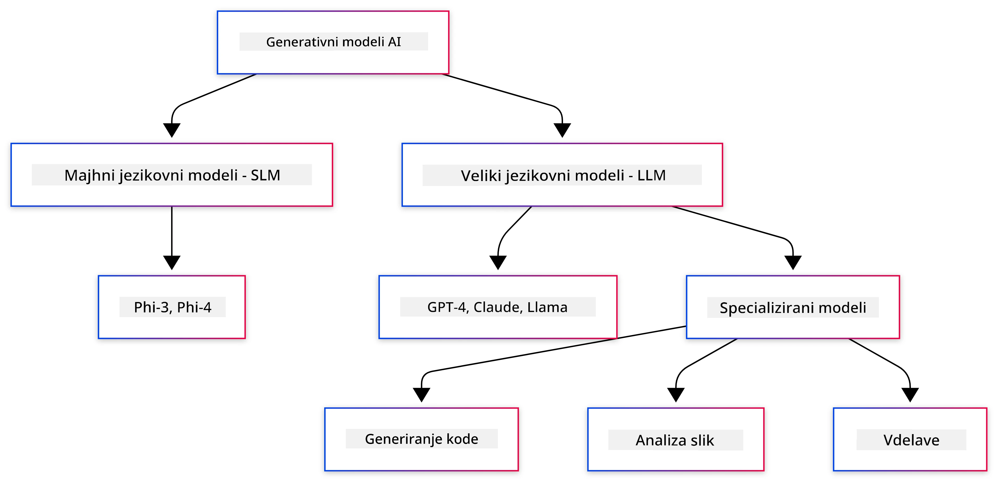
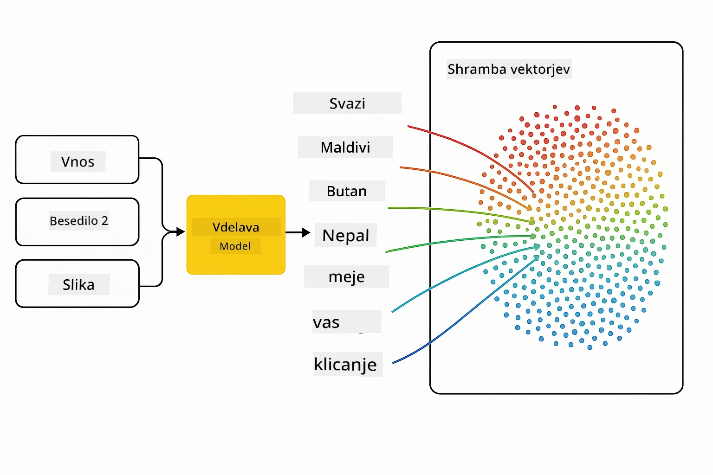
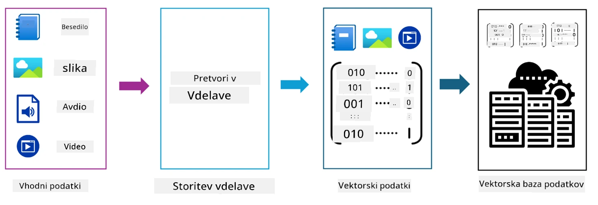
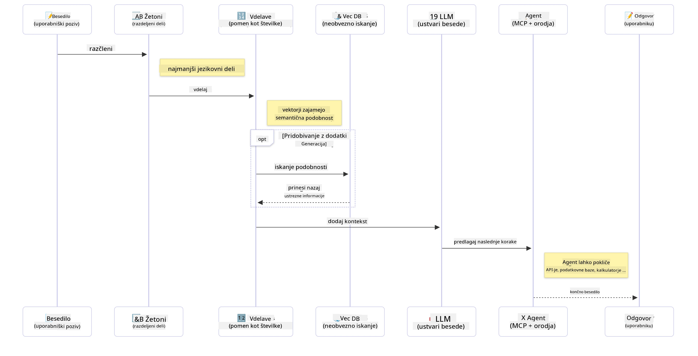

# Uvod v Generativno AI - Java izdaja

> **Video**: [Oglejte si video pregled za to lekcijo na YouTubu.](https://www.youtube.com/watch?v=XH46tGp_eSw) Lahko tudi kliknete na sliko sličice zgoraj.

## Kaj se boste naučili

- **Osnove generativne AI**, vključno z LLM-ji, inženiringom pozivov, tokeni, embeddingi in vektorskimi bazami podatkov
- **Primerjava orodij za razvoj AI v Javi**, vključno z Azure OpenAI SDK, Spring AI in OpenAI Java SDK
- **Odkrijte Model Context Protocol** in njegovo vlogo pri komunikaciji AI agentov

## Kazalo

- [Uvod](#uvod)
- [Hitri pregled konceptov generativne AI](#hitri-pregled-konceptov-generativne-ai)
- [Pregled inženiringa pozivov](#pregled-inženiringa-pozivov)
- [Tokeni, embeddingi in agenti](#tokeni-embeddingi-in-agenti)
- [Orodja in knjižnice za AI razvoj v Javi](#orodja-in-knjižnice-za-ai-razvoj-v-javi)
  - [OpenAI Java SDK](#openai-java-sdk)
  - [Spring AI](#spring-ai)
  - [Azure OpenAI Java SDK](#azure-openai-java-sdk)
- [Povzetek](#povzetek)
- [Naslednji koraki](#naslednji-koraki)

## Uvod

Dobrodošli v prvem poglavju Generativne AI za začetnike - Java izdaja! Ta temeljna lekcija vas uvaja v osnovne pojme generativne AI in kako z njimi delati z uporabo Jave. Naučili se boste osnovnih gradnikov AI aplikacij, vključno z velikimi jezikovnimi modeli (LLM), tokeni, embeddingi in AI agenti. Raziskali bomo tudi glavna orodja za Javo, ki jih boste uporabljali skozi celoten tečaj.

### Hitri pregled konceptov generativne AI

Generativna AI je vrsta umetne inteligence, ki ustvarja novo vsebino, kot so besedila, slike ali koda, na podlagi vzorcev in odnosov, pridobljenih iz podatkov. Generativni AI modeli lahko ustvarijo odzive, podobne človekovim, razumejo kontekst in včasih celo ustvarijo vsebino, ki deluje človeško.

Pri razvoju vaših Java AI aplikacij boste delali z **generativnimi AI modeli**, da ustvarite vsebino. Nekatere zmožnosti generativnih AI modelov vključujejo:

- **Generiranje besedila**: Oblikovanje besedila, podobnega človeškemu, za klepetalnice, vsebino in dokončanje besedila.
- **Generiranje in analiza slik**: Izdelava realističnih slik, izboljšava fotografij in zaznavanje predmetov.
- **Generiranje kode**: Pisanje izrezkov kode ali skript.

Obstajajo specifične vrste modelov, ki so optimizirane za različne naloge. Na primer, tako **majhni jezikovni modeli (SLM)** kot tudi **veliki jezikovni modeli (LLM)** lahko obvladujejo generiranje besedila, pri čemer LLM običajno ponujajo boljšo zmogljivost za kompleksne naloge. Za naloge, povezane s slikami, bi uporabili specializirane vidne modele ali multimodalne modele.

Seveda odzivi teh modelov niso vedno popolni. Verjetno ste že slišali, da modeli "halucinirajo" ali ustvarjajo napačne informacije na avtoritativen način. Vendar pa lahko pomagate usmerjati model k boljšim odgovorom z jasnimi navodili in kontekstom. Tukaj pride v poštev **inženiring pozivov**.

#### Pregled inženiringa pozivov

Inženiring pozivov je praksa oblikovanja učinkovitih vnosov, ki usmerjajo AI modele k želenim izhodom. Vključuje:

- **Jasnost**: Naredite navodila jasna in nedvoumna.
- **Kontekst**: Zagotovite potrebne ozadjske informacije.
- **Omejitve**: Določite morebitne omejitve ali formate.

Nekatere najboljše prakse za inženiring pozivov vključujejo oblikovanje pozivov, jasna navodila, razčlenitev naloge, učenje z enim primerom in nekaj primeri ter prilagajanje pozivov. Preizkušanje različnih pozivov je bistveno za ugotavljanje, kaj najbolje deluje za vaš primer uporabe.

Pri razvoju aplikacij boste delali z različnimi vrstami pozivov:
- **Sistemski pozivi**: Nastavijo osnovna pravila in kontekst za vedenje modela
- **Uporabniški pozivi**: Vhodni podatki od uporabnikov vaše aplikacije
- **Asistentski pozivi**: Odzivi modela na podlagi sistemskih in uporabniških pozivov

> **Več informacij**: Več o inženiringu pozivov si lahko preberete v [poglavju Inženiring pozivov v tečaju Generativna AI za začetnike](https://github.com/microsoft/generative-ai-for-beginners/tree/main/04-prompt-engineering-fundamentals)

#### Tokeni, embeddingi in agenti

Pri delu z generativnimi AI modeli boste naleteli na izraze, kot so **tokeni**, **embeddingi**, **agenti** in **Model Context Protocol (MCP)**. Tukaj je podroben pregled teh konceptov:

- **Tokeni**: Tokeni so najmanjša enota besedila v modelu. Lahko so besede, znaki ali podbesede. Tokeni se uporabljajo za predstavitev besedilnih podatkov v formatu, ki ga model razume. Na primer, stavek "The quick brown fox jumped over the lazy dog" bi bil lahko tokeniziran kot ["The", " quick", " brown", " fox", " jumped", " over", " the", " lazy", " dog"] ali ["The", " qu", "ick", " br", "own", " fox", " jump", "ed", " over", " the", " la", "zy", " dog"] odvisno od strategije tokenizacije.

Tokenizacija je proces razbijanja besedila na te manjše enote. To je ključno, ker modeli delujejo na tokenih in ne na surovem besedilu. Število tokenov v pozivu vpliva na dolžino in kakovost odgovora modela, saj imajo modeli omejitve števila tokenov v svojem kontekstnem oknu (npr. 128K tokenov za celoten kontekst GPT-4o, vključujoč vhod in izhod).

  V Javi lahko za tokenizacijo samodejno uporabljate knjižnice, kot je OpenAI SDK, ko pošiljate zahteve AI modelom.

- **Embeddingi**: Embeddingi so vektorske predstavitve tokenov, ki zajamejo semantični pomen. Gre za numerične predstavitve (običajno polja decimalnih števil), ki modelom omogočajo razumevanje odnosov med besedami in ustvarjanje kontekstualno ustreznih odgovorov. Podobne besede imajo podobne embeddinge, kar omogoča modelu razumevanje konceptov, kot so sopomenke in semantični odnosi.

  V Javi lahko embeddinge ustvarjate z uporabo OpenAI SDK ali drugih knjižnic, ki podpirajo ustvarjanje embeddingov. Ti embeddingi so ključni za naloge, kot je semantično iskanje, kjer želite najti podobno vsebino glede na pomen in ne točno besedilo.

- **Vektorske baze podatkov**: Vektorske baze podatkov so specializirani skladiščni sistemi, optimizirani za embeddinge. Omogočajo učinkovito iskanje podobnosti in so ključne za vzorce Retrieval-Augmented Generation (RAG), kjer morate najti relevantne informacije iz velikih zbirk podatkov na podlagi semantične podobnosti, ne točnih ujemanj.

> **Opomba**: V tem tečaju ne bomo pokrivali vektorskih baz podatkov, a vredni so omeniti, ker se pogosto uporabljajo v resničnih aplikacijah.

- **Agenti & MCP**: AI komponenti, ki avtonomno sodelujeta z modeli, orodji in zunanjimi sistemi. Model Context Protocol (MCP) zagotavlja standardiziran način za agente, da varno dostopajo do zunanjih virov podatkov in orodij. Več izveste v našem [tečaju MCP za začetnike](https://github.com/microsoft/mcp-for-beginners).

V Java AI aplikacijah boste uporabljali tokene za obdelavo besedila, embeddinge za semantično iskanje in RAG, vektorske baze podatkov za pridobivanje podatkov in agente z MCP za gradnjo inteligentnih sistemov, ki uporabljajo orodja.

### Orodja in knjižnice za AI razvoj v Javi

Java nudi odlična orodja za razvoj AI. Obstajajo tri glavne knjižnice, ki jih bomo raziskovali skozi ta tečaj - OpenAI Java SDK, Azure OpenAI SDK in Spring AI.

Tukaj je hitra referenčna tabela, ki prikazuje, kateri SDK se uporablja v primerih iz posameznih poglavij:

| Poglavje | Primer | SDK |
|---------|--------|-----|
| 02-SetupDevEnvironment | github-models | OpenAI Java SDK |
| 02-SetupDevEnvironment | basic-chat-azure | Spring AI Azure OpenAI |
| 03-CoreGenerativeAITechniques | examples | Azure OpenAI SDK |
| 04-PracticalSamples | petstory | OpenAI Java SDK |
| 04-PracticalSamples | foundrylocal | OpenAI Java SDK |
| 04-PracticalSamples | calculator | Spring AI MCP SDK + LangChain4j |

**Povezave do dokumentacije SDK-jev:**
- [Azure OpenAI Java SDK](https://github.com/Azure/azure-sdk-for-java/tree/azure-ai-openai_1.0.0-beta.16/sdk/openai/azure-ai-openai)
- [Spring AI](https://docs.spring.io/spring-ai/reference/)
- [OpenAI Java SDK](https://github.com/openai/openai-java)
- [LangChain4j](https://docs.langchain4j.dev/)

#### OpenAI Java SDK

OpenAI SDK je uradna Java knjižnica za OpenAI API. Ponuja preprost in enoten vmesnik za interakcijo z OpenAI modeli, kar omogoča enostavno integracijo AI zmogljivosti v Java aplikacije. V poglavju 2 je primer GitHub Models, v poglavju 4 pa aplikacija Pet Story in primer Foundry Local, ki prikazujejo pristop OpenAI SDK.

#### Spring AI

Spring AI je obsežen okvir, ki prinaša AI zmogljivosti v Spring aplikacije, zagotavlja enotno abstrakcijsko plast preko različnih AI ponudnikov. Se brezhibno integrira s Spring ekosistemom, zaradi česar je idealna izbira za poslovne Java aplikacije, ki potrebujejo AI zmogljivosti.

Moč Spring AI je v njegovi gladki integraciji v Spring ekosistem, kar omogoča enostavno gradnjo produkcijsko pripravljenih AI aplikacij z znanimi Spring vzorci, kot so odvisnostna injekcija, upravljanje konfiguracije in testiranje. Spring AI boste uporabljali v poglavjih 2 in 4 za gradnjo aplikacij, ki izkoriščajo tako OpenAI kot Model Context Protocol (MCP) Spring AI knjižnice.

##### Model Context Protocol (MCP)

[Model Context Protocol (MCP)](https://modelcontextprotocol.io/) je nastajajoči standard, ki omogoča AI aplikacijam varno interakcijo z zunanjimi viri podatkov in orodji. MCP zagotavlja standardiziran način, da AI modeli dostopajo do kontekstualnih informacij in izvajajo akcije v vaših aplikacijah.

V poglavju 4 boste zgradili preprosto MCP storitev kalkulatorja, ki prikazuje osnove Model Context Protocol s Spring AI, in prikazuje, kako ustvariti osnovne integracije orodij in arhitekture storitev.

#### Azure OpenAI Java SDK

Azure OpenAI klientska knjižnica za Javo je prilagoditev OpenAI REST API-jev, ki zagotavlja idiomatičen vmesnik in integracijo z ostalim Azure SDK ekosistemom. V poglavju 3 boste gradili aplikacije z uporabo Azure OpenAI SDK, vključno s klepetalnimi aplikacijami, klicanjem funkcij in vzorci RAG (Retrieval-Augmented Generation).

> Opomba: Azure OpenAI SDK zaostaja za OpenAI Java SDK glede funkcionalnosti, zato za prihodnje projekte razmislite o uporabi OpenAI Java SDK.

## Povzetek

To je vse o temeljih! Zdaj razumete:

- Osnovne koncepte, ki stojijo za generativno AI - od LLM in inženiringa pozivov do tokenov, embeddingov in vektorskih baz podatkov
- Možnosti vašega orodnega kompleta za razvoj Java AI: Azure OpenAI SDK, Spring AI in OpenAI Java SDK
- Kaj je Model Context Protocol in kako omogoča AI agentom delo z zunanjimi orodji

## Naslednji koraki

[Poglavje 2: Nastavitev razvojnega okolja](../02-SetupDevEnvironment/README.md)

---

<!-- CO-OP TRANSLATOR DISCLAIMER START -->
**Omejitev odgovornosti**:
Ta dokument je bil preveden z uporabo AI prevajalske storitve [Co-op Translator](https://github.com/Azure/co-op-translator). Čeprav si prizadevamo za natančnost, prosimo, upoštevajte, da avtomatizirani prevodi lahko vsebujejo napake ali netočnosti. Izvirni dokument v njegovem izvirnem jeziku velja za avtoritativni vir. Za ključne informacije priporočamo strokovni človeški prevod. Nismo odgovorni za kakršne koli nesporazume ali napačne interpretacije, ki izhajajo iz uporabe tega prevoda.
<!-- CO-OP TRANSLATOR DISCLAIMER END -->