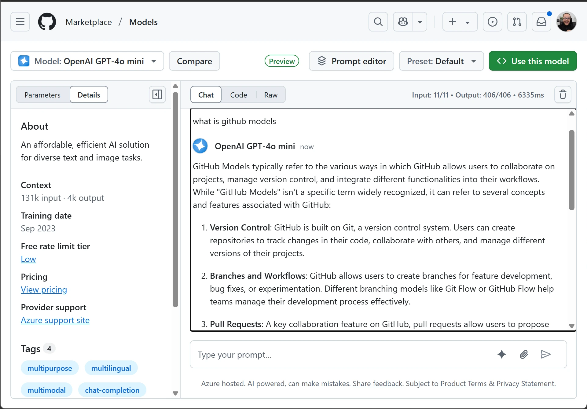
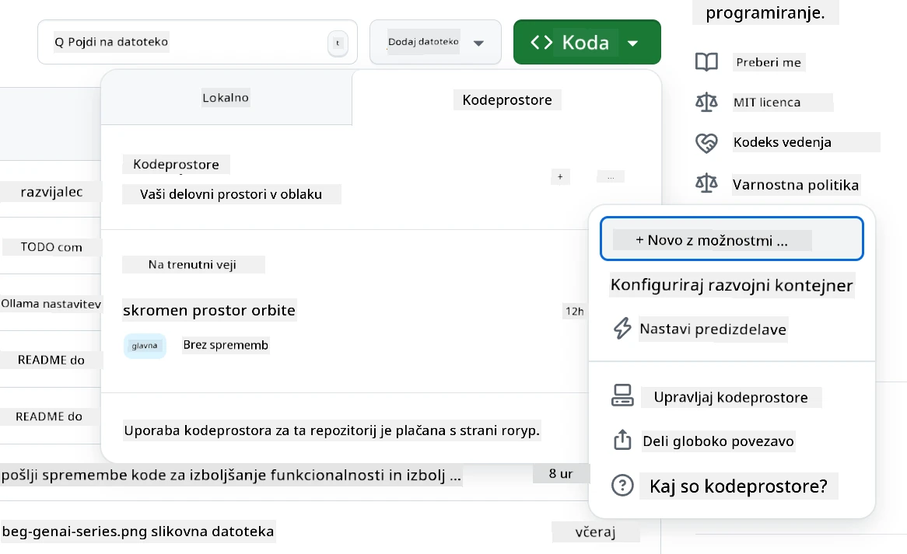
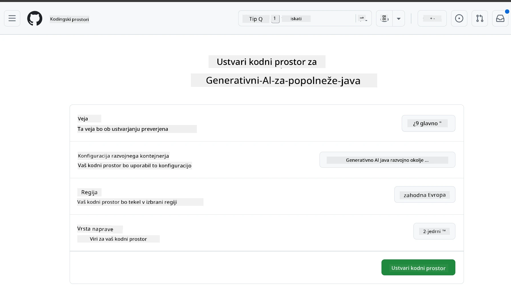
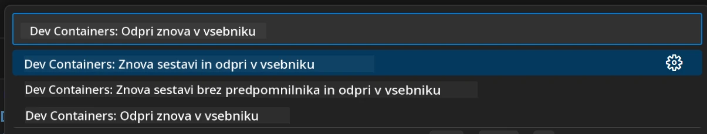
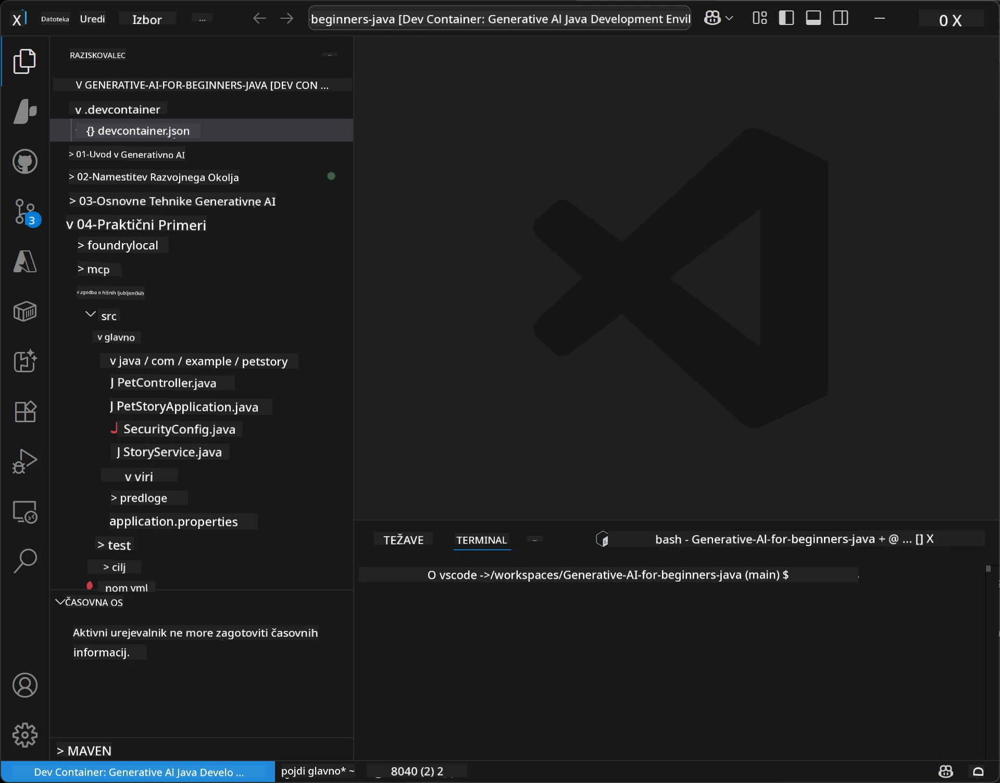
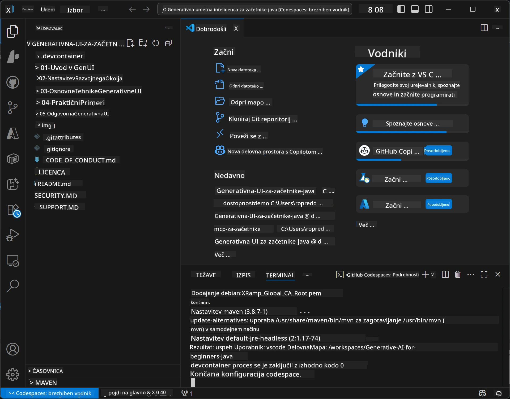

# Nastavitev razvojnega okolja za Generativno umetno inteligenco za Javo

> **Hiter začetek**: Kodirajte v oblaku v 2 minutah - Pojdite na [Nastavitev GitHub Codespaces](../../../02-SetupDevEnvironment) - ni potrebno lokalno nameščanje in uporablja github modele!

> **Vas zanima Azure OpenAI?**, oglejte si naš [Vodnik za nastavitev Azure OpenAI](getting-started-azure-openai.md) z navodili za ustvarjanje nove Azure OpenAI storitve.

## Kaj boste izvedeli

- Nastavitev razvojnega okolja za AI aplikacije v Javi
- Izbira in konfiguracija vašega priljubljenega razvojnega okolja (oblak z Codespaces, lokalni razvojni kontejner ali popolna lokalna nastavitev)
- Testiranje nastavitve z povezavo do GitHub modelov

## Kazalo

- [Kaj boste izvedeli](../../../02-SetupDevEnvironment)
- [Uvod](../../../02-SetupDevEnvironment)
- [Korak 1: Nastavite razvojno okolje](../../../02-SetupDevEnvironment)
  - [Možnost A: GitHub Codespaces (priporočeno)](../../../02-SetupDevEnvironment)
  - [Možnost B: Lokalni razvojni kontejner](../../../02-SetupDevEnvironment)
  - [Možnost C: Uporabite obstoječo lokalno namestitev](../../../02-SetupDevEnvironment)
- [Korak 2: Ustvarite osebni dostopni žeton GitHub](../../../02-SetupDevEnvironment)
- [Korak 3: Testirajte svojo nastavitev](../../../02-SetupDevEnvironment)
- [Reševanje težav](../../../02-SetupDevEnvironment)
- [Povzetek](../../../02-SetupDevEnvironment)
- [Nadaljnji koraki](../../../02-SetupDevEnvironment)

## Uvod

Ta poglavje vas bo vodilo pri nastavitvi razvojnega okolja. Za naš glavni primer bomo uporabili **GitHub Models**, saj je brezplačen, enostaven za nastavitev z le GitHub računom, ne zahteva kreditne kartice in omogoča dostop do več modelov za eksperimentiranje.

**Ni potrebna lokalna namestitev!** Takoj lahko začnete kodirati z uporabo GitHub Codespaces, ki zagotavlja popolno razvojno okolje v vašem brskalniku.



Priporočamo uporabo [**GitHub Models**](https://github.com/marketplace?type=models) za ta tečaj, ker je:
- **Brezplačen** za začetek
- **Enostaven** za nastavitev z le GitHub računom
- **Ni potrebna kreditna kartica**
- Na voljo je **več modelov** za eksperimentiranje

> **Opomba**: GitHub Models uporabljeni v tem usposabljanju imajo te brezplačne omejitve:
> - 15 zahtevkov na minuto (150 na dan)
> - približno 8.000 besed vhodnih, približno 4.000 besed izhodnih na zahtevek
> - 5 sočasnih zahtevkov
> 
> Za produkcijsko uporabo nadgradite na Azure AI Foundry Models z vašim Azure računom. Vaša koda ni potreben spreminjati. Oglejte si [dokumentacijo Azure AI Foundry](https://learn.microsoft.com/azure/ai-foundry/foundry-models/how-to/quickstart-github-models).


## Korak 1: Nastavite razvojno okolje

<a name="quick-start-cloud"></a>

Ustvarili smo prednastavljen razvojni kontejner, da skrajšamo čas nastavitve in zagotovimo, da imate vse potrebne programe za ta tečaj Generativne AI za Javo. Izberite svoj priljubljeni način razvoja:

### Možnosti nastavitev okolja:

#### Možnost A: GitHub Codespaces (priporočeno)

**Začnite kodirati v 2 minutah - ni potrebna lokalna namestitev!**

1. Forkajte to repozitorij na svoj GitHub račun
   > **Opomba**: Če želite spremeniti osnovno konfiguracijo, si oglejte [Dev Container Configuration](../../../.devcontainer/devcontainer.json)
2. Kliknite **Code** → zavihek **Codespaces** → **...** → **Novo z možnostmi...**
3. Uporabite privzete nastavitve – izbrana bo **Dev container konfiguracija**: **Generative AI Java Development Environment** po meri ustvarjen za ta tečaj
4. Kliknite **Ustvari codespace**
5. Počakajte približno 2 minuti, da je okolje pripravljeno
6. Nadaljujte na [Korak 2: Ustvarite GitHub žeton](../../../02-SetupDevEnvironment)







> **Prednosti Codespaces:**
> - Ni potrebna lokalna namestitev
> - Deluje na kateri koli napravi z brskalnikom
> - Prednastavljeno z vsemi orodji in odvisnostmi
> - Brezplačno 60 ur na mesec za osebne račune
> - Konsistentno okolje za vse udeležence

#### Možnost B: Lokalni razvojni kontejner

**Za razvijalce, ki imajo raje lokalni razvoj z Dockerjem**

1. Forkajte in klonirajte ta repozitorij na svoj lokalni računalnik
   > **Opomba**: Če želite spremeniti osnovno konfiguracijo, si oglejte [Dev Container Configuration](../../../.devcontainer/devcontainer.json)
2. Namestite [Docker Desktop](https://www.docker.com/products/docker-desktop/) in [VS Code](https://code.visualstudio.com/)
3. Namestite [razširitev Dev Containers](https://marketplace.visualstudio.com/items?itemName=ms-vscode-remote.remote-containers) v VS Code
4. Odprite mapo repozitorija v VS Code
5. Ko ste pozvani, kliknite **Ponovno odpri v kontejnerju** (ali uporabite `Ctrl+Shift+P` → "Dev Containers: Reopen in Container")
6. Počakajte, da se kontejner zgradi in zažene
7. Nadaljujte na [Korak 2: Ustvarite GitHub žeton](../../../02-SetupDevEnvironment)





#### Možnost C: Uporabite obstoječo lokalno namestitev

**Za razvijalce z obstoječimi Java okolji**

Pogoji:
- [Java 21+](https://www.oracle.com/java/technologies/javase/jdk21-archive-downloads.html)
- [Maven 3.9+](https://maven.apache.org/download.cgi)
- [VS Code](https://code.visualstudio.com) ali vaš priljubljeni IDE

Koraki:
1. Klonirajte ta repozitorij na svoj lokalni računalnik
2. Odprite projekt v vašem IDE-ju
3. Nadaljujte na [Korak 2: Ustvarite GitHub žeton](../../../02-SetupDevEnvironment)

> **Pameten nasvet**: Če imate računalnik z nizko zmogljivostjo, a želite lokalni VS Code, uporabite GitHub Codespaces! Vaš lokalni VS Code lahko povežete na oblak gostujoči Codespace za najboljše iz obeh svetov.




## Korak 2: Ustvarite osebni dostopni žeton GitHub

1. Pojdite na [GitHub Nastavitve](https://github.com/settings/profile) in izberite **Settings** v meniju vašega profila.
2. V levem stranskem meniju kliknite **Developer settings** (običajno na dnu).
3. Pod **Personal access tokens**, kliknite **Fine-grained tokens** (ali sledite tej neposredni [povezavi](https://github.com/settings/personal-access-tokens)).
4. Kliknite **Generate new token**.
5. Pod "Token name" vnesite opisno ime (npr. `GenAI-Java-Course-Token`).
6. Nastavite datum poteka (priporočeno: 7 dni za varnostne prakse).
7. Pod "Resource owner" izberite svoj uporabniški račun.
8. Pod "Repository access" izberite repozitorije, ki jih želite uporabljati z GitHub modeli (ali "All repositories", če je potrebno).
9. Pod "Account permissions" poiščite **Models** in nastavite na **Samo za branje**.
10. Kliknite **Generate token**.
11. **Kopirajte in shranite svoj žeton zdaj** – ne boste ga več videli!

> **Varnostni nasvet**: Uporabite najmanjšo potrebno obseg in najkrajši praktični čas poteka za vaše žetone dostopa.

## Korak 3: Testirajte svojo nastavitev z GitHub Models primerom

Ko je razvojno okolje pripravljeno, preizkusimo integracijo GitHub Modelov z našo primer aplikacijo v [`02-SetupDevEnvironment/examples/github-models`](../../../02-SetupDevEnvironment/examples/github-models).

1. Odprite terminal v vašem razvojnem okolju.
2. Pojdite do GitHub Models primera:
   ```bash
   cd 02-SetupDevEnvironment/examples/github-models
   ```
3. Nastavite svoj GitHub žeton kot okoljsko spremenljivko:
   ```bash
   # macOS/Linux
   export GITHUB_TOKEN=your_token_here
   
   # Windows (Ukazni poziv)
   set GITHUB_TOKEN=your_token_here
   
   # Windows (PowerShell)
   $env:GITHUB_TOKEN="your_token_here"
   ```

4. Zaženite aplikacijo:
   ```bash
   mvn compile exec:java -Dexec.mainClass="com.example.githubmodels.App"
   ```

Videli boste izhod, podoben temu:
```text
Using model: gpt-4.1-nano
Sending request to GitHub Models...
Response: Hello World!
```

### Razumevanje primerne kode

Najprej razumimo, kaj smo pravkar zagnali. Primer pod `examples/github-models` uporablja OpenAI Java SDK za povezavo z GitHub Models:

**Kaj ta koda počne:**
- **Poveže** se do GitHub Modelov z vašim osebnim dostopnim žetonom
- **Pošlje** preprosto sporočilo "Say Hello World!" AI modelu
- **Prejme** in prikaže odziv AI-ja
- **Preveri**, da vaša nastavitev deluje pravilno

**Ključna odvisnost** (v `pom.xml`):
```xml
<dependency>
    <groupId>com.openai</groupId>
    <artifactId>openai-java</artifactId>
    <version>2.12.0</version>
</dependency>
```

**Glavna koda** (`App.java`):
```java
// Povežite se z GitHub Modeli s pomočjo OpenAI Java SDK
OpenAIClient client = OpenAIOkHttpClient.builder()
    .apiKey(pat)
    .baseUrl("https://models.inference.ai.azure.com")
    .build();

// Ustvarite zahtevek za dokončanje klepeta
ChatCompletionCreateParams params = ChatCompletionCreateParams.builder()
    .model(modelId)
    .addSystemMessage("You are a concise assistant.")
    .addUserMessage("Say Hello World!")
    .build();

// Pridobite AI odgovor
ChatCompletion response = client.chat().completions().create(params);
System.out.println("Response: " + response.choices().get(0).message().content().orElse("No response content"));
```

## Povzetek

Super! Zdaj imate vse pripravljeno:

- Ustvarjen osebni dostopni žeton GitHub z ustreznimi dovoljenji za dostop do AI modelov
- Tekne razvojno okolje Jave (ne glede na to, ali je to Codespaces, dev container ali lokalno)
- Povezali ste se z GitHub Models z uporabo OpenAI Java SDK za brezplačni AI razvoj
- Preizkusili ste, da vse deluje s preprostim primerom, ki komunicira z AI modeli

## Nadaljnji koraki

[Poglavje 3: Osnovne tehnike generativne umetne inteligence](../03-CoreGenerativeAITechniques/README.md)

## Reševanje težav

Imate težave? Tukaj so pogoste težave in rešitve:

- **Žeton ne deluje?** 
  - Prepričajte se, da ste kopirali celoten žeton brez dodatnih presledkov
  - Preverite, da je žeton pravilno nastavljen kot okoljska spremenljivka
  - Preverite, ali ima vaš žeton pravilna dovoljenja (Models: samo za branje)

- **Maven ni najden?** 
  - Če uporabljate dev containerje/Codespaces, bi moral biti Maven prednameščen
  - Za lokalno nastavitev zagotovite, da imate nameščen Java 21+ in Maven 3.9+
  - Poskusite `mvn --version` za preverjanje namestitve

- **Težave s povezavo?** 
  - Preverite internetno povezavo
  - Preverite, ali je GitHub dostopen iz vašega omrežja
  - Preverite, da niste za požarnim zidom, ki blokira GitHub Models endpoint

- **Dev container se ne zažene?** 
  - Prepričajte se, da je Docker Desktop zagnan (za lokalni razvoj)
  - Poskusite znova zgraditi kontejner: `Ctrl+Shift+P` → "Dev Containers: Rebuild Container"

- **Napake pri prevajanju aplikacije?**
  - Preverite, da ste v pravi mapi: `02-SetupDevEnvironment/examples/github-models`
  - Poskusite počistiti in ponovno zgraditi: `mvn clean compile`

> **Potrebujete pomoč?**: Če imate še vedno težave, odprite zadevo v repozitoriju in pomagali vam bomo.

---

<!-- CO-OP TRANSLATOR DISCLAIMER START -->
**Opozorilo**:
Ta dokument je bil preveden z uporabo AI prevajalske storitve [Co-op Translator](https://github.com/Azure/co-op-translator). Čeprav si prizadevamo za natančnost, bodite pozorni, da avtomatizirani prevodi lahko vsebujejo napake ali netočnosti. Izvirni dokument v njegovem izvornega jeziku velja za zavezujoč vir. Za ključne informacije priporočamo profesionalni človeški prevod. Nismo odgovorni za morebitne nesporazume ali napačne interpretacije, ki izhajajo iz uporabe tega prevoda.
<!-- CO-OP TRANSLATOR DISCLAIMER END -->