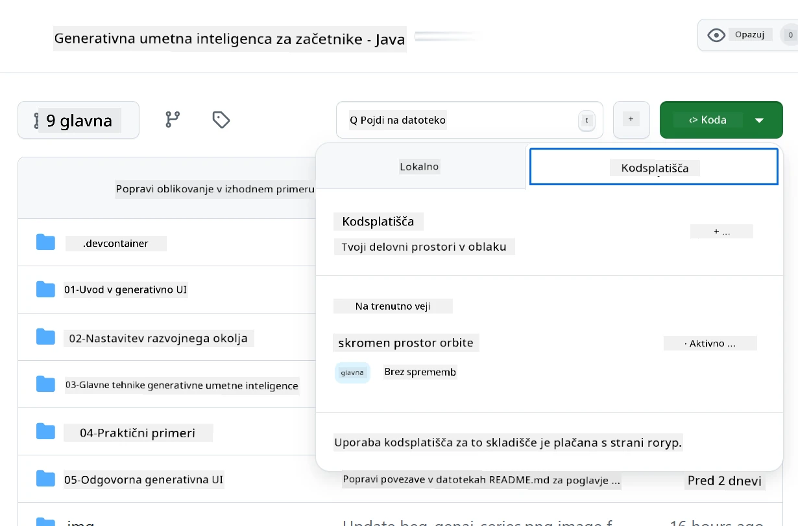

<!--
CO_OP_TRANSLATOR_METADATA:
{
  "original_hash": "bfdb4b4eadbee3a59ef742439f58326a",
  "translation_date": "2025-07-27T13:29:49+00:00",
  "source_file": "02-SetupDevEnvironment/getting-started-azure-openai.md",
  "language_code": "sl"
}
-->
# Nastavitev razvojnega okolja za Azure OpenAI

> **Hitri začetek**: Ta vodič je namenjen nastavitvi Azure OpenAI. Za takojšnji začetek z brezplačnimi modeli uporabite [GitHub Models with Codespaces](./README.md#quick-start-cloud).

Ta vodič vam bo pomagal nastaviti modele Azure AI Foundry za vaše Java AI aplikacije v tem tečaju.

## Kazalo vsebine

- [Pregled hitre nastavitve](../../../02-SetupDevEnvironment)
- [Korak 1: Ustvarite vire Azure AI Foundry](../../../02-SetupDevEnvironment)
  - [Ustvarite Hub in projekt](../../../02-SetupDevEnvironment)
  - [Namestite model GPT-4o-mini](../../../02-SetupDevEnvironment)
- [Korak 2: Ustvarite svoj Codespace](../../../02-SetupDevEnvironment)
- [Korak 3: Konfigurirajte svoje okolje](../../../02-SetupDevEnvironment)
- [Korak 4: Preizkusite svojo nastavitev](../../../02-SetupDevEnvironment)
- [Kaj sledi?](../../../02-SetupDevEnvironment)
- [Viri](../../../02-SetupDevEnvironment)
- [Dodatni viri](../../../02-SetupDevEnvironment)

## Pregled hitre nastavitve

1. Ustvarite vire Azure AI Foundry (Hub, projekt, model)
2. Ustvarite Codespace z Java razvojnim okoljem
3. Konfigurirajte svojo `.env` datoteko z Azure OpenAI poverilnicami
4. Preizkusite svojo nastavitev z vzorčnim projektom

## Korak 1: Ustvarite vire Azure AI Foundry

### Ustvarite Hub in projekt

1. Obiščite [Azure AI Foundry Portal](https://ai.azure.com/) in se prijavite
2. Kliknite **+ Create** → **New hub** (ali pojdite na **Management** → **All hubs** → **+ New hub**)
3. Konfigurirajte svoj hub:
   - **Ime huba**: npr. "MyAIHub"
   - **Naročnina**: Izberite svojo Azure naročnino
   - **Skupina virov**: Ustvarite novo ali izberite obstoječo
   - **Lokacija**: Izberite najbližjo lokacijo
   - **Shranjevalni račun**: Uporabite privzeto ali konfigurirajte po meri
   - **Key vault**: Uporabite privzeto ali konfigurirajte po meri
   - Kliknite **Next** → **Review + create** → **Create**
4. Ko je hub ustvarjen, kliknite **+ New project** (ali **Create project** iz pregleda huba)
   - **Ime projekta**: npr. "GenAIJava"
   - Kliknite **Create**

### Namestite model GPT-4o-mini

1. V svojem projektu pojdite na **Model catalog** in poiščite **gpt-4o-mini**
   - *Alternativa: Pojdite na **Deployments** → **+ Create deployment***
2. Kliknite **Deploy** na kartici modela gpt-4o-mini
3. Konfigurirajte namestitev:
   - **Ime namestitve**: "gpt-4o-mini"
   - **Različica modela**: Uporabite najnovejšo
   - **Vrsta namestitve**: Standard
4. Kliknite **Deploy**
5. Ko je model nameščen, pojdite na zavihek **Deployments** in kopirajte te vrednosti:
   - **Ime namestitve** (npr. "gpt-4o-mini")
   - **Ciljni URI** (npr. `https://your-hub-name.openai.azure.com/`) 
      > **Pomembno**: Kopirajte samo osnovni URL (npr. `https://myhub.openai.azure.com/`) in ne celotne poti do končne točke.
   - **Ključ** (iz razdelka Keys and Endpoint)

> **Imate težave?** Obiščite uradno [Azure AI Foundry Dokumentacijo](https://learn.microsoft.com/azure/ai-foundry/how-to/create-projects?tabs=ai-foundry&pivots=hub-project)

## Korak 2: Ustvarite svoj Codespace

1. Forkajte to repozitorij v svoj GitHub račun
   > **Opomba**: Če želite urediti osnovno konfiguracijo, si oglejte [Dev Container Configuration](../../../.devcontainer/devcontainer.json)
2. V svojem fork-anem repozitoriju kliknite **Code** → zavihek **Codespaces**
3. Kliknite **...** → **New with options...**

4. Izberite **Dev container configuration**: 
   - **Generative AI Java Development Environment**
5. Kliknite **Create codespace**

## Korak 3: Konfigurirajte svoje okolje

Ko je vaš Codespace pripravljen, nastavite svoje Azure OpenAI poverilnice:

1. **Pomaknite se do vzorčnega projekta iz korenskega repozitorija:**
   ```bash
   cd 02-SetupDevEnvironment/examples/basic-chat-azure
   ```

2. **Ustvarite svojo `.env` datoteko:**
   ```bash
   cp .env.example .env
   ```

3. **Uredite `.env` datoteko z vašimi Azure OpenAI poverilnicami:**
   ```bash
   # Your Azure OpenAI API key (from Azure AI Foundry portal)
   AZURE_AI_KEY=your-actual-api-key-here
   
   # Your Azure OpenAI endpoint URL (e.g., https://myhub.openai.azure.com/)
   AZURE_AI_ENDPOINT=https://your-hub-name.openai.azure.com/
   ```

   > **Varnostna opomba**: 
   > - Nikoli ne vključujte svoje `.env` datoteke v verzijsko kontrolo
   > - `.env` datoteka je že vključena v `.gitignore`
   > - Svoje API ključe hranite varno in jih redno rotirajte

## Korak 4: Preizkusite svojo nastavitev

Zaženite vzorčno aplikacijo, da preizkusite svojo povezavo z Azure OpenAI:

```bash
mvn clean spring-boot:run
```

Videti bi morali odgovor modela GPT-4o-mini!

> **Uporabniki VS Code**: Lahko pritisnete tudi `F5` v VS Code za zagon aplikacije. Konfiguracija zagona je že nastavljena za samodejno nalaganje vaše `.env` datoteke.

> **Celoten primer**: Oglejte si [End-to-End Azure OpenAI Example](./examples/basic-chat-azure/README.md) za podrobna navodila in odpravljanje težav.

## Kaj sledi?

**Nastavitev je zaključena!** Zdaj imate:
- Azure OpenAI z nameščenim gpt-4o-mini
- Lokalno konfiguracijo `.env` datoteke
- Pripravljeno Java razvojno okolje

**Nadaljujte na** [Poglavje 3: Osnovne tehnike generativne umetne inteligence](../03-CoreGenerativeAITechniques/README.md) za začetek gradnje AI aplikacij!

## Viri

- [Azure AI Foundry Dokumentacija](https://learn.microsoft.com/azure/ai-services/)
- [Spring AI Azure OpenAI Dokumentacija](https://docs.spring.io/spring-ai/reference/api/clients/azure-openai-chat.html)
- [Azure OpenAI Java SDK](https://learn.microsoft.com/java/api/overview/azure/ai-openai-readme)

## Dodatni viri

- [Prenesite VS Code](https://code.visualstudio.com/Download)
- [Prenesite Docker Desktop](https://www.docker.com/products/docker-desktop)
- [Dev Container Configuration](../../../.devcontainer/devcontainer.json)

**Omejitev odgovornosti**:  
Ta dokument je bil preveden z uporabo storitve AI za prevajanje [Co-op Translator](https://github.com/Azure/co-op-translator). Čeprav si prizadevamo za natančnost, vas prosimo, da upoštevate, da lahko avtomatizirani prevodi vsebujejo napake ali netočnosti. Izvirni dokument v njegovem maternem jeziku je treba obravnavati kot avtoritativni vir. Za ključne informacije priporočamo profesionalni človeški prevod. Ne prevzemamo odgovornosti za morebitna nesporazumevanja ali napačne razlage, ki izhajajo iz uporabe tega prevoda.