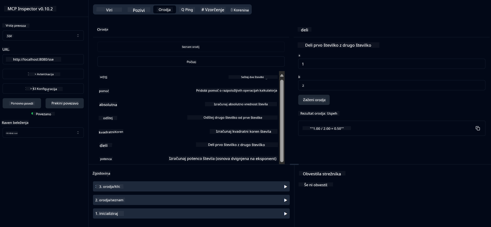

<!--
CO_OP_TRANSLATOR_METADATA:
{
  "original_hash": "7bf9a4a832911269a8bd0decb97ff36c",
  "translation_date": "2025-07-21T21:29:39+00:00",
  "source_file": "04-PracticalSamples/mcp/calculator/README.md",
  "language_code": "sl"
}
-->
# Osnovna storitev kalkulatorja MCP

>**Opomba**: To poglavje vključuje [**Vadnico**](./TUTORIAL.md), ki vas vodi skozi zagon končnih primerov.

Dobrodošli pri vašem prvem praktičnem delu z **Model Context Protocol (MCP)**! V prejšnjih poglavjih ste spoznali osnove generativne umetne inteligence in nastavili svoje razvojno okolje. Zdaj je čas, da zgradite nekaj praktičnega.

Ta storitev kalkulatorja prikazuje, kako lahko AI modeli varno komunicirajo z zunanjimi orodji prek MCP. Namesto da bi se zanašali na včasih nezanesljive matematične sposobnosti AI modela, vam bomo pokazali, kako zgraditi robusten sistem, kjer AI lahko kliče specializirane storitve za natančne izračune.

## Kazalo

- [Kaj se boste naučili](../../../../../04-PracticalSamples/mcp/calculator)
- [Predpogoji](../../../../../04-PracticalSamples/mcp/calculator)
- [Ključni koncepti](../../../../../04-PracticalSamples/mcp/calculator)
- [Hiter začetek](../../../../../04-PracticalSamples/mcp/calculator)
- [Razpoložljive operacije kalkulatorja](../../../../../04-PracticalSamples/mcp/calculator)
- [Testni odjemalci](../../../../../04-PracticalSamples/mcp/calculator)
  - [1. Neposredni MCP odjemalec (SDKClient)](../../../../../04-PracticalSamples/mcp/calculator)
  - [2. Odjemalec z umetno inteligenco (LangChain4jClient)](../../../../../04-PracticalSamples/mcp/calculator)
- [MCP Inspector (spletni vmesnik)](../../../../../04-PracticalSamples/mcp/calculator)
  - [Navodila po korakih](../../../../../04-PracticalSamples/mcp/calculator)

## Kaj se boste naučili

S tem primerom boste razumeli:
- Kako ustvariti storitve, združljive z MCP, z uporabo Spring Boot
- Razliko med neposredno komunikacijo prek protokola in interakcijo z umetno inteligenco
- Kako AI modeli odločajo, kdaj in kako uporabiti zunanja orodja
- Najboljše prakse za gradnjo aplikacij z umetno inteligenco, ki uporabljajo orodja

Popolno za začetnike, ki se učijo konceptov MCP in so pripravljeni zgraditi svojo prvo integracijo AI orodij!

## Predpogoji

- Java 21+
- Maven 3.6+
- **GitHub žeton**: Potreben za odjemalca z umetno inteligenco. Če tega še niste nastavili, si oglejte [Poglavje 2: Nastavitev razvojnega okolja](../../../02-SetupDevEnvironment/README.md) za navodila.

## Ključni koncepti

**Model Context Protocol (MCP)** je standardiziran način, kako AI aplikacije varno povezujejo z zunanjimi orodji. Predstavljajte si ga kot "most", ki omogoča AI modelom uporabo zunanjih storitev, kot je naš kalkulator. Namesto da bi AI model sam izvajal izračune (kar je lahko nezanesljivo), lahko pokliče našo storitev kalkulatorja za natančne rezultate. MCP zagotavlja, da ta komunikacija poteka varno in dosledno.

**Dogodki, poslani s strežnika (SSE)** omogočajo komunikacijo v realnem času med strežnikom in odjemalci. Za razliko od tradicionalnih HTTP zahtevkov, kjer pošljete zahtevo in čakate na odgovor, SSE omogoča strežniku, da neprekinjeno pošilja posodobitve odjemalcu. To je idealno za AI aplikacije, kjer se odgovori lahko pretakajo ali potrebujejo več časa za obdelavo.

**AI orodja in klic funkcij** omogočajo AI modelom, da samodejno izberejo in uporabijo zunanje funkcije (kot so operacije kalkulatorja) na podlagi uporabniških zahtev. Ko vprašate "Koliko je 15 + 27?", AI model razume, da želite seštevanje, samodejno pokliče našo funkcijo `add` s pravimi parametri (15, 27) in vrne rezultat v naravnem jeziku. AI deluje kot inteligentni koordinator, ki ve, kdaj in kako uporabiti vsako orodje.

## Hiter začetek

### 1. Pojdite v imenik aplikacije kalkulatorja
```bash
cd Generative-AI-for-beginners-java/04-PracticalSamples/mcp/calculator
```

### 2. Zgradite in zaženite
```bash
mvn clean install -DskipTests
java -jar target/calculator-server-0.0.1-SNAPSHOT.jar
```

### 3. Testirajte z odjemalci
- **SDKClient**: Neposredna interakcija prek MCP protokola
- **LangChain4jClient**: Interakcija v naravnem jeziku z umetno inteligenco (zahteva GitHub žeton)

## Razpoložljive operacije kalkulatorja

- `add(a, b)`, `subtract(a, b)`, `multiply(a, b)`, `divide(a, b)`
- `power(base, exponent)`, `squareRoot(number)`, `absolute(number)`
- `modulus(a, b)`, `help()`

## Testni odjemalci

### 1. Neposredni MCP odjemalec (SDKClient)
Testira surovo komunikacijo prek MCP protokola. Zaženite z:
```bash
mvn test-compile exec:java -Dexec.mainClass="com.microsoft.mcp.sample.client.SDKClient" -Dexec.classpathScope=test
```

### 2. Odjemalec z umetno inteligenco (LangChain4jClient)
Prikazuje interakcijo v naravnem jeziku z GitHub modeli. Zahteva GitHub žeton (glejte [Predpogoji](../../../../../04-PracticalSamples/mcp/calculator)).

**Zaženite:**
```bash
mvn test-compile exec:java -Dexec.mainClass="com.microsoft.mcp.sample.client.LangChain4jClient" -Dexec.classpathScope=test
```

## MCP Inspector (spletni vmesnik)

MCP Inspector ponuja vizualni spletni vmesnik za testiranje vaše MCP storitve brez pisanja kode. Popolno za začetnike, da razumejo, kako MCP deluje!

### Navodila po korakih:

1. **Zaženite strežnik kalkulatorja** (če še ni zagnan):
   ```bash
   java -jar target/calculator-server-0.0.1-SNAPSHOT.jar
   ```

2. **Namestite in zaženite MCP Inspector** v novem terminalu:
   ```bash
   npx @modelcontextprotocol/inspector
   ```

3. **Odprite spletni vmesnik**:
   - Poiščite sporočilo, kot je "Inspector running at http://localhost:6274"
   - Odprite ta URL v svojem spletnem brskalniku

4. **Povežite se s svojo storitvijo kalkulatorja**:
   - V spletnem vmesniku nastavite vrsto prenosa na "SSE"
   - Nastavite URL na: `http://localhost:8080/sse`
   - Kliknite gumb "Connect"

5. **Raziščite razpoložljiva orodja**:
   - Kliknite "List Tools", da si ogledate vse operacije kalkulatorja
   - Videli boste funkcije, kot so `add`, `subtract`, `multiply` itd.

6. **Testirajte operacijo kalkulatorja**:
   - Izberite orodje (npr. "add")
   - Vnesite parametre (npr. `a: 15`, `b: 27`)
   - Kliknite "Run Tool"
   - Oglejte si rezultat, ki ga vrne vaša MCP storitev!

Ta vizualni pristop vam pomaga razumeti, kako komunikacija MCP deluje, preden zgradite svoje odjemalce.



---
**Referenca:** [Dokumentacija MCP Server Boot Starter](https://docs.spring.io/spring-ai/reference/api/mcp/mcp-server-boot-starter-docs.html)

**Omejitev odgovornosti**:  
Ta dokument je bil preveden z uporabo storitve AI za prevajanje [Co-op Translator](https://github.com/Azure/co-op-translator). Čeprav si prizadevamo za natančnost, vas prosimo, da upoštevate, da lahko avtomatizirani prevodi vsebujejo napake ali netočnosti. Izvirni dokument v njegovem maternem jeziku je treba obravnavati kot avtoritativni vir. Za ključne informacije priporočamo profesionalni človeški prevod. Ne prevzemamo odgovornosti za morebitna nesporazumevanja ali napačne razlage, ki izhajajo iz uporabe tega prevoda.