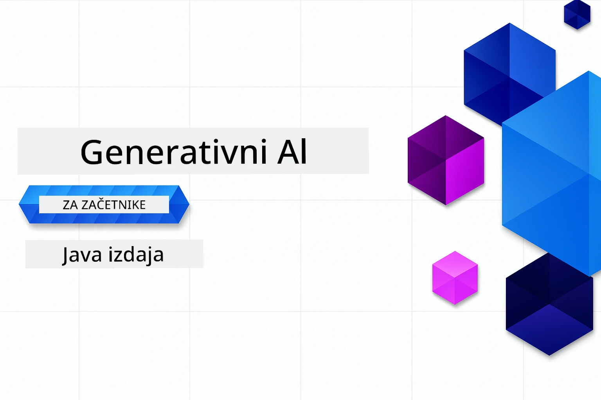

# Generativna umetna inteligenca za začetnike - Java izdaja
[](https://discord.gg/nTYy5BXMWG)



**Časovna zahteva**: Celoten delavnico lahko opravite na spletu brez lokalne namestitve. Nastavitev okolja traja 2 minuti, raziskovanje primerov pa 1–3 ure, odvisno od globine raziskovanja.

> **Hiter začetek**

1. Razvejajte to repozitorij na svoj GitHub račun
2. Kliknite **Code** → zavihek **Codespaces** → **...** → **New with options...**
3. Uporabite privzete nastavitve – izbralo bo razvojno okolje ustvarjeno za ta tečaj
4. Kliknite **Create codespace**
5. Počakajte približno 2 minuti, da bo okolje pripravljeno
6. Takoj skočite na [Prvi primer](./02-SetupDevEnvironment/README.md#step-2-create-a-github-personal-access-token)

> **Raje klonirate lokalno?**

> Ta repozitorij vsebuje več kot 50 prevodov jezikov, kar znatno poveča velikost prenosa. Za kloniranje brez prevodov uporabite sparse checkout:
> ```bash
> git clone --filter=blob:none --sparse https://github.com/microsoft/Generative-AI-for-beginners-java.git
> cd Generative-AI-for-beginners-java
> git sparse-checkout set --no-cone '/*' '!translations' '!translated_images'
> ```
> To vam zagotovi vse, kar potrebujete za dokončanje tečaja z veliko hitrejšim prenosom.


## Podpora več jezikov

### Podprto preko GitHub Action (avtomatizirano in vedno posodobljeno)

<!-- CO-OP TRANSLATOR LANGUAGES TABLE START -->
[Arabščina](../ar/README.md) | [Bengalščina](../bn/README.md) | [Bolgarščina](../bg/README.md) | [Burmanski (Myanmar)](../my/README.md) | [Kitajščina (poenostavljena)](../zh-CN/README.md) | [Kitajščina (tradicionalna, Hong Kong)](../zh-HK/README.md) | [Kitajščina (tradicionalna, Macao)](../zh-MO/README.md) | [Kitajščina (tradicionalna, Tajvan)](../zh-TW/README.md) | [Hrvaščina](../hr/README.md) | [Češčina](../cs/README.md) | [Danščina](../da/README.md) | [Nizozemščina](../nl/README.md) | [Estonščina](../et/README.md) | [Finščina](../fi/README.md) | [Francoščina](../fr/README.md) | [Nemščina](../de/README.md) | [Grščina](../el/README.md) | [Hebrejščina](../he/README.md) | [Hindijščina](../hi/README.md) | [Madžarščina](../hu/README.md) | [Indonezijščina](../id/README.md) | [Italijanščina](../it/README.md) | [Japonščina](../ja/README.md) | [Kannada](../kn/README.md) | [Korejščina](../ko/README.md) | [Litovščina](../lt/README.md) | [Malajščina](../ms/README.md) | [Malajalščina](../ml/README.md) | [Maratščina](../mr/README.md) | [Nepalščina](../ne/README.md) | [Nigerijski pidžin](../pcm/README.md) | [Norveščina](../no/README.md) | [Perzijščina (Farsi)](../fa/README.md) | [Poljščina](../pl/README.md) | [Portugalščina (Brazilija)](../pt-BR/README.md) | [Portugalščina (Portugalska)](../pt-PT/README.md) | [Punjabi (Gurmukhi)](../pa/README.md) | [Romunščina](../ro/README.md) | [Ruščina](../ru/README.md) | [Srbščina (cirilica)](../sr/README.md) | [Slovaščina](../sk/README.md) | [Slovenščina](./README.md) | [Španščina](../es/README.md) | [Svahili](../sw/README.md) | [Švedščina](../sv/README.md) | [Tagalog (Filipino)](../tl/README.md) | [Tamil](../ta/README.md) | [Telugu](../te/README.md) | [Tajščina](../th/README.md) | [Turščina](../tr/README.md) | [Ukrajinščina](../uk/README.md) | [Urdu](../ur/README.md) | [Vietnamščina](../vi/README.md)

> **Raje klonirate lokalno?**

> Ta repozitorij vsebuje več kot 50 prevodov jezikov, kar znatno poveča velikost prenosa. Za kloniranje brez prevodov uporabite sparse checkout:
> ```bash
> git clone --filter=blob:none --sparse https://github.com/microsoft/Generative-AI-for-beginners-java.git
> cd Generative-AI-for-beginners-java
> git sparse-checkout set --no-cone '/*' '!translations' '!translated_images'
> ```
> To vam zagotovi vse, kar potrebujete za dokončanje tečaja z veliko hitrejšim prenosom.
<!-- CO-OP TRANSLATOR LANGUAGES TABLE END -->

## Struktura tečaja in učna pot

### **Poglavje 1: Uvod v generativno umetno inteligenco**
- **Osnovni pojmi**: Razumevanje velikih jezikovnih modelov, tokenov, vdelav (embeddings) in zmogljivosti UI
- **Java AI ekosistem**: Pregled Spring AI in OpenAI SDK-jev
- **Protokol konteksta modela**: Uvod v MCP in njegova vloga pri komunikaciji UI agentov
- **Praktične uporabe**: Resnični primeri vključno s klepetalnimi roboti in generiranjem vsebin
- **[→ Začni poglavje 1](./01-IntroToGenAI/README.md)**

### **Poglavje 2: Nastavitev razvojnega okolja**
- **Konfiguracija za več ponudnikov**: Nastavitev GitHub modelov, Azure OpenAI in OpenAI Java SDK integracij
- **Spring Boot + Spring AI**: Najboljše prakse za razvoj UI aplikacij za podjetja
- **GitHub modeli**: Brezplačen dostop do UI modelov za prototipe in učenje (brez kreditne kartice)
- **Razvojna orodja**: Konfiguracija Docker vsebnikov, VS Code in GitHub Codespaces
- **[→ Začni poglavje 2](./02-SetupDevEnvironment/README.md)**

### **Poglavje 3: Osnovne tehnike generativne UI**
- **Inženiring pozivov**: Tehnike za optimalne odzive UI modelov
- **Vdelave in vektorske operacije**: Izvedba semantičnega iskanja in primerjave podobnosti
- **Generiranje, podprto z iskanjem (RAG)**: Kombiniranje UI z vašimi podatkovnimi viri
- **Klicanje funkcij**: Razširitev zmogljivosti UI s prilagojenimi orodji in vtičniki
- **[→ Začni poglavje 3](./03-CoreGenerativeAITechniques/README.md)**

### **Poglavje 4: Praktične aplikacije in projekti**
- **Generator zgodb o hišnih ljubljenčkih** (`petstory/`): Kreativno generiranje vsebin z GitHub modeli
- **Foundry lokalna predstavitev** (`foundrylocal/`): Lokalna integracija UI modelov z OpenAI Java SDK
- **MCP kalkulatorska storitev** (`calculator/`): Osnovna implementacija protokola konteksta modela s Spring AI
- **[→ Začni poglavje 4](./04-PracticalSamples/README.md)**

### **Poglavje 5: Odgovorni razvoj UI**
- **Varnost GitHub modelov**: Testiranje vgrajenih filtrov vsebin in varnostnih mehanizmov (trdi blokadi in mehki zavrnitvi)
- **Demo odgovorne UI**: Praktičen primer delovanja sodobnih sistemov varnosti UI
- **Najboljše prakse**: Ključna navodila za etični razvoj in uvajanje UI
- **[→ Začni poglavje 5](./05-ResponsibleGenAI/README.md)**

## Dodatni viri

<!-- CO-OP TRANSLATOR OTHER COURSES START -->
### LangChain
[](https://aka.ms/langchain4j-for-beginners)
[](https://aka.ms/langchainjs-for-beginners?WT.mc_id=m365-94501-dwahlin)

---

### Azure / Edge / MCP / Agenti
[](https://github.com/microsoft/AZD-for-beginners?WT.mc_id=academic-105485-koreyst)
[](https://github.com/microsoft/edgeai-for-beginners?WT.mc_id=academic-105485-koreyst)
[](https://github.com/microsoft/mcp-for-beginners?WT.mc_id=academic-105485-koreyst)
[](https://github.com/microsoft/ai-agents-for-beginners?WT.mc_id=academic-105485-koreyst)

---
 
### Serija generativne UI
[](https://github.com/microsoft/generative-ai-for-beginners?WT.mc_id=academic-105485-koreyst)
[-9333EA?style=for-the-badge&labelColor=E5E7EB&color=9333EA)](https://github.com/microsoft/Generative-AI-for-beginners-dotnet?WT.mc_id=academic-105485-koreyst)
[-C084FC?style=for-the-badge&labelColor=E5E7EB&color=C084FC)](https://github.com/microsoft/generative-ai-for-beginners-java?WT.mc_id=academic-105485-koreyst)
[-E879F9?style=for-the-badge&labelColor=E5E7EB&color=E879F9)](https://github.com/microsoft/generative-ai-with-javascript?WT.mc_id=academic-105485-koreyst)

---
 
### Osnovno učenje
[](https://aka.ms/ml-beginners?WT.mc_id=academic-105485-koreyst)
[](https://aka.ms/datascience-beginners?WT.mc_id=academic-105485-koreyst)
[](https://aka.ms/ai-beginners?WT.mc_id=academic-105485-koreyst)
[](https://github.com/microsoft/Security-101?WT.mc_id=academic-96948-sayoung)

[](https://aka.ms/webdev-beginners?WT.mc_id=academic-105485-koreyst)
[](https://aka.ms/iot-beginners?WT.mc_id=academic-105485-koreyst)
[](https://github.com/microsoft/xr-development-for-beginners?WT.mc_id=academic-105485-koreyst)

---
 
### Serija Copilot
[](https://aka.ms/GitHubCopilotAI?WT.mc_id=academic-105485-koreyst)
[](https://github.com/microsoft/mastering-github-copilot-for-dotnet-csharp-developers?WT.mc_id=academic-105485-koreyst)
[](https://github.com/microsoft/CopilotAdventures?WT.mc_id=academic-105485-koreyst)
<!-- CO-OP TRANSLATOR OTHER COURSES END -->

## Pridobivanje pomoči

Če se zataknete ali imate vprašanja o ustvarjanju AI aplikacij. Pridružite se sošolcem in izkušenim razvijalcem v pogovorih o MCP. To je podporna skupnost, kjer so vprašanja dobrodošla in kjer se znanje prosto deli.

[](https://discord.gg/nTYy5BXMWG)

Če imate povratne informacije o izdelku ali napake med gradnjo, obiščite:

[](https://aka.ms/foundry/forum)

---

<!-- CO-OP TRANSLATOR DISCLAIMER START -->
**Omejitev odgovornosti**:
Ta dokument je bil preveden z uporabo storitve za strojno prevajanje AI [Co-op Translator](https://github.com/Azure/co-op-translator). Čeprav si prizadevamo za natančnost, vas opozarjamo, da avtomatski prevodi lahko vsebujejo napake ali netočnosti. Izvirni dokument v njegovem izvorni jezik se šteje za verodostojen vir. Za pomembne informacije priporočamo strokovni človeški prevod. Za morebitne nesporazume ali napačne interpretacije, ki izhajajo iz uporabe tega prevoda, ne prevzemamo odgovornosti.
<!-- CO-OP TRANSLATOR DISCLAIMER END -->